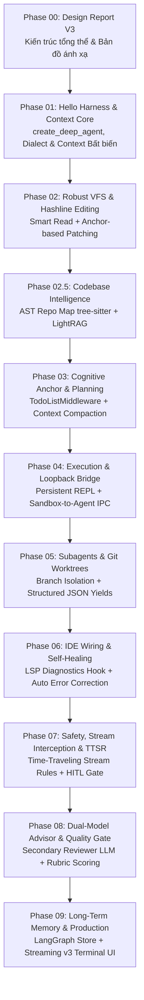

# 🛠️ Design Report V3: Xây dựng Coding Agent Đỉnh cao — Học hỏi từ Kiến trúc Thực chiến của oh-my-pi

> **Phiên bản**: V3.0 (Cập nhật: 28/09/2026)  
> **Nền tảng**: Python 3.12+, `uv`, `deepagents` (LangChain ecosystem)  
> **Cảm hứng kiến trúc**: `oh-my-pi` (omp) — Coding Agent hàng đầu với ~80k dòng Rust + TypeScript/Bun  
> **Mục tiêu**: Cung cấp khung thiết kế kiến trúc chuẩn mực và hướng dẫn từng bước để bạn **tự tay code hoàn chỉnh** một coding agent chuyên nghiệp.

---

## 1. Lời mở đầu: Tại sao V2 chưa đủ và Bài học từ oh-my-pi

Ở phiên bản V2, chúng ta đã tiếp cận việc xây dựng agent bằng cách ghép các tính năng có sẵn của `deepagents`. Tuy nhiên, kết quả vẫn mang tính **"chung chung"** — nó giống một chatbot biết gọi tool hơn là một **Coding Agent thực thụ** có thể giải quyết các tác vụ phần mềm phức tạp trong thực tế.

Khi phân tích sâu codebase của **`oh-my-pi` (omp)** — một coding agent mã nguồn mở được tối ưu hóa khắt khe trên hàng loạt benchmark (Grok, Gemini, MiniMax) và sử dụng hàng ngày bởi các kỹ sư — chúng ta nhận diện được **6 nút thắt sống còn (The Harness Problem)** mà một coding agent bắt buộc phải giải quyết:

```
┌────────────────────────────────────────────────────────────────────────┐
│                   6 BÀI HỌC KIẾN TRÚC TỪ OH-MY-PI                      │
├────────────────────────────────┬───────────────────────────────────────┤
│ 1. Sửa code mong manh          │ • oh-my-pi: Hashline & Anchor editing │
│    (Brittle String Replace)    │ • DeepAgents: Line-anchored patch     │
├────────────────────────────────┼───────────────────────────────────────┤
│ 2. Thiếu phản hồi từ IDE       │ • oh-my-pi: LSP writethrough          │
│    (No Compiler Feedback)      │ • DeepAgents: Post-edit linter/LSP hook│
├────────────────────────────────┼───────────────────────────────────────┤
│ 3. Xung đột ghi đè Subagent   │ • oh-my-pi: Git Worktree per subagent │
│    (Workspace Pollution)       │ • DeepAgents: GitWorktreeBackend      │
├────────────────────────────────┼───────────────────────────────────────┤
│ 4. Sandbox thụ động            │ • oh-my-pi: Persistent eval + bridge  │
│    (Passive Execution)         │ • DeepAgents: REPL có loopback tool   │
├────────────────────────────────┼───────────────────────────────────────┤
│ 5. Lệch hướng khi stream       │ • oh-my-pi: Time-Traveling Rules (TTSR│
│    (Stream Hallucination)      │ • DeepAgents: Stream abort & reinject │
├────────────────────────────────┼───────────────────────────────────────┤
│ 6. Thiên kiến của 1 mô hình   │ • oh-my-pi: Dual-Model Advisor        │
│    (Single-Model Blindspot)    │ • DeepAgents: RubricEvaluator LLM     │
└────────────────────────────────┴───────────────────────────────────────┘
```

---

## 2. Bảng Ánh xạ Kiến trúc: oh-my-pi ➔ DeepAgents (Python)

Toàn bộ tinh hoa của `oh-my-pi` được chuẩn hóa và ánh xạ sang hệ sinh thái Python + `deepagents` như sau:

| Trụ cột kỹ thuật | Triển khai trong `oh-my-pi` | Hiện thực hóa trong Tutorial V3 (`deepagents` + Python) |
|---|---|---|
| **Lõi Runtime & Ngữ cảnh** | `agent-loop.ts`, `AppendOnlyContext`, dialect normalization | `create_deep_agent()`, quản lý tin nhắn bất biến, prompt thích ứng theo provider |
| **Phẫu thuật File (VFS)** | `crates/pi-edit` (hashline anchors), `read-summary.ts` | 7 File tools VFS + `AnchorEditEngine` (mỏ neo dòng/nội dung), Smart Read phân trang |
| **Codebase Intelligence** | `ast-grep`, `ast-edit`, tree-sitter | `tree-sitter` sinh Repo Map toàn dự án + LightRAG MCP server truy vấn đồ thị ngữ nghĩa |
| **Bộ neo nhận thức (Task)** | `todo.ts` (trạng thái phân cấp, cây task trực quan) | `TodoListMiddleware` + `SummarizationMiddleware` tự nén khi đạt 85% context |
| **Thực thi mã có Cầu nối** | Persistent Python/Bun kernel, bridge gọi ngược lại tool | Persistent Python REPL (Local/Docker) + Loopback bridge cho phép test script gọi tool Agent |
| **Cô lập Subagents** | `task/worktree.ts` (mỗi subagent chạy trên 1 git worktree) | Dynamic Subagents + `GitWorktreeBackend` riêng cho từng subagent, hợp nhất qua PR/diff |
| **Nối dây IDE (LSP)** | `lsp/writethrough.ts` (bắt diagnostics ngay sau ghi file) | Post-Write Diagnostic Hook kết nối `ruff`/`pyright`, tự động kích hoạt vòng lặp Self-Healing |
| **Can thiệp Stream & Bảo mật** | TTSR (hủy token stream giữa chừng, ép retry với luật) | LangChain v1.3 stream filtering, `PolicyWrapper`, HITL modal phê duyệt lệnh nguy hiểm |
| **Cố vấn song song (Advisor)** | `advisor/index.ts` (model phụ đọc từng turn, cảnh báo P0-P3)| Two-model Architecture: Model chính code, Model phụ thẩm định qua `RubricMiddleware` |
| **Ký ức & Học hỏi liên tục** | `retain`, `learn`, `recall`, SQLite / Mnemopi | LangGraph Store với namespace `(project_id, user_id)`, trích xuất bài học sau mỗi task |

---

## 3. Lộ trình 10 Phases Toàn diện (V3)



### Chi tiết mục tiêu từng Phase:

| Phase | Tên Phase | Trọng tâm lý thuyết & Kỹ thuật | Sản phẩm tự code hoàn chỉnh |
|:---:|:---|:---|:---|
| **01** | **Hello Harness & Context Core** | The Harness Problem; Context drift; Chuẩn hóa prompt theo Model Provider; Event Streaming v3. | Module cấu hình đa nhà cung cấp, system prompt thích ứng, runner CLI stream từng token. |
| **02** | **Robust VFS & Hashline Editing** | Tại sao `str_replace` thất bại; Thuật toán mỏ neo nội dung (Hashline/Anchor); Smart Read phân trang & tóm tắt. | Bộ công cụ 7 VFS tools tích hợp engine chỉnh sửa chính xác từng dòng và tự bảo vệ context. |
| **02.5**| **Codebase Intelligence & Repo Map**| Giới hạn của Grep; Phân tích cú pháp AST với `tree-sitter`; Biểu đồ quan hệ gọi hàm; GraphRAG. | Script trích xuất Repo Map tự động cho toàn bộ codebase và công cụ truy vấn ngữ nghĩa. |
| **03** | **Cognitive Anchor: Task & Plan** | Trôi mục tiêu trong hội thoại dài; Vai trò của bộ neo nhận thức bên ngoài; Ngưỡng nén ngữ cảnh 85%. | Agent có khả năng lập kế hoạch nhiều bước, cập nhật tiến độ realtime và tự động tóm tắt lịch sử. |
| **04** | **Execution Engine & Loopback Bridge**| Persistent Execution vs One-shot Subprocess; Cơ chế Loopback IPC: khi code trong sandbox cần gọi tool agent. | Persistent Python REPL sandbox cho phép chạy script test và gọi ngược lại `tool.read()` để debug. |
| **05** | **Subagents & Git Worktree Isolation**| Race condition khi multi-agent cùng sửa code; Nguyên lý Git Worktree cô lập; Structured JSON Output. | Hệ thống điều phối subagent phân nhánh worktree riêng, thực thi độc lập và gom diff an toàn. |
| **06** | **IDE Wiring: LSP & Self-Healing** | Chu trình khép kín của developer; Bắt diagnostics từ compiler/linter (`ruff`/`pyright`); Self-healing loop. | Middleware/Hook tự động kiểm tra lỗi cú pháp sau mỗi lần agent sửa file và yêu cầu sửa ngay. |
| **07** | **Safety, Stream Interception & TTSR** | Rủi ro lệnh phá hủy; Giám sát token stream thời gian thực; Ngắt dòng Time-Traveling Stream Rules. | Bộ lọc stream phát hiện token nguy hiểm, ngắt dòng tức thì, bơm luật cấm và yêu cầu con người duyệt. |
| **08** | **Dual-Model Advisor & Quality Gates** | Thiên kiến xác nhận của single-model; Kiến trúc 2 mô hình (Doer & Advisor); Chấm điểm theo tiêu chí (Rubric). | Cố vấn LLM chạy ngầm độc lập chấm điểm mã nguồn theo thang P0-P3 trước khi cho phép commit. |
| **09** | **Continuous Learning & Production** | Ký ức dự án dài hạn; Bộ ba `retain` - `learn` - `recall`; Đóng gói Terminal TUI hoàn chỉnh. | Agent hoàn chỉnh có bộ nhớ vĩnh viễn, học hỏi từ sai lầm và giao diện tương tác chuyên nghiệp. |

---

## 4. Công nghệ & Môi trường Thực thi (Tech Stack)

Để giữ cho dự án gọn gàng, hiệu quả và không bị phân tán, toàn bộ tutorial được chuẩn hóa trên:

* **Ngôn ngữ**: Python 3.12+
* **Package Manager**: `uv` (cực nhanh, chuẩn hóa virtualenv tự động)
* **Framework Agent cốt lõi**: `deepagents` (LangChain ecosystem), `langchain-core`, `langgraph`
* **Xử lý cú pháp code**: `tree-sitter`, `tree-sitter-python`
* **Linter & Kiểm tra tĩnh**: `ruff`, `pyright`
* **Kiểm thử**: `pytest`
* **Quản lý Git cục bộ**: `GitPython`
* **LLM Providers**: Hỗ trợ linh hoạt SiliconFlow (DeepSeek V3/R1), OpenAI, Anthropic, Google Gemini thông qua chuẩn tương thích LangChain.

---

## 5. Quy chuẩn Thiết kế từng Bài Tutorial

Mỗi bài tutorial từ Phase 1 đến Phase 9 sẽ được xây dựng theo một khuôn mẫu sư phạm nhất quán:

1. **Lý thuyết chuyên sâu & So sánh thực tế**: Phân tích cặn kẽ "Tại sao cách làm cũ thất bại?", "Cách `oh-my-pi` giải quyết là gì?".
2. **Lệnh cài đặt cụ thể**: Các lệnh shell rõ ràng (`uv add ...`).
3. **Kiến trúc module & Hợp đồng dữ liệu**: Sơ đồ lớp, cấu trúc state TypedDict / Pydantic.
4. **Code mẫu hoàn chỉnh cho từng module nhỏ**: Đầy đủ code, có type hints, docstring và comment giải thích cặn kẽ để bạn hiểu bản chất trước khi tự gõ lại.
5. **Kịch bản thực hành kiểm thử (Hands-on Verification)**: Tạo môi trường giả lập (repo mẫu có bug) để bạn chạy thử nghiệm ngay.
6. **Checklist tự nghiệm thu**: Tiêu chí rõ ràng để bạn kiểm tra xem code của mình đã hoạt động đúng như mong đợi chưa trước khi chuyển sang phase tiếp theo.
