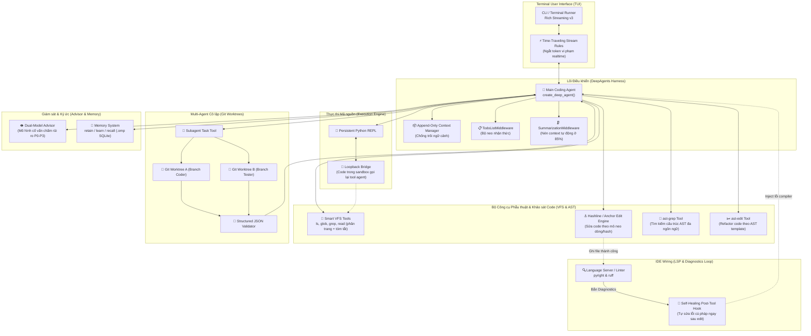

# 🛠️ Design Report V3: Xây dựng Coding Agent Thực chiến — Chuẩn hóa 100% theo oh-my-pi trên nền DeepAgents

> **Phiên bản**: V3.1 (Cập nhật: 28/09/2026)  
> **Framework Agent duy nhất**: `deepagents` (LangChain ecosystem, Python 3.12+, `uv`)  
> **Triết lý thiết kế**: Bỏ toàn bộ các khái niệm chung chung của tutorial cũ (LightRAG, AgentSeek...). Chuẩn hóa 100% công cụ và kiến trúc theo **`oh-my-pi` (omp)**.  
> **Nguyên tắc triển khai**:
> - Công cụ nào của `oh-my-pi` dùng lại được ➔ **Hướng dẫn tích hợp trực tiếp** (ví dụ: `ast-grep`, `git worktree`, Language Server).
> - Thành phần nào của `oh-my-pi` viết bằng Rust/TypeScript cần chuyển ngữ ➔ **Hướng dẫn porting sang Python** (ví dụ: Hashline editing engine, Loopback IPC bridge, Time-Traveling Stream Rules).

---

## 1. Bản chất cốt lõi: Tại sao phải follow 100% theo oh-my-pi?

Trong thế giới Coding Agent, có một khoảng cách rất lớn giữa:
- **Chatbot biết gọi tool (Generic Agent)**: Đọc file bằng cách `cat` toàn bộ, sửa code bằng `str_replace` mong manh, nhồi nhét RAG vector chung chung, chạy lệnh xong in text, subagent chạy chung một thư mục làm bẩn git.
- **Coding Agent chuyên nghiệp thực thụ (`oh-my-pi`)**: Coi IDE và hệ thống tệp là thực thể sống, sửa code dựa trên mỏ neo cú pháp, bắt lỗi compiler/linter tức thì, chạy code có cầu nối loopback, và cô lập subagent bằng Git Worktree.

Bằng cách giữ **`deepagents`** làm bộ khung điều phối vòng lặp và thay thế toàn bộ công cụ ngoại vi bằng giải pháp của **`oh-my-pi`**, chúng ta sẽ xây dựng được một Coding Agent có sức mạnh thực chiến tương đương các agent hàng đầu thế giới (như Cursor, Claude Code, Pi).

---

## 2. Bảng Phân loại: Dùng lại (Reuse) vs Chuyển ngữ (Porting) từ oh-my-pi

Dưới đây là chiến lược chi tiết cho từng hệ thống con được bóc tách từ `oh-my-pi`:

| Hệ thống con trong `oh-my-pi` | Bản gốc trong `oh-my-pi` | Chiến lược trong Tutorial V3 (Python + `deepagents`) | Cách thực hiện cụ thể |
|---|---|---|---|
| **1. Runtime & Context Core** | `packages/agent/src/agent-loop.ts`, `append-only-context.ts` | **Giữ `deepagents`** + Porting logic Append-Only | Sử dụng `create_deep_agent()`. Thiết kế state quản lý tin nhắn bất biến, chống trôi ngữ cảnh (Context Drift). |
| **2. Phẫu thuật File (VFS)** | `crates/pi-edit` (Rust), `read-summary.ts` | **Porting sang Python** | Viết module `src/tools/hashline.py`: Đánh số dòng kèm hash nội dung ngắn (`*12#a4b\|`). Agent sửa code theo mỏ neo dòng/hash. Nếu file bị đổi ngầm, mỏ neo lệch ➔ từ chối ghi đè để bảo vệ code. |
| **3. Codebase Intelligence** | `packages/coding-agent/src/tools/ast-grep.ts`, `ast-edit.ts` | **Dùng lại (Reuse) `ast-grep`** | **Loại bỏ hoàn toàn LightRAG**. Cài đặt CLI `ast-grep` (`sg`) hoặc `ast-grep-py` (công cụ Rust mở của Herrington Darkholme mà `oh-my-pi` sử dụng). Bọc thành 2 tool `ast_grep` và `ast_edit` tìm/sửa code theo cây cú pháp AST. |
| **4. Task Planning & Context Compaction** | `packages/coding-agent/src/tools/todo.ts`, `compaction.ts` | **Tận dụng `deepagents`** | Kích hoạt `TodoListMiddleware` làm bộ neo nhận thức bên ngoài (External Cognitive Anchor) và `SummarizationMiddleware` tự động nén context khi đạt 85% cửa sổ token. |
| **5. Thực thi mã có Cầu nối (Loopback)** | `packages/coding-agent/src/eval/` (runner.py + bridge) | **Porting cơ chế Loopback sang Python** | Dựng Persistent Python REPL chạy ngầm qua NDJSON. Tạo đối tượng `agent_bridge` được tiêm sẵn vào môi trường thực thi, cho phép code test gọi ngược lại `agent_bridge.read_file(...)`. |
| **6. Cô lập Subagents** | `packages/coding-agent/src/task/worktree.ts`, `structured-subagent.ts` | **Dùng lại Git Worktree** | Sử dụng lệnh `git worktree add -b <subagent-branch>` (qua `GitPython` hoặc `subprocess`) để mỗi subagent làm việc trên một thư mục nhánh hoàn toàn độc lập, trả về JSON có cấu trúc. |
| **7. Nối dây IDE (LSP Writethrough)** | `packages/coding-agent/src/lsp/writethrough.ts` | **Dùng lại LSP Server (`pyright`/`ruff`)** | Viết Post-Tool Hook: Ngay sau khi tool `edit_file` chạy xong, kích hoạt linter/LSP kiểm tra diagnostics. Nếu phát hiện syntax error, tự động inject diagnostics để Agent tự sửa (Self-Healing Loop). |
| **8. Ngắt dòng theo luật (TTSR)** | `packages/coding-agent/src/stream/` (Time-Traveling Stream Rules) | **Porting sang Python** | Bắt token stream của LangChain theo thời gian thực bằng regex. Nếu Agent phát ra lệnh cấm (như `rm -rf`, lộ API key), ngắt stream ngay lập tức, bơm luật phạt và yêu cầu sinh lại. |
| **9. Cố vấn Độc lập (Advisor)** | `packages/coding-agent/src/advisor/index.ts`, `review.ts` | **Porting kiến trúc 2 mô hình sang Python** | Thiết lập mô hình thứ 2 (Advisor LLM) chạy song song hoặc thông qua `RubricMiddleware` để thẩm định từng bước đi của Agent chính, xếp hạng rủi ro P0-P3. |
| **10. Ký ức Dài hạn** | `packages/coding-agent/src/memories/` (`retain`, `learn`, `recall`) | **Porting bộ ba công cụ sang Python** | Triển khai 3 tool `retain` (lưu fact vào SQLite/JSON dự án), `learn` (ghi bài học kiến trúc), và `recall` (truy xuất bài học tương ứng cho tác vụ mới). |

---

## 3. Sơ đồ Kiến trúc Tổng thể (Toàn bộ theo chuẩn oh-my-pi)

---

## 4. Lộ trình 10 Phases Toàn diện

| Phase | Tên Phase & Cảm hứng từ `oh-my-pi` | Cơ chế Thực hiện (Tái sử dụng vs Porting) | Sản phẩm Hoàn chỉnh Bạn sẽ Tự Code |
|:---:|:---|:---|:---|
| **00** | **Design Architecture V3** | Phân tích 100% kiến trúc `oh-my-pi` | Bản đặc tả kiến trúc chuẩn, loại bỏ toàn bộ khái niệm cũ không liên quan. |
| **01** | **Hello Harness & Context Core** *(từ `agent-loop.ts`, `AppendOnlyContext`)* | **DeepAgents** + Porting Append-Only | Khởi tạo Deep Agent với cấu hình đa nhà cung cấp, kiểm soát lịch sử tin nhắn bất biến, stream token v3. |
| **02** | **Robust VFS & Hashline Editing** *(từ `crates/pi-edit`, `read-summary.ts`)* | **Porting sang Python** | Xây dựng bộ công cụ đọc file thông minh và engine sửa code theo mỏ neo dòng/hash (Hashline) chống lỗi `str_replace`. |
| **02.5**| **Codebase Intelligence với ast-grep** *(từ `ast-grep.ts`, `ast-edit.ts`)* | **Tái sử dụng `ast-grep`** (bỏ LightRAG) | Tích hợp `ast-grep` CLI / `ast-grep-py` thành 2 công cụ tìm kiếm và refactor code theo cây cú pháp AST chuyên nghiệp. |
| **03** | **Cognitive Anchor: Task & Plan** *(từ `todo.ts`, `plan-mode/`)* | **Tận dụng `deepagents`** | Kích hoạt `TodoListMiddleware` quản lý checklist phân cấp và `SummarizationMiddleware` tự nén ngữ cảnh khi vượt 85%. |
| **04** | **Execution Engine & Loopback Bridge** *(từ `eval.ts`, `src/eval/py/runner.py`)* | **Porting cơ chế Loopback sang Python** | Dựng Persistent Python REPL chạy ngầm giao tiếp qua NDJSON, hỗ trợ code test gọi ngược lại tool đọc/tìm kiếm của Agent. |
| **05** | **Subagents & Git Worktree Isolation** *(từ `task/worktree.ts`, `structured-subagent.ts`)*| **Tái sử dụng Git Worktree** | Xây dựng cơ chế sinh Git Worktree tự động cho từng subagent, triệt tiêu xung đột ghi đè code, ép kiểu trả về qua JSON Schema. |
| **06** | **IDE Wiring: LSP & Self-Healing** *(từ `lsp/writethrough.ts`)* | **Tái sử dụng `pyright`/`ruff`** | Tạo Post-Tool Hook kết nối Language Server, tự động bắt lỗi cú pháp sau mỗi lần sửa code và kích hoạt vòng lặp tự sửa lỗi. |
| **07** | **Safety & Stream Rules (TTSR)** *(từ `stream/` TTSR, `approval.ts`)* | **Porting TTSR sang Python** | Bắt regex trên token stream realtime, ngắt luồng sớm nếu phát hiện lệnh cấm, bơm luật phạt và tích hợp duyệt Human-in-the-Loop. |
| **08** | **Dual-Model Advisor & Quality Gate** *(từ `advisor/index.ts`, `review.ts`)* | **Porting kiến trúc Advisor sang Python** | Xây dựng mô hình cố vấn thứ hai (Advisor LLM) chạy song song chấm điểm rủi ro P0-P3 và duyệt diff theo tiêu chí (Rubric). |
| **09** | **Continuous Learning & Production** *(từ `memories/index.ts`)* | **Porting bộ 3 retain/learn/recall** | Xây dựng bộ nhớ dự án lâu dài xuyên session, tự động ghi nhận kinh nghiệm sửa lỗi, đóng gói CLI Terminal TUI hoàn chỉnh. |

---

## 5. Quy chuẩn Triển khai Mỗi Phase

1. **Lý thuyết nguồn cội**: Luôn trích dẫn trực tiếp file mã nguồn tương ứng trong `sample-code/oh-my-pi/` để bạn đối chiếu cách các tác giả `oh-my-pi` đã giải quyết bài toán.
2. **Lệnh cài đặt chi tiết**: Chỉ rõ cách cài đặt các công cụ bên ngoài (ví dụ `ast-grep`, `ruff`, `pyright`, `GitPython`).
3. **Mã nguồn mẫu từng module nhỏ**: Cung cấp đầy đủ code Python mẫu, có chú thích chi tiết lý do tại sao viết như vậy.
4. **Kịch bản thực hành (Hands-on)**: Luôn đi kèm một repo giả lập có lỗi logic để bạn cho Agent chạy và tự quan sát kết quả.
5. **Checklist nghiệm thu**: Tiêu chuẩn rõ ràng để bạn tự đánh giá code của mình trước khi bước sang phase tiếp theo.
