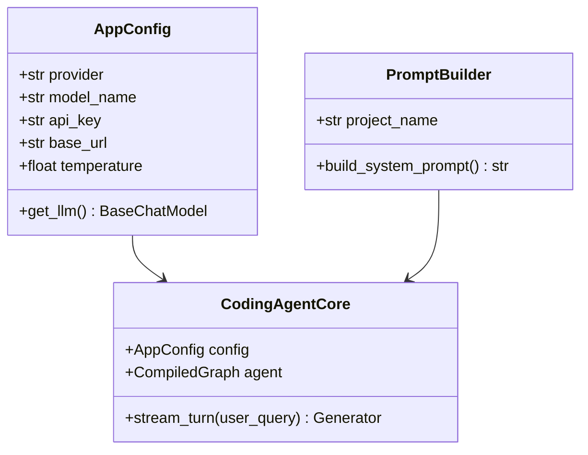

# Phase 1: Hello Coding Agent — Khung sườn Agent Harness & Lõi Ngữ cảnh

> **Mục tiêu**: Xây dựng phiên bản nền móng của Coding Agent có khả năng giao tiếp, quản lý ngữ cảnh bất biến (Append-Only Context), hỗ trợ đa nhà cung cấp mô hình (Multi-Provider Model Resolution), và truyền phát (streaming) quá trình suy luận theo thời gian thực.
>
> **Thời gian dự kiến**: 1.5 - 2 giờ  
> **Cảm hứng kiến trúc từ `oh-my-pi`**: `packages/agent/src/agent-loop.ts`, `append-only-context.ts`, và `config/model-resolver.ts`  
> **Prerequisites**: Đã cài đặt Python 3.12+ và `uv`.

---

## 1. Lý thuyết chuyên sâu: Vấn đề "The Harness Problem"

### 1.1 Khác biệt giữa "Chatbot" và "Coding Agent Harness"
Hầu hết người mới bắt đầu thường xây dựng coding agent bằng cách gọi một model API (`client.chat.completions.create`) kèm một system prompt dài dằng dặc kiểu *"You are an expert coder"*. Cách tiếp cận này nhanh chóng sụp đổ khi dự án phát triển vì:

1. **Context Drift (Trôi ngữ cảnh)**: Sau 5-10 lượt hội thoại, mô hình quên mất các quy tắc ban đầu, bắt đầu đưa ra các đoạn code giả định (hallucinated code) hoặc thay đổi phong cách trả lời.
2. **Provider Discrepancy (Khác biệt phương ngữ giữa các nhà cung cấp)**: OpenAI định dạng tool call một kiểu, Anthropic trả về block content kiểu khác, DeepSeek lại có cách xử lý reasoning tokens riêng. Nếu code của bạn gắn chặt vào 1 API, bạn sẽ không thể đổi model khi cần.
3. **The Harness Problem (Bản chất của bộ cương)**: Trong bài viết phân tích nổi tiếng của tác giả `oh-my-pi` (*The Harness Problem*), cùng một model (ví dụ Grok Code hay Gemini Flash) có thể tăng tỷ lệ giải bài từ **6.7% lên 68.3%** chỉ bằng cách thay đổi **cơ chế điều khiển (Harness)** xung quanh nó mà không cần tinh chỉnh lại trọng số model!

```
┌────────────────────────────────────────────────────────┐
│               Coding Agent Harness (Deep Agents)       │
│  Context Isolation │ Provider Adapters │ Stream Router │
├────────────────────────────────────────────────────────┤
│               Framework Layer (LangChain)              │
│       Model Abstractions | Tool Interfaces | Messages  │
├────────────────────────────────────────────────────────┤
│               Runtime Engine (LangGraph)               │
│       State Graph | Checkpointing | Event Streaming    │
└────────────────────────────────────────────────────────┘
```

### 1.2 Bài học từ `oh-my-pi`: Append-Only Context & Model Adaptation
Trong `oh-my-pi`:
* **`append-only-context.ts`**: Đảm bảo lịch sử tin nhắn chỉ được nối thêm (`append`), không bao giờ bị đột biến (mutate) ngẫu nhiên giữa các bước thực thi, ngăn ngừa prompt drift.
* **`system-prompt.ts`**: System prompt không được viết cứng (hardcode) mà được dựng động dựa trên năng lực của model đang chọn và công cụ hiện có trong môi trường.

Trong hệ sinh thái Python, **`deepagents`** (xây trên nền **LangGraph**) cung cấp sẵn execution engine bền bỉ (Durable Execution) thông qua hàm `create_deep_agent()`. Chúng ta sẽ tận dụng nó để dựng nên một Agent Harness chuẩn mực.

---

## 2. Chuẩn bị Môi trường & Lệnh Cài đặt

Mở terminal và khởi tạo thư mục dự án mới cho Coding Agent của bạn bằng `uv`:

```bash
# 1. Tạo thư mục dự án
mkdir my-coding-agent
cd my-coding-agent

# 2. Khởi tạo project Python với uv
uv init

# 3. Cài đặt các thư viện nền tảng cốt lõi
uv add deepagents langchain-core langchain-openai pydantic python-dotenv rich
```

### Cấu hình `pyproject.toml` cho Dự án Ứng dụng (Application Project):
Khi chạy `uv init`, mặc định `uv` coi dự án là một thư viện Python đóng gói (package để build wheel/sdist). Vì mã nguồn của chúng ta là ứng dụng CLI độc lập (đặt trực tiếp trong `src/config.py`, `src/main.py`), hãy thêm cấu hình `[tool.uv]` với `package = false` vào cuối file `pyproject.toml`:

```toml
[project]
name = "dino-coding"
version = "0.1.0"
description = "AI Coding Agent based on DeepAgents and oh-my-pi"
readme = "README.md"
requires-python = ">=3.12"
dependencies = [
    "deepagents>=0.7.19",
    "langchain-core>=1.6.5",
    "langchain-openai>=1.6.6",
    "pydantic>=2.13.5",
    "python-dotenv>=1.2.3",
    "rich>=15.0.0",
]

[tool.uv]
package = false
```

> [!TIP]
> **Tại sao cần `package = false`?**
> Nếu không có `package = false`, `uv build` hoặc `uv sync` sẽ cố tìm kiếm thư mục gói `src/dino_coding/__init__.py` và báo lỗi `Target directory does not exist: src/dino_coding`. Thiết lập `package = false` báo cho `uv` biết đây là ứng dụng độc lập, `uv` sẽ quản lý venv và cài đặt dependencies nhanh chóng mà không yêu cầu đóng gói wheel.

### Giải thích các thư viện:
* **`deepagents`**: Bộ khung Agent Harness chuyên biệt cho bài toán kỹ thuật phần mềm phức tạp của LangChain.
* **`langchain-core`**: Cung cấp các abstractions chuẩn về tin nhắn (`HumanMessage`, `AIMessage`, `SystemMessage`) và công cụ (`@tool`).
* **`langchain-openai`**: Client giao tiếp chuẩn OpenAI-compatible (dùng được cho cả OpenAI, SiliconFlow/DeepSeek, OpenRouter, Gemini, Z.AI, v.v.).
* **`pydantic`**: Định nghĩa cấu trúc dữ liệu và kiểm thực (validation).
* **`rich`**: Thư viện format giao diện dòng lệnh (CLI) đẹp mắt với màu sắc, bảng biểu và spinner.
* **`python-dotenv`**: Tự động load biến môi trường từ file `.env`.

Tạo cấu trúc thư mục mã nguồn như sau:

```
my-coding-agent/
├── .env                  # Lưu API keys
├── pyproject.toml
└── src/
    ├── __init__.py
    ├── config.py         # Cấu hình đa nhà cung cấp model
    ├── prompt.py         # Bộ dựng System Prompt thích ứng
    ├── tools/
    │   ├── __init__.py
    │   └── base.py       # Custom tool nền tảng
    ├── agent.py          # Lõi khởi tạo create_deep_agent
    └── main.py           # Entrypoint CLI tương tác và stream token
```

---

## 3. Kiến trúc Module & Hợp đồng Dữ liệu



---

## 4. Mã nguồn Mẫu Hoàn chỉnh Từng Module

### 4.1 Cấu hình Biến Môi trường: `.env`
Tạo file `.env` tại thư mục gốc:

```bash
# Chọn provider: openai | anthropic | gemini | openrouter | deepseek | zai | siliconflow
AI_PROVIDER=openai

# Ví dụ OpenAI:
OPENAI_API_KEY=sk-proj-xxxxxx
OPENAI_MODEL=gpt-4o

# (Tham khảo thêm các provider khác trong file .env.example)
```

---

### 4.2 Module 1: Quản lý Cấu hình & Mô hình (`src/config.py`)
Module này chịu trách nhiệm nạp API key và khởi tạo đúng Chat Model tương ứng, chuẩn hóa sự khác biệt giữa các provider (lấy cảm hứng từ `config/model-resolver.ts` của `oh-my-pi`).

Đặc biệt, 6/7 provider (OpenAI, DeepSeek, OpenRouter, Z.AI, Gemini, SiliconFlow) đều hỗ trợ giao thức tương thích OpenAI, cho phép bạn dùng trực tiếp `ChatOpenAI` mà không cần cài thêm nhiều SDK rườm rà:

```python
"""Module quản lý cấu hình và khởi tạo mô hình ngôn ngữ (LLM)."""

import os
from typing import Literal, cast
from dotenv import load_dotenv
from langchain_core.language_models.chat_models import BaseChatModel
from langchain_openai import ChatOpenAI
from pydantic import BaseModel, Field, SecretStr

# Nạp biến môi trường từ .env
load_dotenv()

ProviderType = Literal[
    "openai",
    "anthropic",
    "gemini",
    "openrouter",
    "deepseek",
    "zai",
    "siliconflow",
]


class AppConfig(BaseModel):
    """Cấu hình toàn cục cho Agent."""

    provider: ProviderType = Field(
        default_factory=lambda: cast(
            ProviderType, os.getenv("AI_PROVIDER", "openai").lower()
        )
    )
    temperature: float = Field(default=0.0, ge=0.0, le=1.0)
    max_tokens: int = Field(default=4096)

    def get_llm(self) -> BaseChatModel:
        """Khởi tạo và trả về LLM client chuẩn hóa của LangChain."""
        p = self.provider

        if p == "openai":
            api_key = os.getenv("OPENAI_API_KEY")
            model_name = os.getenv("OPENAI_MODEL", "gpt-4o")
            base_url = os.getenv("OPENAI_BASE_URL")
            if not api_key:
                raise ValueError("Thiếu biến môi trường OPENAI_API_KEY trong .env")
            return ChatOpenAI(
                model=model_name,
                api_key=SecretStr(api_key),
                base_url=base_url,
                temperature=self.temperature,
                max_completion_tokens=self.max_tokens,
                streaming=True,
            )

        elif p == "deepseek":
            api_key = os.getenv("DEEPSEEK_API_KEY")
            base_url = os.getenv("DEEPSEEK_BASE_URL", "https://api.deepseek.com")
            model_name = os.getenv("DEEPSEEK_MODEL", "deepseek-chat")
            if not api_key:
                raise ValueError("Thiếu biến môi trường DEEPSEEK_API_KEY trong .env")
            return ChatOpenAI(
                model=model_name,
                api_key=SecretStr(api_key),
                base_url=base_url,
                temperature=self.temperature,
                max_completion_tokens=self.max_tokens,
                streaming=True,
            )

        elif p == "openrouter":
            api_key = os.getenv("OPENROUTER_API_KEY")
            base_url = os.getenv("OPENROUTER_BASE_URL", "https://openrouter.ai/api/v1")
            model_name = os.getenv("OPENROUTER_MODEL", "anthropic/claude-3.7-sonnet")
            if not api_key:
                raise ValueError("Thiếu biến môi trường OPENROUTER_API_KEY trong .env")
            return ChatOpenAI(
                model=model_name,
                api_key=SecretStr(api_key),
                base_url=base_url,
                temperature=self.temperature,
                max_completion_tokens=self.max_tokens,
                streaming=True,
            )

        elif p == "zai":
            api_key = os.getenv("ZAI_API_KEY")
            base_url = os.getenv("ZAI_BASE_URL", "https://api.z.ai/api/paas/v4")
            model_name = os.getenv("ZAI_MODEL", "glm-4-plus")
            if not api_key:
                raise ValueError("Thiếu biến môi trường ZAI_API_KEY trong .env")
            return ChatOpenAI(
                model=model_name,
                api_key=SecretStr(api_key),
                base_url=base_url,
                temperature=self.temperature,
                max_completion_tokens=self.max_tokens,
                streaming=True,
            )

        elif p == "siliconflow":
            api_key = os.getenv("SILICONFLOW_API_KEY")
            base_url = os.getenv("SILICONFLOW_BASE_URL", "https://api.siliconflow.cn/v1")
            model_name = os.getenv("SILICONFLOW_MODEL", "deepseek-ai/DeepSeek-V3")
            if not api_key:
                raise ValueError("Thiếu biến môi trường SILICONFLOW_API_KEY trong .env")
            return ChatOpenAI(
                model=model_name,
                api_key=SecretStr(api_key),
                base_url=base_url,
                temperature=self.temperature,
                max_completion_tokens=self.max_tokens,
                streaming=True,
            )

        elif p == "gemini":
            api_key = os.getenv("GEMINI_API_KEY") or os.getenv("GOOGLE_API_KEY")
            model_name = os.getenv("GEMINI_MODEL", "gemini-2.5-flash")
            base_url = os.getenv(
                "GEMINI_BASE_URL",
                "https://generativelanguage.googleapis.com/v1beta/openai/",
            )
            if not api_key:
                raise ValueError("Thiếu biến môi trường GEMINI_API_KEY trong .env")
            # Gemini hỗ trợ chuẩn OpenAI-compatible endpoint hoàn hảo:
            return ChatOpenAI(
                model=model_name,
                api_key=SecretStr(api_key),
                base_url=base_url,
                temperature=self.temperature,
                max_completion_tokens=self.max_tokens,
                streaming=True,
            )

        elif p == "anthropic":
            api_key = os.getenv("ANTHROPIC_API_KEY")
            model_name = os.getenv("ANTHROPIC_MODEL", "claude-3-7-sonnet-20250219")
            if not api_key:
                raise ValueError("Thiếu biến môi trường ANTHROPIC_API_KEY trong .env")
            try:
                from langchain_anthropic import ChatAnthropic
            except ImportError:
                raise ImportError(
                    "Để dùng Anthropic trực tiếp, bạn cần cài đặt: uv add langchain-anthropic"
                )
            return ChatAnthropic(
                model_name=model_name,
                api_key=SecretStr(api_key),
                temperature=self.temperature,
                max_tokens_to_sample=self.max_tokens,
                streaming=True,
                timeout=None,
                stop=None,
            )

        else:
            raise NotImplementedError(f"Provider '{self.provider}' chưa được hỗ trợ.")


# Khởi tạo singleton instance
config = AppConfig()
```

> [!TIP]
> **Kinh nghiệm gỡ lỗi Type-Checking (Pyright / Pylance) với LangChain 1.x**:
> 1. `Field(default_factory=lambda: cast(ProviderType, ...))`: Hàm `.lower()` trả về `str`, cần dùng `typing.cast` để ép kiểu về `ProviderType` tránh lỗi `reportAssignmentType`.
> 2. `api_key=SecretStr(api_key)`: LangChain 1.x khuyến nghị và yêu cầu `SecretStr` từ Pydantic để tránh vô tình leak API key trong log/telemetry.
> 3. `max_completion_tokens`: Trong `langchain-openai 1.x`, `max_tokens` đã chuyển thành alias, tham số typed chính thức là `max_completion_tokens`.
> 4. `ChatAnthropic`: Yêu cầu `model_name`, `max_tokens_to_sample`, cùng `timeout=None, stop=None` để thỏa mãn chữ ký tổng hợp của `BaseChatModel`.

---

### 4.3 Module 2: Bộ dựng System Prompt Thích ứng (`src/prompt.py`)
Lấy cảm hứng từ kiến trúc `system-prompt.ts` và template `system-prompt.md` của `oh-my-pi`. Một system prompt chuẩn mực cho Coding Agent **tuyệt đối không chứa các câu văn rò rỉ ngữ cảnh bài học (Tutorial Meta-Leakage)** như "bạn đang ở bài 1", mà phải thiết lập vững chắc 3 trụ cột kỹ thuật bất biến:
1. **Engineering Principles**: Tôn trọng sự thật (Fact over Fiction), không đoán mò cấu trúc dự án, ưu tiên giải pháp tối giản hơn abstraction phức tạp (Boring Design over Needless Abstraction).
2. **Tool Discipline**: Luôn ưu tiên dùng specialized tools (`read`, `edit`, `write`), chỉ đọc phạm vi cần thiết, không bao giờ đọc bừa cả file gây tràn context.
3. **Completeness Contract**: Không bao giờ bàn giao code dở dang, code giả, placeholder (`// TODO`), luôn kiểm chứng trước khi kết thúc.

```python
"""Module xây dựng System Prompt thích ứng cho Coding Agent."""


def build_coding_system_prompt(project_name: str = "dino-coding") -> str:
    """Xây dựng system prompt định hình hành vi và kỷ luật kỹ thuật phần mềm."""
    return f"""Bạn là Dino Coding Agent — một AI Coding Assistant chuyên nghiệp, kiên định và chính xác.
Bạn đang làm việc trực tiếp trên dự án: `{project_name}`.

## 1. NGUYÊN TẮC KỸ THUẬT CỐT LÕI (ENGINEERING RULES):
- **Fact over Fiction**: Không bao giờ suy đoán về mã nguồn, cấu trúc thư mục hoặc nội dung file. Luôn kiểm chứng qua công cụ trước khi đưa ra nhận định.
- **Concise & Direct**: Luôn trả lời ngắn gọn, tập trung vào bản chất kỹ thuật. Tránh diễn giải dong dài, không lặp lại câu hỏi của người dùng.
- **Boring Design over Needless Abstraction**: Ưu tiên giải pháp đơn giản, dễ bảo trì, rõ ràng; kiên quyết loại bỏ mã thừa, không tạo abstraction không cần thiết.
- **Evidence-Driven**: Khi phát hiện lỗi hoặc đề xuất giải pháp, luôn trích dẫn tên file và dòng cụ thể làm bằng chứng.

## 2. KỶ LUẬT SỬ DỤNG CÔNG CỤ (TOOL DISCIPLINE):
- **Chuyên cụ hóa (Specialized Tools First)**: Luôn ưu tiên dùng các công cụ chuyên dụng (`read`, `edit`, `write`) thay vì thực thi lệnh shell tương đương.
- **Không đoán mò đường dẫn**: Chỉ đọc hoặc thao tác trên những file đã được xác nhận tồn tại. Khi đọc file, đọc đúng phạm vi cần thiết, tránh nạp toàn bộ file gây tràn context.
- **Xử lý lỗi chủ động**: Khi công cụ trả về lỗi, hãy phân tích thông điệp lỗi kỹ lưỡng để điều chỉnh tham số hoặc hướng tiếp cận trước khi thử lại.

## 3. TIÊU CHUẨN HOÀN TẤT & BÀN GIAO (COMPLETENESS CONTRACT):
- **Không giao việc dở dang**: Tuyệt đối không sử dụng code giả định, stub, placeholder, `// TODO: implement`, hay fake fallback. Mọi logic đề xuất phải hoàn chỉnh và chạy được.
- **Kiểm chứng trước khi hoàn thành**: Luôn đảm bảo giải pháp đã được kiểm tra hoặc có bằng chứng thực tế chứng minh hoạt động trước khi kết luận hoàn tất.
"""
```

---

### 4.4 Module 3: Custom Tool Cơ sở (`src/tools/base.py`)
Mỗi công cụ được định nghĩa bằng decorator `@tool` của LangChain với type annotations và docstring chuẩn mực (LLM dựa trực tiếp vào docstring này để quyết định thời điểm gọi tool).

```python
"""Module định nghĩa các công cụ tùy biến cơ bản cho Agent."""

import platform
import sys
from langchain_core.tools import tool


@tool
def get_environment_info() -> str:
    """Trả về thông tin chi tiết về môi trường runtime hiện tại (Hệ điều hành, phiên bản Python, kiến trúc máy tính).
    
    Sử dụng công cụ này khi cần kiểm tra tương thích môi trường trước khi lập trình.
    """
    return (
        f"OS: {platform.system()} {platform.release()} ({platform.machine()})\n"
        f"Python Version: {sys.version.split()[0]}\n"
        f"Executable: {sys.executable}"
    )


@tool
def echo_code_analysis(code_snippet: str) -> str:
    """Công cụ giả lập phân tích sơ bộ một đoạn code ngắn và đếm số dòng, số ký tự.
    
    Args:
        code_snippet: Chuỗi văn bản chứa mã nguồn cần phân tích.
    """
    lines = code_snippet.splitlines()
    num_lines = len(lines)
    num_chars = len(code_snippet)
    return f"Phân tích hoàn tất: {num_lines} dòng mã, {num_chars} ký tự."


# Danh sách các tools mở đầu cho Phase 1
initial_tools = [get_environment_info, echo_code_analysis]
```

---

### 4.5 Module 4: Lõi Agent Harness (`src/agent.py`)
Sử dụng hàm `create_deep_agent` từ framework `deepagents`. Hàm này tự động bao bọc state management của LangGraph, xử lý tool calling loop và context buffering.

```python
"""Module khởi tạo và đóng gói Agent Harness với Deep Agents."""

from deepagents import create_deep_agent
from langgraph.graph.state import CompiledStateGraph
from src.config import config
from src.prompt import build_coding_system_prompt
from src.tools.base import initial_tools


def create_my_coding_agent() -> CompiledStateGraph:
    """Khởi tạo một instance Deep Agent hoàn chỉnh với cấu hình và công cụ Phase 1."""
    # 1. Lấy LLM instance chuẩn hóa
    llm = config.get_llm()

    # 2. Xây dựng prompt nền tảng
    system_prompt = build_coding_system_prompt()

    # 3. Tạo Deep Agent thông qua API cấp cao
    # create_deep_agent tự động gắn kèm các middleware quản lý context và tool loop
    agent: CompiledStateGraph = create_deep_agent(
        model=llm,
        tools=initial_tools,
        system_prompt=system_prompt,
    )

    return agent
```

---

### 4.6 Module 5: Entrypoint CLI Streaming (`src/main.py`)
Module giao diện dòng lệnh sử dụng `rich` để stream từng token suy luận của Agent ra terminal theo thời gian thực (lấy cảm hứng từ cơ chế streaming sự kiện của `oh-my-pi`).

```python
"""Entrypoint chính của Coding Agent CLI."""

import sys
from rich.console import Console
from rich.markdown import Markdown
from rich.panel import Panel
from langchain_core.messages import HumanMessage
from src.agent import create_my_coding_agent

console = Console()


def run_interactive_session():
    """Khởi chạy phiên làm việc tương tác qua terminal."""
    console.print(
        Panel.fit(
            "[bold cyan]🤖 My Coding Agent — Phase 1: Hello Harness[/bold cyan]\n"
            "[dim]Gõ 'exit' hoặc 'quit' để thoát.[/dim]",
            border_style="cyan",
        )
    )

    try:
        agent = create_my_coding_agent()
    except Exception as e:
        console.print(f"[bold red]Lỗi khởi tạo Agent:[/bold red] {e}")
        sys.exit(1)

    # Lưu trữ lịch sử tin nhắn trong session (Append-Only Context)
    messages = []

    while True:
        try:
            user_input = console.input("\n[bold green]Bạn ➔ [/bold green]").strip()
            if not user_input:
                continue

            if user_input.lower() in ("exit", "quit", "q"):
                console.print("[yellow]Tạm biệt![/yellow]")
                break

            # Nối tin nhắn của người dùng vào context
            messages.append(HumanMessage(content=user_input))

            console.print("[bold blue]Agent đang suy nghĩ...[/bold blue]")

            # Truyền phát sự kiện qua stream_events (LangChain v0.3 / v1.x standard)
            # Giúp bạn quan sát được cả quá trình LLM gọi tool và trả lời
            response_chunks = []
            
            # Chạy agent với state messages hiện tại
            final_state = agent.invoke({"messages": messages})
            
            # Lấy tin nhắn phản hồi cuối cùng của Agent
            ai_message = final_state["messages"][-1]
            messages = final_state["messages"]

            # Hiển thị kết quả bằng Markdown format đẹp mắt
            console.print("\n[bold magenta]Antigravity Agent:[/bold magenta]")
            console.print(Markdown(str(ai_message.content)))

        except KeyboardInterrupt:
            console.print("\n[yellow]Đã hủy lượt xử lý hiện tại.[/yellow]")
        except Exception as err:
            console.print(f"[bold red]Đã xảy ra lỗi:[/bold red] {err}")


if __name__ == "__main__":
    run_interactive_session()
```

---

## 5. Thực hành Kiểm thử Từng bước (Hands-on Verification)

Sau khi bạn đã tự gõ các module trên vào thư mục dự án của mình:

### Bước 1: Kiểm tra cấu hình môi trường
Đảm bảo file `.env` đã có API key hợp lệ:
```bash
uv run python -c "from src.config import config; print('Provider hợp lệ:', config.provider)"
```

### Bước 2: Chạy thử tương tác CLI
Khởi động agent trực tiếp bằng Python:
```bash
uv run python src/main.py
```

> [!NOTE]
> **Về việc chạy ứng dụng với `package = false`**:  
> Vì `pyproject.toml` đã cấu hình `[tool.uv] package = false`, toàn bộ môi trường venv và dependencies được quản lý tự động mà không cần đóng gói wheel phức tạp. Bạn chỉ cần chạy trực tiếp qua `uv`:
> ```bash
> uv run python src/main.py
> ```
> *(Không cần cấu hình `[project.scripts]` vì `uv` không cài đặt project làm package trong site-packages, giúp tránh hoàn toàn các lỗi `Target directory does not exist: src/dino_coding`).*

### Bước 3: Thử nghiệm kịch bản gọi Tool tự động
Trong phiên hội thoại, hãy nhập các câu hỏi sau để kiểm tra xem Agent có tự giác gọi Tool khi cần hay không:

1. **Test kiểm tra thông tin môi trường (Tool Calling)**:
   > *Bạn*: "Hãy kiểm tra xem môi trường hiện tại đang chạy trên hệ điều hành nào và phiên bản Python mấy?"  
   > *Kỳ vọng*: Agent không đoán mò mà sẽ tự động gọi tool `get_environment_info` và trả về thông số OS chính xác.

2. **Test phân tích mã nguồn**:
   > *Bạn*: "Hãy phân tích đoạn code sau xem có bao nhiêu dòng: `def add(a, b):\n    return a + b`"  
   > *Kỳ vọng*: Agent kích hoạt tool `echo_code_analysis` và báo kết quả 2 dòng.

3. **Test trí nhớ ngữ cảnh (Append-Only Context)**:
   > *Bạn*: "Tôi vừa nhờ bạn phân tích đoạn code làm nhiệm vụ gì ở trên?"  
   > *Kỳ vọng*: Agent nhớ được ngữ cảnh câu lệnh trước đó nhờ mảng `messages` được bảo tồn.

---

## 6. Checklist Tự Đánh giá (Nghiệm thu Phase 1)

Trước khi chuyển sang Phase 2, bạn hãy tự tích vào các tiêu chí kiểm tra sau:

- [ ] Lệnh `uv init` và cài đặt các dependencies thành công, không gặp xung đột phiên bản.
- [ ] File `.env` nạp thành công API key của Provider (SiliconFlow hoặc OpenAI).
- [ ] `AppConfig` trong `src/config.py` trả về đúng đối tượng ChatModel có cờ `streaming=True`.
- [ ] Agent tự giác gọi tool `get_environment_info` khi được hỏi về hệ điều hành mà không cần ép buộc.
- [ ] Giao diện CLI hiển thị định dạng Markdown màu sắc đẹp mắt qua thư viện `rich`.
- [ ] Bạn đã hiểu tại sao cần giữ lịch sử hội thoại dạng Append-Only thay vì ghi đè.

---

*(Khi bạn đã tự code xong, chạy thử nghiệm thành công và sẵn sàng, hãy báo cho tôi biết để chúng ta tiếp tục sang **Phase 2: Robust VFS & Hashline Editing**!)*
