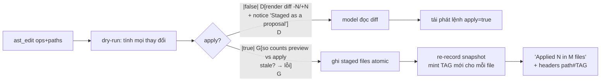

# Phase 2.5: Codebase Intelligence với ast-grep — Tìm kiếm & Tái cấu trúc theo Cây Cú pháp

> **Chuỗi tutorial:** [Phase 1](phase_01_hello_agent.md) → [Phase 2](phase_02_file_operations.md) → **Bạn đang đây** → Phase 3
>
> **Nguồn tham chiếu:** `packages/coding-agent/src/tools/ast-grep.ts`, `ast-edit.ts` • `crates/pi-natives/src/ast.rs` • `crates/pi-ast/src/{ops.rs, block.rs}` • `crates/pi-edit/src/modes/hashline/block.rs` • `crates/pi-ast/src/language/mod.rs` • `packages/coding-agent/src/prompts/tools/ast-grep.md`, `ast-edit.md`
>
> **Sản phẩm bàn giao:** 2 tool mới `ast_grep` (tìm kiếm cấu trúc) và `ast_edit` (codemod đa file) + **block resolver `N*`** trả nợ defer cho Phase 2 — tất cả cắm thẳng vào EditStore hashline đã xây.

Sau Phase 2, agent của bạn đã sửa file an toàn nhờ mỏ neo `tag + dòng`. Nhưng nó vẫn *tìm* code như một chiếc regex mù: `grep "format_price"` bắt cả comment, cả biến, cả chuỗi "format_price" trong docstring; và nó vẫn *sửa lặp* bằng cách đọc từng file rồi `edit` từng chỗ — trong khi bản chất công việc là "đổi mọi chỗ gọi `old_api(...)` thành `new_api(...)` trên 40 file".

Đây là lúc nâng cấp từ **văn bản** lên **cây cú pháp (AST)**. `oh-my-pi` dùng [ast-grep](https://ast-grep.github.io/) — engine Rust của Herrington Darkholme — cho cả hai việc, và Phase này chúng ta port đúng lớp bọc của omp, tái sử dụng core qua binding Python chính chủ `ast-grep-py`.

---

## 1. Lý thuyết chuyên sâu: Text Search chống MẤT, AST Search chống NHẦM

### 1.1 Ba tình huống grep bó tay

**Tình huống 1 —语义 lẫn lộn.** Tìm mọi chỗ *gọi hàm* `process(x)` trong codebase Python:

```text
grep "process(x)" → ① process(x)            ← gọi hàm THẬT (muốn)
                    ② # TODO: process(x)     ← comment (không muốn)
                    ③ "process(x)"           ← chuỗi văn bản (không muốn)
                    ④ self.process(x)        ← gọi phương thức (muốn hay không tùy ngữ cảnh)
                    ⑤ process(xy)            ← KHÔNG khớp — nhưng nó cũng là gọi hàm process!
```

Regex không phân biệt được ①②③④ vì cả bốn đều là *chữ*; và khớp sai ⑤ vì `process(x)` là khối chữ, không phải *lời gọi có đối số x*. Với AST pattern `process($X)` — trong đó `$X` là metavariable — engine match **node `call` có callee tên `process` và đúng 1 đối số**, nên ②③ bị loại (không phải node call), ④ bị loại (callee là `self.process`), ⑤ khớp đúng (`$X` = `xy`).

**Tình huống 2 — codemod an toàn.** Đổi `old_api(a, b)` → `new_api(a, b)` trên toàn repo. Cách text: `sed s/old_api(/new_api(/` — nổ tung chuỗi `"old_api(2024)"` trong log và comment. Cách AST: pattern `old_api($A, $B)`, template `new_api($A, $B)` — chỉ những node gọi hàm 2 đối số bị thay, chuỗi và comment nguyên vẹn vì chúng *không parse thành node call*.

**Tình huống 3 — ràng buộc đồng nhất.** Pattern `$A && $A()` (JavaScript) chỉ khớp khi **cùng một mã nguồn** xuất hiện cả hai vị trí (`x && x()` khớp; `x && y()` không). Đây là điều regex không thể diễn đạt ở tầm riêng lẻ từng match — và chính là thứ biến nó thành công cụ refactor (thành `f(x)?.()` optional chaining) thay vì tìm-kiếm.

### 1.2 ast-grep: pattern là code, match là node

Ba quy tắc ngôn ngữ pattern (đối chiếu `prompts/tools/ast-grep.md` của omp — đây là phần ta **port y nguyên vào tool description**):

| Ký hiệu | Ý nghĩa | Ví dụ |
|---|---|---|
| `$NAME` | bắt **đúng 1 node**, đặt tên `NAME` để dùng lại | `print($X)` bắt 1 đối số |
| `$_` | khớp 1 node, **không** đặt tên | `logger.$_($$$)` |
| `$$$NAME` | bắt **0..n node** liền nhau | `f($$$ARGS)` — mọi lời gọi `f` |
| `$$$` | 0..n node, không đặt tên | `console.log($$$)` |
| `$$$NAME` **2 lần** | phải khớp **cùng một chuỗi node** | `$A == $A` chỉ khớp `x == x` |

Ba quy tắc biên:

1. **Pattern phải parse thành MỘT node.** `key: $V` (JSON) là nhiều node con → lỗi `MultipleNode`. omp có cơ chế auto-wrap trong `ops.rs::compile_wrapped_fallback` (wrap `{ ... }` rồi select `pair`) — ta defer phần này (chỉ JSON cần); với đa số ngôn ngữ, pattern viết trong cặp `class $_ { ... }` là đủ.
2. **Tên metavariable viết HOA, chiếm trọn một identifier.** `prefix$VAR` không hợp lệ.
3. **`$$$NAME` hợp lệ, `$$NAME` KHÔNG** (2 dấu `$` không phải cú pháp).

Và câu hỏi quan trọng nhất của tutorial này — *khi engine Rust thay `$$$ARGS` trong template kết quả, nó chèn cái gì?* Đọc `ast-grep/crates/core/src/meta_var.rs::get_var_bytes_impl`:

```rust
MetaVariable::MultiCapture(n) => {
    let nodes = env.get_multiple_matches(n);
    // …
    let start = nodes[0].range().start;
    let end = nodes[nodes.len() - 1].range().end;
    Some(nodes[0].get_doc().get_source().get_range(start..end))
}
```

Không phải join `", "` — mà là **slice nguồn gốc từ node đầu đến node cuối**, giữ nguyên dấu phẩy, khoảng trắng, xuống dòng như trong file. `f(a, b, c)` match `f($$$A)` rồi replace thành `g($$$A)` sẽ ra `g(a, b, c)` — không phải `g(a, b, c)` dựng từ danh sách `["a","b","c"]`. Sự tinh tế này (slice nguồn > join danh sách) là thứ ta phải **tự port tay** ở mục 4.3, vì binding Python không làm hộ.

### 1.3 Bản đồ nguồn & chiến lược porting

Nguon omp chia 4 tầng; ta port tầng bọc, tái sử dụng tầng core qua `ast-grep-py`:

| Tầng omp | File nguồn | Vai trò | Chiến lược |
|---|---|---|---|
| Tool (TS) | `tools/ast-grep.ts` | schema, hashline bridge, format output, multi-target merge | **Port** (bỏ internal-URL, delegation-bias) |
| Tool (TS) | `tools/ast-edit.ts` | 2-phase preview→apply, stale check, fresh tags | **Port** (`xd://resolve` → tham số `apply`) |
| Native binding | `pi-natives/src/ast.rs` | `ast_grep` / `ast_edit`: walk, compile, bounded retain, staged writes | **Port logic, thay nền**: `ast-grep-py` làm core parse/match |
| Core | `ast-grep-core` (crates.io) | pattern, metavar env, replacer | **Reuse** qua `ast-grep-py` — trừ 3 lỗ hổng binding ở §3.3 |

Chi tiết từng hạng mục:

| Hạng mục | Nguồn | Quyết định |
|---|---|---|
| Bản đồ ngôn ngữ (ext → lang, alias) | `ops.rs:75-95`, `language/mod.rs:611+` | **Port rút gọn** — 20+ ngôn ngữ đủ dùng, bảng mở rộng trivial |
| Walk file + glob filter + skip ẩn | `ast.rs::collect_candidates` (ignore-walk) | **Điều chỉnh**: `os.walk` + skip-list; gitignore defer |
| Match dataclass + sort key (path, dòng, cột, byte) | `ast.rs:44-53` | **Port** |
| Bounded retain (skip+limit+1 heap) | `ast.rs:172-236` | **Điều chỉnh**: collect + sort + slice — cùng ngữ nghĩa `skip/limit/limit_reached`, đơn giản hơn hẳn để dạy |
| ERROR-node detection → parse_errors | `ast.rs:727-733` | **Port** (binding không có `has_error` → tự walk) |
| Template expansion ($A / $$$A / thiếu biến) | `core/replacer.rs` | **Port tay** — binding trả template thô (§3.3) |
| `apply_edits`: sort + dedupe + overlap-check + apply ngược | `ops.rs:297-335` | **Port** — đoạn đẹp nhất để dạy tính atomic |
| Dedupe edit trùng giữa nhiều rule | `ast.rs:1113-1123` | **Port** |
| Staged writes (flush sau khi pass thành công) | `ast.rs:1050-1202` | **Port** |
| `max_files` cap 1000 | `ast-edit.ts:264` | **Port** |
| Preview notice + stale check + fresh tag sau apply | `ast-edit.ts:424-521` | **Port** — cơ chế confirm đổi từ `write xd://resolve` sang cờ `apply=true` |
| Hashline bridge: mint tag từ search hit, record seen-lines | `ast-grep.ts:287-339` | **Port** — *cây cầu sống còn nối Phase 2* |
| **Block resolver `N*`** | `pi-ast/block.rs` + `pi-edit/.../block.rs` | **Port** — trả nợ `BLOCK_RESOLVER_UNAVAILABLE` Phase 2 |
| Thông báo unresolved + suggestions (±64 dòng) | `messages.rs:304-404` | **Port** |
| Multi-pattern OR, rule selector JSON, strictness override | `ast.rs` | **Defer** (§7) |
| `xd://resolve` device, internal URL fs, parse cache LRU | `resolve.ts`, `parse_cache.rs` | **Defer** (§7) |

### 1.4 Vòng đời `ast_edit` hai pha — codemod không bao giờ ghi mù

`ast-edit.ts` **không bao giờ ghi đĩa ở lần gọi đầu**. Vòng đời chuẩn (mục 4.4 hiện thực đủ):



Hai chi tiết đáng học bằng xương:

1. **Tag preview đã chết ngay khi apply xong** — file đổi nội dung, hash cũ vô hiệu. omp re-record snapshot *sau khi ghi* để mint tag mới (`ast-edit.ts:456-473`), đảm bảo lệnh `edit` hashline kế tiếp của model không rơi vào stale-từ-chuyện-không-biết. Không có bước này, mọi codemod đều kết thúc bằng một vòng read-lại thừa.
2. **Stale check giữa 2 pha** — nếu file đổi giữa lúc preview và lúc apply (formatter chạy ngầm, người khác sửa), counts lệch → từ chối với thông báo so sánh `only X of Y replacements were applied` thay vì giả vờ thành công.

Và với `ast_grep` (chỉ đọc): kết quả search **mint tag + đóng góp seen-lines** vào EditStore — nghĩa là *dòng hiện trong kết quả search được dùng làm anchor cho `edit` luôn*, không cần read lại file. Cây cầu này sinh ra từ `ast-grep.ts:287-339` và khớp đúng thông báo guard Phase 2: *"it showed a partial range, **a search hit**, or a folded summary"* — hồi Phase 2 ta dịch thông báo đó, giờ ta hiện thực nhánh "search hit" của nó.

---

## 2. Chuẩn bị Môi trường

```bash
cd dino-coding

# Binding Python chính chủ của ast-grep (core Rust, PyO3, không cần cài CLI riêng)
uv add ast-grep-py

# Kiểm tra nhanh — parse 1 biểu thức JavaScript bằng pattern cấu trúc:
uv run python -c "
from ast_grep_py import SgRoot
root = SgRoot('a + b + c', 'javascript')
m = root.root().find(pattern='\$\$\$ + \$B')
print('captured B =', m.get_match('B').text())   # → captured B = c
"
```

Kết quả mong đợi: `captured B = c` — pattern `$$$ + $B` khớp *chuỗi cộng cuối cùng*, `$$$` nuốt `a + b`, `$B` bắt toán hạng cuối. Nếu dòng này chạy được, core Rust đã sẵn sàng trong venv.

> **Vì sao `ast-grep-py` chứ không CLI `sg`?** CLI mở subprocess mỗi lần gọi, output phải parse lại, khó mock trong pytest. Binding chạy in-process, trả object có `.text()/.range()/.get_match()` — đúng tầng trừu tượng để build tool. CLI chỉ hơn ở việc scan ngoài workspace (ta không cần — có PathPolicy). Đánh đổi: binding đi sau CLI vài tính năng (xem §3.3).

---

## 3. Kiến trúc Module & Hợp đồng Dữ liệu

### 3.1 Cây module mới (đặt cạnh code Phase 2)

```text
src/dino_coding/tools/
├── astlang.py            # §4.1  bản đồ ngôn ngữ: ext → lang, alias
├── astfind.py            # §4.2  engine tìm kiếm cấu trúc (port ast.rs::ast_grep)
├── astrewrite.py         # §4.3  engine codemod + apply_edits atomic
├── ast_tools.py          # §4.4  @tool ast_grep + ast_edit + cầu nối hashline
├── workspace.py          # (Phase 2) — dùng lại get_store()/get_workspace()
├── fs.py                 # (Phase 2) — read/write giữ nguyên
├── editor.py             # (Phase 2) — edit giữ nguyên, lợi hưởng N*
└── hashline/
    ├── block.py          # §4.5  block resolver N* (port pi-ast/block.rs + pi-edit)
    ├── patcher.py        # §4.6  diff 6 dòng: cắm resolver thay chỗ từ chối
    └── ...               # (Phase 2 còn nguyên)
```

### 3.2 Ba cây cầu về Phase 2 — phần "trí tuệ" của tích hợp

Cả hai tool mới **không tự invent giao thức** — chúng nói đúng ngôn ngữ EditStore đã có:

1. **Mint tag từ search** (`ast_grep`): với mỗi file có match — `store.record(canonical_key, text)` lấy tag, in header `[path#TAG]`; mọi dòng match in dạng `N:TEXT` (marker `*` dòng đầu) — **chính là dạng dòng mà `seen_lines_from_body()` của Phase 2 đã biết đọc từ trước** (regex `^[ *]?(\d+)...` của ta có sẵn nhánh marker). Gọi `store.record_seen_lines(...)` với các dòng đã render → model edit thẳng theo kết quả search.
2. **Seen-lines đóng góp có kiểm soát**: chỉ *dòng thực sự render ra* được tính là đã thấy (dòng giữa của match nhiều dòng cũng render → anchor được). Khác với read whole-file: search chỉ mở "cửa sổ" match — đúng tinh thần guard Phase 2.
3. **Fresh tag sau apply** (`ast_edit`): sau khi ghi file, re-record snapshot cho từng file bị đổi → trả header tag mới ngay trong kết quả của chính lệnh apply. Model không bao giờ cầm tag chết.

### 3.3 Ba khác biệt bắt buộc của binding Python (đã khảo sát thực tế)

Thí nghiệm trên `ast-grep-py==0.45.3` (kết quả tái lập được — script probe trong mục 5):

| # | Hành vi binding | Hệ quả | Phần bù của ta |
|---|---|---|---|
| 1 | `node.replace(tpl)` trả `Edit` với `inserted_text` = **template thô**, metavariable KHÔNG được thay; `commit_edits` cũng chỉ splice template thô | Không thể dùng `replace()` cho codemod có metavar | Tự port `expand_template()` (mục 4.3) theo đúng `core/replacer.rs`: `$A` → text node bắt được; `$$$A` → **slice nguồn** node đầu→cuối; biến thiếu → bỏ trống |
| 2 | Pattern rác (`def def def(`) **không raise** — `find_all` im lặng trả `[]` | Model gõ sai pattern → "No matches found" giả, tin rằng symbol không tồn tại (đúng bệnh "parse issues ≠ absence" mà prompt omp cảnh báo!) | Tự validate: thay metavar bằng định danh trung tính → parse → dò node `ERROR` (heuristic `_pattern_is_valid`, khảo sát 4/4 đúng) |
| 3 | `find_all` không nhận `strictness` (luôn mặc định `smart`) | Không exposed các mức ast/cst/relaxed | Defer (§7) — `smart` là lựa chọn cân bằng, cũng là mặc định của omp |

Đây là bài học porting quan trọng ngang Quyết định 17–18 của Phase 2: **binding ≠ core**. Ba "lỗ hổng" trên đều là khoảng trống giữa API Rust (napi object đầy đủ) và wrapper Python mỏng — và cả ba đều phải bù ở tầng engine của ta, không phải tầng tool.

### 3.4 Hợp đồng dữ liệu nội bộ

```python
# astfind.py — port AstFindMatch / AstFindResult (ast.rs:98-118, 239-253)
@dataclass
class AstMatch:
    path: str              # display path tương đối workspace, dùng "/" posix
    text: str              # nguyên văn node match (có thể đa dòng)
    start_line: int        # 1-based
    start_column: int      # 1-based
    end_line: int
    end_column: int
    byte_start: int        # Pos.index của binding
    byte_end: int
    meta: dict[str, str]   # NAME → text (single) hoặc join ", " (multi)

@dataclass
class FindResult:
    matches: list[AstMatch]        # đã sort + phân trang skip/limit
    total_matches: int
    files_with_matches: int
    files_searched: int
    limit_reached: bool
    parse_errors: list[str]        # "path: parse error (syntax tree contains error nodes)"

# astrewrite.py — port AstReplaceChange / AstReplaceResult (ast.rs:331-384)
@dataclass
class RewriteChange:
    path: str
    before: str
    after: str
    start_line: int        # 1-based — dòng render diff -N/+N
    start_column: int
    byte_start: int
    byte_end: int

@dataclass
class RewriteResult:
    changes: list[RewriteChange]
    file_counts: dict[str, int]    # path → số thay đổi
    total_replacements: int
    files_touched: int
    files_searched: int
    applied: bool
    limit_reached: bool
    parse_errors: list[str]

# hashline/block.py — port BlockRange (pi-ast/block.rs:34-40)
BlockSpan = tuple[int, int]        # (start_line, end_line) 1-based inclusive
```

---
## 4. Mã nguồn Mẫu Hoàn chỉnh Từng Module

> Quy ước như Phase 2: mỗi mục là MỘT file hoàn chỉnh — gõ nguyên văn vào đúng đường dẫn. Dòng `← port ...` trỏ về nguồn omp tương ứng để đối chiếu độc lập.

### 4.1 Module `tools/astlang.py` — bản đồ ngôn ngữ

Core ast-grep biết parse; việc còn lại là *suy ra dùng parser nào cho file nào*. omp duy trì 40+ ngôn ngữ qua `pi-ast/src/language/mod.rs` (macro Rust + phf map). Ta port đúng tinh thần bằng bảng thường — thêm ngôn ngữ = thêm 1 dòng.

Hai ngữ nghĩa phải giữ nguyên từ `ops.rs:75-95`:

1. `resolve_language(lang, path)`: **lang override thắng path** — model ghi rõ `lang="cpp"` cho file `.h` thì tin model.
2. `is_supported_file(path, explicit)`: có `explicit` → **mọi file đều là ứng viên** (omp ghi chú trong `ast.rs:413-419`: *"When `lang` is explicitly provided, all files are considered candidates"*); không có → chỉ file có đuôi trong bảng.

```python
"""Bản đồ ngôn ngữ cho ast-grep — port rút gọn pi-ast/src/language/mod.rs
(extensions + aliases) và ops.rs::resolve_language / is_supported_file.

ast-grep-py bundle sẵn parser; module này trả lời hai câu hỏi:
file này dùng ngôn ngữ gì, và có đáng quét không.
"""

from __future__ import annotations

import os
from typing import Optional

# ext → ngôn ngữ. ← port language/mod.rs::from_extension (subset 25 ngôn ngữ)
EXTENSION_LANGS: dict[str, str] = {
    ".py": "python",
    ".js": "javascript", ".mjs": "javascript", ".cjs": "javascript",
    ".jsx": "javascript",
    ".ts": "typescript",
    ".tsx": "tsx",
    ".rs": "rust",
    ".go": "go",
    ".java": "java",
    ".c": "c", ".h": "c",
    ".cpp": "cpp", ".cc": "cpp", ".cxx": "cpp", ".hpp": "cpp", ".hh": "cpp",
    ".cs": "csharp",
    ".rb": "ruby",
    ".html": "html", ".htm": "html",
    ".css": "css",
    ".json": "json",
    ".yaml": "yaml", ".yml": "yaml",
    ".toml": "toml",
    ".md": "markdown",
    ".kt": "kotlin", ".kts": "kotlin",
    ".swift": "swift",
    ".php": "php",
    ".lua": "lua",
    ".scala": "scala",
    ".sh": "bash", ".bash": "bash",
    ".sql": "sql",
}

# alias → ngôn ngữ (canonical name là alias của chính nó). ← port LANG_ALIASES
_CANONICAL = ("python", "javascript", "typescript", "tsx", "rust", "go",
              "java", "c", "cpp", "csharp", "ruby", "html", "css", "json",
              "yaml", "toml", "markdown", "kotlin", "swift", "php", "lua",
              "scala", "bash", "sql")
LANG_ALIASES: dict[str, str] = {name: name for name in _CANONICAL} | {
    "py": "python", "python3": "python",
    "js": "javascript", "node": "javascript",
    "rs": "rust",
    "golang": "go",
    "c++": "cpp", "cxx": "cpp",
    "c#": "csharp",
    "rb": "ruby",
    "yml": "yaml",
    "md": "markdown",
    "kt": "kotlin",
    "sh": "bash", "shell": "bash",
}


def resolve_lang_alias(name: str) -> Optional[str]:
    """Alias → tên ngôn ngữ core, None nếu không biết. ← port resolve_supported_lang"""
    return LANG_ALIASES.get(name.strip().lower())


def lang_from_path(path: str) -> Optional[str]:
    """Suy ngôn ngữ từ đuôi file. ← port language::from_extension"""
    _, ext = os.path.splitext(path.lower())
    return EXTENSION_LANGS.get(ext)


def resolve_language(lang: Optional[str], path: str) -> Optional[str]:
    """Lang override thắng path-inference. ← port ops.rs::resolve_language.

    Chuỗi rỗng/toàn khoảng trắng coi như không ghi (ast.rs:666 trim + filter).
    """
    if lang and lang.strip():
        return resolve_lang_alias(lang)
    return lang_from_path(path)


def is_supported_file(path: str, explicit_lang: Optional[str]) -> bool:
    """Có explicit lang → mọi file là ứng viên (người gọi đã chọn). ← port ops.rs:417"""
    if explicit_lang and explicit_lang.strip():
        return True
    return lang_from_path(path) is not None
```
### 4.2 Module `tools/astfind.py` — engine tìm kiếm cấu trúc

Port `ast.rs::ast_grep` (phần single-target — tool của ta gọi từng scope một). Ba điều chỉnh đã bàn ở §3.3: validate pattern thủ công, dò ERROR bằng walk, thay bounded-heap bằng sort+slice.

Điểm dễ sai nhất khi port: **hệ tọa độ**. Binding trả `Pos.line`/`Pos.column` **0-based**, còn `Pos.index` là offset **codepoint** (không phải byte như Rust — đã kiểm chứng bằng file chứa `é`: index 10 trong khi byte offset là 13). Toàn bộ dataclass đầu ra của ta là 1-based line/column như hashline Phase 2.

```python
"""Engine tìm kiếm cấu trúc — port crates/pi-natives/src/ast.rs::ast_grep.

Điều chỉnh so với Rust (đã kiểm chứng trên ast-grep-py 0.45.3):
* Pattern rác không raise từ binding → tự validate (pattern_is_valid).
* BinaryHeap retain (skip+limit+1) → collect + sort + slice: cùng ngữ nghĩa.
* Pos.index là CODEPOINT (Rust là byte) → mọi slice chuỗi an toàn theo str.
"""

from __future__ import annotations

import fnmatch
import os
import re
from dataclasses import dataclass, field
from typing import Optional

from ast_grep_py import SgRoot

from dino_coding.tools.astlang import is_supported_file, resolve_language

DEFAULT_FIND_LIMIT = 50  # ← ast.rs DEFAULT_FIND_LIMIT = ast-grep.ts DEFAULT_AST_LIMIT

# Thư mục bỏ qua khi walk. ← thay ignore-walk (gitignore) của Rust; defer §7
SKIP_DIRS = {
    ".git", ".hg", ".svn", "__pycache__", "node_modules", ".venv", "venv",
    ".mypy_cache", ".ruff_cache", ".pytest_cache", "dist", "build",
    ".tox", ".eggs", ".idea", ".vscode",
}

# $$$NAME | $$NAME (bất hợp lệ, bắt để thay) | $NAME | $$$ | $_ | $
_METAVAR_TOKEN_RE = re.compile(
    r"\$\$\$[A-Z_][A-Z0-9_]*|\$\$[A-Z_][A-Z0-9_]*|\$[A-Z_][A-Z0-9_]*|\$\$\$|\$_|\$"
)


@dataclass
class AstMatch:
    """Một match có tọa độ 1-based. ← port ast.rs::AstFindMatch"""
    path: str              # display path posix tương đối workspace
    text: str
    start_line: int
    start_column: int
    end_line: int
    end_column: int
    char_start: int        # codepoint offset (Rust: byte — binding đã chuẩn hóa)
    char_end: int
    meta: dict[str, str] = field(default_factory=dict)


@dataclass
class FindResult:
    """Thống kê một lượt tìm. ← port ast.rs::AstFindResult"""
    matches: list[AstMatch] = field(default_factory=list)
    total_matches: int = 0
    files_with_matches: int = 0
    files_searched: int = 0
    limit_reached: bool = False
    parse_errors: list[str] = field(default_factory=list)


def pattern_variables(pattern: str) -> list[str]:
    """Tên metavariable có tên, theo thứ tự xuất hiện, không trùng."""
    names: list[str] = []
    for token in _METAVAR_TOKEN_RE.findall(pattern):
        name = token.lstrip("$")
        if name and name != "_" and name not in names:
            names.append(name)
    return names


def pattern_is_valid(pattern: str, lang: str) -> bool:
    """Heuristic phát hiện pattern không parse được. ← bù lỗ hổng binding §3.3.

    Binding nuốt lỗi compile: pattern rác chỉ làm find_all trả []. Ở đây thay
    mọi metavar token bằng định danh trung tính `_MV` rồi dò node ERROR trong
    cây parse của chính pattern. Khảo sát 4/4: 'print($$$A)' và 'f($A, $B)'
    hợp lệ; 'def def def(' và 'class $_ {' rác với ngôn ngữ python.
    """
    prepared = _METAVAR_TOKEN_RE.sub("_MV", pattern)
    try:
        root = SgRoot(prepared, lang).root()
    except Exception:
        return False
    return not _tree_has_error(root)


def _tree_has_error(root) -> bool:
    """Cây có node ERROR nào không. ← thay node.has_error() (binding không có)."""
    stack = [root]
    while stack:
        node = stack.pop()
        if node.kind() == "ERROR":
            return True
        stack.extend(node.children())
    return False


def collect_files(root_abs: str, glob: Optional[str] = None) -> list[str]:
    """Danh sách file ứng viên (path posix tương đối root_abs, đã sort).

    File đơn → chính nó; thư mục → os.walk bỏ SKIP_DIRS + thư mục ẩn.
    ← port collect_candidates (phần walk; giữ nguyên ngữ nghĩa glob)
    """
    if os.path.isfile(root_abs):
        return [os.path.basename(root_abs)]
    found: list[str] = []
    for dirpath, dirnames, filenames in os.walk(root_abs):
        dirnames[:] = sorted(
            d for d in dirnames if d not in SKIP_DIRS and not d.startswith(".")
        )
        for name in sorted(filenames):
            rel = os.path.relpath(os.path.join(dirpath, name), root_abs)
            rel = rel.replace(os.sep, "/")
            if glob is None or fnmatch.fnmatch(rel, glob):
                found.append(rel)
    return found


def _match_sort_key(match: AstMatch) -> tuple:
    """Thứ tự hiển thị ổn định. ← port ast.rs::AstFindOrderKey"""
    return (
        match.path, match.start_line, match.start_column,
        match.end_line, match.end_column, match.char_start, match.char_end,
    )


def _meta_for(node, names: list[str]) -> dict[str, str]:
    """NAME → text. Single: text node; multi: join ', '. ← port meta_var.rs HashMap::from"""
    meta: dict[str, str] = {}
    for name in names:
        single = node.get_match(name)
        if single is not None:
            meta[name] = single.text()
            continue
        multi = node.get_multiple_matches(name)
        if multi:
            meta[name] = ", ".join(n.text() for n in multi)
    return meta


def find_matches(
    pattern: str,
    root_abs: str,
    glob: Optional[str] = None,
    lang: Optional[str] = None,
    skip: int = 0,
    limit: int = DEFAULT_FIND_LIMIT,
) -> FindResult:
    """Quét một scope bằng một pattern. ← port ast_grep (single-target).

    Vòng trong theo đúng ast.rs:684-777: file lỗi ngôn ngữ/đọc → parse_errors
    rồi tiếp tục file khác; cây có ERROR node → ghi parse error nhưng VẪN tìm
    (ast.rs:728 không continue — khớp error-recovery của tree-sitter).
    """
    result = FindResult()
    validated: dict[str, bool] = {}  # lang → pattern đã kiểm chưa
    names = pattern_variables(pattern)
    all_matches: list[AstMatch] = []
    is_single_file = os.path.isfile(root_abs)

    for rel in collect_files(root_abs, glob):
        if not is_supported_file(rel, lang):
            continue
        file_lang = resolve_language(lang, rel)
        if file_lang is None:
            continue
        result.files_searched += 1

        if file_lang not in validated:
            validated[file_lang] = pattern_is_valid(pattern, file_lang)
        if not validated[file_lang]:
            result.parse_errors.append(
                f"{pattern}: {rel}: Invalid pattern for {file_lang}"
            )
            continue

        absolute = root_abs if is_single_file else os.path.join(root_abs, rel)
        try:
            with open(absolute, "r", encoding="utf-8") as handle:
                source = handle.read()
        except (OSError, UnicodeDecodeError) as error:
            result.parse_errors.append(f"{pattern}: {rel}: {error}")
            continue

        root = SgRoot(source, file_lang).root()
        if _tree_has_error(root):
            result.parse_errors.append(
                f"{rel}: parse error (syntax tree contains error nodes)"
            )

        file_had_match = False
        for node in root.find_all(pattern=pattern):
            result.total_matches += 1
            if not file_had_match:
                result.files_with_matches += 1
                file_had_match = True
            rng = node.range()
            all_matches.append(AstMatch(
                path=rel,
                text=node.text(),
                start_line=rng.start.line + 1,
                start_column=rng.start.column + 1,
                end_line=rng.end.line + 1,
                end_column=rng.end.column + 1,
                char_start=rng.start.index,
                char_end=rng.end.index,
                meta=_meta_for(node, names),
            ))

    all_matches.sort(key=_match_sort_key)
    visible = all_matches[skip:]
    result.matches = visible[:limit]
    result.limit_reached = len(all_matches) > skip + limit  # ← page_retained_matches
    return result
```

**Vì sao gộp parse-error của pattern và của file vào cùng list?** Vì phía tool, cả hai cùng cản trở kết luận "không có match" — và thông báo omp phát (mục 4.4) không phân biệt: *"No matches found. Parse issues mean the query may be mis-scoped; narrow `path` before concluding absence."*
### 4.3 Module `tools/astrewrite.py` — codemod + `apply_edits` atomic

Ba trách nhiệm, ba nguồn:

1. **`expand_template`** — thay metavariable trong template kết quả, theo đúng `core/replacer.rs` (bù lỗ hổng binding #1 ở §3.3). Quy tắc lấy thẳng từ `maybe_get_var` + `get_var_bytes_impl`: `$NAME` → text của node bắt được; `$$$NAME` → **slice nguồn** từ node đầu đến node cuối (giữ dấu phẩy/khoảng trắng gốc); biến không bắt được → bỏ trống.
2. **`apply_edits`** — port `ops.rs:297-335`: sort theo (position, deleted_length, text) → gộp edit trùng byte-identical → phát hiện chồng lấn → áp dụng **từ cuối lên đầu** (offset phía trước không xê dịch). Đây là điểm atomic của codemod: một cặp pattern mâu thuẫn làm CẢ lượt thất bại, không file nào bị ghi dở.
3. **`rewrite_text`** — port vòng lặp `ast_edit_blocking:1107-1154`: parse **một lần**, chạy mọi rule trên cùng một cây (khác `ops.rs::rewrite_source` re-parse từng rule — omp dùng bản một-parse cho tool này), dedupe edit trùng giữa các rule (ast.rs:1113-1123).

```python
"""Engine tái cấu trúc — port ast.rs::ast_edit_blocking + ops.rs::apply_edits,
kèm expand_template tự viết theo core/replacer.rs (binding không thay metavar).
"""

from __future__ import annotations

import os
import re
from dataclasses import dataclass, field
from typing import Optional

from ast_grep_py import SgRoot

from dino_coding.tools.astfind import _tree_has_error, collect_files, pattern_is_valid
from dino_coding.tools.astlang import is_supported_file, resolve_language

# Biến có tên trong template kết quả. $$$NAME | $NAME — anonymous ($, $_, $$$)
# KHÔNG match → giữ nguyên là chữ thường (đúng replacer.rs::split_first_meta_var
# trả None cho biến không tên).
_TEMPLATE_VAR_RE = re.compile(r"\$\$\$[A-Z_][A-Z0-9_]*|\$[A-Z_][A-Z0-9_]*")


class RewriteConflict(ValueError):
    """Hai edit đè lên cùng một vùng chữ. ← port ops.rs overlap error."""


@dataclass
class RewriteChange:
    """Một thay đổi sắp xảy ra trên file. ← port ast.rs::AstReplaceChange"""
    path: str
    before: str
    after: str
    start_line: int
    start_column: int
    char_start: int
    char_end: int


@dataclass
class RewriteResult:
    """Kết quả một lượt rewrite (có thể dry-run). ← port ast.rs::AstReplaceResult"""
    changes: list[RewriteChange] = field(default_factory=list)
    file_counts: dict[str, int] = field(default_factory=dict)
    total_replacements: int = 0
    files_touched: int = 0
    files_searched: int = 0
    applied: bool = False
    limit_reached: bool = False
    parse_errors: list[str] = field(default_factory=list)


def expand_template(template: str, node, source: str) -> str:
    """Thay metavar trong template. ← port replacer.rs::maybe_get_var.

    Thứ tự tra: single trước (get_match), multi sau (get_multiple_matches) —
    vì một tên chỉ được bắt ở đúng một trong hai dạng.
    """
    parts: list[str] = []
    pos = 0
    for hit in _TEMPLATE_VAR_RE.finditer(template):
        parts.append(template[pos : hit.start()])
        name = hit.group(0).lstrip("$")
        single = node.get_match(name)
        if single is not None:
            parts.append(single.text())
        else:
            multi = node.get_multiple_matches(name)
            if multi:
                first, last = multi[0], multi[-1]
                parts.append(source[first.range().start.index : last.range().end.index])
        # cả hai đều rỗng → biến chưa từng được bắt: bỏ trống (core omit bytes)
        pos = hit.end()
    parts.append(template[pos:])
    return "".join(parts)


def apply_edits(source: str, edits: list[tuple[int, int, str]]) -> str:
    """Áp danh sách (char_pos, deleted_len, inserted) lên source.

    ← port ops.rs::apply_edits: sort → dedupe identical → overlap check →
    áp từ cuối lên. Edit trùng byte-identical giữa hai rule là MỘT edit
    deterministic; chỉ overlap *khác nhau* mới là mâu thuẫn.
    """
    ordered = sorted(edits, key=lambda e: (e[0], e[1], e[2]))
    unique: list[tuple[int, int, str]] = []
    for edit in ordered:
        if not unique or unique[-1] != edit:
            unique.append(edit)
    prev_end = 0
    for position, deleted_length, _ in unique:
        if position < prev_end:
            raise RewriteConflict(
                "Overlapping replacements detected; refine pattern to avoid ambiguous edits"
            )
        prev_end = position + deleted_length
    output = source
    for position, deleted_length, inserted in reversed(unique):
        output = output[:position] + inserted + output[position + deleted_length :]
    return output


def rewrite_text(
    source: str,
    lang: str,
    rules: list[tuple[str, str]],
    max_replacements: Optional[int] = None,
) -> tuple[list[RewriteChange], str]:
    """Chạy mọi rule trên MỘT parse của source. ← port ast_edit_blocking:1107-1154.

    Trả (changes, new_source). Ném RewriteConflict nếu hai rule đè vùng chữ
    khác nhau — caller quyết định bỏ cả lượt (đúng ngữ nghĩa atomic của omp).
    """
    root = SgRoot(source, lang).root()
    staged: list[tuple[int, int, str]] = []
    changes: list[RewriteChange] = []

    for pattern, template in rules:
        if not pattern_is_valid(pattern, lang):
            continue  # đã được báo ở parse_errors của rewrite_target
        for node in root.find_all(pattern=pattern):
            rng = node.range()
            position = rng.start.index
            deleted_length = rng.end.index - rng.start.index
            inserted = expand_template(template, node, source)
            edit = (position, deleted_length, inserted)
            # Hai rule cho cùng node cùng kết quả = một edit. ← ast.rs:1116
            if any(
                e[0] == edit[0] and e[1] == edit[1] and e[2] == edit[2]
                for e in staged
            ):
                continue
            if max_replacements is not None and len(staged) >= max_replacements:
                raise RewriteConflict("max_replacements exceeded")  # không dùng — xem ghi chú
            staged.append(edit)
            changes.append(RewriteChange(
                path="",
                before=node.text(),
                after=inserted,
                start_line=rng.start.line + 1,
                start_column=rng.start.column + 1,
                char_start=rng.start.index,
                char_end=rng.end.index,
            ))

    return changes, apply_edits(source, staged)


def rewrite_target(
    rules: list[tuple[str, str]],
    root_abs: str,
    lang: Optional[str] = None,
    glob: Optional[str] = None,
    apply: bool = False,
    max_files: int = 1000,  # ← ast-edit.ts $envpos("PI_MAX_AST_FILES", 1000)
    max_replacements: Optional[int] = None,
    writer=None,  # callable(absolute_path, new_text) — test chèn vào đây; mặc định ghi đĩa
) -> RewriteResult:
    """Rewrite cả scope (file hoặc thư mục). ← port ast_edit_blocking toàn phần.

    staged writes: mọi file được tính xong TRƯỚC khi file đầu tiên được ghi
    (ast.rs:1050 'Stage writes in memory … flush only after the whole pass
    succeeds'). Apply bị lỗi giữa chừng → không file nào đổi.
    """
    result = RewriteResult(applied=apply)
    validated: dict[str, bool] = {}
    pending_writes: list[tuple[str, str]] = []
    is_single_file = os.path.isfile(root_abs)

    def _write(path: str, text: str) -> None:
        if writer is not None:
            writer(path, text)
        else:
            with open(path, "w", encoding="utf-8", newline="") as handle:
                handle.write(text)

    for rel in collect_files(root_abs, glob):
        if not is_supported_file(rel, lang):
            continue
        file_lang = resolve_language(lang, rel)
        if file_lang is None:
            continue
        result.files_searched += 1

        if file_lang not in validated:
            validated[file_lang] = all(
                pattern_is_valid(pat, file_lang) for pat, _ in rules
            )
        if not validated[file_lang]:
            result.parse_errors.append(
                f"{rel}: Invalid pattern for {file_lang}"
            )
            continue

        absolute = root_abs if is_single_file else os.path.join(root_abs, rel)
        try:
            with open(absolute, "r", encoding="utf-8") as handle:
                source = handle.read()
        except (OSError, UnicodeDecodeError) as error:
            result.parse_errors.append(f"{rel}: {error}")
            continue

        parse_root = SgRoot(source, file_lang).root()
        if _tree_has_error(parse_root):
            result.parse_errors.append(
                f"{rel}: parse error (syntax tree contains error nodes)"
            )
            continue

        changes, new_source = rewrite_text(source, file_lang, rules, max_replacements)
        if not changes:
            continue
        if result.files_touched >= max_files:
            result.limit_reached = True
            break

        result.files_touched += 1
        result.file_counts[rel] = len(changes)
        for change in changes:
            change.path = rel
        result.changes.extend(changes)
        if apply and new_source != source:
            pending_writes.append((absolute, new_source))

    result.total_replacements = len(result.changes)
    if apply:
        for absolute, new_source in pending_writes:  # flush sau khi pass sạch lỗi
            _write(absolute, new_source)
    return result
```

**Bốn quyết định đáng tranh luận trong module này:**

1. **`rewrite_text` gộp overlap-check vào `apply_edits`** — tức hai rule mâu thuẫn làm nguyên lượt `rewrite_target` ném exception (bị tool bắt ở §4.4). omp hành xử y hệt: lỗi `apply_edits` từ `ast_edit_blocking:1178` lan lên thành lỗi cả call, không ghi file nào.
2. **File lỗi parse: rewrite SKIP, search vẫn quét — chủ đích, không phải bug.** `rewrite_target` gặp cây có ERROR node thì ghi parse error rồi `continue` bỏ qua file (ast.rs:1097-1105): path GHI không được phép hành động trên cây chỉ hiểu một phần — viết đè file người dùng từ hiểu sai cú pháp là thiệt hại thật, skip + báo lỗi là an toàn. Ngược lại `find_matches` (mục 4.2) ghi parse error nhưng vẫn find trên cây error-recovery (ast.rs:727-733 không `continue`): path ĐỌC nhận match ở vùng parse-đúng làm tín hiệu định vị, kèm cảnh báo để model tự chịu trách nhiệm kết luận. Đọc lẫn — ghi chặt: đúng nguyên tắc phân cấp rủi ro của omp.
3. **max_replacements mặc định None** (vô hạn) — đúng mặc định `u32::MAX` của ast.rs:968. Tool không lộ param này; chỉ `max_files=1000` được giữ như omp.
4. **Tham số `writer`** chỉ phục vụ pytest (in-memory assertion, không đĩa). Production path là `open(..., newline="")` giữ nguyên kết thúc dòng như Phase 2.

*Danh sách `rules` phải duy nhất theo pattern — tool ở §4.4 chặn `Duplicate rewrite pattern` trước khi vào đây (port ast-edit.ts:256-262).*
### 4.4 Module `tools/ast_tools.py` — hai tool + cầu nối hashline

Port `ast-grep.ts` và `ast-edit.ts` (phần execute). Mọi chuỗi model-facing là tiếng Anh, dịch từ `prompts/tools/ast-grep.md` + `ast-edit.md` — giữ đúng các quy tắc metavariable vì đó là "ngữ pháp" model phải tuân theo.

Ba cây cầu §3.2 sống ở đây: (1) `ast_grep` mint tag + `record_seen_lines` cho từng file có match; (2) `ast_edit` preview KHÔNG ghi đĩa; (3) `ast_edit` apply xong re-record snapshot mint tag mới. Một chi tiết chính xác phải giữ: **snapshot ghi vào store là text đã `normalize_to_lf` + `strip_bom`** — vì `patcher` Phase 2 so `file_hash` trên text đã chuẩn hóa; ghi snapshot từ text thô thì tag sẽ không bao giờ khớp.

```python
"""Tool ast_grep + ast_edit — port packages/coding-agent/src/tools/ast-grep.ts
và ast-edit.ts (phần execute, bỏ internal-URL filesystem + delegation bias).

Điều chỉnh lớn nhất: omp finalize codemod bằng write tới thiết bị xd://resolve;
dino-coding chưa có lớp dispatch đó → hợp đồng 2 pha tường minh: gọi đầu
preview (apply=False, mặc định), gọi lại apply=True để ghi.
"""

from __future__ import annotations

import os
import posixpath
from typing import Optional

from langchain_core.tools import tool
from rich.console import Console
from rich.markup import escape

from dino_coding.tools.astfind import DEFAULT_FIND_LIMIT, find_matches
from dino_coding.tools.astrewrite import RewriteConflict, rewrite_target
from dino_coding.tools.hashline.text import (
    file_hash, normalize_to_lf, seen_lines_from_body, strip_bom,
)
from dino_coding.tools.workspace import get_store, get_workspace

console = Console()

MAX_AST_FILES = 1000   # ← ast-edit.ts $envpos("PI_MAX_AST_FILES", 1000)
PARSE_ERROR_CAP = 3    # ← capParseErrors: in 3 lỗi đầu, đếm phần còn lại
_LAST_PREVIEW: dict[tuple, tuple[dict[str, int], int, dict[str, str]]] = {}
# Preview gần nhất theo (rules, paths): (counts, tổng thay đổi, {rel → tag}).
# Pha apply so VỚI CHÍNH preview mà model đã xem theo HAI chiều — đếm match
# VÀ content tag từng file — thay closure queueResolveHandler của omp (resolve.ts).

AST_GREP_DESCRIPTION = """Structural code search via ast-grep. Use when syntax shape matters more than text (calls, declarations, language constructs).

- `pat` is ONE AST pattern per call; separate calls for unrelated patterns.
- Set `lang` when extension inference is ambiguous (for example `cpp` for `.h`).
- `$NAME` captures one node; `$_` matches without binding; `$$$NAME` zero-or-more; `$$$` zero-or-more unbound.
  - Use `$$$NAME`, NOT `$$NAME` (invalid). Names UPPERCASE, whole node — `prefix$VAR` fails.
- Same metavariable twice MUST match identical code (`$A == $A` matches `x == x`, not `x == y`).
- Patterns MUST parse as a single AST node. Non-standalone fragments: wrap them, e.g. `class $_ { ... }`.
- Declaration forms are distinct — `function foo`, method `foo()`, `const foo = () => {}`; search the right form before concluding absence.
- Loosest existence check: `pat: "executeBash"` with a narrow `path`.
- Match rows render as `N:TEXT` under a `[path#TAG]` header — those lines are valid edit anchors; copy the header into your next edit.
- Parse issues mean the query may be mis-scoped: fix the pattern or narrow `path` BEFORE concluding "no matches"."""

AST_EDIT_DESCRIPTION = """Structural AST-aware rewrites via ast-grep. Use for codemods where text replace is unsafe. Mixed-language paths are fine: each file is parsed in its own language, and a pattern only rewrites files it parses in.

- Metavariables in `pat` (`$A`, `$$$ARGS`) substitute into `out`.
- Patterns match AST structure, not text. `$NAME` = one node; `$_` = unbound; `$$$NAME` = zero-or-more.
  - Use `$$$NAME`, NOT `$$NAME` (invalid). Names UPPERCASE, whole node — partial like `prefix$VAR` fails.
- Same metavariable twice MUST match identical code.
- Rewrite patterns MUST parse as a single AST node; wrap non-standalone fragments.
- 1:1 substitution — no splitting or merging captures. Delete with empty `out`.
- Calls run as a DRY-RUN first: the diff comes back staged, files NOT modified. Re-issue the same call with `apply=true` to write, or adjust `ops`/`paths`.
- After `apply=true`, fresh `[path#TAG]` headers are returned for follow-up line edits.
- Parse issues mean a malformed rewrite, not a clean no-op. For one-off text edits, prefer the edit tool."""


def _parse_error_lines(errors: list[str]) -> list[str]:
    """In tối đa 3 lỗi + dòng đếm. ← port capParseErrors/formatParseErrors"""
    shown = errors[:PARSE_ERROR_CAP]
    lines = [f"Parse issue: {error}" for error in shown]
    if len(errors) > PARSE_ERROR_CAP:
        lines.append(f"(+{len(errors) - PARSE_ERROR_CAP} more parse issues)")
    return lines


def _read_normalized(absolute: str) -> Optional[str]:
    """Đọc file về dạng chuẩn snapshot (LF, không BOM). None nếu không đọc được."""
    try:
        with open(absolute, "r", encoding="utf-8", newline="") as handle:
            return normalize_to_lf(strip_bom(handle.read()))
    except (OSError, UnicodeDecodeError):
        return None


def _split_targets(path_param: str) -> list[str]:
    """`src;tests` → ['src', 'tests']; rỗng → ['.']. ← port toPathList"""
    parts = [p.strip() for p in path_param.split(";") if p.strip()]
    return parts or ["."]


def _ws_rel(target: str, rel: str, scope_is_file: bool) -> str:
    """Engine trả path tương đối SCOPE; omp hiển thị tương đối WORKSPACE
    (ast-grep.ts:301). Chuẩn hóa khi merge để mint tag mở đúng file với
    directory-target ở mọi chiều sâu — không chỉ file ngay dưới root."""
    norm = posixpath.normpath((target or ".").replace(os.sep, "/"))
    if norm in ("", "."):
        return rel
    return norm if scope_is_file else f"{norm}/{rel}"

@tool
def ast_grep(
    pat: str,
    path: str = ".",
    lang: Optional[str] = None,
    skip: int = 0,
) -> str:
    """Structural code search via ast-grep. Use when syntax shape matters
    more than text (calls, declarations, language constructs).
    """
    workspace = get_workspace()
    store = get_store()

    pattern = pat.strip()
    if not pattern:
        return "Error: `pat` must be a non-empty pattern."
    try:
        skip = int(skip)
        assert skip >= 0
    except (ValueError, AssertionError):
        return "Error: `skip` must be a non-negative number."

    # Multi-target: chạy từng scope rồi merge-sort toàn cục. ← runMultiTargetAstGrep
    merged: list = []
    total = files_with = searched = 0
    limit_reached = False
    parse_errors: list[str] = []
    for target in _split_targets(path):
        try:
            absolute = workspace.resolve(target)
        except ValueError as error:
            return f"Error: {error}"
        result = find_matches(pattern, absolute, lang=lang, skip=0,
                              limit=skip + DEFAULT_FIND_LIMIT + 1)
        total += result.total_matches
        files_with += result.files_with_matches
        searched += result.files_searched
        limit_reached = limit_reached or result.limit_reached
        parse_errors.extend(result.parse_errors)
        for match in result.matches:
            match.path = _ws_rel(target, match.path, os.path.isfile(absolute))
        merged.extend(result.matches)

    merged.sort(key=lambda m: (m.path, m.start_line, m.start_column,
                               m.end_line, m.end_column))
    visible = merged[skip:]
    paged = visible[:DEFAULT_FIND_LIMIT]
    limit_reached = limit_reached or len(visible) > DEFAULT_FIND_LIMIT

    if not paged:
        message = "No matches found"
        if parse_errors:
            message = ("No matches found. Parse issues mean the query may be "
                       "mis-scoped; narrow `path` before concluding absence.")
            message += "\n" + "\n".join(_parse_error_lines(parse_errors))
        console.print(f"[dim]ast_grep → {escape(pattern)}: no matches[/dim]")
        return message

    # Render theo file, mint tag + seen-lines. ← ast-grep.ts:287-339
    by_file: dict[str, list] = {}
    for match in paged:
        by_file.setdefault(match.path, []).append(match)

    output: list[str] = []
    for rel in sorted(by_file):
        absolute = os.path.join(workspace.root, rel)
        text = _read_normalized(absolute)
        rows: list[str] = []
        if text is not None:
            tag = store.record(workspace.canonical_key(absolute), text)
            output.append(f"[{rel}#{tag}]")
            for match in by_file[rel]:
                for index, line in enumerate(match.text.split("\n")):
                    marker = "*" if index == 0 else " "
                    rows.append(f"{marker}{match.start_line + index}:{line}")
                if match.meta:
                    serialized = ", ".join(
                        f"{name}={value}" for name, value in sorted(match.meta.items())
                    )
                    rows.append(f"  meta: {serialized}")
            store.record_seen_lines(
                workspace.canonical_key(absolute), tag,
                seen_lines_from_body("\n".join(rows)),
            )
            output.extend(rows)
        else:
            output.append(f"[{rel}]")
            output.append("  (file unreadable)")

    if limit_reached:
        output.append("")
        output.append("Result limit reached; narrow `path` or page with `skip`.")
    if parse_errors:
        output.append("")
        output.extend(_parse_error_lines(parse_errors))

    console.print(f"[dim]ast_grep → {escape(pattern)}: {total} matches "
                  f"in {files_with} file(s)[/dim]")
    return "\n".join(output)


@tool
def ast_edit(ops: list[dict], paths: list[str], apply: bool = False) -> str:
    """Structural AST-aware rewrites via ast-grep. Use for codemods where
    text replace is unsafe. Runs as a dry-run preview unless apply=true.
    """
    workspace = get_workspace()
    store = get_store()

    if not ops:
        return "Error: `ops` must include at least one op entry."
    rules: list[tuple[str, str]] = []
    seen_patterns: set[str] = set()
    for index, entry in enumerate(ops):
        pat = (entry.get("pat") or "").strip()
        if not pat:
            return f"Error: `ops[{index}].pat` must be a non-empty pattern."
        if pat in seen_patterns:
            return f"Error: Duplicate rewrite pattern: {pat}"
        seen_patterns.add(pat)
        rules.append((pat, entry.get("out") or ""))
    if not paths:
        return "Error: `paths` must include at least one path."
    targets: list[tuple[str, str]] = []  # (display, absolute)
    for target in paths:
        try:
            targets.append((target, workspace.resolve(target)))
        except ValueError as error:
            return f"Error: {error}"

    def run(dry_run: bool):
        """Một pass qua mọi target. ← port runAstEditOnce/runAstEditTargets."""
        changes: list = []
        counts: dict[str, int] = {}
        searched = 0
        errors: list[str] = []
        limit_reached = False
        for display, absolute in targets:
            res = rewrite_target(rules, absolute, apply=not dry_run,
                                 max_files=MAX_AST_FILES)
            searched += res.files_searched
            limit_reached = limit_reached or res.limit_reached
            errors.extend(res.parse_errors)
            # path engine = tương đối scope → đổi về tương đối workspace
            # (mint tag phải mở đúng file với directory-target sâu).
            scope_is_file = os.path.isfile(absolute)
            for change in res.changes:
                change.path = _ws_rel(display, change.path, scope_is_file)
            changes.extend(res.changes)
            for path_, count in res.file_counts.items():
                key = _ws_rel(display, path_, scope_is_file)
                counts[key] = counts.get(key, 0) + count
        return changes, counts, searched, errors, limit_reached

    # ---- Pha 1: dry-run preview (LUÔN) ← ast-edit.ts:285-292 ----
    try:
        changes, counts, searched, parse_errors, limit_reached = run(dry_run=True)
    except RewriteConflict as conflict:
        return f"Error: {conflict}"
    if not changes:
        message = "No replacements made"
        if parse_errors:
            message += "\n" + "\n".join(_parse_error_lines(parse_errors))
        console.print("[dim]ast_edit → no replacements[/dim]")
        return message

    # ---- Render diff preview (tag mint từ nội dung TRƯỚC apply) ----
    by_file: dict[str, list] = {}
    for change in changes:
        by_file.setdefault(change.path, []).append(change)

    output: list[str] = []
    preview_tags: dict[str, str] = {}  # rel → content tag lúc render (stale check)
    for rel in sorted(by_file):
        absolute = os.path.join(workspace.root, rel)
        text = _read_normalized(absolute)
        if text is not None:
            tag = store.record(workspace.canonical_key(absolute), text)
            preview_tags[rel] = tag
            output.append(f"[{rel}#{tag}]")
        else:
            output.append(f"[{rel}]")
        for change in by_file[rel]:
            before = change.before.split("\n", 1)[0][:120]
            after = change.after.split("\n", 1)[0][:120]
            output.append(f"-{change.start_line}:{before}")
            output.append(f"+{change.start_line}:{after}")

    if limit_reached:
        output.append("")
        output.append("Limit reached; narrow paths.")
    if parse_errors:
        output.append("")
        output.extend(_parse_error_lines(parse_errors))

    if not apply:
        _LAST_PREVIEW[(tuple(rules), tuple(targets))] = (counts, len(changes), preview_tags)
        output.insert(0, "Staged as a proposal — files NOT modified yet. "
                         "Re-issue the same call with apply=true to apply these changes.")
        output.insert(1, "")
        console.print(f"[dim]ast_edit → staged {len(changes)} replacement(s) "
                      f"in {len(counts)} file(s)[/dim]")
        return "\n".join(output)

    # ---- Stale check GIỮA HAI LẦN GỌI: so với preview model đã xem ----
    # ← thay closure queueResolveHandler của omp: nếu file đổi sau preview,
    # từ chối ghi và bắt preview lại, thay vì áp một diff người ta chưa duyệt.
    # So HAI chiều: (a) đếm match, (b) content tag từng file — thay đổi ngoài
    # vùng match (comment appends, formatter chạy ngang...) cũng bị bắt.
    staged = _LAST_PREVIEW.get((tuple(rules), tuple(targets)))
    if staged is not None:
        counts_changed = counts != staged[0] or len(changes) != staged[1]
        tags_changed = False
        for rel, expected_tag in staged[2].items():
            live = _read_normalized(os.path.join(workspace.root, rel))
            live_tag = file_hash(live).upper() if live is not None else None
            if live_tag != expected_tag.upper():
                tags_changed = True
                break
        if counts_changed or tags_changed:
            reason = ("match counts changed" if counts_changed
                      else "file contents changed since the preview")
            return (f"Error: Preview is stale / no longer matches ({reason}); "
                    "nothing was written. Re-run the preview first, then "
                    "apply.")
    _LAST_PREVIEW.pop((tuple(rules), tuple(targets)), None)

    # ---- Pha 2: apply thật + stale check giữa 2 pha + fresh tags ----
    try:
        applied_changes, applied_counts, _, _, _ = run(dry_run=False)
    except RewriteConflict as conflict:
        return f"Error: apply failed; no files were modified: {conflict}"
    applied_total = len(applied_changes)

    if applied_counts != counts or applied_total != len(changes):
        if applied_total == 0:
            return ("Error: Preview is stale / no longer matches; no replacements "
                    f"were applied. Preview expected {len(changes)} replacement(s) "
                    f"in {len(counts)} file(s).")
        return ("Error: Preview is stale / no longer matches; "
                f"{applied_total} of {len(changes)} replacements were applied "
                f"in {len(applied_counts)} of {len(counts)} files.")

    fresh_headers: list[str] = []
    for rel in sorted(applied_counts):
        absolute = os.path.join(workspace.root, rel)
        text = _read_normalized(absolute)
        if text is not None:
            tag = store.record(workspace.canonical_key(absolute), text)
            fresh_headers.append(f"[{rel}#{tag}]")

    message = f"Applied {applied_total} replacement(s) in {len(applied_counts)} file(s)."
    if fresh_headers:
        message += "\n" + "\n".join(fresh_headers)
    console.print(f"[dim]ast_edit → applied {applied_total} replacement(s)[/dim]")
    return message


ast_tools = [ast_grep, ast_edit]
```

**Bốn điểm port đáng soi trong module này:**
1. **`skip + limit + 1` rồi cắt lại** ở `ast_grep` (dòng `find_matches(..., limit=skip + DEFAULT_FIND_LIMIT + 1)`) — mô phỏng chính xác `retainedCapacity = skip + limit + 1` của `ast-grep.ts:91`: giữ dư 1 match để biết `limit_reached` mà không cần đếm toàn bộ.
2. **Stale check có hai tầng**: giữa 2 pha trong cùng call (so `file_counts` dict — bắt "vẫn 5 thay đổi nhưng phân bố khác file"), và **giữa hai lần gọi** qua `_LAST_PREVIEW` (thay closure `queueResolveHandler` của omp) — so theo **HAI chiều: đếm match VÀ content tag từng file**. Chỉ so đếm là thiếu: comment append ngoài vùng match giữ nguyên số replacement nhưng nội dung khác — closure omp chặn theo "file đã đổi", nên chiều content tag (`{rel → tag}` lưu lúc preview, hash lại lúc apply) mới là bản dịch trung thành; sai lệch nào cũng từ chối ghi *trước khi viết*, bắt preview lại.
3. **Notice hai pha nằm ở output[0]** của preview — model đọc dòng đầu tiên trước cả diff, không thể bỏ qua việc nó đang xem proposal.
4. **Apply pass chạy lại từ đầu** (không replay preview) — đúng omp: file có thể đã đổi giữa hai lần gọi; chạy lại trên nội dung mới là cách duy nhất trung thực.
### 4.5 Module `tools/hashline/block.py` — block resolver cho ops `N*`

Trả nợ Phase 2: hai nguồn ghép lại — `pi-ast/src/block.rs::block_range_at` (tìm block bắt đầu đúng dòng N bằng cây cú pháp) và `pi-edit/src/modes/hashline/block.rs::resolve_block_edits` (hạ `EditBlock` thành các edit dòng cụ thể). Sau module này, `patcher` ngắn mạch `BLOCK_RESOLVER_UNAVAILABLE` (mục 4.6).

Bốn quy tắc sống còn lấy từ `block_range_at` (đọc docstring Rust gốc trước khi port — bài học Quyết định 17):

1. **Dòng trống → None** (`first_content_column` trả None) — không block nào bắt đầu trên dòng trắng.
2. **Node lá phải khởi đầu đúng dòng N** — nếu lá bắt đầu dòng sớm hơn, N là dòng tiếp diễn hoặc dòng đóng `)`/`}` của block khác → None.
3. **Leo lên nhưng dừng kịp thời** — dừng ở root toàn file (nuốt cả workspace!) và ở container *statement-sequence* (Python `block`, Go `statement_list`… bắt đầu đúng chỗ statement đầu nên nhận nó là nuốt luôn các statement anh em).
4. **Subtree chứa ERROR → None** — tree-sitter error-recovery có thể ôm cả vùng khổng lồ vì thiếu một dấu ngoặc; chỉ kiểm subtree của node được chọn (lỗi cú pháp nơi khác không nên tắt tính năng).

```python
"""Block resolver cho ops `N*` — port pi-ast/src/block.rs::block_range_at và
pi-edit/src/modes/hashline/block.rs::resolve_block_edits.

Thay cho BLOCK_RESOLVER_UNAVAILABLE của Phase 2: `PUT N*:` / `CUT N*` /
`PUT >N*` giờ phân giải thành các edit dòng cụ thể qua cây cú pháp.
"""

from __future__ import annotations

import re
from typing import Optional

from ast_grep_py import SgRoot

from dino_coding.tools.astlang import resolve_language
from dino_coding.tools.hashline import messages
from dino_coding.tools.hashline.types import (
    Anchor,
    Cursor,
    Edit,
    EditBlock,
    EditCut,
    EditDelete,
    EditInsert,
    EditPaste,
    ParsedRange,
    PasteTarget,
)

BLOCK_SUGGESTION_SCAN_LIMIT = 64  # ← pi-edit/block.rs:27

# ← port STRUCTURAL_CLOSER_RE (pi-edit apply.rs:26)
STRUCTURAL_CLOSER_RE = re.compile(r"^\s*[)\]}]+[;,]?\s*$")

# Container "chuỗi statement": bắt đầu đúng chỗ con đầu tiên → nếu nhận khi leo
# lên sẽ nuốt các anh em kế tiếp. ← port pi-ast/block.rs::is_statement_sequence
_STATEMENT_SEQUENCE_KINDS = {
    "statement_list", "block", "body_statement", "statements", "body",
    "indented_block", "block_mapping", "block_sequence", "import_list",
    "hash_literal_body",
}

BlockSpan = tuple[int, int]  # (start_line, end_line) 1-based inclusive


class BlockUnresolved(ValueError):
    """Không phân giải được block — message model-facing kèm theo."""


def _first_content_column(code: str, row: int) -> Optional[int]:
    """Cột (0-based) của ký tự nội dung đầu tiên của dòng `row`; None nếu trống."""
    lines = code.split("\n")
    if row >= len(lines):
        return None
    for col, char in enumerate(lines[row]):
        if char not in (" ", "\t"):
            return col
    return None


def _subtree_has_error(node) -> bool:
    stack = [node]
    while stack:
        current = stack.pop()
        if current.kind() == "ERROR":
            return True
        stack.extend(current.children())
    return False


def block_range_at(code: str, path: str, line: int) -> Optional[BlockSpan]:
    """Block bắt đầu ĐÚNG dòng `line` (1-based), hoặc None.

    ← port pi-ast/block.rs::block_range_at. Binding không có
    named_descendant_for_point_range nên mô phỏng "point range (row,col)..(row,col+1)"
    bằng điều kiện chứa-điểm-mở: node ẩn zero-width (end == start) tự bị loại.
    """
    if line <= 0 or not code:
        return None
    lang = resolve_language(None, path)
    if lang is None:
        return None
    row, col = line - 1, _first_content_column(code, line - 1)
    if col is None:
        return None

    root = SgRoot(code, lang).root()
    node = root
    while True:
        nxt = None
        for child in node.children():
            rng = child.range()
            if (rng.start.line, rng.start.column) <= (row, col) < (rng.end.line, rng.end.column):
                nxt = child
                break
        if nxt is None:
            break
        node = nxt

    if node is root or node.range().start.line != row:
        return None  # dòng tiếp diễn / dòng đóng của block trước đó

    while True:
        parent = node.parent()
        if parent is None or parent.parent() is None:  # parent là root → dừng
            break
        if parent.range().start.line != row:
            break
        if (
            parent.kind() in _STATEMENT_SEQUENCE_KINDS
            and (parent.range().start.line, parent.range().start.column)
            == (node.range().start.line, node.range().start.column)
        ):
            break
        node = parent

    if _subtree_has_error(node):
        return None
    rng = node.range()
    return (rng.start.line + 1, rng.end.line + 1)


def find_next_block(anchor_line: int, code: str, path: str) -> Optional[BlockSpan]:
    """Block đa dòng ĐẦU TIÊN bắt đầu sau `anchor_line`, trong phạm vi quét 64 dòng.
    ← port find_next_block (block.rs:57-79): skip dòng trống trước khi parse."""
    lines = code.split("\n")
    last = min(len(lines), anchor_line + BLOCK_SUGGESTION_SCAN_LIMIT)
    for candidate in range(anchor_line + 1, last + 1):
        if not lines[candidate - 1].strip():
            continue  # dòng trống không thể mở block — khỏi parse (block.rs:65)
        span = block_range_at(code, path, candidate)
        if span and span[0] == candidate and span[0] != span[1]:
            return span
    return None


def find_enclosing_block(anchor_line: int, code: str, path: str) -> Optional[BlockSpan]:
    """Block đa dòng GẦN NHẤT bao chứa `anchor_line`, quét tối đa 64 dòng lên trên.
    ← port find_enclosing_block (block.rs:81-106): đi TỪ GẦN ĐẾN XA (rev),
    chỉ nhận block bắt đầu TRƯỚC anchor (start < anchor) và chạm tới anchor."""
    lines = code.split("\n")
    first = max(1, anchor_line - BLOCK_SUGGESTION_SCAN_LIMIT)
    for start in range(anchor_line - 1, first - 1, -1):
        if not lines[start - 1].strip():
            continue
        span = block_range_at(code, path, start)
        if span and span[0] == start and span[1] >= anchor_line and span[1] > start:
            return span
    return None


def _op_phrase(mode: Optional[str], register: Optional[str], line: int) -> tuple[str, str]:
    """(dạng block, dạng dòng cụ thể) cho thông báo — PUT/CUT với @register."""
    reg = f" @{register}" if register else ""
    if mode == "cut":
        return f"CUT {line}*{reg}", f"CUT {line}.=M{reg}"
    colon = ":" if not register else ""
    return f"PUT {line}*{reg}{colon}", f"PUT {line}.=M{reg}{colon}"


def resolve_block_edits(
    edits: list[Edit], text: str, path: str
) -> tuple[list[Edit], list[str]]:
    """Hạ mọi EditBlock thành edit dòng cụ thể. ← port resolve_block_edits.

    Trả (edits_mới, warnings). Ném BlockUnresolved(message) khi một op
    replace/cut không phân giải được — caller (patcher) biến thành reject.

    Hạ mức (đúng block.rs:215-298):
    - mode "paste_after"  → EditPaste vào gap sau span.end
    - mode "cut"          → EditCut(range) + EditDelete từng dòng span
    - mode "insert_after" → EditInsert sau span.end (KHÔNG replacement)
    - mode None + register→ EditPaste đè span
    - mode None           → EditInsert trước span.start (replacement) + Delete span

    mode "insert_after"/"paste_after" KHÔNG phân giải được thì hạ tiếp thành
    op dòng thường + warning (block.rs:130-167) — chèn sau dòng N vẫn hợp lệ.
    """
    lowered: list[Edit] = []
    warnings: list[str] = []
    synth = 0  # index tổng hợp cho các edit sinh ra — giữ thứ tự ổn định

    for edit in edits:
        if not isinstance(edit, EditBlock):
            lowered.append(edit)
            continue
        anchor_line = edit.anchor.line
        span = block_range_at(text, path, anchor_line)

        if span is None:
            if edit.mode in ("insert_after", "paste_after"):
                is_closer = bool(
                    STRUCTURAL_CLOSER_RE.match(
                        text.split("\n")[anchor_line - 1]
                        if anchor_line <= len(text.split("\n")) else ""
                    )
                )
                plain = f"PUT >{anchor_line}" + (":" if edit.payloads else "")
                if is_closer:
                    warning = messages.block_closer_lowered_warning(
                        f"PUT >{anchor_line}*", plain
                    )
                else:
                    warning = messages.block_unresolved_lowered_warning(
                        f"PUT >{anchor_line}*", anchor_line, plain
                    )
                warnings.append(warning)
                if edit.mode == "paste_after":
                    lowered.append(EditPaste(
                        at=PasteTarget(cursor=Cursor("after", Anchor(anchor_line))),
                        register=edit.register,
                        line_num=edit.line_num,
                        index=synth,
                    ))
                else:
                    for payload in edit.payloads:
                        lowered.append(EditInsert(
                            cursor=Cursor("after", Anchor(anchor_line)),
                            text=payload,
                            line_num=edit.line_num,
                            index=synth,
                        ))
                synth += 1
                continue

            next_block = find_next_block(anchor_line, text, path)
            enclosing = find_enclosing_block(anchor_line, text, path)
            block_form, fallback = _op_phrase(edit.mode, edit.register, anchor_line)
            raise BlockUnresolved(messages.block_unresolved_message(
                anchor_line, block_form, fallback,
                next_block, enclosing,
            ))

        if span[0] == span[1]:
            enclosing = find_enclosing_block(anchor_line, text, path)
            block_form, _ = _op_phrase(edit.mode, edit.register, anchor_line)
            raise BlockUnresolved(messages.block_single_line_message(
                anchor_line, block_form, enclosing
            ))

        rng = ParsedRange(Anchor(span[0]), Anchor(span[1]))
        if edit.mode == "paste_after":
            lowered.append(EditPaste(
                at=PasteTarget(cursor=Cursor("after", Anchor(span[1]))),
                register=edit.register, line_num=edit.line_num, index=synth,
            ))
        elif edit.mode == "cut":
            lowered.append(EditCut(
                range=rng, register=edit.register,
                line_num=edit.line_num, index=synth,
            ))
            for line in range(span[0], span[1] + 1):
                lowered.append(EditDelete(Anchor(line), edit.line_num, synth))
        elif edit.mode == "insert_after":
            for payload in edit.payloads:
                lowered.append(EditInsert(
                    cursor=Cursor("after", Anchor(span[1])), text=payload,
                    line_num=edit.line_num, index=synth, replacement=False,
                ))
        elif edit.register is not None:
            lowered.append(EditPaste(
                at=PasteTarget(range=rng), register=edit.register,
                line_num=edit.line_num, index=synth,
            ))
        else:
            for payload in edit.payloads:
                lowered.append(EditInsert(
                    cursor=Cursor("before", Anchor(span[0])), text=payload,
                    line_num=edit.line_num, index=synth, replacement=True,
                ))
            for line in range(span[0], span[1] + 1):
                lowered.append(EditDelete(Anchor(line), edit.line_num, synth))
        synth += 1

    return lowered, warnings
```

**Điểm mỏng cần biết khi nâng cấp:** cả hai hàm suggestion đều cap 64 dòng như omp (`block.rs:63` và `87-89`) nhưng mỗi ứng viên gọi `block_range_at` là MỘT lần parse lại cả file — omp parse một lần rồi đi node (`descendant_for_point_range`, binding không cung cấp). File vài nghìn dòng neo sâu vẫn đáp ứng đủ nhanh (tối đa 64 parse); khi nào chậm thì parse một lần rồi leo bằng `parent()`/`ancestors()`. Với hàm dài hơn 64 dòng, gợi ý enclosing có thể thiếu — edit vẫn bị chặn đúng (an toàn), chỉ message kém giàu. Ghi nhận ở §7.
### 4.6 Nối resolver vào `messages.py` + `patcher.py`

**Bước 1 — thêm 4 hàm message vào cuối `tools/hashline/messages.py`** (mọi chuỗi model-facing tiếng Anh — quy chuẩn từ Phase 2). Port `messages.rs:304-404`, giản lược phần `format_anchored_context` (Phase 2 chưa có hàm đó; context dòng lỗi sẽ về ở Phase LSP):

```python
# ---- block resolver (Phase 2.5) ← port messages.rs:304-404 ----

def block_unresolved_message(
    line: int, block_form: str, fallback: str,
    next_block: Optional[tuple[int, int]],
    enclosing_block: Optional[tuple[int, int]],
) -> str:
    """Block-anchored replace/cut không phân giải được. ← messages.rs:304"""
    if next_block is not None:
        message = (
            f"Line {line} is blank; no syntactic block can begin there. "
            f"The next multi-line block begins at line {next_block[0]} and ends "
            f"at line {next_block[1]}. Retry `{block_form.replace(str(line), str(next_block[0]), 1)}`."
        )
    else:
        message = (
            f"`{block_form}` could not resolve a syntactic block beginning on "
            f"line {line} (unsupported language, blank/closer line, or parse "
            f"error). Use `{fallback}` with explicit lines."
        )
    if enclosing_block is not None:
        retry = block_form.replace(str(line), str(enclosing_block[0]), 1)
        message += (
            f" The nearest enclosing multi-line block begins at line "
            f"{enclosing_block[0]} and ends at line {enclosing_block[1]}; "
            f"use `{retry}` to target it."
        )
    return message


def block_single_line_message(
    line: int, block_form: str, enclosing_block: Optional[tuple[int, int]]
) -> str:
    """Neo rơi vào statement một dòng. ← messages.rs:887"""
    message = (
        f"`{block_form}` resolved a single-line block — line {line} is a bare "
        f"statement, not the opening line of a multi-line construct. For only "
        f"this statement use the plain line form."
    )
    if enclosing_block is not None:
        message += (
            f" The nearest enclosing multi-line block begins at line "
            f"{enclosing_block[0]} and ends at line {enclosing_block[1]}."
        )
    return message


def block_closer_lowered_warning(block_form: str, plain_form: str) -> str:
    """Neo là dòng đóng ngoặc → hạ thành op dòng thường. ← messages.rs:371"""
    return (
        f"`{block_form}` anchors on a closing delimiter, so it was applied as "
        f"plain `{plain_form}`. Anchor on the line that OPENS the construct."
    )


def block_unresolved_lowered_warning(
    block_form: str, line: int, plain_form: str
) -> str:
    """`PUT >N*` không giải được → hạ thành `PUT >N`. ← messages.rs:378"""
    return (
        f"`{block_form}` could not resolve a syntactic block on line {line}, so "
        f"it was applied as plain `{plain_form}`. Verify the landing line; "
        "anchor on a line that OPENS a construct."
    )
```

**Bước 2 — thay mạch từ chối trong `patcher.py`.** Tìm khối (số dòng theo bản Phase 2 của bạn):

```python
    if any(isinstance(edit, EditBlock) for edit in parsed.edits):
        raise _reject(
            f"{section.path}: {messages.BLOCK_RESOLVER_UNAVAILABLE}"
        )
```

thay bằng:

```python
    if any(isinstance(edit, EditBlock) for edit in parsed.edits):
        try:
            lowered, block_warnings = resolve_block_edits(
                parsed.edits, read.text, section.path
            )
        except BlockUnresolved as error:
            raise _reject(f"{section.path}: {error}")
        parsed.edits = lowered
        parsed.warnings = parsed.warnings + block_warnings
```

và thêm import ở đầu file (cạnh các import hashline hiện có):

```python
from dino_coding.tools.hashline.block import BlockUnresolved, resolve_block_edits
```

`BLOCK_RESOLVER_UNAVAILABLE` **giữ nguyên trong `messages.py`** — không xóa: nó là chuỗi lịch sử ghi trong doc Phase 2, và vẫn là fallback đúng nếu một ngày module `block.py` bị tháo. Dead-code tolerance một chuỗi const là cái giá rẻ so với việc sửa doc Phase 2.

### 4.7 Merge `agent.py` + `prompt.py`

**`agent.py`** — bản sau nghiệm thu Phase 2 đã dùng `HarnessProfile` + `FilesystemBackend` và loại built-in file tools; chỉ cần thêm import và mở danh sách tools (7 tools tất cả):

```python
from dino_coding.tools.ast_tools import ast_tools
from dino_coding.tools.editor import edit
from dino_coding.tools.fs import file_tools

# trong create_my_coding_agent (cạnh backend=backend):
tools=[*initial_tools, *file_tools, edit, *ast_tools],
```

`_EXCLUDED_BUILTINS` giữ nguyên — `ast_grep`/`ast_edit` là custom tools, không dính built-in nào của deepagents.

**`prompt.py`** — chèn mục mới **sau** mục 3 (FILE OPERATIONS), đánh lại số mục "TIÊU CHUẨN HOÀN TẤT" thành 5. Nội dung mục 4 mới (model-facing — tiếng Anh, dịch từ hai prompt gốc của omp):

```text
## 4. STRUCTURAL SEARCH & REWRITE (ast_grep / ast_edit)

- Prefer ast_grep over read-when hunting by shape: calls, definitions, imports,
  repeated constructs. Narrow `path` first — avoid repo-root scans.
- A pattern must parse as one AST node; wrap non-standalone fragments.
  `$$$NAME` (not `$$NAME`); same metavariable twice must match identical code.
- Parse issues mean the query is mis-scoped, NOT absence: fix the pattern or
  narrow `path` before concluding "no matches".
- Match rows `N:TEXT` under `[path#TAG]` are valid edit anchors — copy the
  header into your next edit without re-reading.
- ast_edit runs staged: first call previews the diff without writing; re-issue
  with apply=true to write. Fresh `[path#TAG]` headers come back after apply.
- Use ast_edit for mechanical multi-file rewrites; keep the line-anchored edit
  tool for local changes.
```

Sau bước này, chạy lại toàn bộ test Phase 2 — 559 test hiện hành phải xanh nguyên vẹn (block resolver chỉ mở rộng, không đổi hành vi nào đã pin).
---

## 5. Bộ Unit Test — `tests/test_ast.py`

Giữ nguyên khuôn Phase 2: test engine thuần trước (không đĩa), test tool E2E sau (workspace tạm qua `DINO_WORKSPACE`). Helper ghi file dùng `open(..., newline="")` để kiểm soát byte-exact.

```python
"""Test Phase 2.5 — ast_grep / ast_edit / block resolver.

Chạy: uv run pytest tests/test_ast.py -q
"""

from __future__ import annotations

import os

import pytest

from dino_coding.tools import workspace as ws_mod
from dino_coding.tools.ast_tools import ast_edit, ast_grep
from dino_coding.tools.astfind import (
    collect_files,
    find_matches,
    pattern_is_valid,
    pattern_variables,
)
from dino_coding.tools.astlang import is_supported_file, resolve_language
from dino_coding.tools.astrewrite import (
    RewriteConflict,
    apply_edits,
    expand_template,
    rewrite_target,
    rewrite_text,
)
from dino_coding.tools.hashline.block import (
    BlockUnresolved,
    block_range_at,
    find_enclosing_block,
    find_next_block,
    resolve_block_edits,
)
from dino_coding.tools.hashline.types import Anchor, EditBlock


# ===========================================================================
# 0. Fixture — workspace tạm cô lập (thừa hưởng khuôn Phase 2)
# ===========================================================================

SAMPLE = (
    "import os\n"
    "\n"
    "\n"
    "def slow(a, b):\n"
    "    total = a + b\n"
    "    return total\n"
    "\n"
    "class Calc:\n"
    "    def run(self, x):\n"
    "        print(x)\n"
    "        return slow(x, 1)\n"
    "\n"
    "print('done')\n"
)


@pytest.fixture()
def agent_workspace(tmp_path, monkeypatch):
    monkeypatch.setenv("DINO_WORKSPACE", str(tmp_path))
    ws_mod._WORKSPACE = None
    ws_mod._STORE = None
    yield tmp_path
    ws_mod._WORKSPACE = None
    ws_mod._STORE = None


def write_file(root, rel: str, content: str) -> None:
    path = root / rel
    path.parent.mkdir(parents=True, exist_ok=True)
    with open(path, "w", encoding="utf-8", newline="") as handle:
        handle.write(content)


# ===========================================================================
# 1. astlang — suy ngôn ngữ
# ===========================================================================

def test_resolve_language_alias_wins_over_extension():
    assert resolve_language("cpp", "header.h") == "cpp"     # override thắng
    assert resolve_language(None, "header.h") == "c"        # .h mặc định C
    assert resolve_language("", "app.py") == "python"       # chuỗi rỗng = bỏ qua
    assert resolve_language(None, "data.bin") is None


def test_is_supported_file_explicit_lang_accepts_everything():
    assert is_supported_file("notes.txt", "python") is True
    assert is_supported_file("notes.txt", None) is False
    assert is_supported_file("app.py", None) is True


# ===========================================================================
# 2. astfind — engine tìm kiếm
# ===========================================================================

def test_pattern_variables_ordered_unique():
    assert pattern_variables("f($A, $B, $A)") == ["A", "B"]
    assert pattern_variables("console.log($$$)") == []
    assert pattern_variables("$A == $A") == ["A"]


def test_pattern_is_valid_detects_garbage():
    assert pattern_is_valid("print($$$A)", "python") is True
    assert pattern_is_valid("f($A, $B)", "python") is True
    assert pattern_is_valid("def def def(", "python") is False
    assert pattern_is_valid("class $_ {", "python") is False


def test_find_matches_call_shape_ignores_comment_lines(agent_workspace):
    code = SAMPLE + "# print('not a call')\n"
    write_file(agent_workspace, "app.py", code)
    result = find_matches("print($$$ARGS)", str(agent_workspace))
    assert result.total_matches == 2          # comment không phải node call
    meta = result.matches[1].meta             # print('done') — ARGS='done'
    assert meta == {"ARGS": "'done'"}
    first = result.matches[0]                 # print(x) — dòng 10, cột 9
    assert (first.start_line, first.start_column) == (10, 9)
    # text node bắt đầu tại cột node — không chứa khoảng thụt lề phía trước
    assert first.text == "print(x)"


def test_find_matches_multiline_match_spans_lines(agent_workspace):
    write_file(agent_workspace, "app.py", SAMPLE)
    result = find_matches(
        "def slow($A, $B):\n    $$$BODY\n    return $$$RET", str(agent_workspace)
    )
    assert len(result.matches) == 1
    match = result.matches[0]
    assert match.start_line == 4 and match.end_line == 6


def test_find_matches_parse_error_file_still_searched(agent_workspace):
    write_file(agent_workspace, "broken.py", "def f(:\n    print('a'\n")
    write_file(agent_workspace, "ok.py", "print('b')\n")
    result = find_matches("print($$$)", str(agent_workspace))
    # chuỗi hỏng trong ERROR region không sinh node call — chỉ ok.py match;
    # nhưng broken.py vẫn ĐƯỢC QUÉT (files_searched) và được báo lỗi parse
    assert result.total_matches == 1
    assert result.files_with_matches == 1
    assert result.files_searched == 2
    assert any("parse error" in e for e in result.parse_errors)


def test_find_matches_skip_and_limit(agent_workspace):
    write_file(agent_workspace, "many.py", "".join(f"print({i})\n" for i in range(10)))
    result = find_matches("print($N)", str(agent_workspace), skip=2, limit=3)
    assert [m.start_line for m in result.matches] == [3, 4, 5]
    assert result.total_matches == 10
    assert result.limit_reached is True
    tail = find_matches("print($N)", str(agent_workspace), skip=8, limit=3)
    assert len(tail.matches) == 2
    assert tail.limit_reached is False


def test_collect_files_skips_hidden_and_caches(agent_workspace):
    write_file(agent_workspace, "a.py", "x = 1\n")
    write_file(agent_workspace, "sub/b.py", "x = 2\n")
    write_file(agent_workspace, ".git/c.py", "x = 3\n")
    write_file(agent_workspace, "__pycache__/d.py", "x = 4\n")
    assert collect_files(str(agent_workspace)) == ["a.py", "sub/b.py"]
    assert collect_files(str(agent_workspace / "a.py")) == ["a.py"]

# ===========================================================================
# 3. astrewrite — template + apply_edits + rewrite toàn phần
# ===========================================================================

def test_expand_template_multi_var_is_source_slice():
    from ast_grep_py import SgRoot

    source = "f(a, b, c)\n"
    node = SgRoot(source, "python").root().find_all(pattern="f($$$A)")[0]
    # slice nguồn giữ nguyên "a, b, c" — KHÔNG dựng từ danh sách node
    assert expand_template("g($$$A)", node, source) == "g(a, b, c)"
    single = SgRoot("print('x')\n", "python").root().find_all(pattern="print($X)")[0]
    assert expand_template("log($X)", single, "print('x')\n") == "log('x')"
    # biến không từng được bắt → bỏ trống (đúng replacer.rs: omit bytes)
    assert expand_template("h($Z)", single, "print('x')\n") == "h()"


def test_apply_edits_sort_dedupe_overlap():
    source = "abcdef"
    # (pos, deleted, inserted) — edit trùng byte-identical gộp làm một
    assert apply_edits(source, [(0, 1, "X"), (0, 1, "X"), (5, 1, "Z")]) == "XbcdeZ"
    with pytest.raises(RewriteConflict, match="Overlapping"):
        apply_edits(source, [(1, 3, "X"), (2, 2, "Y")])
    # áp từ cuối lên: offset phía trước không xê dịch
    assert apply_edits("one two", [(0, 3, "ONE"), (4, 3, "TWO")]) == "ONE TWO"


def test_rewrite_text_multi_rule_single_parse():
    source = "old(1)\nold(2)\nkeep(3)\n"
    changes, out = rewrite_text(source, "python", [("old($N)", "new($N)")])
    assert out == "new(1)\nnew(2)\nkeep(3)\n"
    assert len(changes) == 2 and changes[0].start_line == 1


def test_rewrite_text_identical_edits_from_two_rules_dedupe():
    source = "dup(1)\n"
    changes, out = rewrite_text(
        source, "python",
        [("dup($N)", "twin($N)"), ("dup($A)", "twin($A)")],  # cùng kết quả
    )
    assert out == "twin(1)\n"
    assert len(changes) == 1  # một edit deterministic, không phải hai


def test_rewrite_text_conflicting_rules_abort():
    source = "f(a, b)\n"
    with pytest.raises(RewriteConflict):
        rewrite_text(source, "python",
                     [("f($A, $B)", "g($A)"), ("f($A, $B)", "h($B)")])


def test_rewrite_target_stages_writes_until_clean(agent_workspace):
    write_file(agent_workspace, "good.py", "old(1)\n")
    write_file(agent_workspace, "bad.py", "f(a, b)\n")
    captured: list[str] = []

    def writer(path, text):
        captured.append(os.path.basename(path))

    # rule xung đột trên bad.py → RewriteConflict lan lên, KHÔNG ghi file nào
    with pytest.raises(RewriteConflict):
        rewrite_target(
            [("old($N)", "new($N)"), ("f($A, $B)", "g($A)"),
             ("f($A, $B)", "h($B)")],
            str(agent_workspace), apply=True, writer=writer,
        )
    assert captured == []  # atomic: flush chỉ diễn ra khi cả pass sạch lỗi


def test_rewrite_target_dry_run_and_apply(agent_workspace):
    write_file(agent_workspace, "x.py", "old(1)\nold(2)\n")
    preview = rewrite_target([("old($N)", "new($N)")], str(agent_workspace))
    assert preview.applied is False
    assert (agent_workspace / "x.py").read_text() == "old(1)\nold(2)\n"
    applied = rewrite_target([("old($N)", "new($N)")], str(agent_workspace),
                             apply=True)
    assert applied.total_replacements == 2
    assert (agent_workspace / "x.py").read_text() == "new(1)\nnew(2)\n"


def test_rewrite_target_delete_with_empty_out(agent_workspace):
    write_file(agent_workspace, "d.py", "print('a')\nkeep()\nprint('b')\n")
    result = rewrite_target([("print($$$)", "")], str(agent_workspace), apply=True)
    assert result.total_replacements == 2
    assert (agent_workspace / "d.py").read_text() == "\nkeep()\n\n"


# ===========================================================================
# 4. block resolver — trả nợ Phase 2
# ===========================================================================

def test_block_range_at_function_and_class():
    assert block_range_at(SAMPLE, "app.py", 4) == (4, 6)    # def slow
    assert block_range_at(SAMPLE, "app.py", 8) == (8, 11)   # class Calc
    assert block_range_at(SAMPLE, "app.py", 9) == (9, 11)   # def run


def test_block_range_at_rejects_bad_anchors():
    assert block_range_at(SAMPLE, "app.py", 5) == (5, 5)  # statement 1 dòng;
    # resolve_block_edits chặn case này qua single-line error — không phải ở đây
    assert block_range_at(SAMPLE, "app.py", 7) is None   # dòng trống
    assert block_range_at(SAMPLE, "app.py", 12) is None  # dòng trống cuối class — span dừng ở 11
    assert block_range_at(SAMPLE, "data.bin", 4) is None # ngôn ngữ không hỗ trợ
    # chuỗi hở mới sinh ERROR node — `def broken(:` + pass bị recovery âm thầm
    assert block_range_at("def broken(:\n    print('a'\n", "b.py", 1) is None


def test_block_suggestions():
    assert find_next_block(7, SAMPLE, "app.py") == (8, 11)
    assert find_enclosing_block(10, SAMPLE, "app.py") == (9, 11)


def test_resolve_block_replace_lowering():
    edits = [EditBlock(Anchor(4), ["def slow(a, b):", "    return a * b"],
                       None, None, 1, 0)]
    lowered, warnings = resolve_block_edits(edits, SAMPLE, "app.py")
    kinds = [type(e).__name__ for e in lowered]
    # thay block = insert trước (replacement) + delete từng dòng span
    assert kinds == ["EditInsert", "EditInsert", "EditDelete",
                     "EditDelete", "EditDelete"]
    assert warnings == []
    assert lowered[0].cursor.kind == "before"
    assert lowered[0].cursor.anchor == Anchor(4)
    assert lowered[0].replacement is True


def test_resolve_block_cut_lowers_to_cut_plus_deletes():
    edits = [EditBlock(Anchor(4), [], "cut", "fn", 1, 0)]
    lowered, _ = resolve_block_edits(edits, SAMPLE, "app.py")
    kinds = [type(e).__name__ for e in lowered]
    assert kinds[0] == "EditCut"
    assert kinds[1:] == ["EditDelete"] * 3


def test_resolve_block_unresolved_raises_with_next_hint():
    edits = [EditBlock(Anchor(7), [], None, None, 1, 0)]   # dòng trống
    with pytest.raises(BlockUnresolved, match="next multi-line block"):
        resolve_block_edits(edits, SAMPLE, "app.py")


def test_resolve_block_single_line_statement_raises():
    code = "print('a')\nprint('b')\n"
    edits = [EditBlock(Anchor(1), ["x"], None, None, 1, 0)]
    with pytest.raises(BlockUnresolved, match="single-line block"):
        resolve_block_edits(edits, code, "app.py")


# ===========================================================================
# 5. Tool E2E — không cần LLM
# ===========================================================================

def test_ast_grep_mints_tag_and_seen_lines(agent_workspace):
    write_file(agent_workspace, "app.py", SAMPLE)
    out = ast_grep.invoke({"pat": "print($$$ARGS)", "path": "app.py"})
    assert out.splitlines()[0].startswith("[app.py#")
    assert "*10:print(x)" in out          # text node = từ cột node, không thụt lề
    assert "  meta: ARGS='done'" in out


def test_ast_grep_search_hit_is_edit_anchor(agent_workspace):
    """Search hit đủ điều kiện làm anchor — không cần read lại file."""
    write_file(agent_workspace, "app.py", SAMPLE)
    out = ast_grep.invoke({"pat": "print($$$)", "path": "app.py"})
    header = out.splitlines()[0]                       # [app.py#TAG]
    from dino_coding.tools.editor import edit

    result = edit.invoke({"input": f"{header}\nPUT 10.=10:\n+        log(x)"})
    # kết quả thành công = header TAG mới + diff preview ±N| (không phải "applied")
    assert result.startswith("[app.py#")
    assert "+10|" in result
    assert "log(x)" in (agent_workspace / "app.py").read_text()


def test_ast_grep_no_matches_with_parse_hint(agent_workspace):
    write_file(agent_workspace, "broken.py", "def f(:\n    print('a'\n")
    out = ast_grep.invoke({"pat": "print($$$)", "path": "broken.py"})
    assert "No matches found" in out
    assert "narrow `path`" in out


def test_ast_grep_rejects_escaping_path(agent_workspace):
    out = ast_grep.invoke({"pat": "print($$$)", "path": "../../etc"})
    assert out.startswith("Error:")


def test_ast_edit_preview_then_apply_cycle(agent_workspace):
    write_file(agent_workspace, "app.py", SAMPLE)
    preview = ast_edit.invoke({
        "ops": [{"pat": "print($$$ARGS)", "out": "log($$$ARGS)"}],
        "paths": ["app.py"],
    })
    assert preview.startswith("Staged as a proposal")
    assert "-10:print(x)" in preview
    assert "+10:log(x)" in preview
    assert (agent_workspace / "app.py").read_text() == SAMPLE   # chưa ghi

    applied = ast_edit.invoke({
        "ops": [{"pat": "print($$$ARGS)", "out": "log($$$ARGS)"}],
        "paths": ["app.py"], "apply": True,
    })
    assert applied.startswith("Applied 2 replacement(s) in 1 file(s).")
    assert "[app.py#" in applied          # fresh tag sau apply
    assert "log(x)" in (agent_workspace / "app.py").read_text()


def test_ast_edit_stale_preview_detected(agent_workspace):
    write_file(agent_workspace, "app.py", SAMPLE)
    ast_edit.invoke({"ops": [{"pat": "print($$$)", "out": "log($$$)"}],
                     "paths": ["app.py"]})                      # preview
    write_file(agent_workspace, "app.py", "print('gone')\n")    # đổi ngoài
    out = ast_edit.invoke({"ops": [{"pat": "print($$$)", "out": "log($$$)"}],
                           "paths": ["app.py"], "apply": True})
    assert out.startswith("Error: Preview is stale")
    # từ chối TRƯỚC khi ghi — file giữ nguyên nội dung mới, không áp diff nào
    assert (agent_workspace / "app.py").read_text() == "print('gone')\n"


def test_ast_edit_stale_detected_when_only_content_changed(agent_workspace):
    """Stale theo CONTENT TAG: comment appends ngoài vùng match không đổi
    số replacement nhưng vẫn phải bị chặn — closure omp chặn theo file đổi,
    không theo diff đếm được."""
    write_file(agent_workspace, "app.py", SAMPLE)
    ast_edit.invoke({"ops": [{"pat": "print($$$)", "out": "log($$$)"}],
                     "paths": ["app.py"]})                      # preview
    with open(agent_workspace / "app.py", "a", encoding="utf-8", newline="") as fh:
        fh.write("# review hotfix\n")   # cùng số match, nội dung khác
    out = ast_edit.invoke({"ops": [{"pat": "print($$$)", "out": "log($$$)"}],
                           "paths": ["app.py"], "apply": True})
    assert out.startswith("Error: Preview is stale")
    assert "contents changed" in out
    assert "log(" not in (agent_workspace / "app.py").read_text()


def test_ast_grep_directory_target_deep_mints_correct_path(agent_workspace):
    """Regression: engine trả path tương đối SCOPE; tool phải đổi về tương đối
    workspace trước khi mint tag — directory-target sâu hơn 1 cấp từng mở
    sai file (hiện 'file unreadable' thay vì match row)."""
    write_file(agent_workspace, "pkg/deep/app.py", SAMPLE)
    out = ast_grep.invoke({"pat": "print($$$)", "path": "pkg/deep"})
    assert out.splitlines()[0].startswith("[pkg/deep/app.py#")
    assert "unreadable" not in out
    assert "10:print(x)" in out


def test_ast_edit_directory_target_deep_applies(agent_workspace):
    write_file(agent_workspace, "pkg/deep/app.py", SAMPLE)
    applied = ast_edit.invoke({
        "ops": [{"pat": "print($$$ARGS)", "out": "log($$$ARGS)"}],
        "paths": ["pkg/deep"], "apply": True,
    })
    assert "[pkg/deep/app.py#" in applied
    assert "log(x)" in (agent_workspace / "pkg/deep/app.py").read_text()


def test_ast_edit_duplicate_pattern_rejected(agent_workspace):
    write_file(agent_workspace, "app.py", SAMPLE)
    out = ast_edit.invoke({
        "ops": [{"pat": "print($$$)", "out": "a"},
                {"pat": "print($$$)", "out": "b"}],
        "paths": ["app.py"],
    })
    assert out.startswith("Error: Duplicate rewrite pattern")


def test_edit_tool_block_op_now_resolves(agent_workspace):
    """Regression Phase 2: `PUT N*:` từng bị chặn BLOCK_RESOLVER_UNAVAILABLE —
    giờ phải thay cả thân hàm slow() bằng 2 dòng mới."""
    write_file(agent_workspace, "app.py", SAMPLE)
    from dino_coding.tools.editor import edit

    # Pattern phải là node đơn: def thiếu thân không parse. Pattern đa dòng
    # $$$BODY vừa match vừa RENDER dòng 4-6 → seen-lines đủ cho `PUT 4*:`.
    out = ast_grep.invoke({
        "pat": "def slow($A, $B):\n    $$$BODY", "path": "app.py",
    })
    assert out.startswith("[app.py#")
    assert "*4:def slow(a, b):" in out
    header = out.splitlines()[0]
    result = edit.invoke({"input": (
        f"{header}\nPUT 4*:\n+def slow(a, b):\n+    return a * b"
    )})
    assert result.startswith("[app.py#")   # block 4-6 bị thay, tag mới trả về
    text = (agent_workspace / "app.py").read_text()
    assert "return a * b" in text
    assert "total = a + b" not in text
```

Chạy: `uv run pytest tests/test_ast.py -q` — kỳ vọng **35 passed**. Nếu `test_ast_grep_search_hit_is_edit_anchor` đỏ với thông báo "never displayed": quay lại kiểm tra `_read_normalized` có ghi snapshot bằng text đã chuẩn hóa (note đầu mục 4.4) — đấy là bug tag-không-khớp điển hình.
---

## 6. Kịch bản Nghiệm thu Terminal (cần LLM)

`uv run dino-coding` trong thư mục dự án bất kỳ. Ba kịch bản bấm giờ được:

**Kịch bản 1 — Tìm đúng hình, sửa đúng dòng.**

> "Tìm mọi lời gọi `print` trong file Python của workspace và thay lệnh gọi đầu tiên tìm thấy bằng `logging.info` (giữ nguyên đối số). Đưa tôi tag bạn dùng."

Đạt: model gọi `ast_grep` (không phải read từng file); sao chép header `[path#TAG]` từ kết quả search vào `edit`; dòng đổi đúng dòng có match. Thất bại điển hình: model read lại file — bằng chứng cầu nối seen-lines chưa ăn (kiểm tra `record_seen_lines` trong `ast_tools.py`).

**Kịch bản 2 — Codemod hai pha.**

> "Đổi mọi `old_api($A, $B)` thành `new_api($A, $B)` trên toàn workspace. Cho tôi xem diff trước khi ghi."

Đạt: gọi `ast_edit` (apply mặc định false) → đọc "Staged as a proposal" + diff `-N/+N` → gọi lại `apply=true` → nhận "Applied N replacement(s)" kèm tag mới. Model KHÔNG được ghi đĩa ở lần gọi đầu — nếu model gọi thẳng `apply=true` ngay từ đầu, đó là tín hiệu model chưa đọc description (kiểm tra mục 4.4).

**Kịch bản 3 — Block op trả nợ Phase 2.**

> "Trong file app.py, thay toàn bộ thân hàm đầu tiên bằng `raise NotImplementedError` bằng đúng một hunk block (`PUT N*:`)."

Đạt: model dùng `PUT N*:` (không đếm dòng tay!), engine phân giải span hàm, edit thành công. So sánh trực tiếp với Phase 2: cùng lệnh này từng bị chặn `BLOCK_RESOLVER_UNAVAILABLE`.

**Kịch bản 4 — Migration Weekend (nghiệm thu phức tạp, không cần LLM).**

Kịch bản 1–3 chạm từng tool đơn lẻ; kịch bản này chạy **toàn bộ dây chuyền trên một mini-project thật** (`legacy_shop/`: 3 file Python + 1 TypeScript + 1 file draft lỗi cú pháp + 1 file ẩn) theo đúng dòng thời gian một migration: recon bằng structural search → sửa theo search-hit không read lại → codemod hai pha đa file → file bị sửa tay giữa preview/apply (stale phải chặn) → apply → xóa hàm deprecated bằng `CUT N*` trên 2 file → đổi import line theo → rename trên TypeScript → verify bằng import thật + grep xác nhận 0 match cũ.

Bản tự chạy (28 kiểm tra tự chấm PASS/FAIL) đã có sẵn:

```bash
uv run python scripts/acceptance_phase25.py     # E2E: 8 bước, workspace tạm
uv run python scripts/demo_ast.py               # engine thuần: từng dataclass trung gian
```

Điểm nghiệm thu riêng có ở kịch bản này mà 1–3 không có: (a) **multi-line call** — `$$$ARGS` phải thay bằng *source slice* giữ nguyên separator + trailing comma, không phải join `", "`; (b) **stale theo nội dung** — comment append ngoài vùng match không đổi số replacement nhưng vẫn phải bị từ chối; (c) **file lỗi parse**: rewrite skip + cảnh báo nhưng search vẫn quét; (d) **import line gãy sau khi xóa def** — codemod import statement là bước follow-through bắt buộc của một migration thật.

Kịch bản này bắt được 2 bug thật mà 32 test đơn nguyên bỏ sót: mint tag mở sai file với directory-target sâu hơn 1 cấp (engine trả path tương đối scope), và stale check chỉ so đếm match.

## 7. Những gì đã Defer và Điều kiện Nâng cấp

| Hạng mục | Nguồn omp | Nâng cấp khi nào |
|---|---|---|
| `xd://resolve`/`xd://reject` device — finalize codemod bằng write tới URL nội bộ | `resolve.ts` | Phase có internal-URL dispatch; hiện dùng cờ `apply=true` |
| Multi-pattern OR trong một call (`patterns: []`) | `ast.rs` | Khi benchmark cho thấy model thường gộp tìm kiếm; gọi 2 lần rẻ hơn độ phức tạp schema |
| `strictness` (cst/ast/relaxed/signature) | `AstMatchStrictness` | Khi ast-grep-py expose tham số này lên `find_all` |
| Rule JSON composite (`inside/has/precedes`, transform vars) | `Rule.from_dict` | Phase tìm kiếm nâng cao — cần trước khi làm rule-chained lint |
| Indent-aware replacement (deindent + reindent khi di chuyển code nhiều dòng) | `replacer/indent.rs` | Khi có test case thực tế move block lồng nhau; hiện giữ nguyên thụt lề nguồn |
| JSON wrapper fallback cho pattern nhiều node (`"key": $V`) | `ops.rs::compile_wrapped_fallback` | Khi cần search JSON — chỉ mỗi ngôn ngữ này cần template |
| gitignore-aware walk | `ignore` crate | Khi workspace có repo git thật; SKIP_DIRS đủ cho tutorial |
| Parse cache LRU + timeout/cancel | `parse_cache.rs`, `CancelToken` | Khi scan repo lớn chạm trần thời gian |
| `ast_match` in-memory (không đĩa) | `ast.rs:805` | Phase Execution Engine (REPL) — parse buffer đang soạn thảo |
| Display/Model dual output, fileRecorder artifacts | `ast-grep.ts` | Phase TUI nâng cao |
| `format_anchored_context` trong block message (preview vài dòng quanh neo) | `messages.rs:356` | Khi Phase LSP mang context renderer chung vào |

## 8. Checklist Nghiệm thu

- [ ] 1. `uv run pytest tests/ -q` — **594 pass** (559 hiện hành + 35 mới), 0 fail.
- [ ] 2. `uv run pytest tests/test_ast.py -q` — 35/35 xanh ở lần chạy đầu sau khi gõ xong module (không chỉnh test).
- [ ] 3. Probe môi trường mục 2 in ra `captured B = c`.
- [ ] 4. `ast_grep` với pattern rác (`def def def(`) trả "No matches found" kèm parse hint — không im lặng.
- [ ] 5. Kết quả `ast_grep` có header `[path#TAG]`; dòng đầu match có marker `*`; dòng giữa của match nhiều dòng có số dòng tăng dần.
- [ ] 6. Edit theo dòng search-hit thành công KHÔNG cần read trước (kịch bản 1).
- [ ] 7. `ast_edit` lần đầu KHÔNG ghi đĩa (checksum file trước/sau giống hệt); diff `-N/+N` hiện đúng vị trí.
- [ ] 8. `ast_edit apply=true` ghi file, trả "Applied N replacement(s)" + tag mới; edit tiếp theo bằng tag mới thành công ngay.
- [ ] 9. Đổi file giữa preview và apply → "Error: Preview is stale" (kịch bản 2 biến thể).
- [ ] 10. `PUT N*:` thay cả block hàm/class; `CUT N*` vào register rồi `PUT >N*` paste sau block khác (kịch bản 3).
- [ ] 11. Neo `N*` trên dòng trống → lỗi có gợi ý "The next multi-line block begins at line X… Retry".
- [ ] 12. Đường dẫn lậu (`../../etc`) bị PathPolicy chặn ở CẢ HAI tool ast.
- [ ] 13. Prompt hệ thống có mục "## 4. STRUCTURAL SEARCH & REWRITE"; không rò rỉ meta (không nhắc "omp", "Rust port", "tutorial").
- [ ] 14. Ba kịch bản terminal mục 6 đạt trong tối đa 2 lượt tool mỗi kịch bản.
- [ ] 15. `uv run python scripts/acceptance_phase25.py` — kết thúc "mọi kiểm tra PASS", exit code 0; `uv run python scripts/demo_ast.py` chạy hết 5 bước không traceback.

---

*(Khi cả 15 mục trên khớp, Phase 2.5 đóng sổ. Phase tiếp theo — **Phase 3: Cognitive Anchor** (todo phân cấp + compaction tự nén ngữ cảnh) — bắt đầu từ `todo.ts` và `compaction.ts` của omp. Lúc đó agent của bạn đã có đủ bộ ba: sửa an toàn — tìm thông minh — ghi nhớ việc cần làm.)*
