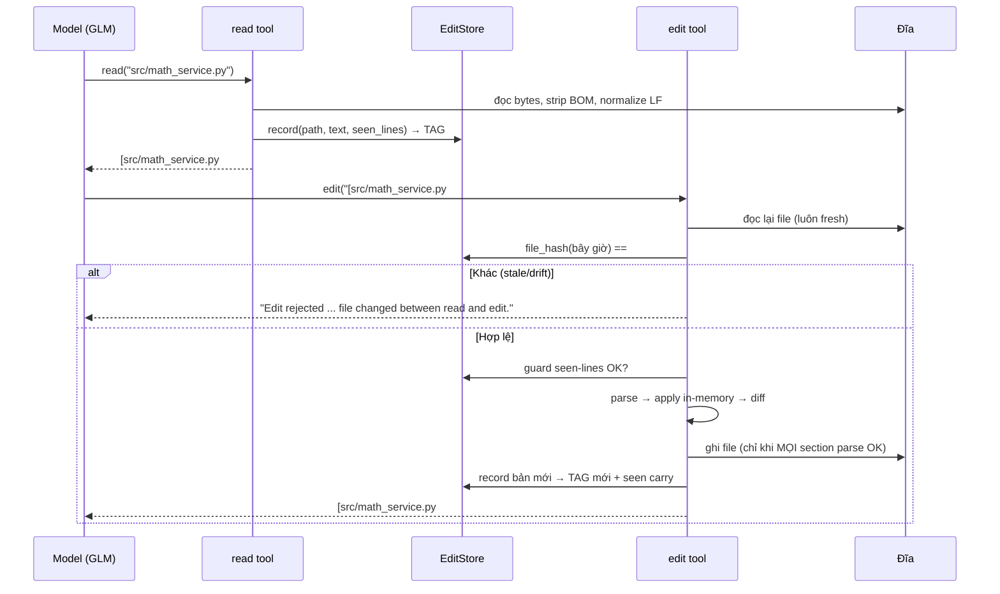
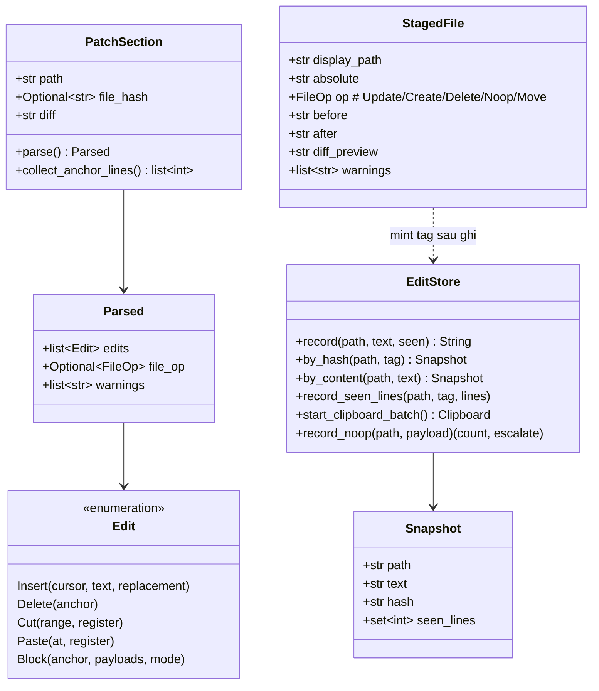

# Phase 2: Robust VFS & Hashline Editing — Phẫu thuật File chống Ảo giác Số dòng

> **Mục tiêu**: Porting Hashline Editing Engine từ Rust (`sample-code/oh-my-pi/crates/pi-edit/`) sang Python (`src/dino_coding/tools/`), xây dựng Smart Read Tool có phân trang và tóm tắt outline, rồi tích hợp toàn bộ vào Deep Agent. Kết thúc phase, Agent của bạn sửa code theo **mỏ neo dòng kèm mã băm ngắn** (`[path#TAG]` + `N:TEXT`), tự động từ chối edit khi file bị thay đổi ngầm hoặc khiNeo dòng chưa từng được đọc.
>
> **Thời gian dự kiến**: 3 - 4 giờ  
> **Cảm hứng kiến trúc từ `oh-my-pi`**: `crates/pi-edit` (Rust edit engine), `packages/coding-agent/src/tools/read.ts` + `read-summary.ts` (Smart Read)  
> **Prerequisites**: Hoàn thành [Phase 1: Hello Coding Agent](phase_01_hello_agent.md) (`uv run dino-coding` chạy được, Pyright 0 errors).

---

## 1. Lý thuyết chuyên sâu: Vì sao `str_replace` là điểm chết của Coding Agent

### 1.1 Ba bệnh mạn tính của `edit_file(old_string, new_string)`

Đa số agent業 nội bộ (kể cả built-in `edit_file` của nhiều framework) sửa file bằng cách tìm-kiếm-thay một chuỗi văn bản. Cách này gặp đúng ba cái bẫy mà `oh-my-pi` đã xử lý triệt để trong crate `pi-edit`:

1. **Ảo giác số dòng (Hallucinatory anchors)**: Model đọc file ở lượt 3, đến lượt 7 vẫn "nhớ" structure cũ. Nếu một lượt edit khác (hoặc chính người dùng) đã chèn 5 dòng ở đầu file, mọi số dòng model còn nắm đều lệch 5. `str_replace` không chết vì số dòng — nó chết vì model *thay nhầm chỗ khác có đoạn text giống hệt* (khai báo import, getter/setter trùng nhau...).
2. **Stale edit / drift ngầm**: Giữa thời điểm model đọc file và thời điểm ghi, file có thể đã đổi (formatter on-save, tiến trình khác, subagent). Ghi đè khi đó = *mất code của người khác mà model không hề hay biết*.
3. **Sửa chỗ chưa từng thấy**: Model chỉ đọc 40 dòng đầu nhưng mạnh dạn `PUT` vào dòng 400 — dòng mà nó chưa bao giờ nhìn thấy trong phiên này. Lỗi giăng sẵn: neo sai, payload sai ngữ cảnh.

### 1.2 Giải pháp của `oh-my-pi`: mỏ neo kép (dual anchor)

Crate `pi-edit` (chế độ **hashline**) giải cả ba bệnh bằng một giao thức nhỏ gọn:

```
[workspace/src/math_service.py#A1B2]      ← mỏ neo phiên bản: PATH + 4-hex content tag
PUT 8.=8:                                  ← mỏ neo dòng: số dòng GỐC từ read output
+    discount_amount = price * (discount_percent / 100)
```

* **Mỏ neo phiên bản — `[PATH#TAG]`**: mỗi lần tool `read` trả file về, engine tính `TAG = file_hash(text)` (4 ký tự hex) và lưu **snapshot** toàn văn. Khi `edit` đến, engine hash lại file trên đĩa: **hash khác tag → từ chối ngay lập tức** với thông báo chỉ đường (`re-read để lấy tag mới`). Bệnh 2 hết.
* **Mỏ neo dòng — `N:TEXT`**: output của `read` đánh số **mỗi dòng một số gốc** (`123:    return x`), số này chính là địa chỉ model dùng trong `PUT N.=M:`. Không có khái niệm "hunk-shifted numbers" như unified diff. Bệnh 1 giảm mạnh: model copy số từ output gần nhất, engine tự validated bằng tag.
* **Seen-lines provenance**: kèm theo snapshot, engine ghi lại **tập hợp các dòng model từng thấy** (`seen_lines`). Khi edit neo vào dòng ngoài tập này (dòng bị gấp/ẩn vì summary, hoặc thuộc trang chưa đọc), engine **từ chối và in luôn nội dung thật** của các dòng đó, yêu cầu xác nhận. Bệnh 3 hết.

Đây là một **hợp đồng giao thức (protocol contract)** giữa read và edit — không phải hai tool rời rạc. Đó là lý do Phase 2 phải xây Read và Edit **cùng một lúc, cùng một store**.

### 1.3 Bản đồ crate `pi-edit` và chiến lược porting

```
crates/pi-edit/src/
├── text.rs                    # normalize LF/BOM, trim kiểu JS, indent profile
├── store.rs                   # EditStore: snapshot (LRU), clipboard @register, no-op guard
│                              #   + file_hash() = xxh32 & 0xFFFF → 4 hex uppercase
├── path_policy.rs             # cô lập đường dẫn, chống traversal
├── files.rs                   # FileSource: read-through cache theo (path, mtime, len)
├── engine.rs                  # ModeEngine trait: preview() / stage() / inspect()
├── session.rs                 # Session: stage toàn bộ → ghi qua EditWriter → mint tag mới
└── modes/hashline/
    ├── format.rs              # hằng số cú pháp + format_numbered_line "N:TEXT"
    ├── types.rs               # Anchor, Cursor, ParsedRange, Edit (Insert/Delete/Cut/Paste/Block)
    ├── tokenizer.rs           # classify_line: Header / OpBlock (PUT/CUT/REM/MV) / Payload / Raw
    ├── input.rs               # tách section [PATH#TAG], gộp section cùng path
    ├── parser.rs              # Executor: pending hunk → edits cấp thấp + warnings
    ├── apply.rs               # materialize(): bucket theo dòng, splice ngược dòng + repair
    ├── clipboard.rs           # hạ mức CUT/PASTE @register thành Insert/Delete
    ├── block.rs               # phân giải `N*` bằng tree-sitter (defer trong port này)
    ├── mismatch.rs            # thông báo lỗi tag lệch (byte-faithful cho model)
    ├── patcher.rs             # stage_patch: check tag → seen-lines guard → apply → StagedFile
    ├── messages.rs            # toàn bộ text model-facing (warnings, errors)
    └── prompts/hashline.md    # tool description gốc (models được train trên text này)
```

**Phân loại porting cho `dino-coding`** (nguyên tắc V3.1: Reuse vs Porting):

| Thành phần `pi-edit` | Chiến lược | Ghi chú |
|---|---|---|
| `file_hash`, `EditStore` (snapshot/clipboard/no-op) | **Port 100%** | `tools/hashline/store.py` |
| tokenizer + input + parser (PUT/CUT/REM/MV, `@register`) | **Port 100%** | `tools/hashline/tokenizer.py`, `input.py`, `parser.py` |
| `materialize` + `validate_bounds` + phantom-line | **Port 100%** | `tools/hashline/apply.py` |
| seen-lines guard (`assert_seen_lines`) + mismatch diagnostics | **Port 100%** | `tools/hashline/patcher.py`, `messages.py` |
| Path policy (cô lập workspace) | **Port rút gọn** | chặn traversal ra ngoài workspace root |
| Tool `read` (`N:TEXT`, tag header, truncation notice) | **Port + điều chỉnh schema** | dùng JSON args `path/offset/limit` thay selector inline `path:50-100` (vì tool LangChain là JSON-schema) |
| Outline summary (`read-summary.ts`) | **Port theo cảm hứng** | tree-sitter → heuristic regex theo ngôn ngữ (Python/JS/TS/MD) |
| Compact diff preview (`±N|`) | **Port điều chỉnh** | tính bằng `difflib`, giữ nguyên format `-N\|old` / `+N\|new` |
| Block ops `N*` (tree-sitter), boundary repair, landing repair | **Defer** | trả đúng lỗi `BLOCK_RESOLVER_UNAVAILABLE` như omp khi không cấu hình resolver — hành vi trung thực, không giả vờ hỗ trợ |
| Streaming preview, fuzzy recovery, path-recovery-by-suffix | **Defer** | ghi nhận ở mục 8 để nâng cấp sau |

> [!IMPORTANT]
> **Vì sao lỗi vẫn là "tính năng"**: `pi-edit` cố tình giữ *error string byte-identical* với bản TypeScript gốc — lib.rs ghi rõ: *"Error strings are byte-identical to the TypeScript implementation they replace; models are trained on them."* Vì vậy toàn bộ **string model-facing trong port này giữ nguyên tiếng Anh** của omp (tool description, error, warning). Tiếng Việt chỉ dùng cho prose tutorial và CLI hiển thị cho người.

### 1.4 Vòng đời một chỉnh sửa (điều khiển bởi `Session`)



Nguyên tắc **stage-then-write**: `stage_patch()` tính toàn bộ kết quả trong RAM cho *mọi* file section; chỉ khi không có lỗi nào mới ghi đĩa. Một patch nhiều file hoặc thành công toàn bộ, hoặc không đổi gì.

---

## 2. Chuẩn bị Môi trường

```bash
cd dino-coding

# Thư viện hash nhanh (thuần C, đã là dependency quen thuộc của LangChain)
uv add xxhash

# pytest cho unit test engine (dev dependency)
uv add --dev pytest
```

Chỉ cần thêm **một** thư viện runtime: `xxhash`. Không cần tree-sitter, không cần regex mới ngoài `re` chuẩn.

Cấu trúc thư mục sau Phase 2 (phần **in đậm** là mới):

```
dino-coding/
├── pyproject.toml                  # + xxhash, + pytest (dev)
└── src/dino_coding/
    ├── config.py                   # (giữ nguyên Phase 1)
    ├── prompt.py                   # cập nhật: thêm FILE OPERATIONS discipline
    ├── agent.py                    # cập nhật: đăng ký read/write/edit
    ├── main.py                     # GIỮ NGUYÊN (display Tool Call đã generic)
    └── tools/
        ├── __init__.py
        ├── base.py                 # (giữ nguyên Phase 1)
        ├── workspace.py            # MỚI: path policy cô lập workspace
        ├── fs.py                   # MỚI: Smart Read + Write tool
        ├── editor.py               # MỚI: edit tool (orchestrator + render kết quả)
        └── hashline/               # MỚI: engine port từ crates/pi-edit
            ├── __init__.py
            ├── text.py             # ← port text.rs + store::file_hash
            ├── types.py            # ← port modes/hashline/types.rs
            ├── store.py            # ← port store.rs (EditStore, Clipboard)
            ├── messages.py         # ← port messages.rs + mismatch.rs
            ├── tokenizer.py        # ← port tokenizer.rs
            ├── input.py            # ← port input.rs
            ├── parser.py           # ← port parser.rs (Executor)
            ├── apply.py            # ← port apply.rs (materialize)
            └── patcher.py          # ← port patcher.rs (stage_patch)
```

`tools/hashline/` **phản chiếu 1-1 cấu trúc crate** để bạn đối chiếu từng file với Rust gốc khi debug. `tools/editor.py` là wrapper biến engine thành LangChain tool — tương đương `EditTool` trong `packages/coding-agent/src/edit/index.ts`.

---

## 3. Kiến trúc Module & Hợp đồng Dữ liệu



Luồng dữ liệu một lời gọi `edit`:

```
input (str) ──► input.split_sections() ──► [PatchSection]
                       │ parse() (tokenizer + parser.Executor)
                       ▼
                  Parsed(edits, file_op, warnings)
                       │ patcher.stage_patch(store, workspace)
                       ▼
                  [StagedFile]  ──(mọi thứ OK)──►  ghi đĩa ──► store.record() → TAG mới
                       │
                       ▼
             editor.render_result() → "[path#TAG] + diff ±N| + warnings"
```

---

## 4. Mã nguồn Mẫu Hoàn chỉnh Từng Module

> Quy ước: mọi dòng `# ← port <file Rust>` chỉ file gốc để bạn đối chiếu. Code python pass Pyright strict cơ bản (type hints đầy đủ).

### 4.1 Module `tools/hashline/text.py` — chuẩn hóa văn bản & `file_hash`

Port của `text.rs` (chỉ phần engine hashline dùng) và `store::file_hash`. Điểm tinh tế: **hash phải bất biến với trailing whitespace** — model hay làm rơi một space cuối dòng khi gõ lại; nếu hash cảm thụ whitespace thì tag sẽ "sai" oan.

```python
"""Chuẩn hóa văn bản và content-hash cho hashline engine.

Port rút gọn của crates/pi-edit/src/text.rs và store::file_hash.
Không module nào trong đây được chạm filesystem.
"""

from __future__ import annotations

import re

import xxhash

# Escape tường minh như omp: `pub const BOM: &str = "\u{FEFF}";`
# KHÔNG gõ ký tự \ufeff literal — nó vô hình, linter/formatter có thể xóa mất
# và biến BOM thành chuỗi rỗng (khi đó startswith("") luôn True, strip_bom
# sẽ cắt ký tự đầu của MỌI file một cách âm thầm).
BOM = "\ufeff"


def strip_bom(content: str) -> str:
    """Tách UTF-8 BOM ở đầu nội dung. ← port text::strip_bom"""
    return content[1:] if content.startswith(BOM) else content


def normalize_to_lf(text: str) -> str:
    """Đổi mọi CRLF / CR còn sót thành LF. ← port text::normalize_to_lf"""
    return text.replace("\r\n", "\n").replace("\r", "\n")


# Regex compile MỘT LẦN ở mức module — mô phỏng `static XXX_RE: LazyLock<Regex>`
# của omp; tránh khởi tạo lại object pattern qua mỗi lần gọi hàm.
_SEEN_PREFIX_RE = re.compile(r"^[ *]?(\d+)(?:-(\d+))?:")


class LineEnding:
    """Phát hiện và khôi phục kiểu xuống dòng. ← port text::detect_line_ending"""

    LF = "lf"
    CRLF = "crlf"

    @staticmethod
    def detect(content: str) -> str:
        crlf = content.find("\r\n")
        if crlf != -1:
            return LineEnding.CRLF
        return LineEnding.LF

    @staticmethod
    def restore(text: str, ending: str) -> str:
        """Ghi đĩa theo kiểu dòng gốc của file. ← port text::restore_line_endings

        omp giữ bất biến "text đầu vào luôn LF" bằng kiến trúc crate; Python
        không có cơ chế nào giữ giúp nên ta chủ động normalize bên trong —
        caller vô tình truyền text còn \r\n sẽ không bị nhân đôi thành \r\r\n.
        Chi phí 1 pass, chỉ trả lời đúng trong mọi tình huống (hàm total).
        """
        text = normalize_to_lf(text)
        if ending == LineEnding.CRLF:
            return text.replace("\n", "\r\n")
        return text


def file_hash(text: str) -> str:
    """Content tag 4-hex cho một phiên bản file. ← port store::file_hash

    Thuật toán (phải khớp byte với Rust):
    1. Với TỪNG dòng, bỏ mọi khoảng trắng cuối dòng (space/tab/CR).
       → model làm rơi trailing space không làm đổi tag.
    2. xxh32 (seed 0) toàn văn bản đã chuẩn hóa.
    3. AND 0xFFFF, format 4 ký tự HEX VIẾT HOA.

    Ví dụ: "def f():\\n    return 1\\n" và "def f():\\n    return 1   \\n"
    cho cùng một tag.
    """

    normalized = "\n".join(line.rstrip(" \t\r") for line in text.split("\n"))
    digest = xxhash.xxh32(normalized.encode("utf-8")).intdigest()
    return f"{digest & 0xFFFF:04X}"


def payload_hash(text: str) -> int:
    """Khóa 64-bit ổn định cho patch input thô — dùng chống vòng lặp no-op. ← port store::payload_hash"""

    return xxhash.xxh64(text.encode("utf-8")).intdigest()


def seen_lines_from_body(body: str) -> list[int]:
    """Trích số dòng hiển thị từ một body dạng hashline. ← port store::seen_lines_from_body

    Mỗi dòng khớp `^[ *]?(\\d+)(-(\\d+))?:` đóng góp endpoint(s) của nó.
    Dòng `5-12:...` đóng góp cả 5 và 12 (guard cần biên, không cần từng dòng giữa).
    """
    prefix = _SEEN_PREFIX_RE
    seen: list[int] = []
    for row in body.split("\n"):
        match = prefix.match(row)
        if not match:
            continue
        seen.append(int(match.group(1)))
        if match.group(2):
            seen.append(int(match.group(2)))
    return seen
```

> [!TIP]
> **Kiểm chứng tương thích thuật toán**: Rust dùng `xxh32(normalized, 0)` từ crate `xxhash-rust`. Python `xxhash.xxh32(...)` mặc định seed 0 — hai bên cho cùng giá trị nguyên. Bạn có thể thử: `file_hash("a\\nb\\n")` luôn ra cùng một tag qua mọi lần gọi.

### 4.2 Module `tools/hashline/types.py` — hợp đồng dữ liệu thuần

Port của `types.rs`. Không gì trong file này chạm filesystem — đây là bản "hợp đồng" giữa parser, applier và patcher.

```python
"""Kiểu dữ liệu thuần dùng chung bởi tokenizer/parser/apply/patcher.

Port của crates/pi-edit/src/modes/hashline/types.rs.
"""

from __future__ import annotations

from dataclasses import dataclass, field
from typing import Optional, Union


@dataclass(frozen=True)
class Anchor:
    """Mỏ neo dòng 1-indexed. ← port types::Anchor"""
    line: int


@dataclass(frozen=True)
class Cursor:
    """Vị trí chèn tương đối nội dung hiện có. ← port types::Cursor

    kind: "bof" | "eof" | "before" | "after"; anchor chỉ dùng cho before/after.
    """
    kind: str
    anchor: Optional[Anchor] = None


@dataclass(frozen=True)
class ParsedRange:
    """Khoảng dòng đóng [start, end] 1-indexed. ← port types::ParsedRange"""
    start: Anchor
    end: Anchor


@dataclass(frozen=True)
class PasteTarget:
    """Điểm hạ của paste: một gap (cursor) hoặc một span bị thay thế. ← port types::PasteTarget"""
    cursor: Optional[Cursor] = None
    range: Optional[ParsedRange] = None


# Block op bị hoãn (cần tree-sitter) — xem BLOCK_RESOLVER_UNAVAILABLE trong messages.py
BlockMode = str  # "insert_after" | "cut" | "paste_after" | "" (thay thế block)


@dataclass
class EditInsert:
    """Một dòng chèn vào cursor. ← port types::Edit::Insert

    replacement=True khi dòng đến từ body của `PUT N.=M:` (chèn trước dòng đầu
    range, kèm Delete các dòng cũ) — phân biệt với chèn thuần `PUT <N:`.
    line_num/index: vị trí trong patch (để cảnh báo chẩn đoán).
    """
    cursor: Cursor
    text: str
    line_num: int
    index: int
    replacement: bool = False


@dataclass
class EditDelete:
    """Xóa đúng một dòng theo mỏ neo. ← port types::Edit::Delete"""
    anchor: Anchor
    line_num: int
    index: int


@dataclass
class EditCut:
    """CUT range (tùy chọn @register) — hạ mức thành các EditDelete. ← port types::Edit::Cut"""
    range: ParsedRange
    register: Optional[str]
    line_num: int
    index: int


@dataclass
class EditPaste:
    """Paste register vào gap hoặc đè lên span. ← port types::Edit::Paste"""
    at: PasteTarget
    register: Optional[str]
    line_num: int
    index: int


@dataclass
class EditBlock:
    """Op khối hoãn giải (`PUT N*:`...) — engine này luôn từ chối. ← port types::Edit::Block"""
    anchor: Anchor
    payloads: list[str]
    mode: Optional[BlockMode]
    register: Optional[str]
    line_num: int
    index: int


Edit = Union[EditInsert, EditDelete, EditCut, EditPaste, EditBlock]


@dataclass
class FileOp:
    """Op toàn file từ thân section. ← port types::FileOp (Rem | Move)"""
    kind: str  # "rem" | "move"
    dest: Optional[str] = None


@dataclass
class Parsed:
    """Kết quả parse một thân section. ← port input::Parsed"""
    edits: list[Edit] = field(default_factory=list)
    file_op: Optional[FileOp] = None
    warnings: list[str] = field(default_factory=list)


@dataclass
class ApplyResult:
    """Kết quả áp edits lên text. ← port types::ApplyResult"""
    text: str = ""
    first_changed_line: Optional[int] = None
    warnings: list[str] = field(default_factory=list)
```

### 4.3 Module `tools/hashline/store.py` — `EditStore`: snapshot, clipboard, no-op guard

Port của `store.rs`. Đây là **bộ nhớ phiên (session memory)** của engine: mọi tool (`read`, `write`, `edit`) cùng chia sẻ một instance. Bản Rust dùng mutex + LRU 256 đường dẫn × 4 phiên bản × 64 MiB; bản port dùng `threading.Lock` và giữ nguyên các hằng số giới hạn (đơn giản hóa eviction thành FIFO theo clock).

```python
"""EditStore: snapshot phiên bản file, clipboard registers, vòng lặp no-op.

Port rút gọn của crates/pi-edit/src/store.rs (một instance dùng chung cả session).
"""

from __future__ import annotations

import threading
from dataclasses import dataclass, field
from typing import Optional

from dino_coding.tools.hashline.text import file_hash

# ← port các hằng số store.rs
MAX_PATHS = 256                 # DEFAULT_MAX_PATHS
MAX_VERSIONS_PER_PATH = 4       # DEFAULT_MAX_VERSIONS_PER_PATH
MAX_SNAPSHOT_FILE_BYTES = 4 * 1024 * 1024  # file lớn hơn không bao giờ snapshot
NOOP_HARD_LIMIT = 3             # no-op giống hệt liên tiếp → leo thang lỗi


@dataclass
class Snapshot:
    """Một phiên bản toàn văn của file tại một thời điểm. ← port store::Snapshot"""
    path: str
    text: str
    hash: str
    seen_lines: Optional[set[int]] = None  # None = không ghi provenance


@dataclass
class Clipboard:
    """Clipboard xâu xuyên một lần apply; register có tên tồn tại qua các lần gọi.
    ← port store::Clipboard
    """
    anon: list[list[str]] = field(default_factory=list)      # các CUT ẩn danh pendings
    named: dict[str, list[str]] = field(default_factory=dict)


class EditStore:
    """Bộ nhớ chia sẻ vòng đời session. ← port store::EditStore"""

    def __init__(self) -> None:
        self._lock = threading.Lock()
        self._histories: dict[str, list[Snapshot]] = {}
        self._clipboard_named: dict[str, list[str]] = {}
        self._noop: dict[str, tuple[int, int]] = {}
        self._order: list[str] = []  # FIFO cho eviction

    # ---------- snapshot ----------

    def record(self, path: str, text: str, seen_lines: Optional[list[int]] = None) -> str:
        """Ghi nhận một phiên bản text dưới path chuẩn, trả về tag. ← port EditStore::record

        Nếu phiên bản (hash + text) đã tồn tại: đưa lên đầu lịch sử và gộp seen_lines.
        """
        tag = file_hash(text)
        with self._lock:
            versions = self._histories.setdefault(path, [])
            for i, snap in enumerate(versions):
                if snap.hash == tag and snap.text == text:
                    moved = versions.pop(i)
                    self._merge_seen(moved, seen_lines)
                    versions.insert(0, moved)
                    self._touch(path)
                    return tag
            snap = Snapshot(path=path, text=text, hash=tag, seen_lines=None)
            self._merge_seen(snap, seen_lines)
            versions.insert(0, snap)
            del versions[MAX_VERSIONS_PER_PATH:]
            self._touch(path)
            self._evict()
            return tag

    def by_hash(self, path: str, tag: str) -> Optional[Snapshot]:
        """Phiên bản gần nhất khớp tag (không phân biệt hoa thường)."""
        with self._lock:
            self._touch(path)
            for snap in self._histories.get(path, []):
                if snap.hash.upper() == tag.upper():
                    return snap
        return None

    def by_content(self, path: str, text: str) -> Optional[Snapshot]:
        """Phiên bản có text khớp chính xác — cửa vào của seen-lines guard."""
        with self._lock:
            self._touch(path)
            for snap in self._histories.get(path, []):
                if snap.text == text:
                    return snap
        return None

    def record_seen_lines(self, path: str, tag: str, lines: list[int]) -> None:
        """Gộp thêm dòng đã hiển thị vào phiên bản khớp tag. ← port EditStore::record_seen_lines"""
        with self._lock:
            self._touch(path)
            for snap in self._histories.get(path, []):
                if snap.hash.upper() == tag.upper():
                    self._merge_seen(snap, lines)
                    return

    def invalidate(self, path: str) -> None:
        """Xóa lịch sử một path (sau khi file bị REM)."""
        with self._lock:
            self._histories.pop(path, None)
            if path in self._order:
                self._order.remove(path)

    def relocate(self, src: str, dest: str) -> None:
        """Chuyển lịch sử source sang destination (sau MV). ← port EditStore::relocate"""
        with self._lock:
            source = self._histories.pop(src, None)
            if source is None:
                return
            for snap in source:
                snap.path = dest
            existing = self._histories.pop(dest, [])
            merged, seen_tags = [], set()
            for snap in source + existing:
                if snap.hash not in seen_tags:
                    seen_tags.add(snap.hash)
                    merged.append(snap)
            self._histories[dest] = merged[:MAX_VERSIONS_PER_PATH]
            if src in self._order:
                self._order.remove(src)
            self._touch(dest)

    # ---------- clipboard ----------

    def start_clipboard_batch(self) -> Clipboard:
        """Bắt đầu một batch với các register có tên đã lưu. ← port EditStore::start_clipboard_batch"""
        with self._lock:
            return Clipboard(anon=[], named=dict(self._clipboard_named))

    def commit_clipboard(self, batch: Clipboard) -> None:
        """Công bố register có tên sau khi batch thành công. ← port commit_clipboard"""
        with self._lock:
            self._clipboard_named.update(batch.named)

    # ---------- no-op guard ----------

    def record_noop(self, path: str, payload: int) -> tuple[int, bool]:
        """Đếm no-op giống hệt liên tiếp. ← port EditStore::record_noop

        Trả về (số lần liên tiếp, đã chạm ngưỡng NOOP_HARD_LIMIT?).
        """
        with self._lock:
            prev_hash, count = self._noop.get(path, (payload, 0))
            count = count + 1 if prev_hash == payload else 1
            self._noop[path] = (payload, count)
            return count, count >= NOOP_HARD_LIMIT

    def reset_noop(self, path: str) -> None:
        with self._lock:
            self._noop.pop(path, None)

    # ---------- nội bộ ----------

    @staticmethod
    def _merge_seen(snap: Snapshot, lines: Optional[list[int]]) -> None:
        if lines is None:
            return
        if snap.seen_lines is None:
            snap.seen_lines = set()
        snap.seen_lines.update(lines)

    def _touch(self, path: str) -> None:
        if path in self._order:
            self._order.remove(path)
        self._order.append(path)

    def _evict(self) -> None:
        while len(self._order) > MAX_PATHS:
            oldest = self._order.pop(0)
            self._histories.pop(oldest, None)
```

### 4.4 Module `tools/hashline/messages.py` — mọi chuỗi model-facing

Port của `messages.rs` + `mismatch.rs`. Giữ nguyên tiếng Anh của omp — model được huấn luyện trên các chuỗi này, đổi wording là giảm chất lượng tự sửa lỗi (self-correction).

```python
"""Toàn bộ text model-facing của engine (lỗi, cảnh báo, định dạng dòng).

Port của crates/pi-edit/src/modes/hashline/messages.rs và mismatch.rs.
Giữ nguyên tiếng Anh gốc: models được train trên các chuỗi này.
"""

from __future__ import annotations

import json
from typing import Optional

MISMATCH_CONTEXT = 2  # dòng ngữ cảnh quanh anchor trong thông báo lỗi

# ---- warnings phổ biến (const, rút từ messages.rs) ----
BARE_BODY_AUTO_PIPED_WARNING = (
    "Auto-prefixed bare body row(s) with `+`. Body rows must be `+TEXT` literal lines."
)
MINUS_ROW_REJECTED = (
    "`-` rows are not valid; the range already names the lines being changed. "
    "For Markdown bullets or other literal `-` lines, prefix the literal row with `+`: `+- item`."
)
MINUS_BULLET_AUTO_PIPED_WARNING = (
    "Auto-prefixed bare `-` Markdown bullet row(s) with `+` as literal content."
)
DIFF_OLD_ROWS_IGNORED_WARNING = (
    "Ignored `-` context row(s) copied from a diff; body rows are final content only."
)
EMPTY_INSERT = (
    "`PUT <N:` / `PUT >N:` promises body rows and got none. Write `+TEXT` rows, or drop "
    "the `:` to paste a register (`PUT >N` = anonymous, `PUT >N @name` = named)."
)
EMPTY_PUT_AUTO_CUT_WARNING = (
    "`PUT N.=M:` with an empty body was treated as `CUT N.=M` (delete the range)."
)
CUT_COLON_IGNORED_WARNING = "CUT takes no body; the trailing `:` was ignored."
CUT_TAKES_NO_BODY = "CUT takes no body rows. Name the range on the CUT line itself."
REM_TAKES_NO_BODY = "`REM` deletes the whole file and takes no body rows."
MOVE_TAKES_NO_BODY = "`MV` takes no body rows. Put line ops in a separate section."
REGISTER_PUT_TAKES_NO_BODY = (
    "Register pastes have no body: the payload comes from the named `CUT ... @name`."
)
COLON_ON_REGISTER_PUT = (
    "Register pastes take no `:` and no body: the payload comes from the named `CUT ... @name`."
)
COLONLESS_PUT_TAKES_NO_BODY = "Body rows require a trailing `:` on the hunk header."
COLONLESS_SPAN_PUT = "`PUT N.=M` without `:` and without a body is ambiguous; write `CUT N.=M` to delete."
SNAPSHOT_ROWS_AUTO_PUT_WARNING = (
    "Recovered pasted read-output row(s) `N:TEXT` as single-line `PUT N.=N:` replacements."
)
BARE_RANGE_AUTO_PUT_WARNING = "Recovered a bare `N-M:` row as `PUT N.=M:`."
READ_METADATA_IGNORED_WARNING = "Ignored read metadata/truncation notice row(s) in the patch body."
REPLACE_PAIR_COALESCED_WARNING = (
    "Coalesced a duplicated before/after replacement pair into one hunk; body is final content only."
)
BLOCK_RESOLVER_UNAVAILABLE = (
    "Block locators (`N*` in `PUT N*:`, `PUT >N*`, `CUT N*`) are not available here "
    "(no block resolver configured). Use a concrete line range."
)
EMPTY_PASTE = (
    "Nothing to paste: no unlabeled `CUT` precedes this `PUT` in this call, and the anonymous "
    "register never carries across calls. Put `CUT N.=M` above it, or use named registers "
    "(`CUT ... @name` -> `PUT ... @name`)."
)
CLIPBOARD_INTERLEAVED_SECTIONS = (
    "The same file appears in non-adjacent sections while clipboard edits are in play. "
    "Keep each file's ops under ONE `[path#TAG]` header."
)
HEADTAIL_DRIFT_WARNING = (
    "File changed since the tagged read; these ops are head/tail inserts with no line anchors, "
    "so they were applied to the current content. Verify the placement."
)


def json_quote(value: str) -> str:
    """JSON.stringify tương thích JS — dùng trong thông báo lỗi. ← port messages::json_quote"""
    return json.dumps(value, ensure_ascii=False)


def format_numbered_line(number: int, line: str) -> str:
    """`N:TEXT` — định dạng dòng của read output và context lỗi. ← port messages"""
    return f"{number}:{line}"


def format_anchored_context(anchor_lines: list[int], file_lines: list[str]) -> list[str]:
    """Ngữ cảnh ±MISMATCH_CONTEXT dòng quanh mỗi anchor. ← port messages::format_anchored_context

    Dòng anchor đánh dấu `*N:TEXT`, dòng ngữ cảnh ` N:TEXT` (leading space),
    chèn `...` giữa các vùng không liền kề.
    """
    rows: list[str] = []
    last_emitted: Optional[int] = None
    for anchor in sorted(anchor_lines):
        if not (1 <= anchor <= len(file_lines)):
            continue
        start = max(1, anchor - MISMATCH_CONTEXT)
        end = min(len(file_lines), anchor + MISMATCH_CONTEXT)
        if last_emitted is not None and start > last_emitted + 1:
            rows.append("...")
        for n in range(start, end + 1):
            marker = "*" if n == anchor else " "
            rows.append(f"{marker}{n}:{file_lines[n - 1]}")
        last_emitted = end
    return rows


def missing_snapshot_tag_message(path: str) -> str:
    return (
        f"Missing hashline snapshot tag for {path}; use `[{path}#tag]` from your latest "
        f"read/search output. To create a new file, use the write tool."
    )


def file_not_found_message(path: str) -> str:
    return f"File not found: {path}. Use the write tool to create new files."


def invalid_header_message(preview: str) -> str:
    return (
        'input must begin with "[PATH#HASH]" on the first non-blank line for anchored edits; '
        f"got: {json_quote(preview)}. Example: \"[src/foo.ts#1A2B]\" then edit ops."
    )


def conflicting_tags_message(path: str, first: str, second: str) -> str:
    return (
        f"Conflicting hashline snapshot tags for {path}: #{first} and #{second}. "
        "Re-read the file and retry with one current header."
    )


def no_change_diagnostic(path: str) -> str:
    return (
        f"Edits to {path} parsed and applied cleanly, but produced no change: your body row(s) "
        "are byte-identical to the file at the targeted lines. The bug is somewhere else — "
        "re-read the file before issuing another edit. Do NOT widen the payload or add lines; "
        "verify the anchor first."
    )


def no_change_loop_diagnostic(path: str, count: int) -> str:
    return (
        f"STOP. Edits to {path} have been a byte-identical no-op {count} times in a row — the "
        "patch body matches the file at the targeted lines and the soft hint did not break the "
        "cycle. Cease re-issuing this payload. Either the intended change is already on disk "
        "(move on), or your anchor is wrong (re-read the file with `read` to observe the current "
        "line numbers and tag, then author a different edit). This exact payload will keep being "
        "rejected until it changes."
    )


def unseen_lines_message(
    path: str,
    unseen: list[int],
    tag: str,
    revealed: list[tuple[int, str]],
    truncated: bool,
) -> str:
    """Guard seen-lines: liệt kê dòng chưa từng hiển thị + lộ nội dung thật.
    ← port messages::unseen_lines_message
    """
    selector = ",".join(str(line) for line in unseen)
    header = (
        f"This edit anchors to lines {selector} of {path} that [{path}#{tag}] never displayed "
        "(it showed a partial range, a search hit, or a folded summary)."
    )
    if not revealed:
        return (
            f"{header} Re-read them in full first with a ranged read (pass explicit "
            f"`offset`/`limit` covering {selector}) — it skips summarization and mints a fresh "
            "tag — then re-issue the edit."
        )
    preview = "\n".join(f"  {n}:{text}" for n, text in revealed)
    if truncated:
        return (
            f"{header} Preview of the actual file content at the first {len(revealed)} unseen "
            f"line(s):\n{preview}\nThe range exceeds the inline preview cap — re-read the "
            f"remainder (offset/limit covering {selector}) before re-issuing the edit."
        )
    return (
        f"{header} Actual file content at those lines:\n{preview}\nVerify the content matches "
        "what you intend to touch, then re-issue the edit with the same [path#tag] header — a "
        "straight retry now succeeds without a re-read. If the content does NOT match, fix your "
        "line numbers."
    )


def format_mismatch_message(
    path: str,
    expected: str,
    actual: str,
    file_lines: list[str],
    anchor_lines: list[int],
    hash_recognized: bool,
) -> str:
    """Chẩn đoán tag lệch. ← port mismatch::format_mismatch_message (nguyên văn)"""
    where = f" for {path}" if path else ""
    if hash_recognized:
        lines = [
            f"Edit rejected{where}: file changed between read and edit.",
            f"Section is bound to #{expected}, but the current file hashes to #{actual}. If a "
            "prior edit in this session modified this file, copy the [path#newhash] header from "
            "that edit's response; otherwise re-read the file with `read` to refresh the tag "
            "before retrying.",
        ]
    else:
        lines = [
            f"Edit rejected{where}: hash #{expected} is not from this session.",
            f"The current file hashes to #{actual}. Re-read the file with `read` to copy a "
            "current [path#tag] header — never invent the tag and never reuse one from a prior "
            "session.",
        ]
    context = format_anchored_context(anchor_lines, file_lines)
    if context:
        lines.append("")
        lines.extend(context)
    return "\n".join(lines)


def format_out_of_range(line: int, total: int) -> str:
    return f"Line {line} does not exist (file has {total} lines)"
```

### 4.5 Module `tools/hashline/tokenizer.py` — phân loại từng dòng patch

Port `tokenizer.rs`. Đầu vào là các dòng đã tách; đầu ra là token `Header / OpBlock / Payload / Raw / Blank`. Trung tâm là hai bộ parse: `parse_header` (`[PATH#TAG]`) và `parse_hunk_header` (`PUT/CUT/REM/MV`).

```python
"""Tokenizer dòng cho hashline patch.

Port của crates/pi-edit/src/modes/hashline/tokenizer.rs (bỏ streaming buffer).
"""

from __future__ import annotations

import re
from dataclasses import dataclass
from typing import Optional, Union

from dino_coding.tools.hashline.types import Anchor, ParsedRange

HASH_LENGTH = 4  # HL_FILE_HASH_LENGTH
HASH_RE = re.compile(r"[0-9A-Fa-f]{4}")

# Locator + register tùy chọn của một op header. ← port tokenizer::BlockTarget
@dataclass
class ReplaceTarget:
    range: ParsedRange
    register: Optional[str] = None

@dataclass
class BlockTarget:
    anchor: Anchor
    register: Optional[str] = None

@dataclass
class InsertBeforeTarget:
    anchor: Anchor
    register: Optional[str] = None

@dataclass
class InsertAfterTarget:
    anchor: Anchor
    register: Optional[str] = None

@dataclass
class InsertAfterBlockTarget:
    anchor: Anchor
    register: Optional[str] = None

@dataclass
class CutTarget:
    range: ParsedRange
    register: Optional[str] = None

@dataclass
class CutBlockTarget:
    anchor: Anchor
    register: Optional[str] = None

@dataclass
class BofTarget:
    register: Optional[str] = None

@dataclass
class EofTarget:
    register: Optional[str] = None

@dataclass
class RemTarget:
    pass

@dataclass
class MoveTarget:
    dest: str

AnyTarget = Union[
    ReplaceTarget, BlockTarget, InsertBeforeTarget, InsertAfterTarget,
    InsertAfterBlockTarget, CutTarget, CutBlockTarget, BofTarget, EofTarget,
    RemTarget, MoveTarget,
]


def target_register(target: AnyTarget) -> Optional[str]:
    return getattr(target, "register", None)


# ---- token của một dòng ----
@dataclass
class HeaderToken:
    line_num: int
    path: str
    file_hash: Optional[str]

@dataclass
class OpToken:
    line_num: int
    target: AnyTarget
    had_colon: bool

@dataclass
class PayloadToken:
    line_num: int
    text: str

@dataclass
class RawToken:
    line_num: int
    text: str

@dataclass
class BlankToken:
    line_num: int

Token = Union[HeaderToken, OpToken, PayloadToken, RawToken, BlankToken]


def _number_prefix(raw: str) -> Optional[tuple[int, int]]:
    """Số dương không bắt đầu bằng 0. ← port tokenizer::parse_number_prefix"""
    if not raw or not raw[0].isascii() or not raw[0].isdigit() or raw[0] == "0":
        return None
    end = 1
    while end < len(raw) and raw[end].isdigit():
        end += 1
    return int(raw[:end]), end


def parse_range(raw: str, allow_single: bool = True) -> Optional[tuple[ParsedRange, int, bool]]:
    """`N`, `N.=M`, `N-M`, `N…M`, `N M`. ← port tokenizer::parse_range

    Trả về (range, số ký tự đã dùng, có_separator?). Separator hợp lệ:
    whitespace, `-`, `.`, `=`, `…` (chuỗi `.=` là 2 ký tự của cùng bộ này).
    """
    start = len(raw) - len(raw.lstrip())
    head = _number_prefix(raw[start:])
    if head is None:
        return None
    first, used = head
    cursor = start + used
    saw_non_ws = False
    while cursor < len(raw):
        ch = raw[cursor]
        if ch.isspace() or ch in "-.=…":
            saw_non_ws = saw_non_ws or not ch.isspace()
            cursor += 1
        else:
            break
    second = _number_prefix(raw[cursor:])
    if second is not None:
        end, count = second
        cursor += count
        while cursor < len(raw) and raw[cursor].isspace():
            cursor += 1
        rng = ParsedRange(Anchor(first), Anchor(end))
        return rng, cursor, True
    if not allow_single:
        return None
    rng = ParsedRange(Anchor(first), Anchor(first))
    if saw_non_ws and (cursor == len(raw) or raw[cursor] in ":@"):
        return rng, cursor, True
    return rng, cursor, False


def _register_and_colon(raw: str, target: AnyTarget) -> Optional[tuple[AnyTarget, bool]]:
    """`@name` tùy chọn + `:` tùy chọn; còn rác → None. ← port parse_register_and_colon"""
    rest = raw.lstrip()
    if rest.startswith("@"):
        tail = rest[1:]
        length = 0
        while length < len(tail) and (tail[length].isalnum() or tail[length] in "_-"):
            length += 1
        if length == 0 or length > 64:
            return None
        register, rest = tail[:length], tail[length:].lstrip()
        if hasattr(target, "register"):
            target.register = register
    had_colon = rest.startswith(":")
    if had_colon:
        rest = rest[1:].lstrip()
    if rest:
        return None
    return target, had_colon


def parse_put_target(raw: str) -> Optional[tuple[AnyTarget, bool]]:
    """Locator sau `PUT `. ← port tokenizer::parse_put_target"""
    rest = raw.lstrip()
    if rest.startswith(">"):
        after = rest[1:].lstrip()
        if after.startswith("$"):
            return _register_and_colon(after[1:], EofTarget())
        head = _number_prefix(after)
        if head is None:
            return None
        line, used = head
        tail = after[used:]
        block = tail.startswith("*")
        if block:
            tail = tail[1:]
        target: AnyTarget = (
            InsertAfterBlockTarget(Anchor(line)) if block else InsertAfterTarget(Anchor(line))
        )
        return _register_and_colon(tail, target)
    if rest.startswith("<"):
        after = rest[1:].lstrip()
        head = _number_prefix(after)
        if head is None:
            return None
        line, used = head
        tail = after[used:]
        if tail.startswith("*"):
            tail = tail[1:]
        target = BofTarget() if line == 1 else InsertBeforeTarget(Anchor(line))
        return _register_and_colon(tail, target)
    parsed = parse_range(rest)
    if parsed is None:
        return None
    rng, used, had_sep = parsed
    tail = rest[used:]
    if tail.startswith("*"):
        if had_sep:
            return None
        return _register_and_colon(tail[1:], BlockTarget(rng.start))
    return _register_and_colon(tail, ReplaceTarget(rng))


def parse_cut_target(raw: str) -> Optional[tuple[AnyTarget, bool]]:
    """Locator sau `CUT `. ← port tokenizer::parse_cut_target"""
    rest = raw.lstrip()
    parsed = parse_range(rest)
    if parsed is None:
        return None
    rng, used, had_sep = parsed
    tail = rest[used:]
    if tail.startswith("*"):
        if had_sep:
            return None
        return _register_and_colon(tail[1:], CutBlockTarget(rng.start))
    return _register_and_colon(tail, CutTarget(rng))


def _unquote_path(raw: str) -> Optional[str]:
    if len(raw) >= 2 and raw[0] == raw[-1] and raw[0] in "\"'":
        return raw[1:-1]
    if raw.startswith(("\"", "'")):
        return None
    return raw


def _keyword_tail(line: str, keyword: str) -> Optional[str]:
    """Phần sau keyword, chỉ hợp lệ khi trống/bắt đầu `:` hoặc whitespace. ← port keyword_tail"""
    if not line.startswith(keyword):
        return None
    rest = line[len(keyword):]
    if not rest or rest.startswith(":") or (rest and rest[0].isspace()):
        return rest
    return None


def parse_hunk_header(line: str) -> Optional[tuple[AnyTarget, bool]]:
    """PUT/CUT/REM/MV trên một dòng. ← port tokenizer::parse_hunk_header"""
    stripped = line.strip()
    rest = _keyword_tail(stripped, "REM")
    if rest is not None:
        return (RemTarget(), False) if not rest.strip() else None
    rest = _keyword_tail(stripped, "MV")
    if rest is not None:
        dest = _unquote_path(rest.strip())
        if dest:
            return MoveTarget(dest), False
        return None
    rest = _keyword_tail(stripped, "PUT")
    if rest is not None:
        return parse_put_target(rest)
    rest = _keyword_tail(stripped, "CUT")
    if rest is not None:
        return parse_cut_target(rest)
    return None


def _path_has_orphan_bracket(path: str) -> bool:
    """] không mở bằng [ → dòng chứa 2 nhóm bracket (noise). ← port header_path_has_orphan_bracket"""
    depth = 0
    for ch in path:
        if ch == "[":
            depth += 1
        elif ch == "]":
            if depth == 0:
                return True
            depth -= 1
    return False


def parse_header(line: str) -> Optional[tuple[str, Optional[str]]]:
    """`[path]` hoặc `[path#TAG]`. ← port tokenizer::parse_header

    TAG: đúng 4 hex (chấp nhận thường, chuẩn hóa HOA). path chứa `#` nữa → None
    (để rơi vào nhánh phục hồi của input.py).
    """
    stripped = line.rstrip()
    if not (stripped.startswith("[") and stripped.endswith("]")):
        return None
    body = stripped[1:-1]
    if not body:
        return None
    if "#" in body:
        path, _, tag = body.rpartition("#")
        if (
            not path
            or "#" in path
            or _path_has_orphan_bracket(path)
            or len(tag) != HASH_LENGTH
            or not HASH_RE.fullmatch(tag)
        ):
            return None
        return path, tag.upper()
    if _path_has_orphan_bracket(body):
        return None
    return body, None


def classify_line(line: str, line_num: int) -> Token:
    """Phân loại một dòng patch. ← port tokenizer::classify_line"""
    if not line:
        return BlankToken(line_num)
    header = parse_header(line)
    if header is not None:
        return HeaderToken(line_num, header[0], header[1])
    op = parse_hunk_header(line)
    if op is not None:
        return OpToken(line_num, op[0], op[1])
    if line.startswith("+"):
        return PayloadToken(line_num, line[1:])
    return RawToken(line_num, line)


def is_op_line(line: str) -> bool:
    """Dòng có phải op header trọn vẹn? ← port Tokenizer::is_op"""
    return parse_hunk_header(line) is not None
```


### 4.6 Module `tools/hashline/input.py` — tách section `[PATH#TAG]`

Port `input.rs`: nhận chuỗi patch thô, tách thành các `PatchSection`, gộp section cùng path, bắt xung đột tag.

```python
"""Tách patch thô thành các section theo header [PATH#TAG].

Port rút gọn của crates/pi-edit/src/modes/hashline/input.rs
(bỏ envelope `*** Begin/End Patch` và streaming recovery).
"""

from __future__ import annotations

import re
from dataclasses import dataclass, field
from typing import Optional

from dino_coding.tools.hashline import messages
from dino_coding.tools.hashline.parser import parse_patch
from dino_coding.tools.hashline.text import BOM
from dino_coding.tools.hashline.tokenizer import parse_header
from dino_coding.tools.hashline.types import (
    EditCut, EditDelete, EditInsert, EditPaste, FileOp, Parsed,
)

# Noise kiểu apply_patch: `*** Update File:`, `*** Move to:`... ← port APPLY_PATCH_PATH_NOISE_RE
PATH_NOISE_RE = re.compile(
    r"(?i)^\*{0,3}\s*(?:(?:update|add|delete|move)[^A-Za-z0-9]*(?:file|to)?[^A-Za-z0-9]*:)?\s*\*{0,3}\s*"
)

# ← port input.rs RECOVERY_TAG_RE (static LazyLock<Regex> của omp)
RECOVERY_TAG_RE = re.compile(r"#([0-9A-Fa-f]{4})\s*$")


@dataclass
class PatchSection:
    """Một section = header (path + tag) + thân ops. ← port input::PatchSection"""
    path: str
    file_hash: Optional[str]
    diff: str
    _parsed: Optional[Parsed] = field(default=None, repr=False)
    _parse_error: Optional[str] = field(default=None, repr=False)

    def parse(self) -> Parsed:
        """Parse (memoized) thân section."""
        if self._parsed is None and self._parse_error is None:
            try:
                self._parsed = parse_patch(self.diff)
                if self._parsed.file_op and self._parsed.file_op.kind == "move":
                    self._parsed.file_op.dest = _normalize_path(
                        self._parsed.file_op.dest, cwd=None
                    )
            except ValueError as error:
                self._parse_error = str(error)
        if self._parse_error is not None:
            raise ValueError(self._parse_error)
        assert self._parsed is not None
        return self._parsed

    def edits(self):
        return self.parse().edits

    def file_op(self) -> Optional[FileOp]:
        return self.parse().file_op

    def has_anchor_scoped_edit(self) -> bool:
        """Có edit nào neo vào nội dung cụ thể không? ← port PatchSection::has_anchor_scoped_edit

        Không có (chỉ head/tail insert) → tag lệch vẫn cho phép apply (vì
        không có mỏ neo nào có thể sai).
        """
        for edit in self.edits():
            if isinstance(edit, (EditDelete, EditCut)):
                return True
            if isinstance(edit, EditPaste) and edit.at.range is not None:
                return True
            if isinstance(edit, EditInsert) and edit.cursor.anchor is not None:
                return True
        return False

    def collect_anchor_lines(self) -> list[int]:
        """Mọi dòng mỏ neo, tăng dần, không trùng. ← port PatchSection::collect_anchor_lines"""
        lines: list[int] = []
        for edit in self.edits():
            if isinstance(edit, EditDelete):
                lines.append(edit.anchor.line)
            elif isinstance(edit, EditCut):
                lines.extend(range(edit.range.start.line, edit.range.end.line + 1))
            elif isinstance(edit, EditPaste):
                if edit.at.range is not None:
                    lines.extend(range(edit.at.range.start.line, edit.at.range.end.line + 1))
                elif edit.at.cursor is not None and edit.at.cursor.anchor is not None:
                    lines.append(edit.at.cursor.anchor.line)
            elif isinstance(edit, EditInsert) and edit.cursor.anchor is not None:
                lines.append(edit.cursor.anchor.line)
        return sorted(set(lines))


@dataclass
class Patch:
    """Patch đa file đã tách section. ← port input::Patch"""
    sections: list[PatchSection]


def _unquote(path: str) -> str:
    if len(path) >= 2 and path[0] == path[-1] and path[0] in "\"'":
        return path[1:-1]
    return path


def _normalize_path(raw: str, cwd: Optional[str]) -> str:
    """Bỏ quote, bỏ noise apply_patch. ← port input::normalize_hashline_path (rút gọn)"""
    cleaned = PATH_NOISE_RE.sub("", _unquote(raw.strip())).strip()
    return cleaned


def _parse_header_line(line: str) -> Optional[PatchSection]:
    stripped = line.strip()
    if not stripped.startswith("["):
        return None
    header = parse_header(stripped)
    if header is not None:
        path, tag = header
        if not path:
            raise ValueError('Input header "[]" is empty; provide a file path.')
        return PatchSection(path=_normalize_path(path, None), file_hash=tag, diff="")
    # Phục hồi nhẹ: `[src/a.py #ABCD]` (space trước #) hoặc path có noise
    if stripped.startswith("[") and stripped.endswith("]"):
        body = PATH_NOISE_RE.sub("", stripped[1:-1].strip()).strip()
        tag_match = RECOVERY_TAG_RE.search(body)
        if tag_match:
            path_text = body[: tag_match.start()].strip()
            if path_text and "#" not in path_text:
                return PatchSection(
                    path=_normalize_path(path_text, None),
                    file_hash=tag_match.group(1).upper(),
                    diff="",
                )
    return None  # dòng `[...]` không parse được sẽ bị từ chối ở split


def split_patch(input_text: str) -> Patch:
    """Tách sections. ← port input::Patch::parse + split_raw_sections"""
    text = input_text.lstrip(BOM).rstrip("\n")
    lines = [ln.rstrip("\r") for ln in text.split("\n")]
    while lines and (not lines[0].strip() or lines[0].strip() == "*** Begin Patch"):
        lines.pop(0)
    if not lines:
        raise ValueError(messages.invalid_header_message(""))

    first = _parse_header_line(lines[0])
    if first is None:
        preview = lines[0][:120]
        raise ValueError(messages.invalid_header_message(preview))

    sections: list[PatchSection] = []
    current: Optional[PatchSection] = None
    body: list[str] = []
    aborted = False

    for line in lines:
        if line.strip() in ("*** End Patch", "*** Abort"):
            aborted = True
            break
        if line.strip() == "*** Begin Patch":
            continue
        if line.lstrip().startswith("["):
            header = _parse_header_line(line)
            if header is not None:
                _flush(sections, current, body)
                current = header
                continue
        body.append(line)
    if not aborted:
        _flush(sections, current, body)

    if not sections:
        raise ValueError("No hashline sections found in input.")

    _merge_same_path(sections)
    return Patch(sections=sections)


def _flush(sections: list[PatchSection], current: Optional[PatchSection], body: list[str]) -> None:
    if current is None:
        body.clear()
        return
    if any(line.strip() for line in body):
        current.diff = "\n".join(body)
        sections.append(current)
    body.clear()


def _merge_same_path(sections: list[PatchSection]) -> None:
    """Gộp section cùng path; tag xung đột → lỗi. ← port input::merge_same_path_sections"""
    positions: dict[str, int] = {}
    result: list[PatchSection] = []
    for section in sections:
        if section.path in positions:
            existing = result[positions[section.path]]
            if existing.file_hash and section.file_hash and existing.file_hash != section.file_hash:
                raise ValueError(
                    messages.conflicting_tags_message(
                        section.path, existing.file_hash, section.file_hash
                    )
                )
            if existing.file_hash is None:
                existing.file_hash = section.file_hash
            existing.diff = existing.diff + "\n" + section.diff
            continue
        positions[section.path] = len(result)
        result.append(section)
    sections[:] = result
```

### 4.7 Module `tools/hashline/parser.py` — `Executor`: op → edits cấp thấp

Port `parser.rs`. Đây là module "dịch nghĩa" các op: `PUT N.=M:` + body thành *các Insert(replacement=True) trước dòng N* + *các Delete N..M*; chống `-` rows, chống overlap hai hunk, hạ mức `CUT` thành Delete...

```python
"""Executor: dịch op headers + body thành edits cấp thấp.

Port rút gọn của crates/pi-edit/src/modes/hashline/parser.rs.
"""

from __future__ import annotations

import re
from dataclasses import dataclass, field
from typing import Optional

from dino_coding.tools.hashline import messages
from dino_coding.tools.hashline.tokenizer import (
    AnyTarget, BofTarget, BlockTarget, CutBlockTarget, CutTarget, EofTarget,
    InsertAfterBlockTarget, InsertAfterTarget, InsertBeforeTarget, MoveTarget,
    RemTarget, ReplaceTarget, classify_line, is_op_line,
    BlankToken, HeaderToken, OpToken, PayloadToken, RawToken, target_register,
)
from dino_coding.tools.hashline.types import (
    Anchor, Cursor, EditBlock, EditCut, EditDelete, EditInsert, EditPaste,
    FileOp, Parsed, ParsedRange, PasteTarget,
)

MAX_EXPANDED_RANGE_LINES = 100_000  # ← port parser::MAX_EXPANDED_RANGE_LINES

# Dòng metadata của read (truncation notice) — bỏ qua với warning. ← port prefixes.rs
READ_METADATA_RE = re.compile(r"^\s*[\[（(]")


@dataclass
class _PayloadRow:
    text: str
    line_num: int
    bare: bool = False
    minus: bool = False


@dataclass
class _Pending:
    target: AnyTarget
    line_num: int
    payloads: list[_PayloadRow] = field(default_factory=list)
    had_colon: bool = False
    deferred_blanks: list[_PayloadRow] = field(default_factory=list)


class Executor:
    """Bộ thực thi token→edit tăng dần. ← port parser::Executor"""

    def __init__(self) -> None:
        self.edits: list = []
        self.warnings: list[str] = []
        self._edit_index = 0
        self._pending: Optional[_Pending] = None
        self._file_op: Optional[FileOp] = None
        self._recovered_lines: set[int] = set()

    # ---------- API ----------

    def feed_line(self, line: str, line_num: int) -> None:
        token = classify_line(line, line_num)
        self.feed(token)

    def feed(self, token) -> None:

        if isinstance(token, HeaderToken):
            self._flush_pending()
        elif isinstance(token, BlankToken):
            self._handle_blank("", token.line_num)
        elif isinstance(token, PayloadToken):
            self._handle_literal(token.text, token.line_num)
        elif isinstance(token, OpToken):
            self._handle_op(token)
        elif isinstance(token, RawToken):
            self._handle_raw(token.text, token.line_num)

    def finish(self) -> Parsed:
        self._flush_pending()
        if self._file_op and self._file_op.kind == "rem" and self.edits:
            raise ValueError(
                "`REM` deletes the whole file and cannot be combined with line ops."
            )
        self._normalize_overlaps()
        return Parsed(edits=self.edits, file_op=self._file_op, warnings=self.warnings)

    # ---------- ops ----------

    def _handle_op(self, token) -> None:
        target, line_num, had_colon = token.target, token.line_num, token.had_colon
        if isinstance(target, (ReplaceTarget, CutTarget)):
            self._validate_range(target.range, line_num)
        if had_colon and isinstance(target, (CutTarget, CutBlockTarget)):
            self._warn_once(messages.CUT_COLON_IGNORED_WARNING)
        if had_colon and not isinstance(target, (RemTarget, MoveTarget)) and target_register(target):
            raise ValueError(
                f"line {line_num}: {messages.COLON_ON_REGISTER_PUT}"
            )
        if isinstance(target, (RemTarget, MoveTarget)):
            self._flush_pending()
            self._set_file_op(target, line_num)
            return
        self._flush_pending()
        self._pending = _Pending(target=target, line_num=line_num, had_colon=had_colon)

    def _set_file_op(self, target: AnyTarget, line_num: int) -> None:
        if self._file_op is not None:
            raise ValueError(
                f"line {line_num}: only one file-level op (`REM` or `MV`) per section. "
                "Merge them under one header."
            )
        if isinstance(target, RemTarget):
            if self.edits:
                raise ValueError(f"line {line_num}: {messages.REM_TAKES_NO_BODY}")
            self._file_op = FileOp(kind="rem")
        elif isinstance(target, MoveTarget):
            self._file_op = FileOp(kind="move", dest=target.dest)

    # ---------- body rows ----------

    def _handle_literal(self, text: str, line_num: int) -> None:
        if self._pending is None:
            if self._file_op is not None:
                raise ValueError(f"line {line_num}: {messages.MOVE_TAKES_NO_BODY}")
            raise ValueError(
                f"line {line_num}: payload line has no preceding hunk header. "
                f"Got {messages.json_quote('+' + text)}."
            )
        self._reject_bodyless(line_num)
        self._pending.payloads.extend(self._pending.deferred_blanks)
        self._pending.deferred_blanks.clear()
        if is_op_line(text):
            self.warnings.append(
                f"line {line_num}: body row `{text}` is itself a valid hunk header, so it was "
                "inserted as literal text rather than executed. Drop the `+` to run it."
            )
        self._pending.payloads.append(_PayloadRow(text, line_num))

    def _handle_raw(self, text: str, line_num: int) -> None:
        if self._pending is None:
            if READ_METADATA_RE.match(text):
                self._warn_once(messages.READ_METADATA_IGNORED_WARNING)
                return
            self._contamination_check(text, line_num)
            if self._file_op is not None:
                raise ValueError(f"line {line_num}: {messages.MOVE_TAKES_NO_BODY}")
            if not text.strip():
                return
            bare_range = _parse_bare_range(text)
            if bare_range is not None:
                self._validate_range(bare_range, line_num)
                self._pending = _Pending(
                    target=ReplaceTarget(bare_range), line_num=line_num, had_colon=True
                )
                self._warn_once(messages.BARE_RANGE_AUTO_PUT_WARNING)
                return
            snapshot_row = _parse_snapshot_row(text)
            if snapshot_row is not None:
                line, value = snapshot_row
                if line in self._recovered_lines:
                    raise ValueError(
                        f"line {line_num}: two or more pasted `{line}:TEXT` rows name line "
                        f"{line}. Write one `PUT {line}.=M:` header covering the changing lines, "
                        "followed by `+TEXT` body rows with their final content."
                    )
                self._recovered_lines.add(line)
                rng = ParsedRange(Anchor(line), Anchor(line))
                self._push_insert(Cursor("before", Anchor(line)), value, line_num, replacement=True)
                self._push_delete_range(rng, line_num)
                self._warn_once(messages.SNAPSHOT_ROWS_AUTO_PUT_WARNING)
                return
            raise ValueError(
                f"line {line_num}: payload line has no preceding hunk header. Use `PUT N.=M:`, "
                f"`CUT N.=M`, or `PUT <N:`/`PUT >N:` above the body. Got {messages.json_quote(text)}."
            )
        if not text.strip():
            self._handle_blank(text, line_num)
            return
        self._reject_bodyless(line_num)
        minus = text.lstrip().startswith("-")
        if not minus:
            self._warn_once(messages.BARE_BODY_AUTO_PIPED_WARNING)
        self._pending.payloads.extend(self._pending.deferred_blanks)
        self._pending.deferred_blanks.clear()
        self._pending.payloads.append(_PayloadRow(text, line_num, bare=True, minus=minus))

    def _handle_blank(self, text: str, line_num: int) -> None:
        if self._pending is None:
            return
        if self._bodyless_message() or not self._pending.payloads:
            return
        # Blank trong thân payload: hoãn lại — chỉ giữ nếu có nội dung theo sau.
        self._pending.deferred_blanks.append(_PayloadRow(text, line_num, bare=True))

    def _reject_bodyless(self, line_num: int) -> None:
        message = self._bodyless_message()
        if message:
            raise ValueError(f"line {line_num}: {message}")

    def _bodyless_message(self) -> Optional[str]:
        target = self._pending.target if self._pending else None
        if target is None:
            return None
        if isinstance(target, (CutTarget, CutBlockTarget)):
            return messages.CUT_TAKES_NO_BODY
        if isinstance(target, (RemTarget, MoveTarget)):
            return None
        if target_register(target):
            return messages.REGISTER_PUT_TAKES_NO_BODY
        if not self._pending.had_colon:
            return messages.COLONLESS_PUT_TAKES_NO_BODY
        return None

    # ---------- flush: hạ mức pending thành edits ----------

    def _flush_pending(self) -> None:
        pending = self._pending
        if pending is None:
            return
        self._pending = None
        self._resolve_minus_rows(pending.payloads)
        _strip_uniform_bare_prefixes(pending.payloads)
        target, line = pending.target, pending.line_num

        if isinstance(target, (RemTarget, MoveTarget)):
            return
        if isinstance(target, CutTarget):
            self._push_cut(target.range, target.register, line)
        elif isinstance(target, CutBlockTarget):
            self.edits.append(
                EditBlock(target.anchor, [], "cut", target.register, line, self._next_index())
            )
        elif isinstance(target, ReplaceTarget):
            if target.register is not None:
                self._push_paste(PasteTarget(range=target.range), target.register, line)
            elif not pending.payloads:
                if not pending.had_colon:
                    raise ValueError(f"line {line}: {messages.COLONLESS_SPAN_PUT}")
                self._push_delete_range(target.range, line)
                self._warn_once(messages.EMPTY_PUT_AUTO_CUT_WARNING)
            else:
                for row in pending.payloads:
                    self._push_insert(
                        Cursor("before", target.range.start), row.text, line, replacement=True
                    )
                self._push_delete_range(target.range, line)
        elif isinstance(target, BlockTarget):
            self.edits.append(
                EditBlock(
                    target.anchor,
                    [row.text for row in pending.payloads],
                    None,
                    target.register,
                    line,
                    self._next_index(),
                )
            )
        elif isinstance(target, InsertAfterBlockTarget):
            if target.register is not None or (
                not pending.had_colon and not pending.payloads
            ):
                self._push_paste(
                    PasteTarget(cursor=Cursor("after", target.anchor)), target.register, line
                )
            elif not pending.payloads:
                raise ValueError(f"line {line}: {messages.EMPTY_INSERT}")
            else:
                self.edits.append(
                    EditBlock(
                        target.anchor,
                        [row.text for row in pending.payloads],
                        "insert_after",
                        None,
                        line,
                        self._next_index(),
                    )
                )
        else:
            # InsertBefore / InsertAfter / Bof / Eof
            if isinstance(target, InsertBeforeTarget):
                cursor = Cursor("before", target.anchor)
            elif isinstance(target, InsertAfterTarget):
                cursor = Cursor("after", target.anchor)
            elif isinstance(target, BofTarget):
                cursor = Cursor("bof")
            elif isinstance(target, EofTarget):
                cursor = Cursor("eof")
            else:  # pragma: no cover
                raise ValueError(f"line {line}: unsupported target")
            if target_register(target) is not None or (
                not pending.had_colon and not pending.payloads
            ):
                self._push_paste(PasteTarget(cursor=cursor), target_register(target), line)
            elif not pending.payloads:
                raise ValueError(f"line {line}: {messages.EMPTY_INSERT}")
            else:
                for row in pending.payloads:
                    self._push_insert(cursor, row.text, line, replacement=False)

    def _resolve_minus_rows(self, rows: list[_PayloadRow]) -> None:
        """`-` rows: bullet MD → giữ như literal; diff context → bỏ; còn lại → lỗi.
        ← port parser::resolve_minus_rows
        """
        minus_rows = [row for row in rows if row.minus]
        if not minus_rows:
            return
        all_bullets = all(_markdown_bullet(row.text) for row in minus_rows)
        explicit = [row for row in rows if not row.bare]
        if all_bullets and (not explicit or any(_markdown_bullet(r.text) for r in explicit)):
            self._warn_once(messages.MINUS_BULLET_AUTO_PIPED_WARNING)
            return
        if explicit and not all_bullets:
            rows[:] = [row for row in rows if not row.minus]
            self._warn_once(messages.DIFF_OLD_ROWS_IGNORED_WARNING)
            return
        raise ValueError(f"line {minus_rows[0].line_num}: {messages.MINUS_ROW_REJECTED}")

    def _normalize_overlaps(self) -> None:
        """Một dòng chỉ được một hunk sở hữu; trùng hoàn toàn → gộp. ← port normalize_overlaps"""
        hunks: dict[int, tuple[set[int], bool]] = {}
        for edit in self.edits:
            if isinstance(edit, EditCut):
                lines, is_clip = hunks.setdefault(edit.line_num, (set(), False))
                hunks[edit.line_num] = (lines, True)
            elif isinstance(edit, EditPaste) and edit.at.range is not None:
                lines, _ = hunks.setdefault(edit.line_num, (set(), False))
                lines.update(range(edit.at.range.start.line, edit.at.range.end.line + 1))
                hunks[edit.line_num] = (lines, True)
            elif isinstance(edit, EditDelete):
                lines, is_clip = hunks.setdefault(edit.line_num, (set(), False))
                lines.add(edit.anchor.line)
                hunks[edit.line_num] = (lines, is_clip)
        if not hunks:
            return
        owner: dict[int, int] = {}
        dropped: set[int] = set()
        for line_num in sorted(hunks):
            hunk_lines, is_clip = hunks[line_num]
            if not hunk_lines:
                continue
            overlaps = {owner[line] for line in hunk_lines if line in owner}
            if not overlaps:
                for line in hunk_lines:
                    owner[line] = line_num
                continue
            if len(overlaps) == 1:
                prev = next(iter(overlaps))
                prev_lines, prev_clip = hunks[prev]
                if not prev_clip and prev_lines == hunk_lines:
                    dropped.add(prev)
                    for line in hunk_lines:
                        owner[line] = line_num
                    self._warn_once(messages.REPLACE_PAIR_COALESCED_WARNING)
                    continue
            first = next(line for line in sorted(hunk_lines) if line in owner)
            prior = next(iter(overlaps)) if len(overlaps) == 1 else "an earlier line"
            raise ValueError(
                f"line {line_num}: anchor line {first} is already targeted by another hunk on "
                f"line {prior}. Issue ONE hunk per range; payload is only the final desired "
                "content, never a before/after pair."
            )
        if dropped:
            self.edits[:] = [e for e in self.edits if e.line_num not in dropped]

    # ---------- helpers ----------

    def _validate_range(self, rng: ParsedRange, line_num: int) -> None:
        if rng.end.line < rng.start.line:
            raise ValueError(
                f"line {line_num}: Invalid absolute range: start {rng.start.line}, end "
                f"{rng.end.line}. The value after `.=` is an absolute source line, not a line "
                f"count or replacement length. For one line use `PUT {rng.start.line}:`."
            )
        span = rng.end.line - rng.start.line + 1
        if span > MAX_EXPANDED_RANGE_LINES:
            raise ValueError(
                f"line {line_num}: range spans {span} lines; the maximum is "
                f"{MAX_EXPANDED_RANGE_LINES}. Split it into smaller hunks."
            )

    def _warn_once(self, message: str) -> None:
        if message not in self.warnings:
            self.warnings.append(message)

    def _next_index(self) -> int:
        index = self._edit_index
        self._edit_index += 1
        return index

    def _push_insert(self, cursor: Cursor, text: str, line_num: int, replacement: bool) -> None:
        self.edits.append(
            EditInsert(cursor, text, line_num, self._next_index(), replacement)
        )

    def _push_delete(self, anchor: Anchor, line_num: int) -> None:
        self.edits.append(EditDelete(anchor, line_num, self._next_index()))

    def _push_delete_range(self, rng: ParsedRange, line_num: int) -> None:
        for line in range(rng.start.line, rng.end.line + 1):
            self._push_delete(Anchor(line), line_num)

    def _push_cut(self, rng: ParsedRange, register: Optional[str], line_num: int) -> None:
        self.edits.append(EditCut(rng, register, line_num, self._next_index()))
        self._push_delete_range(rng, line_num)

    def _push_paste(self, at: PasteTarget, register: Optional[str], line_num: int) -> None:
        self.edits.append(EditPaste(at, register, line_num, self._next_index()))


def _markdown_bullet(text: str) -> bool:
    trimmed = text.lstrip()
    return (
        trimmed.startswith("- ")
        and len(trimmed) > 2
        and not trimmed[2].isspace()
    )


def _parse_snapshot_row(text: str) -> Optional[tuple[int, str]]:
    """`123:text` copy nguyên từ read output → phục hồi thành PUT 1 dòng."""
    trimmed = text.lstrip()
    split = next((i for i, ch in enumerate(trimmed) if ch in ":|"), None)
    if split is None or split == 0:
        return None
    number = trimmed[:split]
    if number.startswith("0") or not number.isdigit():
        return None
    return int(number), trimmed[split + 1:]


def _parse_bare_range(text: str) -> Optional[ParsedRange]:
    """`3.=5:` không có verb → phục hồi thành PUT. ← port parser::parse_bare_range"""
    trimmed = text.strip()
    if not trimmed.endswith(":"):
        return None
    before = trimmed[:-1].strip()
    parts = [p for p in re.split(r"[\s\-.=…]+", before) if p]
    if len(parts) != 2 or not all(p.isdigit() for p in parts):
        return None
    start, end = int(parts[0]), int(parts[1])
    if start == 0 or end == 0:
        return None
    return ParsedRange(Anchor(start), Anchor(end))


_PREFIX_RE = re.compile(r"^\s*(?:(?:>>>|>>)\s*)?(?:[+*-]\s*)?\d+[:|]")


def _strip_uniform_bare_prefixes(rows: list[_PayloadRow]) -> None:
    """Bare rows đều mang số dòng prefix → lột một lớp. ← port strip_uniform_bare_prefixes"""
    bare = [row for row in rows if row.bare and row.text.strip()]
    if not bare:
        return
    stripped = [_PREFIX_RE.sub("", row.text, count=1) for row in bare]
    if any(s == row.text for s, row in zip(stripped, bare)):
        return
    if all(_literal_value(s) for s in stripped):
        return  # giá trị literal như "12:30" — không phải prefix
    mapping = {id(row): s for row, s in zip(bare, stripped)}
    for row in rows:
        if id(row) in mapping:
            row.text = mapping[id(row)]


def _literal_value(text: str) -> bool:
    value = text.strip().rstrip(",").strip()
    return (
        len(value) >= 2 and value[0] == value[-1] and value[0] in "\"'"
    ) or _is_number(value)


def _is_number(value: str) -> bool:
    try:
        float(value)
        return True
    except ValueError:
        return False


def parse_patch(diff: str) -> Parsed:
    """Parse trọn một thân section. ← port parser::parse_patch"""
    executor = Executor()
    for index, line in enumerate(diff.split("\n"), start=1):
        executor.feed_line(line, index)
    return executor.finish()
```

### 4.8 Module `tools/hashline/apply.py` — `materialize`: áp edits lên text

Port phần lõi của `apply.rs`. Bỏ các lớp repair dựa trên tree-sitter (indent/landing/boundary) — ghi rõ trong docstring. `materialize` là trái tim: nhóm edits theo **dòng mỏ neo**, xử lý **từ dòng cao xuống thấp** để chỉ số không bị trôi.

```python
"""Áp edits đã parse lên text (LF-normalized).

Port phần lõi của crates/pi-edit/src/modes/hashline/apply.rs:
- resolve_clipboard_edits (hạ mức CUT/PASTE @register)
- validate_bounds + phantom-line guard
- materialize (bucket theo dòng, splice ngược dòng)

KHÔNG port trong phase này (cần tree-sitter): repair_indentation,
repair_landings, normalize_echoes, repair_boundaries. Engine sẽ apply đúng
như model viết — sai indent là trách nhiệm của model (đúng tinh thần omp
trước khi các lớp repair được thêm vào).
"""

from __future__ import annotations

from typing import Callable, Optional

from dino_coding.tools.hashline import messages
from dino_coding.tools.hashline.store import Clipboard
from dino_coding.tools.hashline.types import (
    Anchor, Cursor, Edit, EditCut, EditDelete, EditInsert, EditPaste,
)


def resolve_clipboard_edits(
    edits: list[Edit],
    file_lines: list[str],
    clipboard: Clipboard,
    on_warning: Callable[[str], None],
) -> list[Edit]:
    """Hạ mức CUT/PASTE thành Insert/Delete. ← port clipboard.rs (rút gọn)

    Quy tắc ẩn danh: một CUT ẩn danh pendings ngay trước PUT ẩn danh.
    Nhiều CUT ẩn danh → ambiguous; không có → EMPTY_PASTE.
    """
    out: list[Edit] = []
    for edit in edits:
        if isinstance(edit, EditCut):
            captured = file_lines[edit.range.start.line - 1 : edit.range.end.line]
            if edit.register:
                clipboard.named[edit.register] = captured
            else:
                clipboard.anon.append(captured)
            continue  # các Delete tương ứng đã có từ parser
        if isinstance(edit, EditPaste):
            register = edit.register
            if register is not None:
                if register not in clipboard.named:
                    known = ", ".join(f"`@{name}`" for name in sorted(clipboard.named))
                    raise ValueError(
                        f"`@{register}` was empty — no `CUT ... @{register}` precedes this op in "
                        "this call and no persisted register has that name — so nothing was "
                        f"pasted.{f' Available registers: {known}.' if known else ''}"
                    )
                lines = clipboard.named[register]
            else:
                if not clipboard.anon:
                    raise ValueError(messages.EMPTY_PASTE)
                if len(clipboard.anon) > 1:
                    raise ValueError(
                        f"{len(clipboard.anon)} unlabeled `CUT`s are pending — an unlabeled "
                        "paste cannot tell which one you meant. Label the moves "
                        "(`CUT ... @name` -> `PUT ... @name`), or keep at most one unlabeled "
                        "`CUT` before each unlabeled paste."
                    )
                lines = clipboard.anon.pop()
            cursor = edit.at.cursor
            rng = edit.at.range
            if rng is not None:
                # paste đè span: insert trước dòng đầu + delete cả span
                for text in lines:
                    out.append(
                        EditInsert(Cursor("before", rng.start), text, edit.line_num, edit.index)
                    )
                for line in range(rng.start.line, rng.end.line + 1):
                    out.append(EditDelete(Anchor(line), edit.line_num, edit.index))
            elif cursor is not None:
                for text in lines:
                    out.append(EditInsert(cursor, text, edit.line_num, edit.index))
            continue
        out.append(edit)
    return out


def validate_bounds(edits: list[Edit], lines: list[str]) -> None:
    """Mọi mỏ neo phải tồn tại trong file. ← port apply::validate_bounds"""
    for edit in edits:
        anchors: list[Anchor] = []
        if isinstance(edit, EditDelete):
            anchors.append(edit.anchor)
        elif isinstance(edit, EditInsert) and edit.cursor.anchor is not None:
            anchors.append(edit.cursor.anchor)
        for anchor in anchors:
            if not (1 <= anchor.line <= len(lines)):
                raise ValueError(messages.format_out_of_range(anchor.line, len(lines)))


def materialize(original: list[str], edits: list[Edit]) -> tuple[str, Optional[int]]:
    """Dựng văn bản mới từ edits. ← port apply::materialize (nguyên thuật toán)

    1. BOF-inserts gom về đầu; EOF-inserts gom về cuối (trước sentinel trống).
    2. Các edit còn lại bỏ vào bucket theo dòng mỏ neo.
    3. Xử lý bucket THEO DÒNG GIẢM DẦN → chỉ số dòng thấp không bị trôi.
    4. Trong một bucket: [insert-before] + [replacement] + [dòng cũ nếu không
       delete] + [insert-after], đúng thứ tự index.
    """
    lines = list(original)
    first_changed: Optional[int] = None
    bof: list[str] = []
    eof: list[str] = []
    buckets: dict[int, list[tuple[int, Edit]]] = {}
    for index, edit in enumerate(edits):
        if isinstance(edit, EditInsert):
            if edit.cursor.kind == "bof":
                bof.append(edit.text)
            elif edit.cursor.kind == "eof":
                eof.append(edit.text)
            elif edit.cursor.anchor is not None:
                buckets.setdefault(edit.cursor.anchor.line, []).append((index, edit))
        elif isinstance(edit, EditDelete):
            buckets.setdefault(edit.anchor.line, []).append((index, edit))

    for line in sorted(buckets, reverse=True):
        bucket = sorted(buckets[line], key=lambda pair: pair[0])
        idx = line - 1
        current = lines[idx] if idx < len(lines) else ""
        before: list[str] = []
        replacements: list[str] = []
        after: list[str] = []
        delete = False
        for _, edit in bucket:
            if isinstance(edit, EditInsert):
                if edit.cursor.kind == "after":
                    after.append(edit.text)
                elif edit.replacement:
                    replacements.append(edit.text)
                else:
                    before.append(edit.text)
            elif isinstance(edit, EditDelete):
                delete = True
        if not (before or replacements or after or delete):
            continue
        spliced = before + replacements + ([current] if not delete else []) + after
        lines[idx : idx + 1] = spliced
        first_changed = line if first_changed is None else min(first_changed, line)

    if bof:
        if len(lines) == 1 and lines[0] == "":
            lines = bof
        else:
            lines[0:0] = bof
        first_changed = 1
    if eof:
        if len(lines) == 1 and lines[0] == "":
            lines = eof
            first_changed = 1
        else:
            insert_at = len(lines) - 1 if lines and lines[-1] == "" else len(lines)
            lines[insert_at:insert_at] = eof
            first_changed = (
                insert_at + 1 if first_changed is None else min(first_changed, insert_at + 1)
            )
    return "\n".join(lines), first_changed


def phantom_line(lines: list[str]) -> Optional[int]:
    """File kết thúc bằng newline → sentinel trống cuối; không cho delete nó.
    ← port apply::phantom_line
    """
    if len(lines) > 1 and lines[-1] == "":
        return len(lines)
    return None


def apply_edits(
    text: str,
    edits: list[Edit],
    clipboard: Optional[Clipboard] = None,
) -> tuple[str, Optional[int], list[str]]:
    """Điểm vào áp edits. ← port apply::apply_edits (không phần repair).

    Trả về (text mới, dòng đổi đầu tiên, warnings).
    """
    if not edits:
        return text, None, []
    lines = text.split("\n")
    local_clipboard = clipboard if clipboard is not None else Clipboard()
    warnings: list[str] = []

    concrete = resolve_clipboard_edits(edits, lines, local_clipboard, warnings.append)
    for edit in concrete:
        if isinstance(edit, EditPaste):
            raise ValueError("UNRESOLVED_CLIPBOARD_INTERNAL")  # pragma: no cover

    phantom = phantom_line(lines)
    if phantom is not None:
        concrete = [
            e
            for e in concrete
            if not (isinstance(e, EditDelete) and e.anchor.line == phantom)
        ]

    validate_bounds(concrete, lines)
    new_text, first_changed = materialize(lines, concrete)
    return new_text, first_changed, warnings
```

### 4.9 Module `tools/hashline/patcher.py` — `stage_patch`: verify tag → guard → stage

Port `patcher.rs`. Đây là nơi ba lớp bảo vệ cascade: *(1)* tag snapshot phải khớp hash file hiện tại, *(2)* mọi mỏ neo phải nằm trong tập seen-lines, *(3)* kết quả no-op bị chẩn đoán (chống vòng lặp model dậm chỗ).

```python
"""Stage một patch: verify snapshot tag → seen-lines guard → apply in-memory.

Port rút gọn của crates/pi-edit/src/modes/hashline/patcher.rs
(bỏ fuzzy recovery và path-recovery-by-suffix).
"""

from __future__ import annotations

import os
from dataclasses import dataclass, field
from typing import TYPE_CHECKING, Optional

from dino_coding.tools.hashline import messages
from dino_coding.tools.hashline.apply import apply_edits
from dino_coding.tools.hashline.diffpreview import compact_preview
from dino_coding.tools.hashline.input import Patch, PatchSection
from dino_coding.tools.hashline.store import Clipboard, EditStore
from dino_coding.tools.hashline.text import (
    LineEnding, file_hash, normalize_to_lf, payload_hash, strip_bom,
)
from dino_coding.tools.hashline.types import EditBlock

if TYPE_CHECKING:
    from dino_coding.tools.workspace import WorkspacePolicy

SEEN_LINE_REVEAL_CAP = 40        # ← port patcher.rs
SEEN_LINE_REVEAL_MAX_COLUMNS = 512


class EditRejected(ValueError):
    """Lỗi model-facing — message sẽ được trả nguyên văn cho model."""


@dataclass
class FileRead:
    """Kết quả đọc một file mục tiêu qua path policy."""
    display_path: str
    absolute_path: str
    raw: str            # bytes gốc (đã decode, còn BOM/CRLF)
    text: str           # LF-normalized, BOM-stripped
    ending: str


@dataclass
class StagedFile:
    """Trạng thái sau-edit của một file, chưa ghi đĩa. ← port engine::StagedFile (rút gọn)"""
    display_path: str
    absolute_path: str
    op: str = "update"          # update | create | delete | noop | move
    before: str = ""
    after: str = ""
    ending: str = "lf"
    move_to: Optional[str] = None
    diff_preview: str = ""
    first_changed_line: Optional[int] = None
    warnings: list[str] = field(default_factory=list)
    new_tag: Optional[str] = None
    read: Optional[FileRead] = None


def _reject(message: str) -> EditRejected:
    return EditRejected(message)


def read_target(display_path: str, absolute_path: str) -> FileRead:

    # newline="" tắt universal newlines: giữ nguyên \r\n để detect() đo đúng kiểu dòng
    with open(absolute_path, "r", encoding="utf-8", errors="strict", newline="") as handle:
        raw = handle.read()
    ending = LineEnding.detect(raw)
    text = normalize_to_lf(strip_bom(raw))
    return FileRead(display_path, absolute_path, raw, text, ending)


def _assert_seen_lines(
    section: PatchSection,
    expected: str,
    store: EditStore,
    canonical: str,
    text: str,
) -> None:
    """Guard seen-lines. ← port patcher::assert_seen_lines"""
    snapshot = store.by_content(canonical, text)
    if snapshot is None or not snapshot.seen_lines:
        return
    unseen = [line for line in section.collect_anchor_lines() if line not in snapshot.seen_lines]
    if not unseen:
        return
    source = snapshot.text.split("\n")
    revealed: list[tuple[int, str]] = []
    column_truncated = False
    for line in unseen[:SEEN_LINE_REVEAL_CAP]:
        if not (1 <= line <= len(source)):
            continue
        value = source[line - 1]
        if len(value) > SEEN_LINE_REVEAL_MAX_COLUMNS:
            revealed.append((line, value[:SEEN_LINE_REVEAL_MAX_COLUMNS] + "…"))
            column_truncated = True
        else:
            revealed.append((line, value))
    truncated = len(unseen) > len(revealed) or column_truncated
    if not truncated:
        store.record_seen_lines(canonical, expected, [n for n, _ in revealed])
    raise _reject(
        messages.unseen_lines_message(section.path, unseen, expected, revealed, truncated)
    )


def _mismatch(
    section: PatchSection,
    canonical: str,
    normalized: str,
    expected: str,
    store: EditStore,
) -> EditRejected:
    actual = file_hash(normalized)
    store.record(canonical, normalized, None)
    raise _reject(
        messages.format_mismatch_message(
            path=section.path,
            expected=expected,
            actual=actual,
            file_lines=normalized.split("\n"),
            anchor_lines=section.collect_anchor_lines(),
            hash_recognized=store.by_hash(canonical, expected) is not None,
        )
    )


def _has_anchor_scoped_edit(section: PatchSection) -> bool:
    return section.has_anchor_scoped_edit()


def stage_patch(
    patch: Patch,
    raw_input: str,
    store: EditStore,
    workspace: "WorkspacePolicy",
    enforce_seen_lines: bool = True,
) -> list[StagedFile]:
    """Stage mọi section — atomic: lỗi bất kỳ section nào → không ghi gì.
    ← port patcher::stage_patch
    """
    clipboard = store.start_clipboard_batch()
    staged: list[StagedFile] = []
    for section in patch.sections:
        staged.append(
            _stage_section(section, raw_input, store, workspace, clipboard, enforce_seen_lines)
        )
    store.commit_clipboard(clipboard)
    return staged


def _stage_section(
    section: PatchSection,
    raw_input: str,
    store: EditStore,
    workspace: "WorkspacePolicy",
    clipboard: Clipboard,
    enforce_seen_lines: bool,
) -> StagedFile:
    parsed = section.parse()
    if section.file_hash is None:
        raise _reject(messages.missing_snapshot_tag_message(section.path))

    absolute = workspace.resolve(section.path)
    if not os.path.isfile(absolute):
        raise _reject(messages.file_not_found_message(section.path))
    read = read_target(section.path, absolute)
    canonical = workspace.canonical_key(absolute)

    if any(isinstance(edit, EditBlock) for edit in parsed.edits):
        raise _reject(
            f"{section.path}: {messages.BLOCK_RESOLVER_UNAVAILABLE}"
        )

    expected = section.file_hash
    live_matches = file_hash(read.text).upper() == expected.upper()

    if parsed.file_op and parsed.file_op.kind == "move":
        dest_abs = workspace.resolve(parsed.file_op.dest or "")
        if workspace.canonical_key(dest_abs) == canonical:
            raise _reject(f"MV destination is the same as {section.path}.")

    if parsed.file_op and parsed.file_op.kind == "rem":
        staged = StagedFile(section.path, absolute, op="delete", before=read.text,
                            ending=read.ending, read=read)
        staged.warnings = list(parsed.warnings)
        return staged

    if live_matches:
        if enforce_seen_lines:
            _assert_seen_lines(section, expected, store, canonical, read.text)
        new_text, first_changed, apply_warnings = apply_edits(read.text, parsed.edits, clipboard)
    elif not _has_anchor_scoped_edit(section):
        # head/tail inserts không có mỏ neo — áp lên nội dung hiện tại + cảnh báo
        new_text, first_changed, apply_warnings = apply_edits(read.text, parsed.edits, clipboard)
        apply_warnings = [messages.HEADTAIL_DRIFT_WARNING] + apply_warnings
    else:
        raise _mismatch(section, canonical, read.text, expected, store)

    staged = StagedFile(
        display_path=section.path,
        absolute_path=absolute,
        before=read.text,
        after=new_text,
        ending=read.ending,
        first_changed_line=first_changed,
        read=read,
    )
    staged.warnings = list(parsed.warnings) + apply_warnings

    if parsed.file_op and parsed.file_op.kind == "move":
        staged.op = "move"
        staged.move_to = workspace.resolve(parsed.file_op.dest or "")

    if new_text == read.text and staged.op == "update":
        staged.op = "noop"
        count, escalate = store.record_noop(canonical, payload_hash(raw_input))
        if escalate:
            raise _reject(messages.no_change_loop_diagnostic(section.path, count))
        # no_change_diagnostic sẽ được render ở editor.py

    staged.diff_preview = compact_preview(read.text.split("\n"), new_text.split("\n"))
    return staged
```

### 4.10 Module `tools/hashline/diffpreview.py` — preview nén `±N|`

Omp render preview từ edit list (`-N|old` / `+N|new`). Port này dùng `difflib` cho cùng định dạng trực quan — đơn giản hơn và đứng vững sau mọi lớp biến đổi.

```python
"""Compact diff preview `-N|old` / `+N|new` — mô phỏng streaming_diff của omp."""

from __future__ import annotations

import difflib


def compact_preview(before: list[str], after: list[str], max_rows: int = 64) -> str:
    rows: list[str] = []
    matcher = difflib.SequenceMatcher(a=before, b=after, autojunk=False)
    for tag, i1, i2, j1, j2 in matcher.get_opcodes():
        if tag == "equal":
            continue
        for i in range(i1, i2):
            rows.append(f"-{i + 1}|{before[i]}")
        for j in range(j1, j2):
            rows.append(f"+{j + 1}|{after[j]}")
    if len(rows) > max_rows:
        head = rows[: max_rows // 2]
        tail = rows[-(max_rows - len(head)) :]
        return "\n".join(head + [f"… ({len(rows) - max_rows} more rows)"] + tail)
    return "\n".join(rows)
```

### 4.11 Module `tools/workspace.py` — path policy cô lập

Port tinh thần `path_policy.rs` + khái niệm `virtual_mode` của `FilesystemBackend`: Agent chỉ được chạm trong workspace root; mọi Attempt breakout (`../`, absolute path ra ngoài) bị từ chối.

```python
"""Path policy: cô lập mọi thao tác file vào workspace root.

Port rút gọn của crates/pi-edit/src/path_policy.rs.
"""

from __future__ import annotations

import os

from dino_coding.tools.hashline.store import EditStore


class PathOutsideWorkspace(ValueError):
    """Model cố truy cập ngoài workspace root."""


class WorkspacePolicy:
    def __init__(self, root: str) -> None:
        self.root = os.path.realpath(root)
        os.makedirs(self.root, exist_ok=True)

    def resolve(self, display_path: str) -> str:
        """Đường dẫn hiển thị (model-facing) → absolute an toàn."""
        cleaned = display_path.strip().strip("\"'")
        if not cleaned:
            raise PathOutsideWorkspace("Empty path.")
        candidate = os.path.realpath(os.path.join(self.root, cleaned))
        if candidate != self.root and not candidate.startswith(self.root + os.sep):
            raise PathOutsideWorkspace(
                f"Path escapes the workspace root: {display_path}"
            )
        return candidate

    def canonical_key(self, absolute_path: str) -> str:
        """Khóa chuẩn cho EditStore (display path tương đối root)."""
        real = os.path.realpath(absolute_path)
        return os.path.relpath(real, self.root).replace(os.sep, "/")

    def display(self, absolute_path: str) -> str:
        return self.canonical_key(absolute_path)


_WORKSPACE: WorkspacePolicy | None = None


def get_workspace() -> WorkspacePolicy:
    """Singleton policy — root mặc định `$DINO_WORKSPACE` hoặc `./workspace`."""
    global _WORKSPACE
    if _WORKSPACE is None:
        root = os.getenv("DINO_WORKSPACE", os.path.join(os.getcwd(), "workspace"))
        _WORKSPACE = WorkspacePolicy(root)
    return _WORKSPACE


def get_store():
    """Singleton EditStore dùng chung bởi read/write/edit."""
    global _STORE

    if _STORE is None:
        _STORE = EditStore()
    return _STORE


_STORE = None
```

### 4.12 Module `tools/fs.py` — Smart Read + Write

Đây là "mặt tiền" của engine với model. Định dạng output **phải** tuân theo hợp đồng hashline: dòng 1 là `[path#TAG]`, các dòng nội dung là `N:TEXT`, cuối là truncation notice. `seen_lines` được ghi vào store ngay sau khi render — đó là chất liệu cho guard của edit.

Outline summary (cảm hứng `read-summary.ts`): khi model đọc **toàn file** (không truyền `offset`/`limit`) và file vượt ngưỡng `SUMMARY_MIN_LINES`, ta gấp thân hàm/lớp thành elision `…`, chỉ giữ lines "xương" (def/class/heading). Dòng bị gấp **không được đánh số** → tự động thành "unseen" với guard.

```python
"""Smart Read & Write tools — mặt tiền hashline của Agent.

Định dạng read output (hợp đồng với edit engine):
    [relative/path.py#A1B2]
    1:...
    2:...
    [Showing lines 1-40 of 120. Use offset=41 to continue]

← port tinh thần packages/coding-agent/src/tools/read.ts + read-summary.ts
   (schema điều chỉnh: offset/limit là JSON args thay vì selector inline)
"""

from __future__ import annotations

import os
import re
from typing import Optional

from langchain_core.tools import tool
from rich.console import Console
from rich.markup import escape

from dino_coding.tools.hashline.text import normalize_to_lf, seen_lines_from_body, strip_bom
from dino_coding.tools.workspace import get_store, get_workspace

console = Console()

DEFAULT_LIMIT = 300        # ← read.defaultLimit của omp
MAX_LINES = 3000           # DEFAULT_MAX_LINES
SUMMARY_MIN_LINES = 100    # ← cfgReadSummarizeMinTotalLines (default 100)

# Heuristic outline thay tree-sitter summarizeCode — mỗi ngôn ngữ một bộ regex "xương"
OUTLINE_RULES: dict[str, list[re.Pattern[str]]] = {
    ".py": [
        re.compile(r"^\s*(?:async\s+)?def\s+\w+"),
        re.compile(r"^\s*class\s+\w+"),
        re.compile(r"^\s*@\w+"),                      # decorator
        re.compile(r"^\s*(?:from\s+[\w.]+\s+)?import\s+"),
    ],
    ".js": [
        re.compile(r"^\s*(?:export\s+)?(?:async\s+)?function\s+\w+"),
        re.compile(r"^\s*(?:export\s+)?class\s+\w+"),
        re.compile(r"^\s*(?:export\s+)?(?:const|let|var)\s+\w+\s*=\s*(?:async\s*)?(?:\(|function)"),
    ],
    ".ts": [
        re.compile(r"^\s*(?:export\s+)?(?:async\s+)?function\s+\w+"),
        re.compile(r"^\s*(?:export\s+)?(?:abstract\s+)?class\s+\w+"),
        re.compile(r"^\s*(?:export\s+)?(?:interface|type|enum)\s+\w+"),
        re.compile(r"^\s*(?:export\s+)?(?:const|let)\s+\w+\s*=\s*(?:async\s*)?(?:\(|function)"),
    ],
    ".md": [re.compile(r"^#{1,6}\s")],
    ".rs": [
        re.compile(r"^\s*(?:pub\s+)?(?:async\s+)?fn\s+\w+"),
        re.compile(r"^\s*(?:pub\s+)?(?:struct|enum|trait|impl|mod)\s*\w*"),
    ],
}
OUTLINE_RULES[".tsx"] = OUTLINE_RULES[".ts"]
OUTLINE_RULES[".jsx"] = OUTLINE_RULES[".js"]


def _outline_rules(path: str) -> list[re.Pattern[str]] | None:
    _, ext = os.path.splitext(path.lower())
    return OUTLINE_RULES.get(ext)


def _build_summary(lines: list[str], rules: list[re.Pattern[str]]) -> tuple[str, int]:
    """Gấp file lớn thành outline. Trả về (text, số dòng bị gấp).

    Dòng giữ nguyên đánh số `N:TEXT`; vùng gấp chỉ một dòng `…` (KHÔNG đánh số —
    những dòng đó là unseen với seen-lines guard).
    """
    keep = [bool(any(rule.match(line) for rule in rules)) for line in lines]
    rows: list[str] = []
    elided = 0
    run_start: int | None = None

    def close_run(end: int) -> None:
        nonlocal run_start, elided
        if run_start is not None:
            elided += end - run_start
            rows.append("…")
            run_start = None

    for index, line in enumerate(lines, start=1):
        if keep[index - 1]:
            close_run(index - 1)
            rows.append(f"{index}:{line}")
        else:
            if run_start is None:
                run_start = index
    close_run(len(lines))
    return "\n".join(rows), elided


@tool
def read(path: str, offset: Optional[int] = None, limit: Optional[int] = None) -> str:
    """Read a file with a snapshot tag and stable line numbers.

    Output starts with `[path#TAG]` — copy it verbatim as the `edit` section
    header. Every displayed line is `N:TEXT` where N is the anchor `edit` uses.
    Pass explicit offset/limit to page through large files; a whole-file read of
    a large file may return a folded outline (elided lines are NOT anchors:
    re-read the exact range before editing it).
    """
    workspace = get_workspace()
    store = get_store()
    try:
        absolute = workspace.resolve(path)
    except ValueError as error:
        return f"Error: {error}"
    display = workspace.display(absolute)

    try:
        with open(absolute, "r", encoding="utf-8") as handle:
            raw = handle.read()
    except FileNotFoundError:
        return f"Error: File not found: {display}. Use the write tool to create new files."
    except UnicodeDecodeError:
        return f"Error: Cannot decode {display} as UTF-8 text."

    text = normalize_to_lf(strip_bom(raw))
    lines = text.split("\n")
    # Bỏ sentinel trống cuối nếu file kết thúc bằng newline (không phải dòng thật)
    trailing_newline = len(lines) > 1 and lines[-1] == ""
    if trailing_newline:
        lines = lines[:-1]
    total = len(lines)

    rules = _outline_rules(display)
    summarize = (
        offset is None and limit is None
        and rules is not None
        and total >= SUMMARY_MIN_LINES
    )

    if summarize:
        assert rules is not None
        body, elided = _build_summary(lines, rules)
        shown = body.split("\n")
        shown += [
            "",
            f"[…{elided}ln elided; re-read needed ranges with explicit offset/limit, "
            f"e.g. path={display} offset=<start> limit=<span>]",
        ]
    else:
        start = max(1, offset or 1)
        count = min(limit or DEFAULT_LIMIT, MAX_LINES)
        page = lines[start - 1 : start - 1 + count]
        shown = [f"{start + i}:{line}" for i, line in enumerate(page)]
        shown_end = start + len(page) - 1
        if shown_end < total:
            shown.append(
                f"[Showing lines {start}-{shown_end} of {total}. "
                f"Use offset={shown_end + 1} to continue]"
            )
        elided = 0

    tag = store.record(workspace.canonical_key(absolute), text)
    store.record_seen_lines(workspace.canonical_key(absolute), tag, seen_lines_from_body("\n".join(shown)))
    header = f"[{display}#{tag}]"
    # escape() bắt rich hiểu `[path#TAG]` là markup tag — không thì header biến mất trên CLI
    console.print(f"[dim]read → {escape(header)} ({total} lines)[/dim]")
    return "\n".join([header, *shown])


@tool
def write(path: str, content: str) -> str:
    """Create or overwrite a file with full content.

    For editing existing files prefer `edit` (anchored, refuses stale writes).
    Use `write` for new files or full rewrites. Returns the `[path#TAG]` header
    that `edit` accepts afterwards.
    """
    workspace = get_workspace()
    store = get_store()
    try:
        absolute = workspace.resolve(path)
    except ValueError as error:
        return f"Error: {error}"
    display = workspace.display(absolute)

    existed = os.path.isfile(absolute)
    os.makedirs(os.path.dirname(absolute) or ".", exist_ok=True)
    normalized = normalize_to_lf(content)
    if not normalized.endswith("\n"):
        normalized += "\n"
    with open(absolute, "w", encoding="utf-8", newline="\n") as handle:
        handle.write(normalized)

    tag = store.record(workspace.canonical_key(absolute), normalized)
    store.reset_noop(workspace.canonical_key(absolute))
    header = f"[{display}#{tag}]"
    verb = "Overwrote" if existed else "Created"
    lines = normalized.split("\n")
    return f"{verb} {display} ({max(0, len(lines) - 1)} lines). Snapshot header for edits:\n{header}"


file_tools = [read, write]
```

### 4.13 Module `tools/editor.py` — tool `edit` và render kết quả

Wrapper tương đương `EditTool` của omp: nhận **một** tham số `input` (chuỗi patch), stage toàn bộ, ghi đĩa, mint tag mới, render kết quả theo format omp (`[path#TAG]` + preview `±N|` + warnings). Tool description là bản rút của `prompts/hashline.md` — chỉ liệt kê ops engine này thật sự hỗ trợ.

````python
"""Hashline edit tool — port của packages/coding-agent/src/edit/index.ts.

Một tham số duy nhất `input`: nội dung patch hashline nhiều file.
"""

from __future__ import annotations

import os
import shutil

from langchain_core.tools import tool
from rich.console import Console

from dino_coding.tools.hashline import messages
from dino_coding.tools.hashline.input import split_patch
from dino_coding.tools.hashline.patcher import StagedFile, stage_patch
from dino_coding.tools.hashline.text import LineEnding, normalize_to_lf
from dino_coding.tools.workspace import get_store, get_workspace

console = Console()

# ← rút từ crates/pi-edit/prompts/hashline.md (chỉ ops engine này hỗ trợ)
HASHLINE_DESCRIPTION = """Edit existing files using line-anchored hunks. New files: use `write`.

Each file section: `[PATH#TAG]` where TAG is the required 4-hex snapshot tag copied
verbatim from the latest `read`/`write` output header. Numbers are original line
numbers from that output, never shifted.

<ops>
`PUT N.=M:` replace inclusive lines N-M with the `+` body (`N.=N` for one line).
`PUT <N:` insert body before line N; `PUT >N:` insert after line N.
`PUT >$:` append at end of file.
`CUT N.=M` delete lines N-M, optionally capturing as `CUT N.=M @name`.
`PUT <N @name` / `PUT >N @name` / `PUT N.=M @name` paste a register (anonymous
paste: `PUT <N` after an unlabeled `CUT`).
`REM` delete the whole file. `MV DEST` rename/move the file after edits.
</ops>

<rules>
- Body rows are `+TEXT` verbatim including indentation; a lone `+` is a blank line.
  Never send removed lines back; the body is the FINAL content of the range only.
- Body length is independent of the range length. To delete, use `CUT`, not an empty PUT.
- Only touch lines you actually saw in the latest read; re-read after edits change
  line numbers or the tag. If the tool reports a mismatch or unseen lines, re-read
  and retry — never invent a tag.
- Split non-adjacent changes into multiple hunks; one hunk per contiguous range.
- After every successful edit the response carries a NEW `[path#TAG]` header; use it
  for the next edit to the same file.
</rules>

<example>
```
[greet.py#A1B2]
PUT 3.=4:
+def greet(name):
+    print(name)
```
Cross-file move: `CUT 2.=5 @fn` in the source section, then `PUT <1 @fn` in the
destination section (same input, different `[PATH#TAG]` headers).
</example>"""


@tool
def edit(input: str) -> str:
    """HASHLINE_DESCRIPTION_PLACEHOLDER"""
    workspace = get_workspace()
    store = get_store()

    try:
        patch = split_patch(input)
        staged = stage_patch(patch, input, store, workspace)
    except ValueError as error:
        # Lỗi model-facing: trả nguyên văn để model tự sửa (byte-faithful theo omp)
        console.print(f"[red]edit rejected:[/red] {str(error).splitlines()[0][:160]}")
        return f"Edit rejected:\n{error}"

    outcomes: list[str] = []
    for item in staged:
        outcomes.append(_commit(item, store, workspace))

    result = "\n\n".join(outcomes)
    console.print(f"[green]edit applied:[/green] {', '.join(f.display_path for f in staged)}")
    return result


def _commit(item: StagedFile, store, workspace) -> str:
    """Ghi một StagedFile xuống đĩa + mint tag mới + carry seen-lines."""

    canonical = workspace.canonical_key(item.absolute_path)

    if item.op == "delete":
        os.remove(item.absolute_path)
        store.invalidate(canonical)
        return f"Deleted {item.display_path}"

    # Ghi theo kiểu dòng gốc của file
    on_disk = LineEnding.restore(item.after, item.ending)
    os.makedirs(os.path.dirname(item.absolute_path) or ".", exist_ok=True)
    with open(item.absolute_path, "w", encoding="utf-8", newline="") as handle:
        handle.write(on_disk)

    if item.op == "move" and item.move_to:
        shutil.move(item.absolute_path, item.move_to)
        store.relocate(canonical, workspace.canonical_key(item.move_to))
        canonical = workspace.canonical_key(item.move_to)
        item.display_path = workspace.display(item.move_to)

    # Snapshot phiên bản mới → tag mới cho lần edit kế tiếp
    written = normalize_to_lf(on_disk)
    tag = store.record(canonical, written)
    store.reset_noop(canonical)

    # Carry seen-lines: giữ các dòng đã seen từ snapshot cũ trong vùng đầu gióng nhau
    _carry_seen_lines(store, canonical, tag, item)

    header = f"[{item.display_path}#{tag}]"
    lines = [header]
    if item.op == "noop":

        lines.append(messages.no_change_diagnostic(item.display_path))
    if item.diff_preview:
        lines.append(item.diff_preview)
    if item.op == "move":
        lines.append(f"Moved to {workspace.display(item.move_to or '')}")
    text = "\n".join(line for line in lines if line)
    if item.warnings:
        text += "\n\nWarnings:\n" + "\n".join(f"- {w}" for w in item.warnings)
    return text


def _carry_seen_lines(store, canonical: str, tag: str, item: StagedFile) -> None:
    """← port session::carried_seen_lines (rút gọn: prefix chung đầu file)."""
    prior = store.by_content(canonical, item.before)
    if prior is None or not prior.seen_lines:
        return
    before_lines = item.before.split("\n")
    after_lines = item.after.split("\n")
    prefix = 0
    for a, b in zip(before_lines, after_lines):
        if a != b:
            break
        prefix += 1
    carried = [line for line in prior.seen_lines if line <= prefix]
    if carried:
        store.record_seen_lines(canonical, tag, carried)
````

> [!IMPORTANT]
> Docstring của tool **không thể** chèn biến runtime — LangChain lấy description từ docstring tĩnh. Ở trên ta để placeholder `HASHLINE_DESCRIPTION_PLACEHOLDER`; bước "ráp nối" cuối cùng là gán lại sau khi tạo tool:
>
> ```python
> # Cuối file tools/editor.py
> edit.description = HASHLINE_DESCRIPTION
> edit.args_schema.model_rebuild()  # giữ schema; description đã thay
> ```
> Cách khác gọn hơn: dán trực toàn bộ HASHLINE_DESCRIPTION vào docstring của hàm `edit`. Cả hai đều hợp lệ — chọn một và giữ nhất quán.

### 4.14 Cập nhật `agent.py`, `prompt.py`

**`agent.py`** — chỉ đổi danh sách tools:

```python
"""Module khởi tạo và đóng gói Agent Harness với Deep Agents."""

from deepagents import create_deep_agent
from langgraph.graph.state import CompiledStateGraph
from dino_coding.config import config
from dino_coding.prompt import build_coding_system_prompt
from dino_coding.tools.base import initial_tools
from dino_coding.tools.editor import edit
from dino_coding.tools.fs import file_tools


def create_my_coding_agent() -> CompiledStateGraph:
    """Khởi tạo Deep Agent với bộ tool VFS Phase 2."""
    llm = config.get_llm()
    system_prompt = build_coding_system_prompt()
    agent: CompiledStateGraph = create_deep_agent(
        model=llm,
        tools=[*initial_tools, *file_tools, edit],
        system_prompt=system_prompt,
    )
    return agent
```

**`prompt.py`** — bổ sung mục FILE OPERATIONS vào khối TOOL DISCIPLINE (vẫn giữ 3 trụ cột, **không** nhắc đến phase/bài học):

```python
# Trong build_coding_system_prompt, sau khối "## 2. KỶ LUẬT SỬ DỤNG CÔNG CỤ", thêm:

## 3. KỶ LUẬT THAO TÁC TỆP (FILE OPERATIONS):
- **Đọc trước khi sửa**: Luôn dùng `read` để lấy header `[path#TAG]` và số dòng gốc trước khi gọi `edit`. Không bao giờ bịa số dòng hoặc tag — mọi chỉnh sửa đều được kiểm tra chống lại snapshot.
- **Chấp nhận phản hồi của engine**: Nếu `edit` bị từ chối (file đổi ngầm, tag lệch, dòng chưa từng hiển thị), hãy đọc lại file và retry theo hướng dẫn trong thông báo lỗi. Đó là cơ chế bảo vệ, không phải lỗi hệ thống.
- **Chỉnh surgically**: Mỗi hunk `PUT` bao đúng các dòng thay đổi; không viết lại cả file bằng `write` khi chỉ cần đổi vài dòng.
- **Xác minh sau khi sửa**: Sau khi edit, dùng kết quả `[path#TAG]` mới cho lần sửa kế tiếp trên cùng file.

# (Đổi số mục "TIÊU CHUẨN HOÀN TẤT" thành ## 4.)
```

`main.py` **giữ nguyên** — vòng hiển thị `⚙️ Tool Call / ↳ Tool Result` của Phase 1 đã generic theo tên tool.

---

## 5. Unit Test Engine trước khi gặp LLM

Động lực porting là tính đúng đắn — engine phải chạy đúng **trước khi** nối vào model. Tạo `tests/test_hashline.py`:

```python
"""Unit test cho hashline engine — chạy: uv run pytest tests/ -q"""

import pytest

from dino_coding.tools.hashline.apply import apply_edits
from dino_coding.tools.hashline.input import split_patch
from dino_coding.tools.hashline.parser import parse_patch
from dino_coding.tools.hashline.patcher import EditRejected, stage_patch
from dino_coding.tools.hashline.store import EditStore
from dino_coding.tools.hashline.text import file_hash, seen_lines_from_body
from dino_coding.tools.workspace import WorkspacePolicy


def test_file_hash_ignores_trailing_whitespace() -> None:
    assert file_hash("def f():\n    return 1\n") == file_hash("def f():\n    return 1   \n")


def test_file_hash_format_is_4_uppercase_hex() -> None:
    tag = file_hash("hello\n")
    assert len(tag) == 4 and int(tag, 16) >= 0 and tag == tag.upper()


def test_seen_lines_from_body_ranges() -> None:
    body = "1:a\n5-12:b\nplain text\n13:c"
    assert seen_lines_from_body(body) == [1, 5, 12, 13]


def _store_with(path: str, text: str, seen: list[int] | None = None) -> EditStore:
    store = EditStore()
    tag = store.record(path, text, seen)
    return store, tag


def test_replace_range_roundtrip(tmp_path) -> None:
    (tmp_path / "a.py").write_text("one\ntwo\nthree\n")
    store = EditStore()
    tag = store.record("a.py", "one\ntwo\nthree\n", [1, 2, 3])
    workspace = WorkspacePolicy(str(tmp_path))
    patch = split_patch(f"[a.py#{tag}]\nPUT 2.=2:\n+TWO")
    staged = stage_patch(patch, "x", store, workspace)
    assert staged[0].after == "one\nTWO\nthree\n"


def test_insert_before_after(tmp_path) -> None:
    (tmp_path / "a.txt").write_text("b\n")
    store = EditStore()
    tag = store.record("a.txt", "b\n", [1])
    workspace = WorkspacePolicy(str(tmp_path))
    patch = split_patch(f"[a.txt#{tag}]\nPUT >1:\n+after\nPUT <1:\n+before")
    staged = stage_patch(patch, "x", store, workspace)
    assert staged[0].after == "before\nb\nafter\n"


def test_stale_tag_rejected(tmp_path) -> None:
    (tmp_path / "a.txt").write_text("v1\n")
    store, tag = _store_with("a.txt", "v1\n", [1])
    (tmp_path / "a.txt").write_text("v1\nsneaky external change\n")
    workspace = WorkspacePolicy(str(tmp_path))
    patch = split_patch(f"[a.txt#{tag}]\nPUT 1.=1:\n+changed")
    with pytest.raises(EditRejected, match="file changed between read and edit"):
        stage_patch(patch, "x", store, workspace)


def test_unseen_lines_guard(tmp_path) -> None:
    (tmp_path / "big.txt").write_text("".join(f"line{i}\n" for i in range(1, 51)))
    text = "".join(f"line{i}\n" for i in range(1, 51))
    store, tag = _store_with("big.txt", text, seen=[1, 2, 3])  # mới thấy dòng 1-3
    workspace = WorkspacePolicy(str(tmp_path))
    patch = split_patch(f"[big.txt#{tag}]\nPUT 40.=40:\n+hacked")
    with pytest.raises(EditRejected, match="never displayed"):
        stage_patch(patch, "x", store, workspace)
    # Retry sau khi reveal: guard ghi nhận seen mới → thành công
    patch2 = split_patch(f"[big.txt#{tag}]\nPUT 40.=40:\n+hacked")
    staged = stage_patch(patch2, "x2", store, workspace)
    assert staged[0].after.split("\n")[39] == "hacked"


def test_noop_loop_escalates(tmp_path) -> None:
    (tmp_path / "a.txt").write_text("same\n")
    store, tag = _store_with("a.txt", "same\n", [1])
    workspace = WorkspacePolicy(str(tmp_path))
    payload = f"[a.txt#{tag}]\nPUT 1.=1:\n+same"
    for _ in range(2):
        stage_patch(split_patch(payload), payload, store, workspace)  # vẫn OK (soft hint)
    with pytest.raises(EditRejected, match="STOP"):
        stage_patch(split_patch(payload), payload, store, workspace)


def test_cut_paste_register_across_files(tmp_path) -> None:
    (tmp_path / "src.py").write_text("keep\nMOVE ME\nkeep2\n")
    (tmp_path / "dst.py").write_text("header\n")
    store = EditStore()
    tag_src = store.record("src.py", "keep\nMOVE ME\nkeep2\n", [1, 2, 3])
    tag_dst = store.record("dst.py", "header\n", [1])
    workspace = WorkspacePolicy(str(tmp_path))
    patch = split_patch(
        f"[src.py#{tag_src}]\nCUT 2.=2 @fn\n"
        f"[dst.py#{tag_dst}]\nPUT >1 @fn"
    )
    staged = stage_patch(patch, "x", store, workspace)
    assert staged[0].after == "keep\nkeep2\n"
    assert staged[1].after == "header\nMOVE ME\n"
    # stage_patch chỉ tính in-memory; đĩa do editor._commit ghi (nghiệm thu ở mục 6)


def test_rem_and_mv(tmp_path) -> None:
    (tmp_path / "old.txt").write_text("data\n")
    store, tag = _store_with("old.txt", "data\n", [1])
    workspace = WorkspacePolicy(str(tmp_path))
    patch = split_patch(f"[old.txt#{tag}]\nMV renamed.txt")
    staged = stage_patch(patch, "x", store, workspace)
    assert staged[0].op == "move" and staged[0].move_to.endswith("renamed.txt")


def test_apply_edits_bucket_order_stability() -> None:

    parsed = parse_patch("PUT 1.=1:\n+A\nPUT 3.=3:\n+C")
    new_text, first, _ = apply_edits("x\ny\nz\n", parsed.edits)
    assert new_text == "A\ny\nC\n"
    assert first == 1
```

Chạy:

```bash
uv run pytest tests/ -q
```

Tất cả test phải xanh **trước khi** bạn chạy bất kỳ kịch bản LLM nào. Nếu một test đỏ, đối chiếu lại module tương ứng với file Rust gốc (mỗi test gắn với một hành vi đã đọc ở mục 4).

---

## 6. Kịch bản Thực chiến trên Terminal

### Bước 1: Dựng workspace giả lập có bug

```bash
mkdir -p workspace/src workspace/tests
```

`workspace/src/math_service.py`:

```python
"""Module xử lý tính toán tài chính."""


def calculate_discount(price: float, discount_percent: float) -> float:
    """Tính giá sau chiết khấu."""
    if discount_percent < 0 or discount_percent > 100:
        raise ValueError("Tỉ lệ chiết khấu không hợp lệ")

    # BUG CỐ Ý: nhân nhầm với 10 thay vì chia 100
    discount_amount = price * (discount_percent * 10)
    return price - discount_amount


def format_currency(amount: float) -> str:
    """Định dạng số tiền hiển thị."""
    return f"{amount:,.2f} VNĐ"
```

`workspace/tests/test_math.py`:

```python
from src.math_service import calculate_discount


def test_discount():
    result = calculate_discount(100000.0, 10.0)
    assert result == 90000.0, f"Kỳ vọng 90000.0 nhưng nhận {result}"
```

### Bước 2: Khởi động Agent

```bash
uv run dino-coding
```

### Bước 3: Ba kịch bản nghiệm thu

**Test 1 — Smart Read mint tag**:
> *Bạn*: `Đọc file src/math_service.py trong workspace và cho tôi biết hàm calculate_discount đang ở những dòng nào.`

Kỳ vọng trên terminal:
* `⚙️ Tool Call: read {'path': 'src/math_service.py'}` — không truyền offset/limit (file nhỏ, không summary).
* `↳ Tool Result:` bắt đầu bằng `[src/math_service.py#XXXX]` (XXXX là 4 hex), mỗi dòng có số `1:`, `2:`...
* Trong `main.py` của bạn sẽ thấy thêm dòng mờ `read → [src/math_service.py#XXXX] (14 lines)` — tag đã được mint vào store.

**Test 2 — Edit chuẩn qua mỏ neo**:
> *Bạn*: `Hàm calculate_discount tính chiết khấu sai (nhân 10 thay vì chia 100). Hãy sửa đúng công thức.`

Ký vọng:
1. Agent gọi `read` (nếu chưa đọc ở lượt trước — Append-Only context cho phép nó dùng lại kết quả cũ).
2. Agent gọi `edit` với input dạng:
   ```
   [src/math_service.py#XXXX]
   PUT 10.=10:
   +    discount_amount = price * (discount_percent / 100)
   ```
3. `↳ Tool Result:` chứa header **TAG MỚI** `[src/math_service.py#YYYY]` và preview `-10|...` / `+10|...`.
4. Kiểm chứng trên đĩa:
   ```bash
   cat workspace/src/math_service.py | grep discount_amount
   # → discount_amount = price * (discount_percent / 100)
   PYTHONPATH=workspace uv run pytest workspace/tests/ -q
   # → 1 passed
   ```

**Test 3 — Stale tag & self-healing** (kim chỉ nam của Phase 2):

Giữ phiên Agent chạy. Mở terminal khác, đổi file ngầm:

```bash
sed -i '1i # External refactor banner' workspace/src/math_service.py
```

Quay lại phiên Agent:
> *Bạn*: `Ở dòng tính discount_amount, đổi tên biến discount_amount thành discount. Dùng lại thông tin bạn đã đọc.`

Kỳ vọng:
1. Agent dùng tag cũ → `edit` bị từ chối: `Edit rejected for src/math_service.py: file changed between read and edit. Section is bound to #XXXX, but the current file hashes to #ZZZZ...`
2. Agent **tự** gọi `read` lại (theo đúng chỉ dẫn trong error message — đây là lúc bạn thấy protocol tự sửa lỗi hoạt động), rồi gửi `edit` với tag mới, neo dòng mới (dịch +1 vì banner chèn dòng 1).
3. Kết quả cuối: file đúng, `pytest` xanh. Không code nào bị ghi đè mù quàng.

> [!TIP]
> **Biến thể Test 3b — unseen lines**: yêu cầu Agent sửa ở dòng 10 khi nó mới chỉ `read` với `limit=5`. Kỳ vọng: guard `never displayed` trả về nội dung thật của các dòng chưa thấy, và lượt retry kế tiếp thành công mà không cần read lại (seen-lines đã được ghi sau lần reveal).

---

## 7. Checklist Tự Đánh giá (Nghiệm thu Phase 2)

- [ ] `uv run pytest tests/ -q` pass 100% trước khi nối LLM.
- [ ] `read` trả về đúng hợp đồng: dòng 1 `[path#TAG]`, thân `N:TEXT`, notice `[Showing lines ... Use offset=...]`.
- [ ] `file_hash` bất biến với trailing whitespace; tag là 4 hex HOA.
- [ ] `edit` thành công trả **tag mới** trong header — và Agent dùng được tag đó cho edit kế tiếp.
- [ ] Đổi file ngầm giữa read và edit → `Edit rejected ... file changed between read and edit` → Agent tự re-read và sửa xong (Test 3).
- [ ] Neo vào dòng chưa từng hiển thị → guard `never displayed` + reveal nội dung + retry thành công.
- [ ] No-op lặp lại 3 lần → thông báo `STOP ...` (không thể vòng lặp vô hạn).
- [ ] `CUT ... @name` + `PUT ... @name` chuyển dòng qua 2 file trong cùng một input.
- [ ] Đường dẫn `../` thoát workspace bị chặn (`Path escapes the workspace root`).
- [ ] Pyright: 0 errors, 0 warnings trên toàn bộ `src/dino_coding/tools/`.
- [ ] System prompt không chứa bất kỳ câu nào lộ "phase/bài học" — chỉ có discipline kỹ thuật.

---

## 8. Điểm nâng cấp đã ghi nhận (defer sang phase sau)

| Khả năng của omp | Chỗ trong `pi-edit` | Điều kiện nâng cấp |
|---|---|---|
| Block ops `PUT N*:` | `block.rs` + `pi_ast` | Cần tree-sitter (hoặc `ast-grep` ở Phase 2.5 — tái sử dụng chính nó làm block resolver) |
| Boundary/indent/landing repair | `apply.rs` (repair_*) | Cần `parses_cleanly` — dùng `ast.parse` cho Python trước, mở rộng sau |
| Fuzzy recovery khi tag lệch | `recovery.rs` | Cần line-runs diff + context validate — port sau khi Phase 2.5 có ast-grep |
| Streaming preview khi model đang gõ | `session.rs` + `stream_json.rs` | Chỉ có nghĩa khi CLI stream token realtime (Phase 7 TTSR cùng nền tảng) |
| Path recovery theo unique suffix | `patcher::recover_target` | Cần `find_by_hash` toàn store — đã có API, chỉ thiếu wiring |

---

*(Khi bạn đã tự code xong, chạy thành công cả 3 kịch bản terminal và checklist trên khớp 100%, hãy báo cho tôi biết để chúng ta sang **Phase 2.5: Codebase Intelligence với ast-grep** — nơi `ast-grep` sẽ đảm nhiệm cả vai trò block resolver mà Phase 2 đã hoãn!)*
