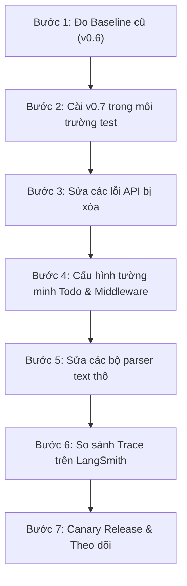

# Deep Agents v0.7: Harness nhẹ hơn, minh bạch hơn và cấu hình được hơn

> **Một Deep Agent đang chạy thực tế sau khi nâng cấp lên v0.7:** Hóa đơn có thể giảm mạnh, nhưng cũng có thể không đổi; agent có thể chạy mượt mà, nhưng cũng có thể đột nhiên không còn tự động tạo danh sách công việc (Todo).  
> Nguyên nhân cốt lõi: **v0.7 đã thay đổi triết lý thiết kế — framework không còn tự ý đưa ra các quyết định ngầm thay cho ứng dụng.**

---

### Khái niệm mở đầu: "Harness" trong Deep Agents là gì?

Để hiểu bản cập nhật v0.7, trước tiên cần hiểu khái niệm **Harness** (bộ khung điều khiển).  
Khi bạn gọi `create_deep_agent()`, framework không chỉ đơn thuần gửi câu hỏi của bạn tới mô hình ngôn ngữ (LLM). Nó bọc mô hình vào một "chiếc áo giáp" gồm:
1. **Base system prompt mặc định** (hướng dẫn mô hình cách suy nghĩ, cách trả lời).
2. **Bộ Middleware mặc định** (tự động lập Todo, tự động tóm tắt tin nhắn cũ, quản lý file).
3. **Mô tả chi tiết các Tool** (hướng dẫn LLM cách gọi từng công cụ).

Ở các phiên bản 0.5 và 0.6, chiếc "áo giáp" này rất dày và cồng kềnh. **Deep Agents v0.7 đã gọt mỏng tối đa lớp áo giáp này:** base prompt mặc định trở nên rỗng, mô tả tool được tinh giản ngắn gọn, tính năng lập Todo chuyển sang bật theo nhu cầu, và Middleware cho phép ứng dụng tự do ghi đè tại chỗ.

> [!NOTE]
> Bạn đọc mới có thể bắt đầu trực tiếp với bản patch 0.7.x mới nhất. Nếu bạn đang nâng cấp từ dự án cũ (0.5/0.6), hãy hoàn thành các bước kiểm tra migration trong tài liệu này trước khi chạy trên môi trường production.

Cài đặt bản patch 0.7.x trong cùng một minor version:

```bash
uv add --upgrade "deepagents>=0.7,<0.8"
uv run python -c "import deepagents; print(deepagents.__version__)"
```

Nếu muốn tái hiện chính xác từng hành vi phát hành đầu tiên của bản 0.7.0 để đối chiếu bug/changelog:

```bash
uv add "deepagents==0.7.0"
```

> [!CAUTION]
> **Đừng nâng cấp tại chỗ trực tiếp trong môi trường production!**  
> v0.7 đồng thời thay đổi Middleware mặc định, giao diện Backend và định dạng trả về của các file tool. Chỉ kiểm tra `import` thành công không chứng minh được ứng dụng của bạn đã tương thích.

---

## 1. Trước tiên xác định: Những chính sách mặc định nào đã thay đổi?

Thay vì cố gắng đoán mò, hãy nhìn vào 4 thay đổi lớn mang tính bước ngoặt từ v0.6 lên v0.7:

| Thay đổi bề mặt | Bản chất thiết kế | Trách nhiệm mà ứng dụng cần tiếp nhận |
| :--- | :--- | :--- |
| **Base prompt mặc định rỗng, mô tả tool rút ngắn** | Các LLM hiện đại đã đủ thông minh để hiểu cách dùng tool qua Tool Schema (JSON), không cần framework phải "dạy kèm" bằng prompt tutorial dài dòng. | Tự viết `system_prompt` sát với nghiệp vụ của bạn; dùng công cụ Trace (như LangSmith) để kiểm tra mô hình có hiểu đúng ngữ cảnh không. |
| **Todo không còn bật mặc định** | Việc bắt buộc lập danh sách Todo ở mọi lượt gọi gây lãng phí token cho các tác vụ ngắn, đơn giản. | Tự quyết định có cần bật lại `TodoListMiddleware` hay không dựa trên độ phức tạp của task và nhu cầu hiển thị UI. |
| **Middleware cùng tên có thể thay thế tại chỗ** | Framework cung cấp sẵn cấu hình mẫu, nhưng cho phép bạn tự do tùy biến tham số (threshold, model, prompt) mà không phải gỡ tung toàn bộ hệ thống. | Quản lý tường minh cấu hình trọn gói của Middleware thay thế (tránh bẫy mất Backend hay Permission). |
| **File tool mạnh hơn và có ranh giới rõ ràng** | Cung cấp thêm tool mạnh (`delete`, ghi đè `write_file`, phân trang `read_file`), đồng thời giới hạn tìm kiếm để tránh tràn bộ nhớ repo lớn. | Rà soát kỹ quyền hạn (Permission), cơ chế ghi đè, và sửa lại code nếu có đoạn nào đang tự parse văn bản trả về của tool. |

Trước khi sửa code, hãy tự trả lời 4 câu hỏi định hướng:
1. Trước đây ứng dụng của tôi có phụ thuộc vào **hành vi mặc định ngầm** nào của framework không? (ví dụ: tự động có Todo, tự động chặn ghi đè file).
2. Hành vi nào trong số đó thực sự cần thiết cho nghiệp vụ của tôi và cần được bật lại một cách tường minh?
3. Code của tôi có chỗ nào đang trực tiếp **đọc text thô (raw text)** trả về từ tool không?
4. Tôi có bộ bài test nghiệp vụ nào để chứng minh agent mới vẫn chạy đúng như cũ hay không?

---

## 2. Hiểu đúng về con số: "Giảm 65% input Token nền"

Khi đọc thông báo phát hành v0.7, bạn sẽ thấy con số ấn tượng: *"giảm 65% input token"*. Hãy hiểu chính xác con số này để không kỳ vọng sai lệch về hóa đơn thực tế.

### Token nền (Baseline Overhead) là gì?

* **Mô tả Tool Schema:** Giảm từ **4.005 token xuống 2.302 token** (giảm 43%). Riêng mô tả tool `task` rút ngắn từ 1.664 xuống 389 token.
* **Tổng token nền của một lượt gọi:** Khi cộng thêm việc bỏ base prompt và bỏ Todo mặc định, một lượt gọi đơn giản giảm từ **5.395 token xuống còn 1.895 token** — tức overhead nền giảm **~65% (bớt được ~3.500 token)**.

> [!IMPORTANT]
> **Token nền giống như "vé vào cổng cố định", còn chi phí cả lượt gọi giống như "tổng tiền ăn uống vui chơi":**  
> - Nếu bạn làm bot hỏi-đáp ngắn (mỗi lượt chỉ 500 token hội thoại), việc bớt được 3.500 token nền sẽ giúp bạn **tiết kiệm cực kỳ nhiều**.  
> - Nhưng nếu agent của bạn chạy tác vụ phức tạp (long-context repo lớn, đọc hàng trăm nghìn token tài liệu, gọi hàng chục tool), thì việc tiết kiệm 3.500 token chỉ chiếm một tỉ lệ rất nhỏ trong tổng hóa đơn.

### 2.1 Đánh giá Benchmark: Tiết kiệm tổng thể, nhưng không đồng đều giữa các Model

LangChain đã chạy kiểm thử trên [hệ thống benchmark Harbor](https://www.langchain.com/blog/how-we-benchmark-deep-agents) với 36 tác vụ thực tế (mỗi tác vụ chạy 3 lần trên 4 mô hình LLM hàng đầu):

| Model | Điểm hoàn thành (Reward) | Lượng Token | Chi phí thực tế | Cách đọc đúng kết quả |
| :--- | :---: | :---: | :---: | :--- |
| **`gpt-5.6-luna`** | +3,8% | **-35,5%** | **-15,2%** | Token và chi phí giảm rõ rệt nhất; độ chính xác giữ vững. |
| **`gemini-3.6-flash`** | -6,7% | -4,7% | -8,1% | Biến động nhỏ nằm trong giới hạn sai số thống kê; hiệu năng gần như tương đương. |
| **`claude-sonnet-4-6`** | +3,1% | **+31,3%** | **+36,8%** | **Chú ý:** Token và chi phí lại tăng! Khi không có prompt và Todo "kìm cương", Sonnet có xu hướng tự mò mẫm thử nghiệm nhiều tool call hơn trên các bài toán khó, dẫn đến chuỗi trace dài hơn. |
| **`claude-opus-4-8`** | -5,1% | **-25,4%** | **-16,4%** | Token giảm mạnh; tỷ lệ thành công ổn định. |

> [!TIP]
> **Bài học rút ra:** v0.7 giúp khung framework nhẹ đi, nhưng **hành vi của từng mô hình LLM là khác nhau**. Không thể mặc định rằng nâng cấp lên v0.7 là hóa đơn sẽ tự động giảm cho mọi bài toán.

### 2.2 Ba chỉ số bắt buộc phải đo khi nâng cấp

1. **Overhead nền:** Đo lượng token của 1 câu hỏi ngắn nhất để xác nhận framework đã nhẹ đi (~1.900 token thay vì ~5.400 token).
2. **Hiệu quả chuỗi xử lý (Trace):** Đếm số lần LLM phải gọi lại, số lượt gọi tool, số lần retry để hoàn thành cùng một nhiệm vụ.
3. **Kết quả nghiệp vụ thực tế:** Tác vụ có thực sự hoàn thành đúng yêu cầu hay không (dựa trên test case thực tế, không chỉ dựa vào cảm tính).

---

## 3. Prompt mặc định rỗng: Tách chỉ dẫn nghiệp vụ khỏi giao diện Tool

Ở v0.6, framework tự động chèn một đoạn base prompt rất dài để dạy mô hình: *"Bạn là một AI assistant, bạn có các công cụ sau, bạn nên dùng chúng như thế này..."*.  
Ở v0.7, **toàn bộ đoạn văn mẫu đó đã bị xóa bỏ.**

Thay đổi này dựa trên 2 nguyên lý Context Engineering hiện đại:
1. **Giao diện (Interface) quan trọng hơn ví dụ (Few-shot):** Tên tham số, kiểu dữ liệu, enum và mô tả ngắn gọn trong JSON Schema của Tool đã đủ để LLM hiện đại biết cách dùng. Đưa quá nhiều ví dụ văn bản dài dòng có thể làm mô hình bị đóng khung tư duy hoặc hiểu nhầm.
2. **Tránh lặp lại thông tin (No Redundancy):** Một ràng buộc vừa viết trong System Prompt vừa viết trong mô tả Tool không làm mô hình tuân thủ gấp đôi, mà chỉ làm tốn token vĩnh viễn và dễ gây xung đột khi cập nhật.

### 3.1 `system_prompt` của bạn giờ đây nắm quyền tối cao

Trước đây, prompt của bạn bị pha trộn với base prompt của framework. Nay lớp nền đã rỗng, mô hình sẽ hoàn toàn tập trung vào những gì bạn yêu cầu:

```python
from deepagents import create_deep_agent

agent = create_deep_agent(
    model=model,
    system_prompt=(
        "Bạn là trợ lý migration code. Hãy đọc ràng buộc version và file test trước, "
        "chỉ sửa các file liên quan trực tiếp đến mục tiêu migration; sau khi xong hãy chạy test sẵn có, "
        "và báo cáo rõ những phần chưa thể xác minh tự động."
    ),
)
```

> [!WARNING]
> **Đừng copy-paste toàn bộ base prompt cũ vào lại code mới!**  
> Làm như vậy sẽ mang đúng khoản chi phí token vô ích và nguy cơ xung đột mà v0.7 vừa cất công gỡ bỏ. Hãy chỉ viết những nguyên tắc đặc thù của nghiệp vụ bạn cần.

---

## 4. Todo chuyển thành tùy chọn (Opt-in): Lập kế hoạch là chiến lược, không phải phí cố định

Trong v0.6, mọi agent tạo ra đều tự động tích hợp `TodoListMiddleware`. Mỗi lượt gọi mô hình đều phải gánh:
* Công cụ `write_todos`
* Kênh trạng thái (state channel) `todos`
* Hướng dẫn prompt bắt buộc mô hình phải lập danh sách công việc trước khi làm.

Thử nghiệm của LangChain cho thấy: với các tác vụ thường ngày, việc bắt LLM lập Todo **không làm tăng độ chính xác**, nhưng lại **làm tốn thêm nhiều token và lượt gọi**. Do đó, v0.7 đã tắt Todo mặc định.

### Bảng quyết định: Khi nào NÊN BẬT và khi nào NÊN TẮT Todo?

| Tình huống sử dụng | Khuyến nghị | Lý do |
| :--- | :---: | :--- |
| **Hỏi đáp 1 bước, tra cứu thông tin nhanh** | **TẮT** (Mặc định) | Kế hoạch Todo đôi khi còn dài hơn cả câu trả lời. |
| **Task phức tạp nhiều bước, dễ quên việc** | **BẬT** | Giúp agent không bị "lạc đề" hoặc sót bước khi chuỗi hội thoại kéo dài. |
| **Dùng model nhỏ / yếu hơn** | **BẬT** | Các model yếu cần danh sách việc cụ thể để bám sát mục tiêu. |
| **Giao diện người dùng (UI) cần thanh tiến độ** | **BẬT** | UI cần đọc state `todos` để hiển thị checklist công việc cho người dùng xem. |
| **Xử lý ngầm theo lô (Batch job)** | **TẮT** | Chỉ quan tâm kết quả cuối cùng, không ai xem kế hoạch Todo. |

### Cách bật lại Todo khi cần:

Chỉ cần import `TodoListMiddleware` và truyền vào tham số `middleware`:

```python
from deepagents import create_deep_agent
from langchain.agents.middleware import TodoListMiddleware

agent = create_deep_agent(
    model=model,
    middleware=[TodoListMiddleware()],
)
```

### 4.1 Bẫy kế thừa Todo đối với Sub-Agent

Cần phân biệt rõ hai loại Sub-Agent trong v0.7:
* **Sub-Agent đa năng (`general-purpose`):** Sẽ **tự động kế thừa** Todo từ Main Agent nếu bạn có bật ở Main Agent.
* **Sub-Agent khai báo riêng (`subagents=[...]`):** Có stack Middleware **hoàn toàn độc lập**. Nếu bạn muốn Sub-Agent này có Todo, bạn **phải khai báo riêng** trong cấu hình của nó:

```python
from langchain.agents.middleware import TodoListMiddleware

# Khai báo Sub-agent chuyên nghiên cứu, có Todo riêng:
researcher_agent = {
    "name": "researcher",
    "description": "Thu thập tài liệu và nghiên cứu chuyên sâu",
    "system_prompt": "Hãy lập kế hoạch các bước thu thập trước, đánh dấu trạng thái từng mục khi hoàn thành.",
    "middleware": [TodoListMiddleware()],  # BẬT RIÊNG CHO SUB-AGENT NÀY
}

agent = create_deep_agent(
    model=model,
    subagents=[researcher_agent],
)
```


## 5. Ghi đè Middleware tại chỗ: khả năng cấu hình không đồng nghĩa cấu hình tự động hợp nhất

### 5.1 Hiểu đúng bản chất: "Sơn lại cửa" vs "Thay cả cánh cửa"

Cụm từ *"khả năng cấu hình không đồng nghĩa cấu hình tự động hợp nhất"* (configurability ≠ auto-merge) là lời nhắc quan trọng nhất về mặt kiến trúc ở v0.7:

- **Trước v0.7 (v0.5, v0.6):** Nếu ứng dụng truyền một Middleware tùy chỉnh (như `SummarizationMiddleware`) vào `middleware=`, framework sẽ báo lỗi trùng tên với instance mặc định. Muốn tùy biến tham số phải tháo gỡ toàn bộ scaffolding mặc định rất phức tạp.
- **Từ v0.7:** Framework hỗ trợ **ghi đè tại chỗ (in-place override)** dựa theo thuộc tính `.name`. Khi instance bạn truyền vào có cùng tên với một Middleware built-in, framework sẽ thay thế trực tiếp instance mặc định ngay tại vị trí đó trong pipeline.

> [!WARNING]
> **Bẫy tư duy thường gặp:** Lập trình viên thường nghĩ: *"Tôi chỉ muốn đổi ngưỡng tóm tắt từ 85% xuống 50%, nên chỉ cần truyền `SummarizationMiddleware(trigger=0.5)` là xong, còn model, backend, prompt hay permission thì framework sẽ tự động hợp nhất (merge) từ cấu hình mặc định sang."*  
> **Thực tế:** Framework **KHÔNG** hề merge cấp trường (field-level). Đây là cơ chế **"Thay trọn gói" (Replace entire instance)**. Bất kỳ thuộc tính nào bạn không chỉ định sẽ rơi về mặc định của class hoặc `None`, làm mất toàn bộ các thiết lập ngầm mà framework đã chuẩn bị cho instance mặc định.

### 5.2 Ví dụ cấu hình đúng: xem Middleware tùy chỉnh như một cấu hình hoàn chỉnh

Khi muốn tinh chỉnh model tóm tắt, threshold kích hoạt và prompt mà không phải tháo Harness, bạn phải cung cấp đầy đủ thông tin:

```python
from deepagents import create_deep_agent
from deepagents.backends import StateBackend
from deepagents.middleware import SummarizationMiddleware

backend = StateBackend()

agent = create_deep_agent(
    model=model,
    backend=backend,
    middleware=[
        SummarizationMiddleware(
            model=summary_model,          # Khai báo rõ model tóm tắt
            backend=backend,              # BẮT BUỘC: Dùng chung Backend với Agent
            trigger=("fraction", 0.5),    # Tinh chỉnh ngưỡng kích hoạt mong muốn
            keep=("messages", 20),        # Số tin nhắn gần nhất giữ lại
            summary_prompt=(
                "Tóm tắt phần hội thoại trước đó, giữ nguyên đường dẫn file, "
                "các quyết định đã chốt, việc chưa xong và nguyên nhân thất bại."
            ),
        )
    ],
)
```

Tóm tắt mặc định thường kích hoạt khi context window dùng đến khoảng 85%. Với các ứng dụng nhiều kết quả tool, hội thoại dài dễ gặp context rot, kéo sớm xuống 50% có thể ổn định hơn, nhưng tăng tần suất tóm tắt và rủi ro mất thông tin. Threshold không phải càng thấp càng tốt; cần đồng thời kiểm tra chi phí các lượt tóm tắt và tỉ lệ thành công task phía sau.

### 5.3 Quy tắc ghi đè và quy tắc kế thừa

Theo [cài đặt ghi đè Middleware (PR #4251)](https://github.com/langchain-ai/deepagents/pull/4251), quy tắc xử lý của v0.7 gồm:

1. **Trùng `.name` với instance built-in:** Thay thế ngay tại chỗ, giữ nguyên thứ tự tương đối trong stack Middleware.
2. **Không có instance mặc định cùng tên:** Chèn sau các Middleware lõi và trước phần đuôi profile / prompt caching / memory.
3. **Sub-Agent `general-purpose`:** Mặc định kế thừa phần ghi đè của main Agent lên instance mặc định.
4. **Sub-Agent kiểu khai báo (`subagents=[...]`):** Tự dựng stack riêng biệt, **không** tự kế thừa ghi đè của main Agent; muốn tùy biến phải cấu hình trong spec của từng sub-Agent.
5. **Thứ tự bắt buộc ở đuôi:** Một số Middleware bắt buộc nằm ở cuối vẫn giữ thứ tự định sẵn (ví dụ logic loại trừ tool phải chạy sau khi toàn bộ tool được inject xong).

### 5.4 Hai rủi ro nghiêm trọng khi ghi đè cả instance

Vì ghi đè là thay thế toàn bộ instance, có hai cạm bẫy thực tế bạn cần lưu ý:

1. **Lệch Backend (Đọc/ghi hai không gian khác nhau):**
   Nếu bạn tạo một `FilesystemMiddleware` hay `SummarizationMiddleware` mới mà quên truyền tham số `backend=backend` chung, Agent sẽ thao tác trên một Backend còn Middleware lại thao tác trên một Backend ngầm khác. Hậu quả là tóm tắt không đọc được dữ liệu phiên, hoặc file Agent tạo ra thì Middleware không thấy.
2. **Thất thoát ranh giới phân quyền (`permissions`):**
   Trong `deepagents==0.7.0`, file permission do framework inject vào `FilesystemMiddleware` mặc định qua cấu hình private. Nếu ứng dụng vừa cấu hình `permissions=` ở cấp ngoài cùng (`create_deep_agent`), vừa thay cả `FilesystemMiddleware`, các quy tắc cấm (denied rules) **không tự động hợp nhất** vào instance mới của bạn. Agent có thể vô tình xóa hoặc ghi đè file nhạy cảm. Cách an toàn là nâng cấp lên bản patch 0.7.x mới đã fix, không phụ thuộc tham số private, và luôn viết regression test với các lệnh allow/denied thực tế. Tool biến mất khỏi giao diện model không có nghĩa ranh giới permission vẫn còn hiệu lực.

## 6. File tool: Mạnh mẽ hơn, nhưng cần kiểm soát chặt chẽ Side Effect

Trong Deep Agents, hệ thống tệp tin (Filesystem) đóng vai trò như **bộ nhớ dài hạn và không gian làm việc** của Agent. Phiên bản v0.7 mang lại bước nhảy vọt về hiệu năng khi xử lý các repository lớn, nhưng đồng thời cũng gỡ bỏ một số rào chắn bảo vệ ngầm trước đây.

### Tổng hợp 7 thay đổi quan trọng của File Tool:

| Công cụ / Tính năng | Hành vi cũ (v0.6) | Hành vi mới (v0.7) | Tác động thực tế lên ứng dụng |
| :--- | :--- | :--- | :--- |
| **`write_file`** | Báo lỗi nếu file đã tồn tại | **Ghi đè toàn bộ ngay lập tức** | Mất cơ chế chống ghi đè nhầm; agent có thể xóa trắng nội dung file cũ. |
| **`delete`** | Không có sẵn trong tool mặc định | **Được bật sẵn mặc định** (xóa file hoặc thư mục đệ quy) | Tăng nguy cơ bị xóa nhầm dữ liệu quan trọng nếu không phân quyền. |
| **Phân trang `read_file`** | Chỉ trả về nội dung text thô | Trả về kèm metadata: **dải dòng, tổng số dòng, số dòng còn lại, `offset` tiếp theo** | Agent biết rõ vị trí của mình trong file lớn, không còn đọc lặp mù quáng. |
| **Timeout `grep` / `glob`** | Treo, timeout hoặc vứt bỏ toàn bộ kết quả | Trả về các kết quả đã tìm được kèm cờ `truncated=True` | Agent vẫn nhận được dữ liệu tìm được ban đầu thay vì nhận lỗi trắng tay. |
| **Giới hạn số match `grep`** | Không giới hạn (dễ tràn bộ nhớ) | **Mặc định tối đa 1.000 matches**, hỗ trợ streaming `rg` | Tránh làm phình context window khi tìm kiếm các từ khóa phổ biến trong repo lớn. |
| **Kết quả `ls` / `glob` rỗng** | Trả về chuỗi `"[]"` | Trả về văn bản `"No files found"` | **Làm hỏng** các hàm code tự parse chuỗi `"[]"` cũ. |
| **Định dạng số dòng `read_file`** | Sau số dòng là ký tự Tab (`\t`) | Sau số dòng là **hai dấu cách** | **Làm hỏng** các hàm parser dùng `split("\t")`. |

---

### 6.1 Ghi đè toàn bộ (`write_file`) vs Chỉnh sửa một phần (`edit_file`)

Quy tắc chuẩn khi làm việc với file trong v0.7:
* **Ghi mới hoặc viết lại toàn bộ file:** Dùng `write_file`.
* **Chỉ sửa vài dòng code / vài câu văn:** Đọc trước bằng `read_file`, sau đó dùng `edit_file` để thay thế chuỗi chính xác (`old_string` -> `new_string`).

> [!WARNING]
> **Mất rào chắn chống ghi đè nhầm:**  
> Ở v0.6, nếu agent vô tình gọi `write_file` lên một file đã có, hệ thống sẽ chặn lại và báo lỗi. Ở v0.7, file đó sẽ bị **ghi đè và mất sạch nội dung cũ**.  
> Đối với các file nhạy cảm (như `.env`, config, mã nguồn quan trọng), bạn **không được ỷ lại vào framework**, mà bắt buộc phải dùng rào chắn phân quyền (`FilesystemPermission`), chế độ con người duyệt (Human-in-the-loop - HITL) hoặc cấu hình chế độ chỉ đọc.

---

### 6.2 Tool `delete`: Cơ chế "Tất cả hoặc không" và cách khóa bằng Allowlist

`delete` đã được đưa vào danh sách tool mặc định của agent, hỗ trợ xóa file đơn lẻ hoặc xóa cả cây thư mục đệ quy (recursive).

* **Cơ chế an toàn "Tất cả hoặc không" (All-or-nothing):** Khi agent yêu cầu xóa một thư mục, hệ thống sẽ kiểm tra quyền hạn của thư mục đó và **toàn bộ các file con bên trong**. Chỉ cần có 1 file con nằm trong danh sách cấm xóa, **toàn bộ thao tác xóa sẽ bị hủy bỏ**, tránh tình trạng thư mục bị xóa dở dang.
* **Nguyên tắc đặc quyền tối thiểu (Least Privilege):** Nếu ứng dụng của bạn không cần cho phép Agent xóa file, hãy chủ động tắt tool này bằng **Tool Allowlist**:

```python
from deepagents import create_deep_agent
from deepagents.backends import StateBackend
from deepagents.middleware import FilesystemMiddleware

backend = StateBackend()

# CHỈ CHO PHÉP 4 TOOL AN TOÀN, LOẠI BỎ WRITE_FILE VÀ DELETE:
agent = create_deep_agent(
    model=model,
    backend=backend,
    middleware=[
        FilesystemMiddleware(
            backend=backend,
            tools=["read_file", "ls", "glob", "grep"],  # Danh sách cho phép
        )
    ],
)
```

> [!TIP]
> `read_file` là công cụ cốt lõi bắt buộc của `FilesystemMiddleware` và không thể bị loại bỏ. Các tool bị loại bỏ khỏi danh sách `tools=[...]` sẽ được gỡ hoàn toàn khỏi hệ thống đăng ký tool (`ToolNode`), đảm bảo mô hình không thể gọi lén.

---

### 6.3 Tìm kiếm thư mục lớn: Cạm bẫy `truncated=True`

Khi tìm kiếm (`grep` hoặc `glob`) trên các repository lớn, nếu gặp timeout hoặc vượt quá 1.000 kết quả, tool sẽ trả về các kết quả tìm được kèm thuộc tính `truncated=True`.

> [!IMPORTANT]
> **"Không có lỗi" không đồng nghĩa với "Đã tìm thấy hết"!**  
> Khi code backend của bạn tiêu thụ trực tiếp kết quả tìm kiếm, phải luôn kiểm tra cờ `truncated`:

```python
result = backend.grep("TODO", path="/workspace")

if result.error:
    raise RuntimeError(result.error)

# Xử lý các kết quả tìm được
for match in result.matches or []:
    process_match(match)

# CẢNH BÁO: Nếu bị cắt cụt, cần thu hẹp phạm vi tìm kiếm tiếp
if result.truncated:
    print("Cảnh báo: Kết quả tìm kiếm chưa đầy đủ do vượt quá giới hạn!")
    schedule_narrower_search()
```

---

### 6.4 Phân trang `read_file`: Agent không còn phải đoán mò

Khi đọc file lớn bằng `read_file(offset=..., limit=...)`, v0.7 sẽ đính kèm thông tin phân trang ở cuối nội dung:
* Dải dòng vừa đọc (ví dụ: dòng 1 đến 100)
* Tổng số dòng của file (ví dụ: 301 dòng)
* Số dòng còn lại chưa đọc (201 dòng)
* Vị trí `offset` tiếp theo để đọc tiếp (101)

Nhờ metadata này, LLM biết chính xác khi nào đã đọc hết file và biết nhảy thẳng tới trang tiếp theo, giúp giảm đáng kể số lượt đọc lặp lại và tiết kiệm token gọi tool.

---

## 7. v0.6 → v0.7: Các thay đổi tương thích có thể làm sập ứng dụng (Breaking Changes)

Ngoài Todo và Middleware, còn có những thay đổi sâu dưới tầng Backend và dữ liệu mà bạn cần rà soát trước khi triển khai:

### 7.1 Gỡ bỏ hoàn toàn Backend Factory

Trước đây (v0.5, v0.6), bạn có thể truyền một hàm callable (factory) vào tham số `backend`:

```python
# CÁCH VIẾT CŨ TRƯỚC ĐÂY (SẼ BÁO LỖI Ở v0.7):
agent = create_deep_agent(
    backend=lambda runtime: StoreBackend(),
    store=store,
)
```

Ở v0.7, cách viết này đã bị xóa bỏ. Bạn phải **khởi tạo instance cụ thể** trước khi truyền vào:

```python
# CÁCH VIẾT CHUẨN TRÊN v0.7:
from deepagents import create_deep_agent
from deepagents.backends import StoreBackend

backend = StoreBackend(
    namespace=lambda runtime: (runtime.server_info.user.identity,),
)

agent = create_deep_agent(
    model=model,
    backend=backend,
    store=store,
)
```

> [!CAUTION]
> **Cảnh báo an toàn dữ liệu nhiều người dùng (Multi-tenant):**  
> Trong v0.6 có cơ chế tự động fallback namespace theo `assistant-id`. Ở v0.7, cơ chế ngầm này đã bị gỡ bỏ. Bạn bắt buộc phải cấu hình `namespace` rõ ràng theo ID người dùng hoặc ID tổ chức (`user.identity`). Nếu cấu hình sai hoặc hardcode cố định, **User A có thể đọc nhầm file của User B!**

**Các hàm và hằng số cũ đã bị xóa bỏ hoàn toàn:**
* Xóa các lớp/hằng: `BackendFactory`, `BACKEND_TYPES`, `FileFormat`, `Unset`.
* Xóa tham số runtime trong constructor: `StateBackend(runtime=...)`, `StoreBackend(runtime=...)`.
* Chuyển các hàm cũ `ls_info`, `glob_info`, `grep_raw` sang các API chuẩn mới: `ls`, `glob`, `grep`, `ReadResult`.
* Xóa tham số `SummarizationMiddleware(history_path_prefix=...)`.

---

### 7.2 Rà soát lại các đoạn code tự bóc tách text thô (Raw text parsing)

Nếu ứng dụng của bạn có những đoạn code Python tự động phân tích kết quả trả về của tool (`ToolMessage.content`), bạn cần đặc biệt chú ý:

1. **So sánh thư mục rỗng:** Trước đây trả về `[]`, nay trả về `"No files found"`.
2. **Cắt dòng bằng Tab:** Trước đây `read_file` dùng `\t` sau số dòng, nay dùng **hai dấu cách** (`  `). Nếu dùng `line.split("\t")` code sẽ lỗi.
3. **Giả định `write_file` báo lỗi:** Code cũ nếu bắt ngoại lệ `FileExistsError` để biết file đã tồn tại thì nay logic đó sẽ không bao giờ được kích hoạt.

> [!TIP]
> **Khuyến nghị thiết kế:** Nếu cần xử lý dữ liệu bằng code Python, hãy gọi trực tiếp các phương thức của `Backend` để nhận object có cấu trúc, không nên parse chuỗi text dành riêng cho LLM đọc.

---

### 7.3 Hướng dẫn quét tĩnh code cũ trong dự án

Trước khi chạy test, bạn có thể dùng lệnh `rg` (ripgrep) trên terminal để tìm nhanh các vết tích của phiên bản cũ trong source code:

```bash
# 1. Tìm các class/hàm cũ đã bị khai tử:
rg -n 'BackendFactory|BACKEND_TYPES|FileFormat|Unset|history_path_prefix' .

# 2. Tìm các method Backend cũ:
rg -n 'ls_info|glob_info|grep_raw' .

# 3. Tìm các hàm factory dạng lambda:
rg -n 'backend\s*=\s*(lambda|[A-Za-z_][A-Za-z0-9_]*_factory)' .

# 4. Tìm các logic parse text thô có nguy cơ gãy:
rg -n 'split\("\\t"|cat -n|No files found|write_file' .
```

---

## 8. Hai tính năng mở rộng theo nhu cầu hạ tầng

Đây là 2 tính năng tối ưu hóa chuyên sâu, chỉ cần quan tâm nếu dự án của bạn sử dụng dịch vụ tương ứng:

### 8.1 Prompt Caching cấp Cloud Provider
* **AWS Bedrock:** Hỗ trợ tính năng Prompt Caching thông qua gói mở rộng `deepagents[aws]`.
* **Fireworks AI:** Khi cài package `langchain-fireworks` tương thích, framework tự động kích hoạt tính năng duy trì session cache (`session affinity`) cho cả main agent và sub-agent, giúp giảm đáng kể chi phí token khi hội thoại dài.

### 8.2 NVIDIA Nemotron 3 Ultra Profile
v0.7 cung cấp sẵn cấu hình Harness chuẩn cho mô hình Nemotron 3 Ultra (trên nền tảng NVIDIA NIM, Fireworks, OpenRouter, Together...). Profile này tự động sửa các lỗi format khi model gọi tool, ngăn chặn vòng lặp vô hạn và bảo vệ kết quả trả về cuối cùng.

---

## 9. Quy trình 7 bước nâng cấp an toàn từ v0.5/0.6 lên v0.7

Để việc migration diễn ra suôn sẻ, không làm gián đoạn hệ thống production, hãy thực hiện theo đúng 7 bước sau:



* **Bước 1: Đo Baseline cũ (v0.6):** Chọn từ 3 - 5 bài test thực tế đại diện cho sản phẩm của bạn (task ngắn, task dài, task đọc file lớn...). Ghi lại số token, số lần gọi model, số lần gọi tool, thời gian phản hồi và chi phí.
* **Bước 2: Cài đặt v0.7 trong môi trường cô lập:** Dùng lệnh `uv add --upgrade "deepagents>=0.7,<0.8"` trên branch phát triển riêng biệt.
* **Bước 3: Sửa các lỗi cú pháp/API trực tiếp:** Thay thế `BackendFactory`, cấu hình tường minh `namespace` cho `StoreBackend`, xóa các tham số deprecated.
* **Bước 4: Tường minh hóa các chính sách mặc định:**
  * Ứng dụng có cần Todo không? (Nếu cần thanh tiến độ UI hoặc task phức tạp -> bật `TodoListMiddleware`).
  * Có cần chỉnh ngưỡng tóm tắt không? (Nếu cần -> ghi đè `SummarizationMiddleware` đầy đủ tham số).
  * Kiểm tra quyền hạn file (`delete`, `write_file`).
* **Bước 5: Viết lại test cho các bộ parser:** Đảm bảo test case bao phủ thư mục rỗng, file phân trang, kết quả tìm kiếm bị cắt cụt.
* **Bước 6: So sánh Trace trên LangSmith:** Chạy cùng một tập dữ liệu test và quan sát bảng tín hiệu:

| Hiện tượng quan sát | Nguyên nhân khả dĩ | Hành động xử lý |
| :--- | :--- | :--- |
| **Token lượt đầu không giảm** | Prompt riêng của bạn hoặc mô tả tool quá dài | Rà soát lại system prompt, lược bớt các câu văn mẫu không cần thiết |
| **Số lượt model gọi lại tăng vọt** | Thiếu Todo hoặc prompt mô tả tool quá ngắn khiến LLM mò mẫm | Bật lại `TodoListMiddleware` hoặc bổ sung vài chỉ dẫn vào system prompt |
| **Mất checklist Todo trên giao diện UI** | Todo đã bị tắt mặc định | Thêm `TodoListMiddleware()` vào tham số `middleware` |
| **Hội thoại dài bị mất trí nhớ hoặc tóm tắt quá muộn** | Ngưỡng tóm tắt 85% mặc định chưa phù hợp | Ghi đè `SummarizationMiddleware` với ngưỡng `trigger=("fraction", 0.5)` |
| **Xuất hiện file bị ghi đè hoặc xóa mất** | Chưa giới hạn quyền hoặc chưa bật Allowlist | Cấu hình lại `FilesystemMiddleware(tools=[...])` hoặc thêm quyền kiểm soát đường dẫn |

* **Bước 7: Canary Release (Tăng dần traffic thực tế):** Chuyển 10% traffic người dùng sang phiên bản v0.7, theo dõi tỷ lệ thành công trước khi chuyển đổi toàn bộ hệ thống.

---

## 10. Bảng tra cứu quyết định nhanh (Cheat-Sheet)

| Đặc điểm ứng dụng của bạn | Khuyến nghị hành động khi lên v0.7 |
| :--- | :--- |
| **Chatbot hỏi đáp nhanh, tác vụ 1 bước, không có UI tiến độ** | Giữ Todo **TẮT** mặc định; tận hưởng việc tiết kiệm ~65% token nền. |
| **Tác vụ phức tạp nhiều bước, repo lớn, hoặc UI có checklist tiến độ** | Chủ động **BẬT** `TodoListMiddleware()` tường minh. |
| **Hội thoại dài nhiều lượt, cần tóm tắt tin nhắn** | Ghi đè `SummarizationMiddleware` cùng tên; nhớ **truyền đầy đủ các trường** và dùng chung `backend`. |
| **Code có đọc trực tiếp kết quả file tool** | Rà soát lại logic parse chuỗi text; chuyển sang dùng API có cấu trúc của Backend. |
| **Làm việc trực tiếp trên hệ thống tệp tin thật** | Kiểm tra quyền hạn `delete` và `write_file`; dùng **Allowlist** để khóa các thao tác nguy hiểm. |
| **Ứng dụng nhiều người dùng (Multi-tenant)** | Bỏ Backend Factory; thiết kế `namespace` rõ ràng theo User/Tenant ID để tránh lộ dữ liệu chéo. |
| **Dùng cloud AWS Bedrock hoặc Fireworks** | Kích hoạt Prompt Caching chuyên dụng để tối ưu hóa thêm chi phí. |

> [!NOTE]
> **Triết lý đọng lại của v0.7:** Khung mặc định siêu nhẹ, giao diện Tool rõ ràng, ứng dụng tự chọn chiến lược, và đánh giá thực tế quyết định thành công. Khi mô hình LLM ngày càng thông minh hơn, sự phân định rạch ròi này sẽ giúp hệ sinh thái Agent của bạn bền vững và dễ bảo trì hơn rất nhiều.


## Tài liệu tham khảo

- [Blog phát hành Deep Agents v0.7](https://www.langchain.com/blog/deep-agents-v0-7)
- [`deepagents` v0.7.0 changelog và lưu ý migration](https://docs.langchain.com/oss/python/releases/changelog#deepagents-v0-7-0)
- [How we benchmark Deep Agents](https://www.langchain.com/blog/how-we-benchmark-deep-agents)
- [Customize Deep Agents: ghi đè Middleware](https://docs.langchain.com/oss/python/deepagents/customization#override-a-default-middleware-instance)
- [Deep Agents Overview: Task planning](https://docs.langchain.com/oss/python/deepagents/overview#task-planning)
- [Deep Agents Overview: Virtual filesystem access](https://docs.langchain.com/oss/python/deepagents/overview#virtual-filesystem-access)
- [PR #5009: tinh giản mô tả tool built-in và đánh giá chéo model](https://github.com/langchain-ai/deepagents/pull/5009)
- [PR #4929: Todo chuyển thành opt-in và kết quả thí nghiệm đầy đủ](https://github.com/langchain-ai/deepagents/pull/4929)
- [PR #4251: ghi đè Middleware mặc định theo tên](https://github.com/langchain-ai/deepagents/pull/4251)
- [PR #4541: gỡ tầng tương thích Backend](https://github.com/langchain-ai/deepagents/pull/4541)
- [PR #4109: `write_file` hỗ trợ ghi đè](https://github.com/langchain-ai/deepagents/pull/4109)
- [PR #4540: metadata phân trang `read_file`](https://github.com/langchain-ai/deepagents/pull/4540)
- [PR #4063: kết quả một phần của `grep` / `glob` và `truncated`](https://github.com/langchain-ai/deepagents/pull/4063)
- [PR #4570: giới hạn match `grep` và streaming output](https://github.com/langchain-ai/deepagents/pull/4570)
- [PR #4706: context lines của `grep` trên Backend local](https://github.com/langchain-ai/deepagents/pull/4706)
- [PR #3851: xóa đệ quy và semantics permission](https://github.com/langchain-ai/deepagents/pull/3851)
- [PR #4325: allowlist file tool](https://github.com/langchain-ai/deepagents/pull/4325)
- [PR #4698: tool bị loại không thể thực thi](https://github.com/langchain-ai/deepagents/pull/4698)

## Tài nguyên liên quan

Cập nhật version Deep Agents v0.7 — [Video讲解 Bilibili](https://www.bilibili.com/video/BV1gPtf6XELh/), [Ảnh bài viết Xiaohongshu](https://xhslink.cn/o/9ei512nEQph)
