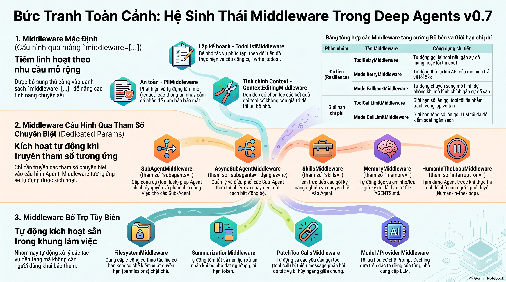

# Chương 4: Lập Kế Hoạch Và Phân Rã Tác Vụ (Task Planning) — Dạy Agent Cách Bẻ Nhỏ Bài Toán Phức Tạp

> Ở chương trước, chúng ta đã tìm hiểu cách Hệ thống tập tin ảo (Virtual File System) quản lý context cho Agent. Chương này sẽ tập trung vào một năng lực cốt lõi khác — **Lập kế hoạch tác vụ (Task Planning)**. Công cụ `write_todos` giúp Agent phân rã bài toán, theo dõi tiến độ; từ phiên bản v0.7 trở đi, khả năng này được thiết kế để **bật theo nhu cầu (on-demand)** chứ không còn là cấu hình cố định mặc định cho mọi Agent.

---

## Tại Sao Agent Cần Khả Năng "Lập Kế Hoạch" (Planning)?

### Bài toán đơn giản vs. Bài toán phức tạp

Với các bài toán đơn giản (Single-step tasks), Agent có thể xử lý gọn gàng chỉ trong một bước:

```text
Người dùng: Thời tiết Hà Nội hôm nay thế nào?
Agent: [Gọi tool thời tiết] → Hôm nay Hà Nội có nắng, 28°C.
```

Tuy nhiên, các tác vụ phức tạp trong thực tế thường đòi hỏi quy trình thực thi nhiều chặng (Multi-step execution). Ví dụ:

```text
Người dùng: Hãy nghiên cứu kiến trúc kỹ thuật của LangGraph, so sánh với 3 sản phẩm cạnh tranh, rồi viết một bản báo cáo phân tích chi tiết dài 3.000 từ.
```

Nhiệm vụ này bao gồm rất nhiều công đoạn: tìm kiếm trên nhiều nguồn dữ liệu, đọc và chắt lọc lượng lớn tài liệu, so sánh ưu nhược điểm, lập dàn ý và biên soạn báo cáo. Nếu thiếu một danh sách công việc (todo list) tường minh, Agent rất dễ bỏ sót các bước trọng yếu hoặc lặp đi lặp lại cùng một thao tác tìm kiếm vô nghĩa. Cơ chế lập kế hoạch sẽ đóng vai trò như chiếc "la bàn" giúp Agent bám sát tiến độ.

---

### Chuyện gì sẽ xảy ra nếu Agent KHÔNG có kế hoạch?

- **Bỏ sót các bước sống còn**: Vừa nhận đề bài đã vội vàng viết báo cáo ngay, quên mất phải tìm kiếm thông tin về đối thủ cạnh tranh trước.
- **Lặp lại công việc thừa thãi (Redundant Work)**: Tìm kiếm cùng một từ khóa tới 3 lần vì "quên" mất là vài lượt trước mình đã tìm rồi.
- **"Đứt gánh giữa đường" (Context Drift)**: Khi lịch sử hội thoại quá dài, Agent bị quá tải ngữ cảnh và mất hoàn toàn cái nhìn tổng thể về mục tiêu ban đầu.
- **Chất lượng trồi sụt thất thường**: Có lúc làm rất tốt, nhưng có lúc lại tự ý bỏ qua các khâu then chốt mà không rõ lý do.

Khả năng lập kế hoạch giúp Agent rèn luyện tư duy **"Nghĩ trước khi làm" (Think before act)** — phân rã tác vụ lớn thành các bước con khả thi, sau đó tuần tự thực thi, theo dõi tiến độ và chủ động điều chỉnh linh hoạt khi gặp tình huống phát sinh.

---

## Kích Hoạt Tường Minh Task Planning Trong Bản v0.7

`TodoListMiddleware` sẽ đồng thời tiêm (inject) vào Agent:
1. Tool `write_todos`.
2. Trường trạng thái `todos` trong Agent State.
3. System prompt hướng dẫn lập kế hoạch.

Ở bản v0.7, Deep Agents mặc định **không tự động cài đặt** middleware này nhằm giữ Agent gọn nhẹ nhất có thể. Khi bài toán cần đến, bạn phải truyền tường minh qua tham số `middleware`:

> **Đoạn code minh họa**: Biến `model` đại diện cho Chat Model đã được cấu hình (xem lại cách khởi tạo ở Chương 2).

```python
from deepagents import create_deep_agent
from langchain.agents.middleware import TodoListMiddleware

agent = create_deep_agent(
    model=model,
    middleware=[TodoListMiddleware()],
)
```

### Bảng hướng dẫn khi nào nên bật `TodoListMiddleware`:

| Tình huống sử dụng | Khuyến nghị | Lý do kỹ thuật |
|---|---|---|
| **Hỏi đáp một bước, gọi tool ngắn hạn** | **Tắt (Mặc định)** | Tránh lãng phí token và thời gian; tránh tình trạng "kế hoạch còn dài dòng hơn cả việc thực hiện". |
| **Tác vụ dài hơi, nhiều chặng, dễ sót bước** | **Nên Bật** | Giúp Agent bám sát quy trình; kiểm tra tỷ lệ hoàn thành qua benchmark thực tế. |
| **Model năng lực suy luận trung bình, dễ lạc đề** | **Nên thử nghiệm** | Thực hiện A/B testing; việc có Todo list thường giúp các model nhỏ giữ vững mạch logic tốt hơn. |
| **Giao diện người dùng (UI) cần hiển thị tiến độ** | **Bắt buộc Bật** | Khi đó, trường `todos` trong State đóng vai trò như một protocol để frontend hiển thị checklist thời gian thực cho người dùng. |

---

## Chi Tiết Về Tool `write_todos`

Sau khi được kích hoạt, Agent sẽ sở hữu tool `write_todos` để khởi tạo và quản lý danh sách việc cần làm. Cần lưu ý rằng: sự tồn tại của tool không đảm bảo 100% Agent sẽ gọi nó ở mọi request; hành vi thực tế phụ thuộc vào độ phức tạp của prompt và năng lực suy luận của mô hình.

### Cấu trúc dữ liệu của một Task

Mỗi nhiệm vụ trong danh sách là một object có cấu trúc đơn giản:

```python
{
    "content": "Tìm kiếm tài liệu chính thức của LangGraph, tổng hợp kiến trúc cốt lõi và thiết kế API",  # Nội dung công việc
    "status": "pending"  # Trạng thái hiện tại
}
```

### 3 Trạng thái cơ bản (`status`)

| Trạng thái | Ý nghĩa | Thời điểm xuất hiện |
|---|---|---|
| `pending` | **Chờ xử lý** | Agent vừa mới phân rã kế hoạch, chưa bắt tay vào làm |
| `in_progress` | **Đang thực hiện** | Agent đang tập trung xử lý bước này |
| `completed` | **Đã hoàn thành** | Agent đánh dấu bước này đã xong |

Vòng đời chuẩn: `pending` → `in_progress` → `completed`. Tuy nhiên, trong quá trình làm việc, mô hình có thể tự do thêm, bớt hoặc đổi thứ tự các task dựa trên thông tin mới thu thập được.

> ⚠️ **Lưu ý quan trọng về tính xác thực:**
> Trạng thái `completed` chỉ là **dấu hiệu tự đánh giá** của Agent. Phía ứng dụng hoặc lập trình viên vẫn bắt buộc phải có cơ chế kiểm tra sản phẩm đầu ra thực tế: ví dụ file báo cáo đã được ghi chưa, đường link trích dẫn có thật không, hay code viết ra có pass unit test không. **Danh sách Todo báo 100% completed không đồng nghĩa với việc kết quả là chính xác.**

---

### Quy Trình Agent Sử Dụng `write_todos` Trong Thực Tế

Khi tiếp nhận một bài toán phức tạp, kịch bản hành vi kinh điển của một Deep Agent diễn ra qua 3 pha:

```
[Nhận yêu cầu]
      │
      ▼
[Pha 1: Lập kế hoạch] ──> Gọi write_todos (Tạo danh sách toàn bộ ở trạng thái pending)
      │
      ▼
[Pha 2: Thực thi tuần tự] ──> Đổi task sang in_progress ──> Gọi Tool (search, write_file) ──> Đổi task sang completed
      │
      ▼
[Pha 3: Điều chỉnh động] ──> Phát hiện thiếu sót ──> Gọi write_todos chèn thêm task mới
```

#### Pha 1: Lập kế hoạch ban đầu
Agent nhận diện độ phức tạp và phân rã đầu việc:
```text
Agent suy nghĩ: "Nhiệm vụ này khá phức tạp, mình cần bẻ nhỏ thành các bước trước."
Agent gọi write_todos:
  1. [pending] Tìm kiếm tài liệu chính thức và khái niệm cốt lõi của LangGraph
  2. [pending] Tìm kiếm 3 đối thủ cạnh tranh (Temporal, Inngest, Prefect)
  3. [pending] Phân tích so sánh ưu nhược điểm từng giải pháp
  4. [pending] Lập dàn ý bài báo cáo
  5. [pending] Soạn thảo báo cáo hoàn chỉnh
```

#### Pha 2: Tuần tự thực thi
Agent chuyển trạng thái từng task và gọi các tool tương ứng:
```text
Agent cập nhật Task 1 sang [in_progress]
Agent gọi tool: internet_search("LangGraph architecture")
Agent gọi tool: write_file("/workspace/langgraph_notes.md", ...)
Agent cập nhật Task 1 sang [completed]

Agent cập nhật Task 2 sang [in_progress]
Agent gọi tool: internet_search("Temporal vs LangGraph")
...
```

#### Pha 3: Điều chỉnh linh hoạt (Dynamic Replanning)
Trong khi tìm kiếm, nếu phát hiện thông tin mới, Agent có thể tái cấu trúc lại kế hoạch:
```text
Agent suy nghĩ: "Trong lúc tìm hiểu, mình thấy Prefect không cùng phân khúc, nên đổi sang Cloudflare Durable Objects thì hợp lý hơn."
Agent gọi write_todos cập nhật lại danh sách:
  1. [completed] Tìm kiếm tài liệu chính thức và khái niệm cốt lõi của LangGraph
  2. [in_progress] Tìm kiếm 3 đối thủ cạnh tranh
  3. [pending] Phân tích so sánh ưu nhược điểm
  4. [pending] Lập dàn ý bài báo cáo
  5. [pending] Soạn thảo báo cáo hoàn chỉnh
  6. [pending] Bổ sung tài liệu về Durable Objects  <-- (Task mới được chèn thêm)
```


---

### Khả Năng Lưu Trữ Bền Vững Của Danh Sách Nhiệm Vụ

Danh sách task được lưu độc lập tại **trường `todos` trong `AgentState`**, tách biệt hoàn toàn với mảng lịch sử tin nhắn (`messages`):

- **Trong cùng một lần chạy (`run`)**: Các bước suy luận phía sau luôn đọc được danh sách này. Cơ chế tự động tóm tắt tin nhắn (Summarization) tuyệt đối không xóa trường `todos`.
- **Giữa nhiều lần gọi `invoke()` khác nhau**: Để danh sách Todo được kế thừa xuyên suốt các lượt trao đổi, bạn bắt buộc phải cấu hình **Checkpointer** và tái sử dụng cùng một `thread_id`. Chỉ thêm `TodoListMiddleware` mà không có Checkpointer thì mỗi lượt `invoke()` mới sẽ là một phiên làm việc trắng tinh.
- **Phạm vi lưu trữ**: `InMemorySaver` chỉ lưu trên bộ nhớ RAM của process hiện tại (nếu restart app là mất). Muốn lưu vĩnh viễn, bạn cần dùng Checkpointer kết nối Postgres/Redis hoặc deploy lên Agent Server có sẵn hạ tầng persistence.
- **Kế thừa Sub-Agent**:
  - Sub-Agent mặc định dạng `general-purpose` sẽ kế thừa cấu hình Todo của Agent cha, nhưng nó quản lý một danh sách `todos` riêng biệt trong State của chính nó.
  - Các Sub-Agent tùy biến khai báo qua `subagents=[...]` có Middleware stack độc lập hoàn toàn. Nếu muốn Sub-Agent đó biết lập kế hoạch, bạn phải bật Todo trong spec của nó; Sub-Agent không đọc lén danh sách Todo của Agent cha.

*(Chi tiết về cấu hình Checkpointer xem tại [Chương 8: Nền tảng của bộ nhớ ngắn hạn](../ch08-long-term-memory/#checkpointer短期记忆的基础)).*

---

## Mở Nắp Động Cơ: Cơ Chế LangChain Middleware

Để hiểu sâu lý do tại sao `write_todos` có thể lắp ghép linh hoạt như một khối Lego, chúng ta cần nhìn xuống tầng dưới: **Hệ thống Middleware của LangChain**.

Deep Agents (Harness layer) được xây dựng bên trên nền tảng LangChain (Framework layer). LangChain cung cấp hệ thống Middleware đóng vai trò như một cơ chế Plugin mạnh mẽ. Bản chất của hàm `create_deep_agent()` chính là việc **tự động kết hợp (auto-assemble) một tập hợp các middleware tiêu chuẩn** vào vòng đời của Agent.

```
┌────────────────────────────────────────────────────────┐
│                   create_deep_agent                    │
│                                                        │
│  ┌──────────────────────────────────────────────────┐  │
│  │               LangChain Middleware               │  │
│  │                                                  │  │
│  │  [Filesystem] [Summarization] [PatchToolCalls]   │  │
│  │  [TodoList]   [SubAgent]      [HumanInTheLoop]   │  │
│  └──────────────────────────────────────────────────┘  │
│                           │                            │
│                           ▼                            │
│  ┌──────────────────────────────────────────────────┐  │
│  │             LangGraph Compiled Graph             │  │
│  └──────────────────────────────────────────────────┘  │
└────────────────────────────────────────────────────────┘
```

---

### Phân Biệt 2 Loại Hook Cốt Lõi

Hệ thống Middleware của LangChain chia làm hai phong cách Hook với ranh giới thực thi hoàn toàn khác nhau:

| Phong cách Hook | Các Hook đại diện | Cơ chế thực thi | Kịch bản sử dụng phù hợp |
|---|---|---|---|
| **Node-style** | `before_agent`, `before_model`, `after_model`, `after_agent` | Được biên dịch thành các **Node độc lập** trên đồ thị (Graph) của LangGraph, chạy tuần tự theo vòng đời | Kiểm tra dữ liệu (Validation), cập nhật State, Audit log, ngắt luồng chờ người duyệt (`interrupt`) |
| **Wrap-style** | `wrap_model_call`, `wrap_tool_call` | Đóng vai trò như một Decorator bọc quanh lời gọi model hoặc tool; có quyền can thiệp, chạy lại nhiều lần hoặc chặn không gọi `handler` | Retry tự động, Cache kết quả, Fallback model dự phòng, chỉnh sửa cấu trúc request/response |

> 💡 **Giải thích chuyên sâu: Tại sao sự khác biệt này lại cực kỳ quan trọng đối với `interrupt()`?**
> - **Node-style Hook** tạo thành một đỉnh (node) rõ ràng trên State Graph. Khi gọi hàm `interrupt()` (để chờ con người phê duyệt), hệ thống lưu checkpoint ngay tại ranh giới của node đó. Lúc resume lại, luồng chạy sẽ biết chính xác cần bắt đầu lại từ node nào mà không gây tác dụng phụ lặp lại.
> - Ngược lại, **Wrap-style Hook** nằm sâu bên trong nội bộ quá trình thực thi của node model/tool. Nếu bạn cố tình đặt `interrupt()` bên trong Wrap-style, khi resume lại, toàn bộ `handler` (và logic bọc ngoài) có thể bị tái thực thi ngoài ý muốn (gây duplicate API call hoặc trùng lặp thao tác).
> - **Quy tắc vàng:** Luôn đặt các điểm ngắt người dùng (`interrupt`) ở **Node-style Hook**.

---

### Ba Nhóm Cấu Hình Middleware Trong Bản v0.7

Khi gọi `create_deep_agent()`, các middleware được tập hợp qua 3 con đường:

#### 1. Nhóm Middleware mặc định (Luôn có sẵn):
- `FilesystemMiddleware`: Tiêm 7 file tools và áp dụng bộ quy tắc kiểm soát quyền `permissions`.
- `SummarizationMiddleware`: Tự động nén ngữ cảnh khi vượt ngưỡng token.
- `PatchToolCallsMiddleware`: Bù đắp các phản hồi tool bị khuyết thiếu trong lịch sử hội thoại (giải thích chi tiết ở mục dưới).
- Các middleware liên quan đến Model Provider (như Prompt Caching) tùy theo model profile.

#### 2. Nhóm cấu hình qua tham số chuyên biệt (Dedicated Parameters):
- `subagents=`: Kích hoạt `SubAgentMiddleware` (mặc định kèm sub-agent tổng quát; cấp công cụ `task`) hoặc `AsyncSubAgentMiddleware`.
- `skills=`: Kích hoạt `SkillsMiddleware` để nạp các bộ kỹ năng.
- `memory=`: Kích hoạt `MemoryMiddleware` để nhúng trí nhớ từ file `AGENTS.md`.
- `interrupt_on=`: Kích hoạt `HumanInTheLoopMiddleware` để chặn các lệnh gọi tool nhạy cảm chờ con người phê duyệt.

#### 3. Nhóm cấu hình qua mảng `middleware=[...]`:
- Nơi bạn chủ động bổ sung các tính năng tùy biến như `TodoListMiddleware`, `ToolRetryMiddleware`, v.v.
- **Quy tắc thay thế tại chỗ (In-place Replacement):** Nếu bạn truyền vào mảng `middleware` một instance có cùng tên lớp với một Middleware mặc định (ví dụ bạn muốn tùy biến `SummarizationMiddleware`), instance mới của bạn sẽ **thay thế hoàn toàn** instance mặc định ở vị trí cũ, chứ không phải nối thêm vào đuôi danh sách.
- Việc thay thế này là **ghi đè nguyên khối (full instance replacement)**, hệ thống không tự động merge các cấu hình cũ và mới.


---

### `PatchToolCallsMiddleware`: Vá Lỗ Hổng Nào Trong Lịch Sử Tin Nhắn?

Khi mô hình LLM quyết định gọi tool, nó gửi ra một message chứa yêu cầu `tool_calls`. Về mặt giao thức API chuẩn (của OpenAI, Anthropic...), ngay sau message đó **bắt buộc phải có một `ToolMessage` tương ứng** mang đúng `tool_call_id` đó để trả về kết quả.

Tuy nhiên, nếu phiên chạy bị hủy đột ngột giữa chừng (người dùng bấm Cancel, đứt kết nối mạng, timeout máy chủ) trước khi tool kịp trả kết quả về, mảng lịch sử tin nhắn sẽ rơi vào trạng thái "mồ côi" — chỉ có lệnh gọi mà không có phản hồi. Ở lần chạy tiếp theo, nếu gửi nguyên lịch sử này lên LLM API, **API sẽ lập tức báo lỗi 400 Bad Request** vì vi phạm giao thức.

Đó chính là lúc `PatchToolCallsMiddleware` phát huy tác dụng:

1. **Trước khi Agent bắt đầu (`before_agent` hook)**, middleware này quét toàn bộ lịch sử message.
2. Nếu phát hiện một `tool_call` chưa có phản hồi, nó sẽ **chủ động chèn thêm một `ToolMessage` giả lập** với đúng `tool_call_id` đó, mang thông báo: *"Lời gọi tool này đã bị hủy bỏ ở phiên trước"* hoặc *"Tham số bị lỗi không thể thực thi"*.
3. Nhờ đó, lịch sử hội thoại trở lại trạng thái hợp lệ, giúp Agent có thể tiếp tục trò chuyện bình thường mà không bị crash API.

> 💡 **Cần phân biệt rõ trách nhiệm giữa các cơ chế:**
> - `PatchToolCallsMiddleware`: **Chỉ vá lại tính toàn vẹn của lịch sử tin nhắn**, tuyệt đối không chạy lại tool, không sửa lỗi logic và không chứng minh được tác vụ bên ngoài đã hoàn tác hay chưa (ví dụ: API bên thứ 3 có thể đã trừ tiền nhưng client bị ngắt mạng).
> - `ToolRetryMiddleware`: Xử lý việc thử lại (retry) khi tool ném ra exception tạm thời.
> - `Checkpointer`: Cơ chế của LangGraph lưu trữ snapshot của State giữa các vòng chạy qua `thread_id`.
> - Kiểm tra tính đúng đắn của dữ liệu: Phải do code logic nghiệp vụ hoặc con người thẩm định.

---

### `TodoListMiddleware`: Chân Dung Thật Của `write_todos`

Như đã khẳng định, `write_todos` chính là hiện thân của `TodoListMiddleware`. Dưới đây là cách bạn có thể tự tay lắp ráp một Agent từ tầng thấp LangChain `create_agent()`:

```python
import os
from langchain_openai import ChatOpenAI
from langchain.agents import create_agent
from langchain.agents.middleware import TodoListMiddleware
from deepagents.middleware import FilesystemMiddleware

model = ChatOpenAI(
    # Lập kế hoạch đòi hỏi tư duy logic cao, nên chọn model mạnh có hỗ trợ tool call tốt
    model="zai-org/GLM-5.2",
    api_key=os.environ["SILICONFLOW_API_KEY"],
    base_url="https://api.siliconflow.cn/v1",
)

agent = create_agent(
    model=model,
    tools=[],
    middleware=[
        TodoListMiddleware(),     # Tự động tiêm write_todos, state todos và prompt hướng dẫn
        FilesystemMiddleware(),   # Tự động tiêm các tool file: read_file, write_file...
    ],
)
```

Bạn cũng có thể tùy biến prompt định hướng tư duy lập kế hoạch thông qua các tham số:

```python
TodoListMiddleware(
    system_prompt="Bạn là kỹ sư phần mềm cao cấp. Bạn LUÔN PHẢI viết Unit Test trước khi bắt tay vào viết code thực thi.",
    tool_description="Công cụ dùng để ghi nhận checklist công việc...",
)
```

---

### `SummarizationMiddleware`: Bí Mật Của Việc Nén Ngữ Cảnh

Cơ chế tự động tóm tắt ngữ cảnh đã học ở Chương 3 do `SummarizationMiddleware` đảm trách. Đáng chú ý là cả LangChain và Deep Agents đều có một middleware mang tên này, nhưng cách thức hoạt động bên dưới có sự khác biệt rất lớn:

| Tiêu chí so sánh | Phiên bản của LangChain | Phiên bản của Deep Agents |
|---|---|---|
| **Đường dẫn Import** | `langchain.agents.middleware` | `deepagents.middleware` |
| **Vị trí thực thi** | `before_model` (Tạo thành một **Node độc lập** trên Graph) | `wrap_model_call` (Nằm kín đáo **bên trong Node `model`**) |
| **Cách xử lý tin nhắn** | Ghi đè thẳng vào State: xóa các message cũ trong `state["messages"]`, chỉ giữ lại bản tóm tắt và vài tin nhắn gần nhất | **Bảo toàn 100% tin nhắn gốc trong State**; chỉ ghi đè tạm thời danh sách message gửi tới LLM ở lượt gọi đó (`request.override(messages=...)`) |
| **Lưu trữ lịch sử** | Không lưu lại các tin nhắn cũ đã bị cắt tỉa | **Ghi toàn bộ tin nhắn cũ vào Virtual File System (Backend)** và gắn đường dẫn file vào bản tóm tắt để Agent có thể đọc lại bằng `read_file` khi cần |

> 💡 **Tại sao khi gọi `agent.get_graph()` lại không thấy node Summarize của Deep Agents?**
> Bởi vì Deep Agents thiết kế middleware này ở dạng **Wrap-style** (`wrap_model_call`). Nó bao bọc trực tiếp xung quanh bước gọi model, nên trên sơ đồ cấu trúc Node của Graph, bạn sẽ chỉ thấy node `model` duy nhất chứ không có node tách rời như bản LangChain.

> ⚠️ **Lưu ý khi tự cấu hình (Manual Instantiation):**
> Cả hai class trên nếu bạn tự `__init__()` mà không truyền tham số `trigger` thì giá trị mặc định của nó là `None` (nghĩa là **sẽ không bao giờ tự động kích hoạt tóm tắt**). Khi dùng `create_deep_agent()`, framework tự tính toán ngưỡng trigger tối ưu; nhưng nếu bạn tự ráp qua `create_agent(middleware=[...])`, bạn bắt buộc phải cấu hình tường minh:
> - `trigger=("fraction", 0.85)`: Kích hoạt khi đạt 85% context window của model.
> - `trigger=("tokens", 4000)`: Kích hoạt khi lịch sử đạt 4.000 tokens.
> - `trigger=("messages", 20)`: Kích hoạt khi lịch sử vượt quá 20 tin nhắn.

---

## Sự Phối Hợp Giữa Task Planning Và Context Management

Trong các bài toán nghiên cứu chạy dài (Long-running tasks), Task Planning và Context Management phối hợp với nhau như thế nào?

### Tình huống thực tế:
Giả sử Agent đang thực hiện một bài nghiên cứu gồm 10 bước. Tới bước thứ 6, ngữ cảnh hội thoại đã đạt đến hàng chục nghìn tokens gồm toàn kết quả search web thô và nội dung file tạm.

Lúc này, cơ chế quản lý context (Chương 3) tự động vào cuộc:
1. **Large Result Auto-Eviction**: Đẩy toàn bộ dữ liệu search khổng lồ ra file `.md` trên VFS, chỉ chừa lại 10 dòng xem trước trong prompt.
2. **Conversation Summarization**: Nén toàn bộ 5 bước trước thành một đoạn tóm tắt súc tích, lưu lịch sử chi tiết vào Backend.

### Vai trò "Mỏ neo" (Anchor) của Todo List:
Điều kỳ diệu là: Dù toàn bộ tin nhắn của 5 bước trước đã bị nén gọn lại thành văn bản tóm tắt, **trường `todos` trong State vẫn giữ nguyên vẹn 100%**!

Danh sách Todo đóng vai trò như một **chiếc mỏ neo nhận thức**:
- Giúp Agent không bị "ngơ ngác" sau khi bị nén context.
- Biết rõ mình đã hoàn thành những bước nào (được đánh dấu `completed`).
- Đang dở dang ở bước nào (`in_progress`).
- Còn lại những bước nào cần làm tiếp theo (`pending`).

```python
# Ví dụ kết hợp thủ công cả TodoList, Filesystem và Summarization dùng chung Backend
from langchain.agents import create_agent
from langchain.agents.middleware import TodoListMiddleware
from deepagents.backends import StateBackend
from deepagents.middleware import FilesystemMiddleware, SummarizationMiddleware

# Khởi tạo một Backend duy nhất để Filesystem và Summarization chia sẻ chung không gian lưu trữ
shared_backend = StateBackend()

agent = create_agent(
    model=model,
    tools=[],
    middleware=[
        TodoListMiddleware(),
        FilesystemMiddleware(backend=shared_backend),
        SummarizationMiddleware(
            model=model,
            backend=shared_backend,          # Giúp read_file đọc lại được file tóm tắt lịch sử
            trigger=("tokens", 4000),        # Vượt quá 4.000 tokens là kích hoạt nén
            keep=("messages", 20),           # Giữ lại 20 message gần nhất
        ),
    ],
)
```

---

## Thực Hành Code: Agent Tự Lập Kế Hoạch Và Nghiên Cứu Đa Bước

Dưới đây là ví dụ hoàn chỉnh: Xây dựng một Deep Agent chuyên nghiệp, tự động lập kế hoạch qua `write_todos`, tìm kiếm thông tin bằng Tavily, lưu trữ ghi chú trung gian vào Virtual File System và hoàn thiện báo cáo phân tích:

```python
import os
from typing import Literal
from langchain_openai import ChatOpenAI
from tavily import TavilyClient
from deepagents import create_deep_agent
from langchain.agents.middleware import TodoListMiddleware

# 1. Cấu hình Model tư duy cao cấp
model = ChatOpenAI(
    model="zai-org/GLM-5.2",
    api_key=os.environ["SILICONFLOW_API_KEY"],
    base_url="https://api.siliconflow.cn/v1",
)

# 2. Định nghĩa Tool tìm kiếm thông tin qua Tavily
tavily_client = TavilyClient(api_key=os.environ["TAVILY_API_KEY"])

def internet_search(query: str, max_results: int = 5) -> dict:
    """Tìm kiếm thông tin mới nhất trên Internet."""
    return tavily_client.search(query, max_results=max_results)

# 3. Khởi tạo Deep Agent kèm TodoListMiddleware
agent = create_deep_agent(
    model=model,
    tools=[internet_search],
    middleware=[TodoListMiddleware()],  # Kích hoạt tính năng Task Planning
    system_prompt="""Bạn là một chuyên gia phân tích công nghệ cao cấp.
Khi đối mặt với các đề tài nghiên cứu phức tạp, bạn LUÔN LUÔN tuân thủ quy trình:
1. Dùng write_todos để lập kế hoạch nghiên cứu bài bản trước khi làm bất cứ việc gì.
2. Tuần tự thực thi từng bước, cập nhật trạng thái task (in_progress, completed) kịp thời.
3. Dùng write_file ghi lại các phát hiện quan trọng vào file markdown để tránh quên.
4. Cuối cùng, tổng hợp toàn bộ các ghi chú để xuất ra báo cáo nghiên cứu hoàn chỉnh, chuyên sâu.
""",
)

# 4. Giao nhiệm vụ nghiên cứu đa bước
result = agent.invoke({
    "messages": [{
        "role": "user",
        "content": "Hãy nghiên cứu 3 framework Agent Harness hàng đầu hiện nay (Deep Agents, Claude Agent SDK, Codex SDK), so sánh sự khác biệt cốt lõi về kiến trúc và viết báo cáo đánh giá ngắn gọn."
    }]
})

# In báo cáo cuối cùng
print("\n===== BÁO CÁO KẾT QUẢ =====\n")
print(result["messages"][-1].content)

# Kiểm tra trạng thái danh sách công việc sau khi hoàn tất
print("\n===== DANH SÁCH TODO CUỐI CÙNG =====\n")
for idx, todo in enumerate(result.get("todos", []), 1):
    print(f"{idx}. [{todo['status']}] {todo['content']}")
```

---

## Bức Tranh Toàn Cảnh: Toàn Bộ Middleware Của Deep Agents

Bảng phân loại dưới đây giúp bạn tra cứu nhanh toàn bộ hệ sinh thái Middleware hỗ trợ trong Deep Agents v0.7:

### 1. Middleware mặc định (Default)
| Tên Middleware | Công dụng chính |
|---|---|
| `FilesystemMiddleware` | Cung cấp 7 công cụ thao tác file + cơ chế kiểm soát quyền `permissions` |
| `SummarizationMiddleware` | Tự động tóm tắt và nén lịch sử tin nhắn khi chạm ngưỡng token |
| `PatchToolCallsMiddleware` | Tự động vá các yêu cầu tool call bị thiếu message phản hồi do hủy ngang |
| Model / Provider Middleware | Tối ưu hóa prompt caching theo đặc tả của từng nhà cung cấp LLM |

### 2. Middleware cấu hình qua tham số chuyên biệt (Dedicated Params)
| Tham số truyền vào | Middleware được kích hoạt | Công dụng |
|---|---|---|
| `subagents=` | `SubAgentMiddleware` | Cấp tool `task` để ủy quyền công việc cho Sub-Agent |
| `skills=` | `SkillsMiddleware` | Tiêm các gói kỹ năng nghiệp vụ chuyên biệt |
| `subagents=` (dạng async) | `AsyncSubAgentMiddleware` | Quản lý các Sub-Agent chạy nền bất đồng bộ |
| `memory=` | `MemoryMiddleware` | Tự động đọc và lưu giữ ký ức từ file `AGENTS.md` |
| `interrupt_on=` | `HumanInTheLoopMiddleware` | Tạm dừng Agent trước khi gọi tool để chờ người phê duyệt |

### 3. Middleware bổ trợ cấu hình qua mảng `middleware=[...]`
| Phân loại | Tên Middleware | Công dụng |
|---|---|---|
| **Lập kế hoạch** | `TodoListMiddleware` | Bẻ nhỏ tác vụ, theo dõi tiến độ, cấp tool `write_todos` |
| **An toàn** | `PIIMiddleware` | Phát hiện và làm mờ (redact) thông tin nhạy cảm cá nhân |
| **Độ bền (Resilience)** | `ToolRetryMiddleware` | Tự động gọi lại tool nếu gặp lỗi mạng/timeout |
| | `ModelRetryMiddleware` | Tự động thử lại khi API mô hình bị lỗi 5xx |
| | `ModelFallbackMiddleware` | Tự động chuyển sang mô hình phụ khi mô hình chính sập |
| **Giới hạn chi phí** | `ToolCallLimitMiddleware` | Giới hạn số lần gọi tool tối đa để tránh vòng lặp vô tận |
| | `ModelCallLimitMiddleware` | Giới hạn số lần gọi LLM tối đa |
| **Tinh chỉnh Context** | `ContextEditingMiddleware` | Dọn dẹp có chọn lọc các kết quả gọi tool cũ không còn giá trị |



---

## Tổng Kết (Key Takeaways)

1. **Ý nghĩa của Planning**: Giúp Agent chuyển từ cơ chế phản xạ tức thời sang tư duy có phương pháp — phân rã bài toán, làm từng bước và tự sửa sai linh hoạt.
2. **Bật tắt theo nhu cầu (v0.7)**: `write_todos` không còn bật sẵn; hãy kích hoạt qua `TodoListMiddleware` cho các bài toán nhiều bước hoặc khi UI cần thanh tiến độ.
3. **Bản chất của `write_todos`**: Lưu trữ 3 trạng thái (`pending`, `in_progress`, `completed`) trong `state["todos"]`. Cần nhớ rằng cờ `completed` chỉ là tự đánh giá của mô hình, ứng dụng cần kiểm chứng sản phẩm thực tế.
4. **LangChain Middleware Architecture**: `create_deep_agent()` là một bộ khung lắp ráp thông minh. Hiểu rõ sự khác biệt giữa **Node-style Hook** (thích hợp cho ngắt luồng `interrupt`) và **Wrap-style Hook** (thích hợp cho retry, nén context) là chìa khóa để tùy biến nâng cao.
5. **Cặp bài trùng TodoList & Context Summarization**: Khi tin nhắn bị tóm tắt và nén lại, `todos` đóng vai trò là "mỏ neo nhận thức" duy nhất giúp Agent không bị mất phương hướng.
6. **Vá lỗi giao thức bằng `PatchToolCallsMiddleware`**: Tự động chèn message phản hồi giả lập cho các lệnh gọi tool bị hủy ngang, ngăn chặn lỗi 400 Bad Request ở phiên kế tiếp.

Ở chương tiếp theo, chúng ta sẽ bước vào thế giới của **Sub-Agents (Agent Phụ) và Cách ly ngữ cảnh** — học cách xây dựng một đội ngũ Agent chuyên trách cùng cộng tác giải quyết các siêu dự án!
