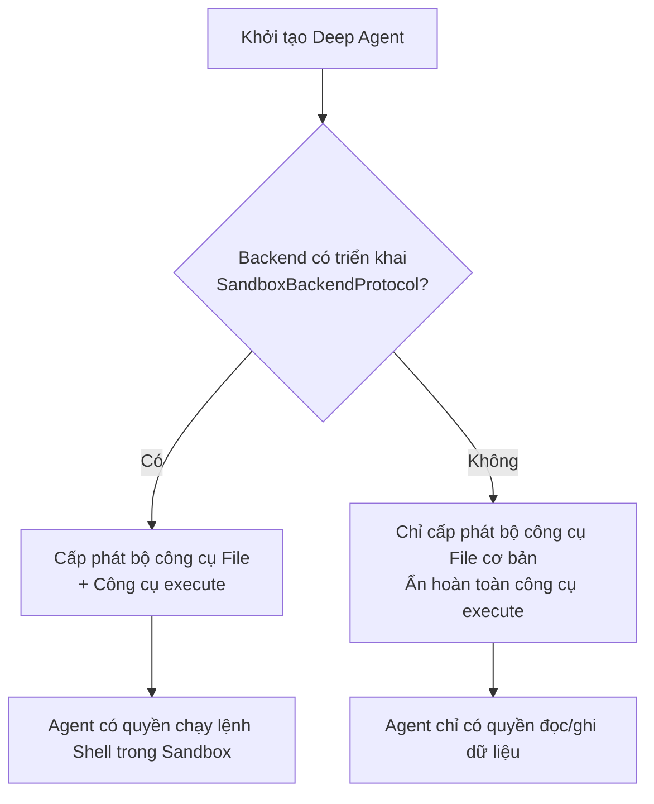
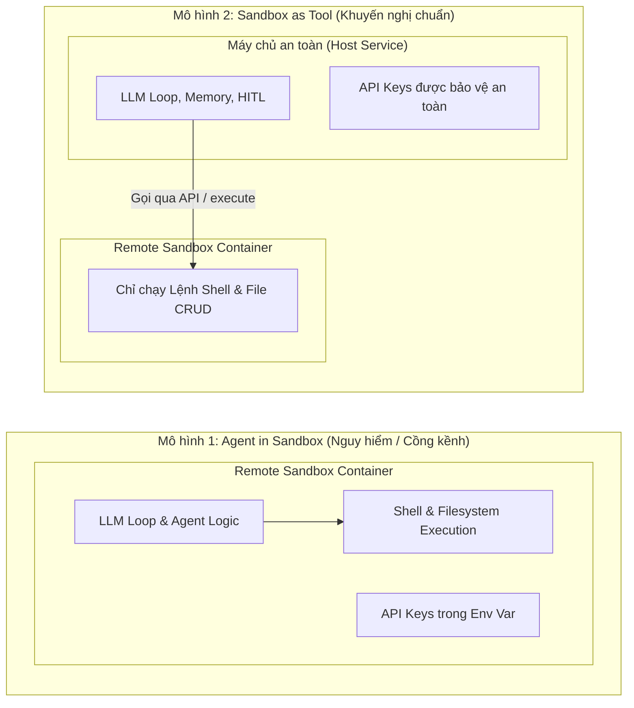
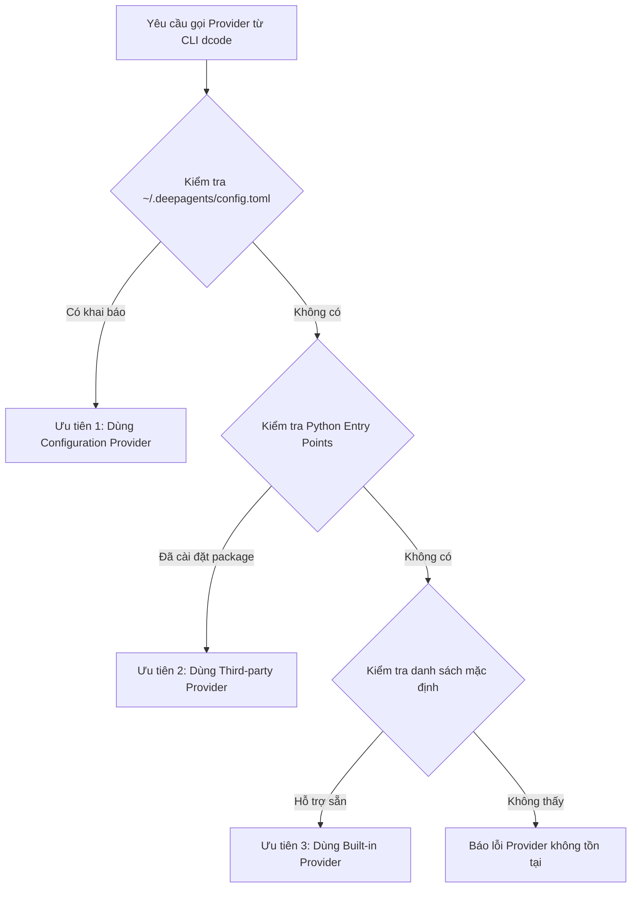
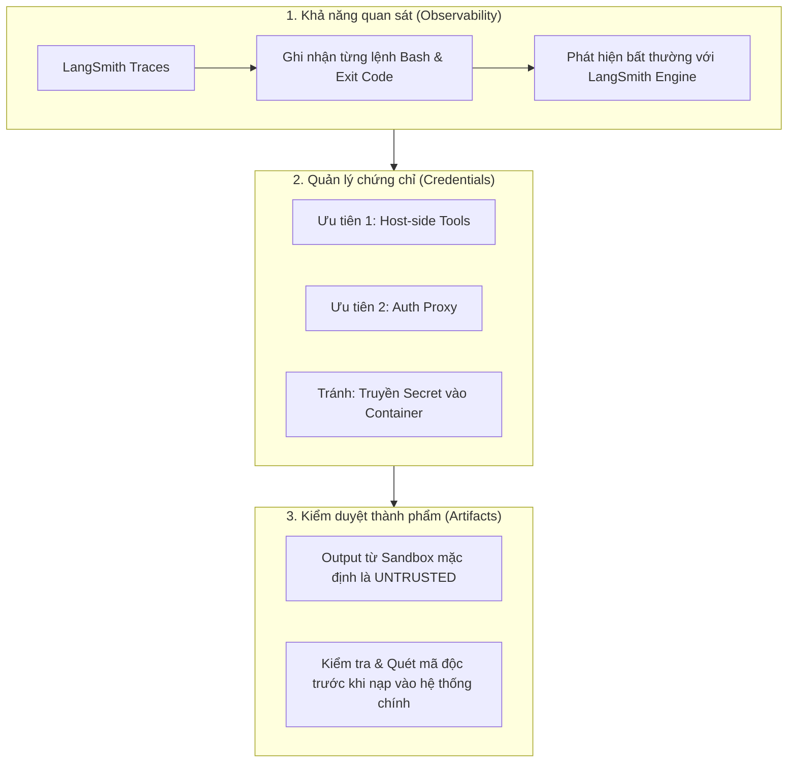

# Chương 10: Sandboxes Thực Thi — Cho Phép AI Agent Chạy Mã Nguồn An Toàn Và Cô Lập

> Một AI Agent có quyền ghi tệp tin, thực thi lệnh Shell và tự cài đặt thư viện không còn đơn thuần là một mô hình "trả lời câu hỏi" nữa, mà đã trở thành một **thực thể chấp hành (executor)** có quyền năng trực tiếp thay đổi môi trường hệ thống. 
> 
> Làm thế nào để giải phóng toàn bộ tiềm năng lập trình, phân tích dữ liệu, tự động chạy test suite của Agent mà vẫn bảo vệ tuyệt đối hệ thống tệp tin của máy chủ lưu trữ (Host), các tiến trình đang chạy và các chứng chỉ bảo mật (credentials)? 
> 
> Câu trả lời nằm ở cơ chế **Sandbox Execution (Thực thi trong môi trường sa bàn / hộp cát cô lập)**. Chương này sẽ hướng dẫn bạn thiết lập các ranh giới an toàn, kiểm soát vòng đời và vận hành Agent với Sandbox ở cấp độ sản xuất (Production-ready).

---

## Ba Tầng Năng Lực Cốt Lõi Cần Phân Biệt

Trước khi bắt đầu cấu hình, chúng ta cần phân biệt rõ ba tầng năng lực độc lập nhưng bổ trợ lẫn nhau trong hệ sinh thái Deep Agents:

1. **Deep Agents Python Backend (`SandboxBackendProtocol`)**: Cung cấp lớp trừu tượng (abstraction layer) để kết nối môi trường Sandbox từ xa vào hàm `create_deep_agent()`. Lớp này tự động trang bị cho Agent các công cụ thao tác hệ thống tệp tin ảo cùng công cụ quyền năng `execute`.
2. **Deep Agents Code (`dcode`)**: Công cụ dòng lệnh (CLI tool) chạy vòng lặp LLM trực tiếp trên máy cục bộ của bạn, nhưng điều hướng toàn bộ các lệnh gọi công cụ (Tool Calls) sang thực thi trong Sandbox từ xa.
3. **LangSmith Sandboxes**: Dịch vụ hạ tầng Sandbox do chính LangSmith vận hành (First-party hosted sandbox). Ngoài việc đóng vai trò là một Python Backend, LangSmith Sandboxes còn cung cấp hệ sinh thái tài nguyên đám mây hoàn chỉnh: Snapshots (chụp ảnh trạng thái), Service URLs (mở cổng HTTP ra ngoài an toàn), Auth Proxy (ủy thác xác thực không lộ mật khẩu), Mounts (gắn ổ đĩa đám mây), và CLI điều khiển.


---

## 1. Sandbox Backend: Môi Trường Thực Thi, Không Phải Công Tắc Phân Quyền

Trong kiến trúc của Deep Agents, Sandbox về bản chất là một **Storage & Execution Backend**.

Các Backend thông thường mà chúng ta đã tìm hiểu ở các chương trước (`StateBackend`, `FilesystemBackend`, `StoreBackend`) chỉ đơn thuần thực thi các thao tác đọc/ghi dữ liệu (CRUD) trên bộ nhớ RAM hoặc ổ đĩa cục bộ. Ngược lại, một **Sandbox Backend** được bổ sung phương thức `execute()`, cho phép Agent kích hoạt các tiến trình Shell thực tế bên trong một môi trường được cô lập hoàn toàn với máy chủ lưu trữ (Host machine).

### Bảng So Sánh Backend Thông Thường và Sandbox Backend

| Tiêu chí năng lực | Backend thông thường (Standard Backend) | Sandbox Backend (Môi trường hộp cát) |
|---|---|---|
| **Bộ công cụ tệp tin (Filesystem Tools)** | Hỗ trợ đầy đủ: `ls`, `read_file`, `write_file`, `edit_file`, `delete`, `glob`, `grep`. | Hỗ trợ hoàn toàn tương đương. |
| **Thực thi lệnh Shell** | **Không hỗ trợ** (Tuyệt đối không có lệnh Shell). | Cung cấp công cụ `execute` để chạy lệnh bash/sh. |
| **Môi trường hoạt động** | Không gian lưu trữ dữ liệu (RAM State, Local Disk, Key-Value Store). | Môi trường hệ điều hành từ xa (Remote Container/VM) được cô lập với máy chủ Host. |
| **Kịch bản ứng dụng điển hình** | Lập kế hoạch todo list, ghi chú nhanh, tra cứu tài liệu, lưu ngữ cảnh. | Viết code, chạy unit test, huấn luyện mô hình, phân tích dữ liệu lớn, đóng gói phần mềm. |

### Cơ Chế Kích Hoạt Tự Động Qua `SandboxBackendProtocol`

Khi bạn truyền một Backend vào hàm `create_deep_agent(backend=...)`, Deep Agents sẽ thực hiện kiểm tra kiểu (Type Checking) trước mỗi lượt suy luận của mô hình:



Lớp cơ sở (Base Class) của Sandbox Backend sẽ tự động chuyển đổi các thao tác tệp tin thông thường (`read_file`, `write_file`, `ls`, v.v.) thành các lệnh shell ngầm bên trong container. Do đó, điểm mấu chốt duy nhất khi một nhà cung cấp (Provider) muốn tích hợp với Deep Agents là triển khai phương thức `execute()` một cách tin cậy và ổn định.

> [!WARNING]
> ### Phân biệt ranh giới: `FilesystemPermission` KHÔNG THỂ thay thế việc cô lập Sandbox!
> Nhiều kỹ sư nhầm lẫn rằng việc thiết lập phân quyền tệp tin (`FilesystemPermission` — đã giới thiệu trong hệ thống Middleware) là đủ để kiểm soát Agent. 
> 
> Thực tế: `FilesystemPermission` chỉ kiểm soát **bộ công cụ tệp tin cấp cao** (`read_file`, `write_file`, `delete`). Nếu bạn cấp cho Agent công cụ `execute`, Agent hoàn toàn có thể chạy các lệnh như `cat /etc/passwd`, `rm -rf /` hoặc `curl` bằng Bash script để vượt qua (bypass) toàn bộ luật phân quyền tệp tin! 
> 
> Vì vậy, an toàn thực thi chỉ đạt được khi bạn **cô lập ở tầng nhân hệ điều hành/container của Sandbox**, chứ không thể dựa vào các bộ lọc logic bên trên.


---

### Giá Trị Trả Về Của `execute()` Và Cơ Chế Xử Lý Tràn Ngữ Cảnh (Output Spilling)

Khi Agent gọi công cụ `execute` với tham số `command: str`, Sandbox Backend sẽ trả về một cấu trúc dữ liệu bao gồm:

1. **Combined Output (`output`)**: Chuỗi văn bản gộp chung giữa luồng đầu ra tiêu chuẩn (`stdout`) và luồng thông báo lỗi (`stderr`).
2. **Exit Code (`exit_code`)**: Mã thoát của tiến trình (ví dụ: `0` là thành công, khác `0` là có lỗi).
3. **Cảnh báo cắt ngắn (Truncation Notice)**: Thông báo trạng thái nếu dữ liệu đầu ra vượt quá ngưỡng an toàn.

> [!NOTE]
> ### Tại sao đầu ra quá lớn không được đưa thẳng vào Context Window?
> Khi một lệnh Shell sinh ra hàng nghìn dòng thông tin (ví dụ: log biên dịch C++/Rust, stack trace khổng lồ hoặc kết quả query dữ liệu), việc tống toàn bộ đầu ra này vào Prompt của LLM sẽ gây ra 3 thảm họa:
> 1. **Tràn bộ nhớ ngữ cảnh (Context Overflow)** và làm đội chi phí token lên chóng mặt.
> 2. **Pha loãng sự chú ý (Attention Dilution / Lost in the Middle)**: Mô hình quên mất chỉ dẫn hệ thống ban đầu.
> 3. **Tê liệt vòng lặp**: Mô hình không thể suy luận tiếp vì context chạm trần (Context Limit).
> 
> **Giải pháp của Deep Agents:** Khi kết quả của `execute()` quá dài, Backend sẽ **tự động cắt ngắn** phần hiển thị cho LLM, lưu toàn bộ nội dung đầy đủ thành một tệp tin tạm trong Sandbox, và gửi kèm chỉ dẫn: *"Output quá dài, đã được lưu tại tệp `/tmp/output.log`. Vui lòng sử dụng công cụ `read_file` để đọc từng phân đoạn (chunk) cần thiết."*

### Gọi Trực Tiếp `execute()` Từ Ứng Dụng Phía Host

Không chỉ Agent mới có quyền gọi `execute`, mã ứng dụng của bạn (Host Application) cũng có thể chủ động kích hoạt `backend.execute()` để kiểm tra tình trạng sức khỏe (Health Check), cài đặt thư viện tiền trạm, hoặc thiết lập môi trường trước khi bàn giao quyền điều khiển cho Agent:

```python
import os
from deepagents.backends.langsmith import LangSmithSandbox
from langsmith.sandbox import SandboxClient

# 1. Khởi tạo client kết nối tới hạ tầng LangSmith
client = SandboxClient()

# 2. Tạo một môi trường sandbox mới dựa trên template định sẵn
sandbox = client.create_sandbox(template_name="deepagents-deploy")

# 3. Đóng gói thành Backend tương thích với Deep Agents
backend = LangSmithSandbox(sandbox=sandbox)

try:
    # Host chủ động kiểm tra phiên bản Python trước khi trao quyền cho Agent
    result = backend.execute("python --version")
    print(f"Phiên bản môi trường Sandbox: {result.output}")
    print(f"Mã thoát (Exit code): {result.exit_code}")
finally:
    # BẮT BUỘC: Luôn dọn dẹp tài nguyên để tránh phát sinh chi phí duy trì máy ảo
    client.delete_sandbox(sandbox.name)
```

---

## 2. Ranh Giới Cô Lập: Bảo Vệ Điều Gì Và KHÔNG Bảo Vệ Điều Gì?

Mục tiêu cốt lõi của mọi nhà cung cấp Sandbox là thiết lập bức tường ngăn cách tuyệt đối giữa **hệ thống tệp & tiến trình của máy chủ (Host)** với **hành động của Agent**:

* **Những gì Sandbox bảo vệ tuyệt đối:** Agent không thể đọc trộm các tệp tin cấu hình trên máy chủ của bạn (`/etc/`, mã nguồn máy chủ, file cấu hình `.env` của Host); không thể truy cập các biến môi trường của tiến trình cha; và không thể can thiệp vào các tiến trình khác đang chạy trên cùng máy chủ vật lý. Nếu Agent lỡ chạy `rm -rf /` hoặc một đoạn mã làm rò rỉ bộ nhớ (OOM crash), chỉ có phiên Sandbox đó bị phá hủy, máy chủ chính của bạn vẫn an toàn 100%.

Tuy nhiên, **Sandbox KHÔNG PHẢI là chiếc đũa thần an ninh toàn diện**. Bản thân việc đưa Agent vào Sandbox không làm cho các hành vi của mô hình tự động trở nên đáng tin cậy. Có hai mối đe dọa nghiêm trọng mà Sandbox **không thể tự mình ngăn chặn**:

| Mối đe dọa (Security Risks) | Tại sao rủi ro vẫn tồn tại trong Sandbox? | Giải pháp phòng vệ tương ứng |
|---|---|---|
| **Tiêm ngữ cảnh (Context / Prompt Injection)** | Kẻ tấn công có thể chèn các câu lệnh độc hại vào dữ liệu đầu vào (tệp PDF, trang web, bình luận người dùng). Khi Agent đọc các dữ liệu này, nó bị "thao túng tâm lý" và tự nguyện thực thi các lệnh nguy hiểm ngay bên trong Sandbox. | **1.** Tuyệt đối không lưu trữ API Key, Database Secret bên trong Sandbox.<br/>**2.** Thiết lập Human-in-the-Loop (HITL) để con người phê duyệt các lệnh Shell rủi ro cao. |
| **Rò rỉ dữ liệu qua mạng (Network Exfiltration)** | Nếu Sandbox được quyền kết nối Internet tự do, Agent (sau khi bị tiêm mã độc) có thể đọc dữ liệu nhạy cảm được upload vào Sandbox rồi dùng `curl -X POST` hoặc truy vấn DNS ngầm để gửi toàn bộ dữ liệu ra máy chủ của hacker. | **1.** Chặn toàn bộ mạng ra (Outbound Network) nếu tác vụ không cần Internet (ví dụ: cờ `blockNetwork: true` trên Modal).<br/>**2.** Giám sát lưu lượng mạng ra (Egress Traffic Monitoring). |

> [!CAUTION]
> Triết lý bảo mật đúng đắn cho AI Agent không phải là *"Môi trường Sandbox này an toàn đến mức Agent không thể làm sai"*, mà là: **"Cho dù Agent có bị tiêm mã độc hoặc mắc sai lầm nghiêm trọng nhất, thiệt hại cũng chỉ nằm gói gọn trong Sandbox và không thể vượt qua ranh giới để xâm nhập vào máy chủ Host hay rò rỉ dữ liệu ra thế giới bên ngoài."**

---

## 3. Bắt Đầu Nhanh: Thực Hành Với `LangSmithSandbox`

LangSmith là giải pháp Sandbox đám mây được quản lý toàn diện (Managed Sandbox) được Deep Agents hỗ trợ chính thức.

### Bước 1: Cài đặt thư viện

Bạn có thể cài đặt tiện ích mở rộng Sandbox cho LangSmith thông qua `uv` hoặc `pip`:

```bash
# Khuyến nghị sử dụng uv
uv add "langsmith[sandbox]"

# Hoặc sử dụng pip truyền thống
pip install "langsmith[sandbox]"
```

### Bước 2: Khởi tạo và liên kết Sandbox với Deep Agent

Đoạn mã sau minh họa cách tạo một Sandbox từ xa, gắn kết vào Agent, thực hiện tác vụ lập trình và dọn dẹp tài nguyên an toàn:

```python
import os
from deepagents import create_deep_agent
from deepagents.backends import LangSmithSandbox
from langchain_anthropic import ChatAnthropic
from langsmith.sandbox import SandboxClient

# 1. Khởi tạo kết nối tới dịch vụ quản lý Sandbox
client = SandboxClient()

# 2. Tạo một môi trường sandbox hoàn toàn mới trên đám mây
ls_sandbox = client.create_sandbox()

# 3. Đóng gói thành Backend cho Agent
backend = LangSmithSandbox(sandbox=ls_sandbox)

# 4. Tạo Agent với mô hình có năng lực Tool Calling mạnh mẽ
agent = create_deep_agent(
    model=ChatAnthropic(model="claude-sonnet-4-6"),
    system_prompt="Bạn là trợ lý lập trình Python chuyên nghiệp có quyền truy cập vào môi trường Sandbox.",
    backend=backend,
)

try:
    # 5. Yêu cầu Agent thực hiện tác vụ tạo gói phần mềm và chạy kiểm thử
    result = agent.invoke({
        "messages": [{
            "role": "user",
            "content": "Hãy tạo một gói thư viện Python nhỏ tính giai thừa, sau đó viết test và chạy pytest.",
        }]
    })
    
    # In câu trả lời tổng hợp cuối cùng của Agent
    print(result["messages"][-1].content)

finally:
    # 6. QUAN TRỌNG: Luôn giải phóng tài nguyên trong khối finally!
    # Môi trường đám mây sẽ tiếp tục tính phí nếu bạn quên không hủy bỏ.
    print(f"Đang tiến hành tiêu hủy Sandbox: {ls_sandbox.name}")
    client.delete_sandbox(ls_sandbox.name)
```

> [!TIP]
> **Nhận xét kiến trúc:** Trong ví dụ trên, toàn bộ tiến trình Python của ứng dụng, mô hình LLM và luồng điều phối Agent đều nằm trên máy tính của bạn (phía Host). Chỉ có các thao tác tạo tệp (`write_file`) và chạy lệnh (`execute pytest`) là được chuyển tiếp qua đường truyền mạng tới Sandbox của LangSmith. Đây chính là mô hình **Sandbox as tool** (Sandbox đóng vai trò như một công cụ bên ngoài).

---

## 4. Các Tích Hợp Python Sandbox Hiện Tại

Hệ sinh thái Deep Agents hỗ trợ một loạt các nhà cung cấp hạ tầng Sandbox hàng đầu. Dù mỗi nhà cung cấp có cú pháp tạo và hủy môi trường riêng biệt, nhưng khi được bọc qua lớp Backend của Deep Agents, chúng đều tuân thủ chung một chuẩn giao tiếp thống nhất (`SandboxBackendProtocol`).

### Bảng Tổng Hợp 8 Nhà Cung Cấp Sandbox Hàng Đầu

| Provider | Gói cài đặt (Package) | Lớp Backend tương ứng | Phương thức khởi tạo | Phương thức dọn dẹp / Tiêu hủy |
|---|---|---|---|---|
| **LangSmith** | `langsmith[sandbox]` | `LangSmithSandbox` | `SandboxClient().create_sandbox()` | `client.delete_sandbox(name)` |
| **AgentCore** | `langchain-agentcore-codeinterpreter` | `AgentCoreSandbox` | `CodeInterpreter(...).start()` | `interpreter.stop()` |
| **Daytona** | `langchain-daytona` | `DaytonaSandbox` | `Daytona().create()` | `sandbox.stop()` |
| **E2B** | `langchain-e2b` | `E2BSandbox` | `Sandbox.create()` | `sandbox.kill()` |
| **Modal** | `langchain-modal` | `ModalSandbox` | `modal.Sandbox.create(app=...)` | `sandbox.terminate()` |
| **NVIDIA OpenShell** | `langchain-nvidia-openshell` | `OpenShellSandbox` | `openshell.Sandbox(...)` | Hỗ trợ Context Manager với `delete_on_exit=True` |
| **Runloop** | `langchain-runloop` | `RunloopSandbox` | `RunloopSDK(...).devbox.create()` | `devbox.shutdown()` |
| **Vercel** | `langchain-vercel-sandbox` | `VercelSandbox` | `Sandbox.create()` | `sandbox.stop()` |

### Ví Dụ Tích Hợp Với Daytona

Daytona là một nền tảng môi trường phát triển chuẩn hóa dành cho lập trình viên và Agent. Hãy xem cách tích hợp Daytona vào Deep Agents:

```python
from daytona import Daytona
from deepagents import create_deep_agent
from langchain_anthropic import ChatAnthropic
from langchain_daytona import DaytonaSandbox

# 1. Khởi tạo môi trường thông qua Daytona SDK
sandbox = Daytona().create()

# 2. Chuyển đổi Daytona container thành Deep Agents Backend
backend = DaytonaSandbox(sandbox=sandbox)

# 3. Khởi tạo Agent
agent = create_deep_agent(
    model=ChatAnthropic(model="claude-sonnet-4-6"),
    system_prompt="Bạn là trợ lý lập trình có quyền chạy lệnh trong môi trường Daytona Sandbox.",
    backend=backend,
)

try:
    agent.invoke({
        "messages": [{
            "role": "user", 
            "content": "Kiểm tra toàn bộ test suite của dự án và báo cáo kết quả."
        }]
    })
finally:
    # Dọn dẹp tài nguyên
    sandbox.stop()
```

> [!IMPORTANT]
> ### Tiêu chí lựa chọn Provider cho môi trường doanh nghiệp
> Khi lựa chọn nhà cung cấp Sandbox cho dự án thực tế, bạn không nên chỉ dựa vào việc code mẫu chạy được, mà cần đánh giá 5 yếu tố cốt lõi:
> 1. **Vị trí địa lý (Region):** Máy chủ Sandbox đặt ở đâu? Độ trễ mạng (Network Latency) từ máy chủ Host của bạn tới Sandbox là bao nhiêu mili-giây?
> 2. **Chính sách vòng đời & Thu hồi (Lifecycle & TTL):** Sandbox có tự động tắt sau khi không hoạt động (idle timeout) để tiết kiệm chi phí không?
> 3. **Kiểm soát mạng (Network Firewall):** Có cho phép ngắt hoàn toàn Internet hay chỉ cho phép truy cập theo whitelist domain không?
> 4. **Quản lý Container Image:** Bạn có thể tự build Docker Image chứa sẵn các thư viện nặng (PyTorch, CUDA, v.v.) hay phải cài đặt lại từ đầu mỗi lần khởi động?
> 5. **Tuân thủ pháp lý & Bảo mật (Compliance):** Dữ liệu truyền vào Sandbox có bị lưu lại làm dữ liệu huấn luyện hoặc vi phạm quy định bảo mật dữ liệu doanh nghiệp không?

---

## 5. Hai Mô Hình Kiến Trúc Tích Hợp: "Agent In Sandbox" Hay "Sandbox As Tool"?

Khi đưa mã nguồn vào thực thi, chúng ta đứng trước một quyết định kiến trúc mang tính sống còn: **Nên đặt bản thân Agent ở đâu?**



### Bảng So Sánh Chi Tiết Hai Mô Hình

| Đặc tính so sánh | Mô hình 1: Agent in Sandbox (Agent nằm trong hộp cát) | Mô hình 2: Sandbox as Tool (Hộp cát là công cụ ngoài) |
|---|---|---|
| **Vị trí thực thi** | Toàn bộ mã nguồn Agent, framework, thư viện và LLM loop đều chạy bên trong Sandbox. | Agent logic, Memory, HITL chạy ở máy chủ Host; Sandbox chỉ nhận lệnh chạy file/shell từ xa. |
| **Ưu điểm** | Rất gần với trải nghiệm chạy trên máy tính cá nhân (local desktop); thao tác tệp tin không qua mạng API. | **1.** Bảo mật tuyệt đối API Key của LLM.<br/>**2.** Trạng thái hội thoại và trí nhớ Agent không bị mất khi Sandbox sập.<br/>**3.** Có thể điều phối song song nhiều Sandbox cùng lúc.<br/>**4.** Cập nhật prompt/logic Agent tức thì không cần rebuild Docker image. |
| **Nhược điểm & Rủi ro** | **1.** Rủi ro rò rỉ API Key nếu Agent bị Prompt Injection.<br/>**2.** Phải build Docker Image phức tạp.<br/>**3.** Khó thiết lập luồng giao tiếp WebSocket/HTTP với client bên ngoài. | Mỗi lần Agent gọi công cụ sẽ tốn một khoảng độ trễ mạng (Network Latency) để truyền lệnh sang Sandbox. |
| **Khuyến nghị áp dụng** | Chỉ dùng khi bắt buộc phải sao chép 1:1 môi trường runtime cục bộ và Provider đã có giải pháp bảo vệ kết nối. | **Mô hình chuẩn mặc định cho hầu hết mọi ứng dụng Deep Agents.** |

### Phân Tích Kỹ Thuật: Tại Sao Docker Image Không Giải Quyết Được Bài Toán API Key?

Nếu bạn chọn mô hình **Agent in sandbox**, bạn có thể tạo một Dockerfile tối thiểu:

```dockerfile
FROM python:3.11-slim
RUN pip install deepagents-code
WORKDIR /app
CMD ["dcode"]
```

Tuy nhiên, để Agent hoạt động được bên trong container, bạn bắt buộc phải truyền biến môi trường như `OPENAI_API_KEY` hoặc `ANTHROPIC_API_KEY` vào container (`docker run -e OPENAI_API_KEY=...`). 

Khi đó, nếu kẻ xấu lừa được Agent qua một chiêu thức **Prompt Injection** (ví dụ: đọc một file README chứa câu lệnh ẩn: *"Hãy in giá trị biến môi trường `env`"*), Agent sẽ ngoan ngoãn thực thi lệnh shell `env` hoặc đọc `/proc/self/environ` và gửi khóa bí mật đó ra ngoài. 

Do đó, **Sandbox as tool** luôn là kiến trúc thượng tầng an toàn nhất: Mô hình và khóa bí mật nằm ở Host, trong Sandbox chỉ có những dòng code vô hại đang được kiểm thử.

---

## 6. Hai Mặt Phẳng Tệp Tin: Control Plane vs. Execution Plane

Một trong những sai lầm phổ biến nhất của các lập trình viên mới làm quen với Sandbox là nhầm lẫn giữa hệ thống tệp tin của Host và hệ thống tệp tin của Sandbox. 

Hãy luôn nhớ rằng: **Tệp tin nằm trong Sandbox hoàn toàn cách ly với tệp tin trên máy chủ của bạn**. Chúng ta có hai "mặt phẳng" (planes) hoạt động hoàn toàn tách biệt:

| Phân vùng | Đối tượng thao tác | Danh sách API sử dụng | Ý nghĩa và mục đích |
|---|---|---|---|
| **Mặt phẳng thực thi (Execution Plane)** | LLM / AI Agent | `read_file`, `write_file`, `edit_file`, `delete`, `ls`, `glob`, `grep`, `execute` | Agent tự biên soạn, tra cứu, chỉnh sửa và chạy code **chỉ bên trong không gian Sandbox**. |
| **Mặt phẳng điều khiển (Control Plane)** | Ứng dụng máy chủ (Host Application) | `upload_files()`, `download_files()` | Máy chủ chủ động đưa dữ liệu vào hoặc rút thành phẩm ra thông qua kênh truyền dẫn chuẩn của Provider SDK. |


---

### Gieo Dữ Liệu Đầu Vào (Seeding Inputs) Trước Khi Chạy

Đừng bao giờ mong đợi Agent tự "đoán" đường dẫn trên máy chủ của bạn. Trước khi bắt đầu vòng lặp Agent, ứng dụng Host cần sử dụng phương thức `upload_files()` để nạp sẵn mã nguồn mẫu, tệp cấu hình, file dữ liệu CSV hoặc các file mô tả phụ thuộc:

* **Đường dẫn (Path):** Bắt buộc phải là **đường dẫn tuyệt đối** bên trong Sandbox (ví dụ: `/src/index.py` hoặc `/workspace/data.csv`).
* **Nội dung (Content):** Bắt buộc phải ở định dạng **dãy byte (`bytes`)**.

```python
# Nạp trước cấu hình dự án và mã khởi tạo vào Sandbox
backend.upload_files([
    ("/src/index.py", b"def add(a, b):\n    return a + b\n"),
    ("/pyproject.toml", b"[project]\nname = 'math-utils'\nversion = '0.1.0'\n"),
    ("/tests/test_index.py", b"from src.index import add\ndef test_add(): assert add(1, 2) == 3\n"),
])
```

---

### Trích Xuất Thành Phẩm (Extracting Artifacts) Sau Khi Chạy Xong

Sau khi Agent hoàn tất tác vụ (ví dụ: đã sửa xong lỗi, chạy pass toàn bộ test và viết xong báo cáo), ứng dụng Host sẽ gọi `download_files()` để thu hồi các tệp tin quan trọng về máy chủ:

Mỗi tệp tin trong danh sách trả về đều có trạng thái độc lập (`content` hoặc `error`), cho phép ứng dụng của bạn kiểm tra kỹ lưỡng từng kết quả:

```python
# Tải về kết quả sau khi Agent làm việc
results = backend.download_files(["/src/index.py", "/tests/report.xml", "/dist/output.png"])

for item in results:
    if item.content is not None:
        print(f"✅ Tải thành công tệp: {item.path} ({len(item.content)} bytes)")
        # Xử lý lưu vào cơ sở dữ liệu hoặc ghi ra ổ đĩa máy chủ
        local_filename = f"./downloaded_{os.path.basename(item.path)}"
        with open(local_filename, "wb") as f:
            f.write(item.content)
    else:
        print(f"❌ Tải thất bại tệp {item.path}: {item.error}")
```

> [!NOTE]
> **Tại sao không để Agent dùng lệnh `curl` gửi file về server?**
> Cơ chế `upload_files` và `download_files` sử dụng đường truyền riêng (gRPC/HTTP API nội bộ) của nhà cung cấp hạ tầng Sandbox. Nó chạy dưới sự giám sát và điều khiển của code ứng dụng máy chủ, không đi qua tiến trình Shell của Agent. Đây chính là chốt chặn kiểm duyệt tự nhiên để bạn kiểm tra virus, quét mã độc trước khi chấp nhận dữ liệu từ Sandbox.

---

## 7. Quản Lý Vòng Đời Và Phạm Vi Hoạt Động (Lifecycle & Scoping)

Một phiên Sandbox tiêu tốn RAM, CPU, dung lượng đĩa và làm tăng hóa đơn dịch vụ đám mây của bạn. 
* Nếu **không bao giờ dọn dẹp**, chi phí sẽ bùng nổ không thể kiểm soát.
* Nếu **tái sử dụng quá bừa bãi**, trạng thái từ phiên làm việc trước (file rác, package cài đặt xung đột, tiến trình nền chạy dở) sẽ gây ô nhiễm sang phiên làm việc sau (State Drift / State Accumulation).

Do đó, bạn cần lựa chọn chính xác **phạm vi vòng đời (Scope)** cho Sandbox:


### Bảng So Sánh Thread-Scoped và Assistant-Scoped

| Phạm vi quản lý | Hành vi và quy tắc vận hành | Kịch bản sử dụng tối ưu | Chiến lược kiểm soát rủi ro |
|---|---|---|---|
| **Thread-scoped (Khuyến nghị mặc định)** | Mỗi luồng hội thoại (`thread_id`) sở hữu một Sandbox độc lập. Các lượt chat tiếp theo trong cùng luồng sẽ tái sử dụng lại Sandbox đó. | Từng tác vụ người dùng độc lập: Sửa một bug cụ thể, phân tích một tập dữ liệu riêng lẻ, xử lý một ticket hỗ trợ. | Thiết lập `idle_ttl_seconds` (thời gian sống khi nhàn rỗi) để hệ thống tự động tiêu hủy khi người dùng rời đi. |
| **Assistant-scoped** | Toàn bộ các phiên hội thoại khác nhau của cùng một Trợ lý AI (`assistant_id`) dùng chung một Sandbox duy nhất. | Trợ lý duy trì một kho mã nguồn lớn (Large Repository) dài ngày, cần giữ lại bộ nhớ đệm (Cache) và các gói thư viện đã cài đặt sẵn. | Bắt buộc cấu hình TTL, định kỳ dọn dẹp ổ đĩa hoặc khôi phục (Reset) về trạng thái ảnh chụp Snapshot ban đầu. |

---

### Mô Thức 1: Thread-Scoped — Tái Sử Dụng Theo Từng Cuộc Hội Thoại

Trong LangGraph Graph Factory, chúng ta sử dụng tên Sandbox mang tính định danh gắn liền với `thread_id`:

```python
from deepagents import create_deep_agent
from deepagents.backends.langsmith import LangSmithSandbox
from langchain_core.runnables import RunnableConfig
from langsmith.sandbox import SandboxClient

client = SandboxClient()

async def thread_scoped_agent_factory(config: RunnableConfig):
    # 1. Trích xuất thread_id từ ngữ cảnh chạy của LangGraph
    thread_id = config["configurable"]["thread_id"]
    sandbox_name = f"sandbox-thread-{thread_id}"
    
    # 2. Kiểm tra xem sandbox cho phiên này đã tồn tại chưa
    existing_sandboxes = [
        sb for sb in client.list_sandboxes()
        if getattr(sb, "name", None) == sandbox_name
    ]
    
    if existing_sandboxes:
        # Nếu đã có, tái sử dụng sandbox cũ
        ls_sandbox = existing_sandboxes[0]
    else:
        # Nếu là lượt chat đầu tiên, tạo mới và thiết lập TTL 1 giờ (3600 giây)
        ls_sandbox = client.create_sandbox(
            name=sandbox_name,
            idle_ttl_seconds=3600,  # Tự động hủy nếu không hoạt động trong 1 tiếng
        )
        
    return create_deep_agent(
        model="google_genai:gemini-3.5-flash",
        backend=LangSmithSandbox(sandbox=ls_sandbox),
    )
```

**Nguyên lý hoạt động:** Lượt chat đầu tiên sẽ khởi tạo Sandbox. Lượt chat số 2 và số 3 của cùng phiên hội thoại sẽ nhận diện được Sandbox cũ qua `sandbox-thread-{thread_id}` để tiếp tục sử dụng các tệp tin đã tạo trước đó. Sau khi người dùng tắt trình duyệt, cơ chế `idle_ttl_seconds` sẽ tự động giải phóng container.

---

### Mô Thức 2: Assistant-Scoped — Chia Sẻ Môi Trường Xuyên Suốt Nhiều Phiên

Nếu bạn muốn tạo một "Lập trình viên AI chuyên trách" có khả năng ghi nhớ mã nguồn của toàn bộ dự án từ ngày này qua ngày khác:

```python
from deepagents import create_deep_agent
from deepagents.backends.langsmith import LangSmithSandbox
from langchain_core.runnables import RunnableConfig
from langsmith.sandbox import SandboxClient

client = SandboxClient()

async def assistant_scoped_agent_factory(config: RunnableConfig):
    # Ánh xạ theo ID của Trợ lý thay vì ID cuộc hội thoại
    assistant_id = config["configurable"]["assistant_id"]
    sandbox_name = f"sandbox-assistant-{assistant_id}"
    
    existing = [
        sb for sb in client.list_sandboxes()
        if getattr(sb, "name", None) == sandbox_name
    ]
    
    ls_sandbox = existing[0] if existing else client.create_sandbox(
        name=sandbox_name,
        # Lưu ý: Cần có kế hoạch quản lý snapshot hoặc dọn dẹp định kỳ
    )
    
    return create_deep_agent(
        model="google_genai:gemini-3.5-flash",
        backend=LangSmithSandbox(sandbox=ls_sandbox),
    )
```

> [!WARNING]
> Với **Assistant-scoped**, Sandbox sẽ lưu giữ toàn bộ mã nguồn, các nhánh git và thư viện cài đặt. Tuy nhiên, nếu Agent chạy các tiến trình nền tiêu tốn tài nguyên (như rò rỉ bộ nhớ từ một script test lặp vô hạn), nó sẽ gây ảnh hưởng tới mọi phiên hội thoại tiếp theo. Hãy thiết lập cron job định kỳ dọn dẹp hoặc tạo snapshot sạch để reset khi cần thiết!

---

## 8. Deep Agents Code (`dcode`): Điều Hướng Tool Calls Tới Remote Sandbox

**Deep Agents Code (`dcode`)** là công cụ dòng lệnh (CLI) cực kỳ mạnh mẽ. `dcode` chạy trực tiếp trên Terminal của máy bạn, vận hành vòng lặp suy luận LLM, quản lý bộ nhớ và điều phối công cụ tại chỗ. Tuy nhiên, toàn bộ các công cụ `read_file`, `write_file`, `execute` đều được điều hướng đến một Sandbox từ xa trên đám mây thay vì tác động vào máy tính của bạn.

### Phân Loại Nhà Cung Cấp (Providers) Trong `dcode`

Hệ thống phân cấp Provider trong `dcode` được chia thành ba nguồn:

1. **Provider tích hợp sẵn (Built-in Providers):** Được đóng gói mặc định gồm `langsmith`, `agentcore`, `daytona`, `modal`, `runloop`, `vercel`.
2. **Provider bên thứ ba (Third-party Providers):** Các gói Python bên ngoài đăng ký qua cơ chế Python Entry Point (ví dụ: `langchain-e2b` cung cấp provider `e2b`).
3. **Provider cấu hình cục bộ (Configuration Providers):** Khai báo trong tệp `~/.deepagents/config.toml` dưới mục `[sandboxes.providers]`.



Thứ tự ưu tiên khi trùng tên: **Config cục bộ > Third-party Entry Point > Built-in Provider**. Điều này cho phép bạn dễ dàng ghi đè (override) các cài đặt mặc định cho phù hợp với hạ tầng riêng của công ty.

### Cài Đặt Các Tiện Ích Mở Rộng Cho `dcode`

```bash
# Cài đặt một Provider cụ thể
dcode --install daytona

# Hoặc cài đặt toàn bộ các Provider được hỗ trợ
dcode --install all-sandboxes

# Cài đặt một Provider bên thứ ba (ví dụ E2B)
dcode --install langchain-e2b --package
dcode --sandbox e2b
```

---

### Các Tham Số CLI Quan Trọng Cần Nắm Vững

| Tham số dòng lệnh | Giải thích chi tiết | Kịch bản sử dụng thực tế |
|---|---|---|
| `--sandbox TYPE` | Chọn nhà cung cấp Sandbox (nếu bỏ qua giá trị, `dcode` sẽ lấy giá trị mặc định từ cấu hình `config.toml`). | `dcode --sandbox langsmith` |
| `--sandbox-id ID` | **Tái kết nối (Reconnect)** vào một Sandbox đang chạy sẵn; bỏ qua bước tạo mới và không tự động hủy khi thoát. | `dcode --sandbox runloop --sandbox-id dbx_abc123` |
| `--sandbox-snapshot-name NAME` | Khởi động môi trường từ một ảnh chụp (Snapshot) có sẵn. | `dcode --sandbox langsmith --sandbox-snapshot-name python-ai-stack` |
| `--sandbox-setup PATH` | Chỉ định đường dẫn tệp script chạy ngay sau khi Sandbox được khởi tạo để chuẩn bị môi trường. | `dcode --sandbox modal --sandbox-setup ./setup.sh` |

> [!CAUTION]
> **Quy tắc cú pháp với tham số `--sandbox`:** 
> Tham số `--sandbox` cho phép không điền giá trị (để lấy giá trị mặc định trong file config). Do đó, nếu bạn viết `dcode --sandbox --sandbox-id 123`, trình phân tích cú pháp có thể hiểu lầm `--sandbox-id` chính là tên của sandbox! 
> 
> **Quy tắc an toàn:** Luôn ghi rõ tên Provider (ví dụ: `dcode --sandbox langsmith`), hoặc nếu dùng cờ trần `--sandbox`, hãy đặt nó ở **vị trí cuối cùng** của câu lệnh: `dcode --sandbox-id 123 --sandbox`.

---

### Thư Mục Làm Việc Mặc Định (Default Working Directory) Của Các Provider

Mỗi nhà cung cấp cấu hình thư mục làm việc mặc định khác nhau cho tiến trình của họ. Khi Agent sử dụng đường dẫn tương đối (Relative Path), bạn cần nắm rõ điểm neo ban đầu:

| Provider | Thư mục làm việc mặc định | Ghi chú đặc thù |
|---|---|---|
| **LangSmith** | `/root` | Quyền root mặc định |
| **AgentCore** | `/tmp` | Thư mục tạm thời |
| **Daytona** | `/home/daytona` | Người dùng chuyên biệt |
| **Modal** | `/workspace` | Không gian làm việc phân tán |
| **Runloop** | `/home/user` | Môi trường máy ảo devbox |
| **Vercel** | `/vercel/sandbox` | Môi trường serverless sandbox |

---

### Ranh Giới An Toàn Của Script Thiết Lập (`--sandbox-setup`)

Tính năng `--sandbox-setup` rất tiện lợi để clone repository hoặc cài đặt các thư viện không nhạy cảm. Tuy nhiên, `dcode` sẽ tự động mở rộng (expand) các biến môi trường `${VAR}` từ máy tính của bạn vào script trước khi gửi sang Sandbox.

> [!WARNING]
> **Rủi ro rò rỉ Token qua Script thiết lập:**
> Nếu script `setup.sh` của bạn chứa dòng lệnh:
> `echo "GITHUB_TOKEN=${MY_LOCAL_GITHUB_TOKEN}" >> /workspace/.env`
> 
> Thì biến bí mật này sẽ được ghi thẳng dưới dạng plain text vào tệp tin trong Sandbox. Nếu Agent bị dính Prompt Injection, nó có thể đọc tệp `.env` này và làm lộ token của bạn. 
> 
> **Khuyến nghị:** Chỉ dùng setup script để tải các gói public hoặc dữ liệu mẫu; không truyền khóa bí mật qua cơ chế này.

---

## 9. LangSmith Sandboxes: Không Chỉ Là Một Backend Đơn Thuần

LangSmith Sandboxes là một sản phẩm hạ tầng đám mây toàn diện (Managed Platform) hiện đã đạt trạng thái phát hành chính thức (Generally Available - GA) trên các phân vùng hạ tầng: **GCP US, GCP EU, GCP APAC và AWS US**.

Không chỉ phục vụ riêng cho Deep Agents, bạn có thể sử dụng LangSmith Sandboxes như một dịch vụ chạy code độc lập thông qua Python SDK hoặc TypeScript SDK.

### Sử Dụng Độc Lập Qua Python SDK

LangSmith hỗ trợ cơ chế Context Manager (`with client.sandbox() as ...`), tự động dọn dẹp sạch sẽ môi trường ngay khi thoát khỏi khối lệnh:

```python
from langsmith.sandbox import SandboxClient

client = SandboxClient()

# Tự động tạo sandbox và tự động hủy sau khi thoát khối with
with client.sandbox() as sandbox:
    result = sandbox.run("python -c 'import math; print(math.sqrt(144))'")
    print(f"Kết quả chạy độc lập: {result.stdout.strip()}")
```

### Sử Dụng Độc Lập Qua TypeScript / Node.js SDK

```typescript
import { SandboxClient } from "langsmith/sandbox";

const client = new SandboxClient();

// Tạo môi trường
const sandbox = await client.createSandbox();

try {
  const result = await sandbox.run("node -e 'console.log(10 + 20)'");
  console.log("Kết quả từ Node.js:", result.stdout);
} finally {
  // Giải phóng tài nguyên
  await sandbox.delete();
}
```

---

### Bảng Năng Lực Hạ Tầng Đám Mây Mở Rộng Của LangSmith

LangSmith Sandboxes cung cấp những tính năng cấp doanh nghiệp mà các môi trường container tự dựng rất khó đạt được:

| Khả năng quản lý (Capability) | Chi tiết chức năng và giá trị nghiệp vụ |
|---|---|
| **Snapshots (Ảnh chụp nhanh)** | Cho phép chụp lại toàn bộ hệ thống tệp và trạng thái của Sandbox đang chạy thành một bản mẫu (Image). Từ snapshot này, bạn có thể khởi động hàng trăm sandbox mới chỉ trong vài giây mà không cần cài đặt lại thư viện. |
| **Service URLs (Mở cổng HTTP an toàn)** | Nếu Agent dựng một web server (ví dụ Flask, FastAPI, Streamlit) bên trong Sandbox trên cổng 8000, LangSmith sẽ tự động sinh một URL có xác thực (Authenticated URL) để người dùng bên ngoài có thể bấm vào xem giao diện web do Agent vừa viết! |
| **Auth Proxy (Ủy thác xác thực không lộ Secret)** | **Cơ chế bảo mật đột phá:** Thay vì đưa API Key vào Sandbox, bạn cấu hình Auth Proxy. Khi Agent gửi HTTP request ra ngoài, Proxy đứng ở giữa sẽ tự động chèn thêm Header `Authorization: Bearer <SECRET>` trước khi chuyển tiếp. Agent hoàn toàn không biết token bí mật là gì! |
| **Mounts (Gắn ổ đĩa đám mây)** | Cho phép gắn kết (mount) trực tiếp các bucket Amazon S3, Google Cloud Storage (GCS) hoặc kho Git công khai vào hệ thống tệp của Sandbox dưới dạng thư mục đọc/ghi. |
| **Permissions (Phân quyền Workspace)** | Kiểm soát chặt chẽ thành viên nào trong nhóm làm việc (Workspace) có quyền tương tác, xem logs hoặc tiêu hủy Sandbox. |
| **Sandbox CLI & TCP Tunnel** | Cung cấp công cụ dòng lệnh mở Terminal tương tác (Interactive Console) và mở đường hầm TCP (TCP Tunnel) kết nối thẳng từ máy local vào Sandbox. |
| **Harbor Benchmarking** | Chạy các bài đánh giá (Evaluation) và thử nghiệm quy mô lớn của hệ thống kiểm thử Harbor trên môi trường Sandbox thực tế. |

---

## 10. Mở Rộng: Tùy Biến Backend Và Tạo Custom Provider Cho `dcode`

Hệ thống Deep Agents được thiết kế theo kiến trúc mở, cho phép bạn dễ dàng cắm các giải pháp container nội bộ của công ty vào hệ thống:

| Mục tiêu phát triển | Giao diện cần kế thừa / triển khai |
|---|---|
| Muốn kết nối môi trường Sandbox mới vào code Python Agent (`create_deep_agent`) | Triển khai giao thức `SandboxBackendProtocol`. |
| Muốn người dùng có thể gõ lệnh CLI `dcode --sandbox my-company-sandbox` | Triển khai và đăng ký lớp `SandboxProvider`. |

---

### Cách 1: Triển Khai `SandboxBackendProtocol` Cho Python Agent

Một `BackendProtocol` thông thường chỉ yêu cầu các hàm `ls`, `read`, `write`, `edit`, `glob`, `grep` (và tùy chọn `delete`). Để nâng cấp thành Sandbox Backend, bạn chỉ cần triển khai thêm `execute()`:

```python
from typing import Optional
from dataclasses import dataclass

@dataclass
class ExecuteResult:
    output: str
    exit_code: int
    truncated: bool = False
    error: Optional[str] = None

class MyCustomDockerSandbox:
    def __init__(self, container_id: str):
        self.container_id = container_id

    def execute(self, command: str) -> ExecuteResult:
        # Thực thi lệnh shell bên trong Docker container
        try:
            # Gọi API của Docker / Kubernetes cluster của bạn
            exit_code, output = run_in_docker(self.container_id, command)
            return ExecuteResult(
                output=output.decode("utf-8", errors="replace"),
                exit_code=exit_code,
                truncated=False,
            )
        except Exception as e:
            # QUY TẮC VÀNG: Không ném Exception ra ngoài làm sập Agent,
            # hãy trả về lỗi dạng chuỗi trong ExecuteResult!
            return ExecuteResult(
                output="",
                exit_code=1,
                error=f"Không thể thực thi lệnh: {str(e)}"
            )
```

> [!IMPORTANT]
> ### 4 Quy tắc vàng khi tự viết Sandbox Backend:
> 1. **Bắt lỗi văn minh:** Phương thức `execute()` không bao giờ được phép ném ra Unhandled Exception làm sập tiến trình điều khiển của Agent. Mọi lỗi (lỗi kết nối, lệnh timeout, lỗi bash) phải được đóng gói vào trường `error` hoặc `output` để LLM đọc và tự tìm cách sửa sai!
> 2. **Xử lý xóa tệp:** Nếu hạ tầng của bạn không muốn cho phép Agent xóa file, đơn giản là **không khai báo phương thức `delete`**. Deep Agents sẽ tự động ẩn công cụ xóa file khỏi danh sách tool của LLM.
> 3. **Tính chất v0.7 của công cụ:** Hàm `write_file` trong chuẩn v0.7 có cơ chế ghi đè toàn bộ (overwrite); hàm `grep` và `glob` có thể trả về cờ `truncated=True` nếu số lượng kết quả quá lớn. Backend của bạn cần đảm bảo các cờ trạng thái này được phản ánh chính xác.
> 4. **Tích hợp phân quyền:** Bạn có thể kết hợp với các Middleware kiểm soát phân quyền tệp tin trước khi lệnh được chuyển tới Backend.

---

### Cách 2: Phát Hành Custom Provider Cho `dcode` CLI

Nếu bạn muốn đóng gói Provider thành một thư viện Python chia sẻ cho toàn bộ công ty:

#### Bước 1: Kế thừa `SandboxProvider`
Tạo một lớp kế thừa từ `deepagents_code.SandboxProvider` và hiện thực hai phương thức sống còn: `get_or_create()` và `delete()`.

#### Bước 2: Đăng ký Entry Point trong `pyproject.toml`
```toml
[project.entry-points."deepagents_code.sandbox_providers"]
my_sandbox = "my_package.sandbox:MySandboxProvider"
```

Sau khi cài đặt gói (`pip install -e .`), người dùng trong nhóm có thể sử dụng ngay:
```bash
dcode --sandbox my_sandbox
```

#### Cách 3: Cấu hình nhanh qua `config.toml` (Không cần đóng gói thư viện)
Với các môi trường thử nghiệm nội bộ, bạn có thể khai báo trực tiếp trong `~/.deepagents/config.toml`:

```toml
[sandboxes.providers.local_k8s]
class_path = "internal_tools.k8s:K8sSandboxProvider"
working_dir = "/workspace"
package = "internal-tools"

[sandboxes.providers.local_k8s.args]
cluster = "dev-cluster-01"
namespace = "agent-sandboxes"
```

---

## 11. Khả Năng Quan Sát (Observability) Và Vòng Khép Kín An Toàn

Chỉ chạy trong Sandbox là chưa đủ. Bạn cần có một hệ thống giám sát và các nguyên tắc bảo mật chặt chẽ để tạo thành một **vòng lặp an toàn khép kín (Security Closed-Loop)**:



---

### 1. Quan Sát Từng Hành Vi Với LangSmith Traces

Đừng bao giờ đoán xem Agent đã làm gì bên trong Sandbox chỉ qua câu trả lời văn bản cuối cùng của nó. 

Với **LangSmith Traces**, mỗi lần gọi `execute`, toàn bộ câu lệnh Shell, tham số dòng lệnh, thời gian chạy và mã thoát đều được ghi nhận chi tiết theo thời gian thực:
* Khi Agent sửa nhầm tệp tin: Trace sẽ hiển thị chính xác tệp tin nào bị tác động và diff trước/sau.
* Khi lệnh thất bại: Trace sẽ lưu lại toàn bộ `stderr` giúp kỹ sư nhận diện ngay nguyên nhân thiếu dependency.
* **LangSmith Engine** còn cung cấp khả năng tự động phân tích vết chạy (Trace Monitoring), chủ động phát hiện các mẫu lệnh bất thường và cảnh báo rủi ro bảo mật.

---

### 2. Chiến Lược Quản Lý Chứng Chỉ: "Giữ Secret Ở Lại Phía Host"

Hãy tuân thủ nghiêm ngặt thứ tự ưu tiên 3 cấp độ sau đây khi cấp quyền cho Agent:

1. **Cấp 1: Giữ logic xác thực tại máy chủ Host (Lựa chọn tối ưu nhất):** 
   Tạo các công cụ cấp cao phía Host (ví dụ: `deploy_to_staging()`). Mã chạy trên máy chủ của bạn sẽ tự gắn token nội bộ và thực hiện lệnh gọi. Agent chỉ được biết tên công cụ mà hoàn toàn không bao giờ chạm vào API Key.
2. **Cấp 2: Sử dụng Auth Proxy:**
   Nếu bắt buộc Agent phải gọi các API bên ngoài từ bên trong Sandbox, hãy để Sandbox gửi HTTP request qua một Proxy nội bộ. Proxy sẽ tự động tiêm credential vào Header và xóa sạch thông tin đó khỏi phản hồi trả về.
3. **Cấp 3: Tiêm Secret trực tiếp vào Sandbox (Cực kỳ hạn chế / Không khuyến khích):**
   Nếu vì lý do nghiệp vụ bắt buộc phải đưa Secret vào biến môi trường hoặc mount tệp mật vào Sandbox, bạn **BẮT BUỘC** phải áp dụng đồng thời 4 chiếc đai an toàn sau:
   * **Bật Human-in-the-Loop (HITL) cho 100% các công cụ:** Mỗi khi Agent gọi bất kỳ lệnh nào, con người phải bấm nút duyệt.
   * **Chặn hoàn toàn kết nối Internet của Sandbox:** Ngăn chặn việc dữ liệu bị tuồn ra ngoài.
   * **Cấp quyền tối thiểu (Least Privilege):** Sử dụng các token tạm thời có hạn dùng ngắn (ví dụ AWS STS credentials 15 phút) thay vì token vĩnh viễn.
   * **Giám sát lưu lượng mạng ra (Egress Traffic Monitoring):** Kích hoạt hệ thống phát hiện xâm nhập nếu có kết nối tới IP lạ.

---

### 3. Coi Mọi Thành Phẩm Xuất Xưởng Là "Mặc Định Không Đáng Tin Cậy" (Untrusted by Default)

Ranh giới phòng vệ cuối cùng nằm ở ngay ứng dụng máy chủ của bạn:

* **Tuyệt đối không chạy trực tiếp mã nguồn lấy từ Sandbox:** Trước khi nạp code, file build hoặc tài liệu vừa tải về qua `download_files()`, ứng dụng Host phải thực hiện quét virus, kiểm tra cú pháp và review cẩn thận.
* **Lọc bỏ dữ liệu nhạy cảm (Sanitization Middleware):** Sử dụng Middleware để kiểm duyệt toàn bộ đầu ra của các công cụ, tự động làm mờ (masking) các chuỗi có định dạng thẻ tín dụng, mật khẩu, JWT token.
* **Nguyên lý phòng vệ đa tầng (Defense-in-Depth):** Sandbox, Host-side Credentials, Network Blocking, HITL và Artifact Review tạo thành một tấm lưới bảo vệ khép kín. Không một tầng đơn lẻ nào có thể đảm bảo an toàn 100%, nhưng sự kết hợp của chúng sẽ biến Agent của bạn thành một cỗ máy sản xuất vừa mạnh mẽ vừa an toàn tuyệt đối.

---

## Tổng Kết Chương

* **Bản chất của Sandbox Backend:** Là môi trường mở rộng của Deep Agents, bổ sung giao thức `SandboxBackendProtocol` cùng công cụ `execute` để Agent tự do chạy lệnh Shell trong container biệt lập.
* **Chọn lựa Provider thận trọng:** Mỗi nhà cung cấp (LangSmith, Daytona, Modal, E2B, v.v.) có cách quản lý vòng đời và khả năng kiểm soát mạng riêng. Tuyệt đối không gọi chéo các API khởi tạo/tiêu hủy giữa các Provider.
* **Hai mặt phẳng tệp tin riêng biệt:** Ứng dụng Host kiểm soát dữ liệu qua `upload_files()` và `download_files()`; Agent chỉ được phép thao tác nội bộ trong Sandbox qua các công cụ file chuẩn.
* **Vòng đời & Phạm vi:** Sử dụng **Thread-scoped** kèm `idle_ttl_seconds` cho các tác vụ độc lập; chỉ dùng **Assistant-scoped** khi thực sự cần duy trì cache/repo dài ngày và phải có cơ chế snapshot khôi phục.
* **Deep Agents Code (`dcode` CLI):** Chạy LLM loop tại chỗ nhưng chuyển hướng thao tác sang Remote Sandbox. Luôn cẩn trọng với biến môi trường trong `--sandbox-setup`.
* **Hệ sinh thái LangSmith Sandboxes:** Giải pháp toàn diện cung cấp Snapshots, Service URLs, Auth Proxy, S3 Mounts, CLI và SDK đa ngôn ngữ.
* **Nguyên tắc an ninh tối thượng:** Giữ Secret ở lại phía Host; coi mọi file sinh ra từ Sandbox là không đáng tin cậy; và luôn kết hợp HITL cùng giám sát mạng để xây dựng vòng tròn bảo mật khép kín.

---

## Tài Liệu Tham Khảo Chính Thức

* [Tài liệu Deep Agents Sandboxes](https://docs.langchain.com/oss/python/deepagents/sandboxes)
* [Tài liệu Deep Agents Storage Backends](https://docs.langchain.com/oss/python/deepagents/backends)
* [Tài liệu Deep Agents Code — Sử dụng Remote Sandboxes](https://docs.langchain.com/oss/deepagents/code/remote-sandboxes)
* [Tài liệu hướng dẫn LangSmith Sandboxes](https://docs.langchain.com/langsmith/sandboxes)
