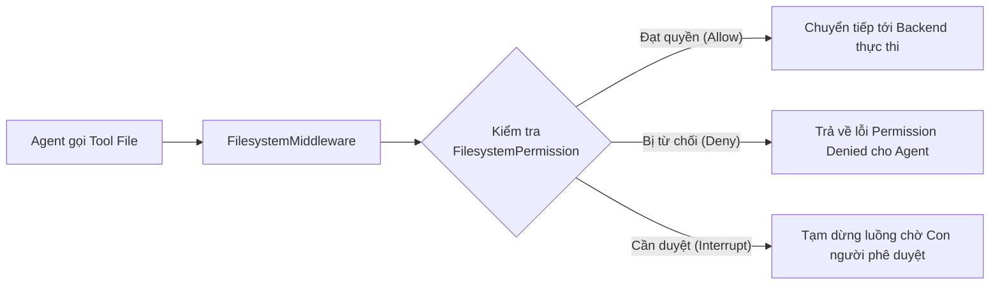
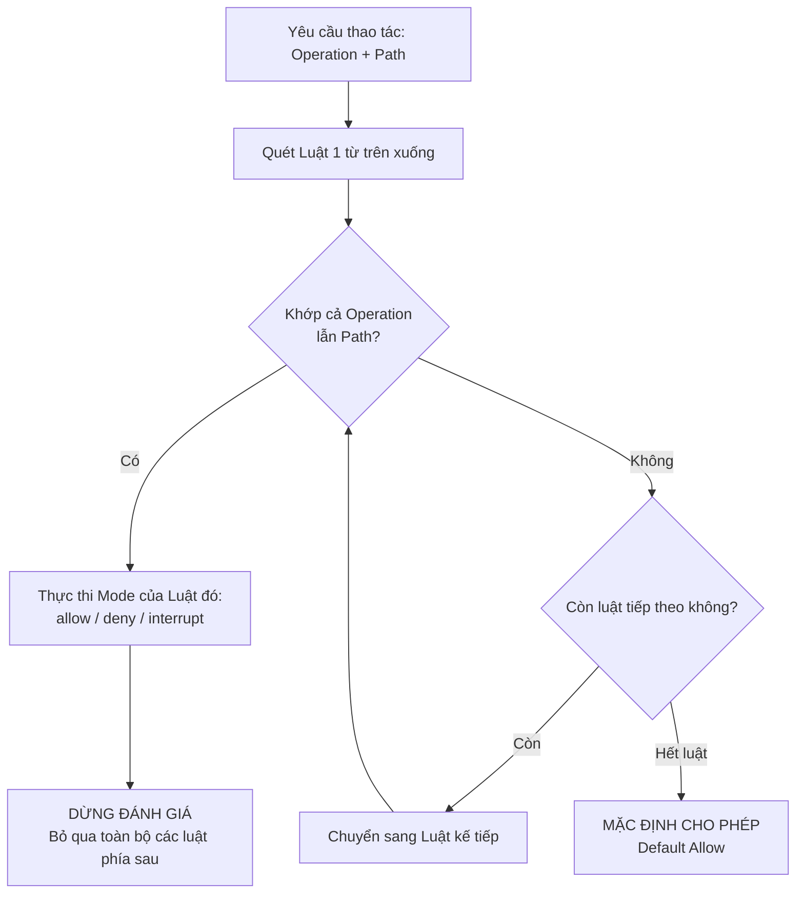

# Chương 11: Phân Quyền Hệ Thống Tệp Tin — Kiểm Soát Ranh Giới Đọc/Ghi Của Agent Bằng Luật Khai Báo (Declarative Rules)

> Hệ thống tệp tin ảo trao cho AI Agent năng lực to lớn: lưu trữ ngữ cảnh dài hạn, ghi nhớ tri thức và tạo ra các sản phẩm thực tế. Nhưng đồng thời, nó cũng mang lại những **tác dụng phụ thực tế (real side-effects)** vào môi trường hệ thống. 
> 
> Một cấu hình phân quyền an toàn cần phải trả lời rõ ràng ba câu hỏi: 
> 1. Agent **được phép thực hiện thao tác nào** (`read` hay `write`)?
> 2. Agent **được phép tác động vào đường dẫn nào** (thư mục nào bị cấm, tệp tin nào được mở)?
> 3. Hành động nào **bắt buộc phải có sự xác nhận của con người** trước khi thực thi?
> 
> Chương này sẽ hướng dẫn bạn làm chủ lớp `FilesystemPermission` trong Deep Agents — giải pháp thiết lập ranh giới an toàn bằng các **luật khai báo (declarative rules)** có thể kiểm toán, minh bạch và chặt chẽ.

---

## Điều Kiện Phiên Bản Và Kiến Thức Tiền Đề

Cơ chế phân quyền hệ thống tệp tin yêu cầu phiên bản Deep Agents tối thiểu:
* **Chế độ `allow` / `deny` cơ bản:** Yêu cầu `deepagents>=0.5.2`
* **Chế độ `interrupt` (kiểm duyệt con người):** Yêu cầu `deepagents>=0.6.8`

> [!NOTE]
> * Nếu bạn chưa quen thuộc với khái niệm **Backend** và đường dẫn ảo, vui lòng đọc lại [Chương 3: Hệ thống tệp tin ảo (Virtual File System)](file:///home/lai/Documents/divein-ai-agent/guideline/05_virtual_filesystem.md).
> * Nếu cần nắm vững chu trình tạm dừng và phục hồi trạng thái hội thoại, hãy tham khảo [Chương 9: Human-in-the-Loop](file:///home/lai/Documents/divein-ai-agent/guideline/11_human_in_the_loop.md).

---

## 1. Đối Tượng Kiểm Soát Của Hệ Thống Phân Quyền Là Gì?

Khi bạn khởi tạo Agent bằng `create_deep_agent()`, framework sẽ tự động kích hoạt `FilesystemMiddleware` để tiêm các công cụ tệp tin có sẵn vào danh sách Tool của mô hình. 

Khi bạn truyền tham số `permissions=[...]`, Middleware này sẽ đánh chặn và kiểm tra quyền hạn **ngay trước khi lệnh gọi được chuyển tiếp tới Storage Backend**:



### Hai Nhóm Thao Tác Cốt Lõi: `read` và `write`

Toàn bộ các công cụ tệp tin có sẵn của Deep Agents được gom thành hai nhóm thao tác:

| Nhóm thao tác (`operations`) | Các công cụ tích hợp sẵn được bảo vệ | Tác dụng phụ tiềm tàng (Side-effects) |
|---|---|---|
| **`read`** | `ls`, `read_file`, `glob`, `grep` | Rò rỉ cấu trúc thư mục, tên tệp tin nhạy cảm hoặc nội dung bí mật ra ngữ cảnh của mô hình. |
| **`write`** | `write_file`, `edit_file`, `delete` | Tạo mới, sửa đổi nội dung, ghi đè toàn bộ hoặc xóa vĩnh viễn tệp tin/thư mục. |

> [!IMPORTANT]
> ### Hành vi trong Deep Agents v0.7:
> 1. **`write_file` có thể ghi đè toàn bộ:** Công cụ `write_file` trong chuẩn mới cho phép ghi đè hoàn toàn một tệp tin đã tồn tại. Do đó, nhóm thao tác `write` cùng lúc bảo vệ cả hành động "tạo mới" lẫn "ghi đè toàn bộ tệp".
> 2. **Xóa thư mục là "Tất cả hoặc không có gì" (All-or-Nothing):** Khi Agent thực hiện xóa một thư mục, hệ thống sẽ duyệt qua toàn bộ các tệp con cháu (descendants) bên trong. Chỉ cần **duy nhất một tệp con** nằm trong diện bị cấm (`deny`), toàn bộ thao tác xóa thư mục sẽ bị hủy bỏ ngay lập tức, tuyệt đối không để lại trạng thái "xóa dở dang".

> [!WARNING]
> ### Chú ý nâng cấp Middleware trong v0.7:
> Deep Agents v0.7 cho phép thay thế Middleware cùng tên tại chỗ (in-place replacement). Nếu bạn tự định nghĩa một `FilesystemMiddleware` tùy chỉnh, nó sẽ **thay thế hoàn toàn** Middleware mặc định chứ không tự động hợp nhất (merge) tham số `permissions=` ở cấp cao nhất. Hãy luôn viết unit test kiểm tra lại quyền sau khi tùy biến Middleware!

### Cấu Hình Tối Thiểu: Thiết Lập Chế Độ "Chỉ Đọc" (Read-Only)

Để tạo một Agent chỉ có quyền tra cứu tài liệu mà không được phép thay đổi bất kỳ tệp tin nào, bạn chỉ cần một luật đơn giản từ chối toàn bộ thao tác `write`:

```python
from deepagents import FilesystemPermission, create_deep_agent

agent = create_deep_agent(
    model=model,
    backend=backend,
    permissions=[
        FilesystemPermission(
            operations=["write"],
            paths=["/**"],
            mode="deny",
        ),
    ],
)
```

Luật này không hạn chế quyền đọc. Agent vẫn thoải mái sử dụng `ls`, `read_file`, `glob` và `grep` để thu thập dữ liệu, nhưng mọi nỗ lực gọi `write_file`, `edit_file` hay `delete` đều sẽ bị chặn đứng ngay lập tức.

---

### Phân Biệt Quan Trọng: `FilesystemPermission` Không Phải Là Sandbox Toàn Năng!

`FilesystemPermission` chỉ áp dụng cho **các công cụ tệp tin tích hợp sẵn (built-in file tools)** của Deep Agents. Các "cửa ngõ" sau đây hoàn toàn **nằm ngoài phạm vi bảo vệ** của lớp này:

| Lối vào hành động (Entrypoint) | Có chịu sự kiểm soát của `FilesystemPermission` không? | Giải pháp kiểm soát tương ứng bắt buộc phải dùng |
|---|:---:|---|
| **Công cụ tệp tin tích hợp sẵn** | **CÓ** | Dùng cấu hình `permissions=` |
| **Công cụ LangChain tự định nghĩa** (Custom Tools) | **KHÔNG** | Tự viết mã kiểm tra trong tool, sử dụng `interrupt_on` hoặc Middleware |
| **Công cụ từ MCP Server** | **KHÔNG** | Cấu hình phân quyền tại MCP Server, thẩm định tool calls, cô lập tiến trình |
| **Lệnh `execute` trong Sandbox hoặc `LocalShellBackend`** | **KHÔNG** | Cô lập cấp hệ điều hành (Container/VM Sandbox), tường lửa mạng, hạn chế quyền Shell |
| **Quy tắc nghiệp vụ phức tạp của Backend** (kiểm tra hạn ngạch, phân quyền người dùng) | **KHÔNG** | Sử dụng **Policy Hook** hoặc lớp bọc `PolicyWrapper` |

> [!CAUTION]
> Một cấu hình *"Cấm `write_file` vào thư mục `/secrets/`"* hoàn toàn **không ngăn chặn** được việc Agent sử dụng một Custom Tool tải file lên mạng, hoặc dùng lệnh Shell `cat /secrets/token.txt` trong Sandbox! Muốn bảo mật toàn diện, bạn phải kiểm soát riêng biệt từng lối vào.

---

## 2. Ba Trường Cấu Hình Của Một Luật `FilesystemPermission`

Mỗi một đối tượng `FilesystemPermission` được định nghĩa chính xác qua ba thuộc tính:

| Trường (Field) | Các giá trị hợp lệ | Ý nghĩa và chức năng |
|---|---|---|
| **`operations`** | Danh sách gồm `"read"`, `"write"` (hoặc cả hai `["read", "write"]`) | Xác định nhóm thao tác tệp tin mà luật này sẽ đánh chặn. |
| **`paths`** | Danh sách các chuỗi mẫu đường dẫn Glob (Glob patterns) | Xác định phạm vi các đường dẫn tệp tin ảo mà luật này áp dụng. |
| **`mode`** | `"allow"`, `"deny"`, `"interrupt"` | Hành động thực thi khi khớp luật: Cho phép, Từ chối, hoặc Tạm dừng chờ con người phê duyệt. |

### Cú Pháp Khai Báo Đường Dẫn (Glob Pattern)

Thuộc tính `paths` hỗ trợ đầy đủ cú pháp Glob nâng cao:
* `**`: Khớp đệ quy mọi cấp thư mục con (ví dụ: `/workspace/**` khớp `/workspace/a.py` và `/workspace/sub/dir/b.py`).
* `{a,b}`: Khớp luân phiên một trong các mẫu (ví dụ: `/shared/{docs,templates}/**`).

```python
FilesystemPermission(
    operations=["read", "write"],
    paths=["/workspace/**", "/shared/{docs,templates}/**"],
    mode="allow",
)
```

> [!NOTE]
> ### Đường dẫn ảo (Virtual Path) vs. Đường dẫn thực tế (Host Path):
> Luật phân quyền luôn so khớp trên **đường dẫn ảo của Backend mà Agent nhìn thấy**, chứ không phải đường dẫn vật lý trên máy chủ của bạn.
> 
> Ví dụ: Khi bạn cấu hình `FilesystemBackend(root_dir="/srv/secure_project")`, Agent sẽ nhìn thấy đường dẫn gốc là `/`. Khi Agent truy cập `/src/main.py`, luật phân quyền sẽ kiểm tra chuỗi `"/src/main.py"`, dù trên máy chủ tệp tin thực sự nằm ở `"/srv/secure_project/src/main.py"`.

---

## 3. Mô Hình Đánh Giá Luật: "Khớp Đầu Tiên Là Thắng" (First-Match-Wins)

Deep Agents đánh giá danh sách `permissions` theo thứ tự khai báo từ trên xuống dưới, tuân theo nguyên tắc **First-Match-Wins (Khớp đầu tiên là có hiệu lực ngay)**:




### Bẫy Ngầm Nguy Hiểm Nhất: "Mặc Định Cho Phép" (Default Allow)

> [!CAUTION]
> **Điểm cần đặc biệt lưu ý:** Nếu một thao tác tệp tin **không khớp với bất kỳ luật nào** trong danh sách `permissions`, hành vi mặc định của hệ thống là **CHO PHÉP (ALLOW)**!
> 
> Rất nhiều lập trình viên mắc sai lầm nghiêm trọng khi chỉ viết duy nhất một luật:
> ```python
> # ❌ SAI LẦM NGUY HIỂM: Nghĩ rằng đây là Whitelist!
> permissions = [
>     FilesystemPermission(operations=["read", "write"], paths=["/workspace/**"], mode="allow"),
> ]
> ```
> Cấu hình trên **KHÔNG HỀ** tạo ra một White-list. Khi Agent đọc `/etc/passwd` hoặc ghi vào `/var/data.txt`, vì đường dẫn này không khớp với `/workspace/**`, hệ thống sẽ rơi vào trạng thái mặc định: **CHO PHÉP THỰC THI**!

---

### Cách Thiết Lập Danh Sách Trắng (Whitelist) Chuẩn Xác

Để xây dựng một Whitelist đúng nghĩa (chỉ cho phép hoạt động trong một thư mục, cấm toàn bộ phần còn lại), bạn **bắt buộc phải bổ sung một luật từ chối toàn cục (`deny /**`) ở cuối cùng**:

```python
# ✅ CẤU HÌNH WHITELIST CHUẨN XÁC
workspace_whitelist = [
    # 1. Cho phép đọc/ghi bên trong thư mục làm việc
    FilesystemPermission(
        operations=["read", "write"],
        paths=["/workspace/**"],
        mode="allow",
    ),
    # 2. BẮT BUỘC: Luật chốt chặn từ chối toàn bộ các đường dẫn còn lại
    FilesystemPermission(
        operations=["read", "write"],
        paths=["/**"],
        mode="deny",
    ),
]
```

*Nếu bạn đổi vị trí của hai luật trên, luật `/**` sẽ khớp trước và chặn đứng mọi thao tác, khiến luật `/workspace/**` không bao giờ có cơ hội chạy.*

---

### Thứ Tự Vàng Khi Thiết Kế Luật: "Cụ Thể Trước, Bao Quát Sau"

Hãy luôn sắp xếp danh sách `permissions` theo 3 tầng thứ tự bất biến:

1. **Tầng 1 (Cụ thể nhất):** Chặn các tệp tin/thư mục nhạy cảm bên trong vùng làm việc.
2. **Tầng 2 (Nghiệp vụ):** Mở quyền cho các thư mục nghiệp vụ được phép truy cập.
3. **Tầng 3 (Bao quát nhất):** Luật chốt chặn từ chối toàn bộ phần còn lại.

```python
protected_workspace = [
    # 1. TẦNG CỤ THỂ: Cấm sờ vào tệp chứa bí mật và thư mục mã nguồn mẫu
    FilesystemPermission(
        operations=["read", "write"],
        paths=["/workspace/.env", "/workspace/examples/**"],
        mode="deny",
    ),
    
    # 2. TẦNG NGHIỆP VỤ: Cho phép Agent toàn quyền làm việc trong workspace
    FilesystemPermission(
        operations=["read", "write"],
        paths=["/workspace/**"],
        mode="allow",
    ),
    
    # 3. TẦNG CHỐT CHẶN: Cấm tuyệt đối mọi truy cập ngoài workspace
    FilesystemPermission(
        operations=["read", "write"],
        paths=["/**"],
        mode="deny",
    ),
]
```

---

## 4. Bốn Chiến Lược Phân Quyền Kinh Điển Trong Thực Tế

### Chiến Lược 1: Toàn Bộ Hệ Thống Tệp Tin "Chỉ Đọc" (Full Read-Only)

Áp dụng cho các Agent làm nhiệm vụ nghiên cứu, đọc hiểu mã nguồn (Code Auditor), phân tích dữ liệu hoặc tra cứu thông tin mà không được phép tạo ra bất kỳ tác dụng phụ nào trên đĩa:

```python
read_only_policy = [
    FilesystemPermission(
        operations=["write"],
        paths=["/**"],
        mode="deny",
    ),
]
```

---

### Chiến Lược 2: Giới Hạn Cứng Trong Thư Mục Làm Việc (Workspace Isolation)

Áp dụng cho các trợ lý lập trình (Coding Assistants) hoặc tác vụ làm việc với một dự án độc lập, ngăn ngừa việc ghi đè hoặc đọc trộm tệp tin ngoài phạm vi:

```python
workspace_only_policy = [
    FilesystemPermission(
        operations=["read", "write"],
        paths=["/workspace/**"],
        mode="allow",
    ),
    FilesystemPermission(
        operations=["read", "write"],
        paths=["/**"],
        mode="deny",
    ),
]
```

---

### Chiến Lược 3: Tri Thức Dùng Chung "Chỉ Đọc", Ký Ức Người Dùng "Có Thể Ghi"

Khi kết hợp với `CompositeBackend`, bạn có thể định tuyến các đường dẫn ảo tới các Backend lưu trữ khác nhau. Ví dụ: Ký ức người dùng (`/memories/`) được ghi tự do, nhưng quy định của tổ chức (`/policies/`) chỉ được phép đọc:

```python
from deepagents import FilesystemPermission, create_deep_agent
from deepagents.backends import CompositeBackend, StateBackend, StoreBackend

agent = create_deep_agent(
    model=model,
    backend=CompositeBackend(
        default=StateBackend(),
        routes={
            # Ký ức người dùng: Lưu vào StoreBackend theo user identity
            "/memories/": StoreBackend(
                namespace=lambda rt: (rt.server_info.user.identity,),
            ),
            # Chính sách tổ chức: Lưu chung theo org_id
            "/policies/": StoreBackend(
                namespace=lambda rt: (rt.context.org_id,),
            ),
        },
    ),
    permissions=[
        # Cấm Agent tự ý ghi đè hoặc sửa đổi chính sách tổ chức
        FilesystemPermission(
            operations=["write"],
            paths=["/policies/**"],
            mode="deny",
        ),
        # Không cần khai báo /memories/** vì mặc định không khớp sẽ là Allow
    ],
)
```

---

### Chiến Lược 4: Khóa Hoàn Toàn Hệ Thống Tệp Tin (Deny All Filesystem)

Nếu Agent của bạn chỉ thuần túy gọi các API dịch vụ bên ngoài và bạn muốn đảm bảo 100% Agent không tiêu tốn token để gọi công cụ tệp tin:

```python
deny_all_policy = [
    FilesystemPermission(
        operations=["read", "write"],
        paths=["/**"],
        mode="deny",
    ),
]
```

> [!NOTE]
> Chiến lược này **không ẩn** công cụ file khỏi danh sách tool của LLM, mà sẽ trả về lỗi quyền hạn nếu mô hình cố tình gọi. Nếu muốn loại bỏ hoàn toàn công cụ khỏi prompt của mô hình, bạn nên cấu hình lại danh sách `tools` và `middleware`.

---

## 5. Chế Độ `interrupt`: Trao Quyền Kiểm Duyệt Cho Con Người

Thay vì tự động từ chối (`deny`) hoặc tự động cho phép (`allow`), giá trị `mode="interrupt"` sẽ kích hoạt cơ chế **Human-in-the-Loop (HITL)**. Nó cực kỳ lý tưởng cho các đường dẫn nhạy cảm: *"Bình thường được phép ghi, nhưng mỗi lần ghi bắt buộc phải có người duyệt!"*

### Điều Kiện Tiên Quyết: Checkpointer

Khi sử dụng `mode="interrupt"`, bạn **bắt buộc** phải cung cấp một `checkpointer` (ví dụ: `InMemorySaver` hoặc database checkpointer) để LangGraph có thể lưu giữ trạng thái đồ thị và khôi phục lại đúng vị trí đó sau khi con người đưa ra quyết định.

```python
from deepagents import FilesystemPermission, create_deep_agent
from langgraph.checkpoint.memory import InMemorySaver
from langgraph.types import Command

# 1. Khởi tạo Agent với luật interrupt cho thư mục chứa token/secrets
agent = create_deep_agent(
    model=model,
    permissions=[
        FilesystemPermission(
            operations=["write"],
            paths=["/secrets/**"],
            mode="interrupt",  # Tạm dừng chờ phê duyệt khi có hành động ghi vào /secrets/
        ),
    ],
    checkpointer=InMemorySaver(),  # BẮT BUỘC để lưu vết tạm dừng
)

# 2. Cấu hình thread_id định danh phiên làm việc
config = {"configurable": {"thread_id": "permission-review-session-1"}}

# 3. Kích hoạt Agent thực hiện tác vụ nhạy cảm
result = agent.invoke(
    {
        "messages": [
            {
                "role": "user",
                "content": "Hãy lưu thông tin token tạm thời vào tệp /secrets/token.txt",
            }
        ]
    },
    config=config,
    version="v2",
)

# 4. Kiểm tra xem Agent có bị ngắt (interrupted) hay không
if result.interrupts:
    # Trích xuất thông tin hành động mà Agent đang xin phép thực hiện
    request = result.interrupts[0].value["action_requests"][0]
    print(f"🔔 Yêu cầu phê duyệt công cụ: {request['name']}")
    print(f"📝 Tham số đề xuất: {request['args']}")

    # 5. Con người đưa ra quyết định phê duyệt (approve) và tiếp tục thực thi đồ thị
    result = agent.invoke(
        Command(resume={"decisions": [{"type": "approve"}]}),
        config=config,
        version="v2",
    )
    print("✅ Đã hoàn tất sau khi được con người phê duyệt.")
```

### Các Quyết Định Của Con Người

Tương tự như cơ chế HITL tổng thể đã học ở Chương 9, khi bị ngắt bởi `FilesystemPermission`, con người có thể phản hồi 3 loại quyết định:
* **`approve`:** Chấp thuận thực hiện thao tác với tham số nguyên bản.
* **`edit`:** Thay đổi tham số (ví dụ: đổi đường dẫn sang thư mục an toàn khác).
* **`reject`:** Bác bỏ yêu cầu, Agent sẽ nhận được thông báo bị từ chối và tự tìm hướng giải quyết khác.

---

### Quy Tắc Thiết Kế Mẫu Đường Dẫn Cho `interrupt`: Cần Có "Mỏ Neo" (Anchor) Rõ Ràng

Khi dùng `mode="interrupt"`, bạn nên sử dụng các đường dẫn có mỏ neo cố định ở đầu, ví dụ: `/secrets/**` hoặc `/projects/*/secrets/**`.

> [!WARNING]
> Tránh sử dụng các mẫu không có mỏ neo như `/**/secrets/**`. Khi Agent gọi các thao tác quét danh mục hàng loạt như `ls`, `glob`, hoặc `grep`, Middleware sẽ phải đánh giá xem liệu toàn bộ cây tìm kiếm có khả năng chạm vào tệp nhạy cảm hay không. Một mẫu quá chung chung sẽ dẫn tới tình trạng **ngắt quá mức (over-interruption)**, làm phiền người dùng liên tục ngay cả khi Agent chỉ đang tìm kiếm các tệp thông thường.

---

## 6. Phân Quyền Cho Sub-Agents: Mặc Định Kế Thừa, Cấu Hình Tường Minh Sẽ Thay Thế Hoàn Toàn

Quản lý quyền hạn trong kiến trúc đa Agent (Multi-Agent) tuân thủ hai quy tắc rõ ràng:

1. **Mặc định:** Sub-agent sẽ **kế thừa toàn bộ** danh sách `permissions` của Main Agent.
2. **Cấu hình tường minh:** Ngay khi bạn định nghĩa thuộc tính `"permissions"` trong cấu hình của Sub-agent, tập luật mới này sẽ **thay thế hoàn toàn (full replacement)** tập luật của Main Agent, chứ **KHÔNG PHẢI** là phép cộng dồn hay giao thoa (intersection)!

```python
from deepagents import FilesystemPermission, create_deep_agent

agent = create_deep_agent(
    model=model,
    backend=backend,
    # Quyền của Main Agent: Toàn quyền đọc/ghi trong /workspace/
    permissions=[
        FilesystemPermission(
            operations=["read", "write"],
            paths=["/workspace/**"],
            mode="allow",
        ),
        FilesystemPermission(
            operations=["read", "write"],
            paths=["/**"],
            mode="deny",
        ),
    ],
    subagents=[
        {
            "name": "code_auditor",
            "description": "Chuyên gia rà soát mã nguồn (Chỉ đọc)",
            "system_prompt": "Kiểm tra mã nguồn và báo cáo lỗi, tuyệt đối không sửa file.",
            # ĐỊNH NGHĨA RIÊNG -> THAY THẾ TOÀN BỘ QUYỀN CỦA CHA
            "permissions": [
                # 1. Cấm ghi trên toàn bộ hệ thống
                FilesystemPermission(
                    operations=["write"],
                    paths=["/**"],
                    mode="deny",
                ),
                # 2. BẮT BUỘC: Phải tự định nghĩa lại quyền đọc /workspace/
                FilesystemPermission(
                    operations=["read"],
                    paths=["/workspace/**"],
                    mode="allow",
                ),
                # 3. Cấm đọc các vùng còn lại
                FilesystemPermission(
                    operations=["read"],
                    paths=["/**"],
                    mode="deny",
                ),
            ],
        }
    ],
)
```

> [!IMPORTANT]
> Vì cơ chế là **thay thế hoàn toàn**, danh sách quyền của Sub-agent phải là một **hệ thống độc lập khép kín**. Đừng bao giờ chỉ viết mỗi luật cấm ghi (`deny write /**`) vì nghĩ rằng Sub-agent vẫn còn giữ quyền đọc workspace từ Main Agent. Hãy khai báo đầy đủ cả quyền đọc lẫn luật chốt chặn cho Sub-agent!

---

## 7. Ranh Giới Đặc Thù Giữa `CompositeBackend` Và Môi Trường Sandbox

### 1. Luật Phân Quyền Chỉ Áp Dụng Cho Các Tuyến Đường (Routes) Có Thể Kiểm Soát

Khi bạn kết hợp `CompositeBackend` với một Sandbox đóng vai trò là `default` Backend, bạn **chỉ được phép cấu hình quyền tệp tin cho các tuyến đường (routes) cụ thể không phải là sandbox** (ví dụ: route `/memories/` lưu trữ ký ức):

```python
from deepagents import FilesystemPermission, create_deep_agent
from deepagents.backends import CompositeBackend

composite = CompositeBackend(
    default=sandbox_backend,                 # Tuyến mặc định trỏ vào Sandbox
    routes={"/memories/": memories_backend}, # Tuyến cụ thể trỏ vào Storage tĩnh
)

agent = create_deep_agent(
    model=model,
    backend=composite,
    permissions=[
        # HỢP LỆ: Tuyến /memories/ nằm trong tầm kiểm soát tĩnh
        FilesystemPermission(
            operations=["write"],
            paths=["/memories/**"],
            mode="deny",
        ),
    ],
)
```

> [!CAUTION]
> Nếu bạn cố tình viết luật `FilesystemPermission` cho các đường dẫn thuộc về tuyến mặc định của Sandbox (ví dụ: `paths=["/workspace/**"]` hoặc `paths=["/**"]`), hàm `create_deep_agent()` sẽ lập tức ném lỗi **`NotImplementedError`**!
> 
> **Lý do thiết kế:** Sandbox cung cấp công cụ `execute` để chạy lệnh Shell tự do. Nếu Deep Agents cho phép bạn cấu hình `FilesystemPermission` trên Sandbox, bạn sẽ bị rơi vào một **ảo tưởng an toàn (false sense of security)** rằng tệp tin trong sandbox đã được bảo vệ, trong khi thực tế Agent có thể dùng một lệnh bash `rm` hoặc `cat` để qua mặt hoàn toàn bộ lọc!

### 2. Sơ Đồ Toàn Cảnh Về Ranh Giới Kiểm Soát Và Các "Lối Đi Tắt" (Bypasses)


Hãy luôn ghi nhớ:
* `FilesystemPermission` kiểm soát **công cụ tệp tin có sẵn**.
* Sandbox kiểm soát **tiến trình hệ điều hành, lệnh Shell và mạng**.
* Cả hai phải được phối hợp chặt chẽ, không cái nào có thể thay thế cái nào.

---

## 8. Khi Nào Cần Nâng Cấp Lên Custom Policy? Triển Khai Policy Hook & PolicyWrapper

Luật khai báo `FilesystemPermission` rất xuất sắc trong việc trả lời câu hỏi tĩnh: *"Thao tác này trên đường dẫn này có được phép không?"*. 

Nhưng trong các hệ thống doanh nghiệp thực tế, bạn sẽ gặp những yêu cầu nghiệp vụ phức tạp hơn nhiều:
* *"Mỗi phút Agent chỉ được phép ghi tệp tối đa 20 lần (Rate Limiting)?"*
* *"Trước khi ghi tệp, phải quét xem nội dung có chứa thẻ tín dụng, số CCCD hay secret key không?"*
* *"Chỉ người dùng có vai trò Admin mới được ghi vào thư mục `/releases/`?"*
* *"Cần ghi log kiểm toán (Audit Trail) chi tiết vào cơ sở dữ liệu doanh nghiệp mỗi khi Agent đọc tệp?"*

Khi đó, bạn cần sử dụng **Policy Hook**.

### Bản Chất Của Policy Hook

> [!NOTE]
> Trong tài liệu của Deep Agents, **Policy Hook** không phải là một tham số bạn có thể truyền thẳng vào `create_deep_agent(policy_hook=...)`. 
> 
> Nó đại diện cho một **Mô thức kiến trúc (Design Pattern)** ở tầng Backend: Can thiệp và kiểm tra logic nghiệp vụ ngay trước khi dữ liệu được chuyển tới Backend lưu trữ thật sự.

```
Lệnh gọi Tool của Agent
   │
   ▼
[1] FilesystemPermission (Kiểm tra tĩnh: Thao tác & Đường dẫn)
   │
   ▼ (Nếu hợp lệ)
[2] Policy Hook / PolicyWrapper (Kiểm tra động: Nội dung, Hạn mức, Định danh)
   │
   ▼ (Nếu hợp lệ)
[3] Storage Backend thực tế (Lưu dữ liệu vào RAM, Đĩa hoặc Database)
```

---

### Hai Phương Pháp Triển Khai Policy Hook

| Phương pháp | Kịch bản sử dụng phù hợp | Đánh đổi kỹ thuật |
|---|---|---|
| **1. Kế thừa Backend cụ thể (`GuardedBackend`)** | Khi hệ thống chỉ dùng duy nhất một loại Backend (ví dụ `FilesystemBackend`) và muốn tái sử dụng trực tiếp các phương thức của nó. | Chính sách bị gắn chặt (tightly-coupled) với một lớp Backend duy nhất. |
| **2. Bao bọc giao diện (`PolicyWrapper`)** | Khi chính sách cần tái sử dụng linh hoạt xuyên suốt nhiều loại Backend khác nhau (`StateBackend`, `StoreBackend`, `FilesystemBackend`). | Phải triển khai đầy đủ và chuyển tiếp (forward) toàn bộ các phương thức của giao diện `BackendProtocol`. |

---

### Triển Khai Mẫu 1: `GuardedBackend` (Kế Thừa `FilesystemBackend`)

```python
from deepagents.backends.filesystem import FilesystemBackend
from deepagents.backends.protocol import EditResult, WriteResult

class GuardedBackend(FilesystemBackend):
    def __init__(self, *, deny_prefixes: list[str], **kwargs):
        super().__init__(**kwargs)
        # Chuẩn hóa tiền tố luôn có dấu gạch chéo ở cuối để tránh bắt nhầm
        self.deny_prefixes = [
            p if p.endswith("/") else p + "/" 
            for p in deny_prefixes
        ]

    def _is_denied(self, path: str) -> bool:
        return any(path.startswith(prefix) for prefix in self.deny_prefixes)

    def write(self, file_path: str, content: str) -> WriteResult:
        if self._is_denied(file_path):
            # Trả về đối tượng kết quả chứa trường error, KHÔNG ném Exception
            return WriteResult(error=f"Chính sách bảo mật: Cấm ghi vào đường dẫn {file_path}")
        return super().write(file_path, content)

    def edit(
        self,
        file_path: str,
        old_string: str,
        new_string: str,
        replace_all: bool = False,
    ) -> EditResult:
        if self._is_denied(file_path):
            return EditResult(error=f"Chính sách bảo mật: Cấm chỉnh sửa đường dẫn {file_path}")
        return super().edit(file_path, old_string, new_string, replace_all)

# Khởi tạo Backend có chốt chặn bảo vệ
backend = GuardedBackend(
    root_dir="/srv/agent-workspace",
    virtual_mode=True,
    deny_prefixes=["/policies"],
)
```

---

### Triển Khai Mẫu 2: `PolicyWrapper` (Lớp Bọc Đa Năng Cho Mọi Backend)

`PolicyWrapper` là giải pháp kiến trúc chuẩn mực nhất. Nó nhận một `inner` Backend bất kỳ và bổ sung lớp bảo vệ mà không làm biến đổi bản chất của Backend gốc:

```python
from deepagents.backends.protocol import (
    BackendProtocol,
    EditResult,
    GlobResult,
    GrepResult,
    LsResult,
    ReadResult,
    WriteResult,
)

class PolicyWrapper(BackendProtocol):
    def __init__(
        self,
        inner: BackendProtocol,
        deny_prefixes: list[str] | None = None,
    ):
        self.inner = inner
        self.deny_prefixes = [
            p if p.endswith("/") else p + "/" 
            for p in (deny_prefixes or [])
        ]

    def _is_denied(self, path: str) -> bool:
        return any(path.startswith(prefix) for prefix in self.deny_prefixes)

    # 1. Các phương thức đọc: Giữ nguyên hành vi, chuyển tiếp trực tiếp tới inner
    def ls(self, path: str) -> LsResult:
        return self.inner.ls(path)

    def read(self, file_path: str, offset: int = 0, limit: int = 2000) -> ReadResult:
        return self.inner.read(file_path, offset=offset, limit=limit)

    def grep(self, pattern: str, path: str | None = None, glob: str | None = None) -> GrepResult:
        return self.inner.grep(pattern, path, glob)

    def glob(self, pattern: str, path: str | None = None) -> GlobResult:
        return self.inner.glob(pattern, path)

    # 2. Các phương thức ghi: Đánh chặn kiểm tra chính sách trước khi chuyển tiếp
    def write(self, file_path: str, content: str) -> WriteResult:
        # Ở đây bạn có thể mở rộng: kiểm tra độ dài nội dung, quét secret, kiểm tra quota
        if self._is_denied(file_path):
            return WriteResult(error=f"PolicyWrapper: Thao tác ghi bị từ chối tại {file_path}")
        return self.inner.write(file_path, content)

    def edit(
        self,
        file_path: str,
        old_string: str,
        new_string: str,
        replace_all: bool = False,
    ) -> EditResult:
        if self._is_denied(file_path):
            return EditResult(error=f"PolicyWrapper: Thao tác sửa bị từ chối tại {file_path}")
        return self.inner.edit(file_path, old_string, new_string, replace_all)
```

> [!TIP]
> ### 4 Điểm mấu chốt trong thiết kế của `PolicyWrapper`:
> 1. **Chuẩn hóa dấu gạch chéo cuối (`/`):** Luôn biến `/policies` thành `/policies/` để tránh việc cấm nhầm một đường dẫn hợp lệ như `/policies-archive/data.txt`.
> 2. **Điểm can thiệp tập trung (`_is_denied`):** Giúp bạn dễ dàng cắm thêm các logic phức tạp (gọi Redis kiểm tra Rate Limit, gọi API phân quyền OAuth2) tại một vị trí duy nhất.
> 3. **Chỉ can thiệp thao tác cần quản lý:** Các hàm đọc (`ls`, `read`, `glob`, `grep`) được chuyển tiếp thẳng, không gây suy giảm hiệu năng.
> 4. **Bắt buộc tuân thủ giao thức trả về:** Phải trả về `WriteResult(error=...)` hoặc `EditResult(error=...)` khi từ chối, giúp Agent nhận diện được lỗi một cách có cấu trúc để tự động điều chỉnh hành vi.

---

### Bảng Hướng Dẫn Lựa Chọn Cơ Chế Bảo Vệ Phù Hợp

| Nhu cầu nghiệp vụ cụ thể | Cơ chế đề xuất nên sử dụng |
|---|---|
| Cấm hoàn toàn hành động ghi vào `/policies/**` | `FilesystemPermission(operations=["write"], paths=["/policies/**"], mode="deny")` |
| Yêu cầu con người bấm nút duyệt trước khi ghi vào `/releases/**` | `FilesystemPermission(operations=["write"], paths=["/releases/**"], mode="interrupt")` |
| Giới hạn tần suất: Mỗi phút Agent chỉ được ghi 20 lần | **Policy Hook** hoặc Middleware đếm lượt |
| Quét nội dung tệp tin để phát hiện rò rỉ mã bí mật (Secret Scanning) | `PolicyWrapper` hoặc Middleware xử lý chuỗi |
| Ghi log kiểm toán (Audit Log) cho từng thao tác đọc/ghi | `PolicyWrapper` ghi log vào Database |
| Kiểm soát quyền truy cập của Custom Tool hoặc MCP Tool | Thiết lập bảo vệ ngay trong chính Custom Tool + `interrupt_on` |
| Kiểm soát câu lệnh Shell và truy cập Internet | Môi trường **Sandbox** cô lập |

---

## 9. Danh Sách Kiểm Tra (Checklist) Thẩm Định Quyền Hạn Trước Khi Lên Production

Phân quyền là ranh giới an ninh sống còn. Bạn **không bao giờ được phép** chỉ kiểm tra xem *"đường dẫn hợp lệ có chạy thành công hay không"*, mà bắt buộc phải chạy bộ kiểm thử toàn diện với 12 kịch bản sau:

| STT | Kịch bản kiểm thử (Test Scenario) | Cam kết an ninh cần chứng minh |
|:---:|---|---|
| **1** | Đọc/Ghi trên đường dẫn được phép | Đảm bảo luồng nghiệp vụ thông thường diễn ra trơn tru, không bị chặn nhầm. |
| **2** | Đọc thử tệp tin nhạy cảm (`.env`, `token.txt`) | Đảm bảo luật `read deny` hoạt động và không để lộ nội dung. |
| **3** | Ghi, sửa, xóa trên đường dẫn nhạy cảm | Đảm bảo cả ba công cụ `write_file`, `edit_file`, `delete` đều bị chặn bởi nhóm `write`. |
| **4** | Ghi đè lên một tệp tin đã tồn tại (`write_file`) | Đảm bảo cơ chế ghi đè của v0.7 vẫn bị kiểm soát bởi luật `write`. |
| **5** | **Truy cập một đường dẫn hoàn toàn ngẫu nhiên ngoài workspace** | **QUAN TRỌNG:** Chứng minh luật chốt chặn cuối cùng (`deny /**`) thực sự hoạt động, tránh bẫy Whitelist ảo. |
| **6** | Hoán đổi thứ tự các luật phân quyền | Đảm bảo luật từ chối cụ thể không bao giờ bị che khuất bởi luật cho phép bao quát. |
| **7** | Xóa thư mục chứa tệp con được bảo vệ | Đảm bảo tính chất "All-or-Nothing", không để lại trạng thái thư mục bị xóa một nửa. |
| **8** | Chạy `grep` hoặc `glob` trên cây thư mục lớn | Đảm bảo không rò rỉ đường dẫn bị cấm và cờ `truncated=True` được xử lý đúng. |
| **9** | Kiểm tra quyền của Sub-agent trên cùng đường dẫn | Đảm bảo hành vi kế thừa hoặc thay thế quyền của Sub-agent hoạt động chính xác. |
| **10** | Phê duyệt, Chỉnh sửa và Từ chối trong chế độ `interrupt` | Đảm bảo chu trình tạm dừng và khôi phục hoạt động đồng nhất trên cùng một `thread_id`. |
| **11** | Kiểm tra cả hai nhánh Cho phép/Từ chối của Policy Hook | Đảm bảo điều kiện động không chặn nhầm luồng chuẩn và không thể bị vượt mặt. |
| **12** | Thử nghiệm các lối đi tắt (Custom Tool, MCP, Shell `execute`) | Đảm bảo mỗi lối vào đều đã có lớp kiểm soát độc lập tương ứng. |

---

## 10. Bảng Ma Trận Phối Hợp Kỹ Thuật

`FilesystemPermission` không đứng độc lập mà hòa quyện chặt chẽ với toàn bộ các tính năng khác của Deep Agents:

| Tính năng kết hợp | Cách thức tương tác và phối hợp |
|---|---|
| **Hệ thống tệp ảo (Virtual Filesystem)** | Backend quyết định tệp tin được lưu ở đâu; `FilesystemPermission` quyết định Agent được tác động vào đâu. |
| **Hệ thống Middleware** | `FilesystemMiddleware` đóng vai trò là trạm gác cổng, thực thi luật quyền hạn trước khi lệnh tới Backend. |
| **Sub-agents** | Sub-agent mặc định thừa hưởng quyền của cha; có thể định nghĩa lại để tạo các Agent chuyên biệt có quyền hạn hẹp hơn (ví dụ Agent chuyên đọc). |
| **Agent Skills** | Cho phép Agent đọc các thư mục kỹ năng dùng chung (`/skills/**`) nhưng cấm tuyệt đối hành động sửa đổi tệp `SKILL.md`. |
| **Ký ức dài hạn (Long-term Memory)** | Ký ức riêng của người dùng được phép ghi đè (`/memories/**`), nhưng quy định chung của công ty chỉ được đọc (`/policies/**`). |
| **Human-in-the-Loop (HITL)** | Chế độ `interrupt` kết hợp hoàn hảo với hệ thống phê duyệt của con người, dùng chung một giao thức `Command(resume=...)`. |
| **Môi trường Sandbox** | Phân quyền bảo vệ các công cụ tệp tin có sẵn; Sandbox bảo vệ tầng hệ điều hành, tiến trình và kết nối mạng. |

---

## Tổng Kết Chương

* **Ranh giới bảo vệ rõ ràng:** `FilesystemPermission` chỉ bảo vệ các công cụ file tích hợp sẵn. Muốn an toàn trước Custom Tools, MCP và Shell `execute`, bạn phải thiết lập các chốt chặn độc lập tại từng lối vào.
* **Nhóm thao tác chuẩn hóa:** Nhóm `read` bao gồm `ls`, `read_file`, `glob`, `grep`; nhóm `write` bao gồm `write_file`, `edit_file`, `delete`. Xóa thư mục luôn tuân thủ nguyên tắc All-or-Nothing.
* **Quy tắc vàng First-Match-Wins:** Hệ thống dừng lại ngay ở luật đầu tiên khớp. **Nếu không khớp luật nào, mặc định là CHO PHÉP (ALLOW)**. Do đó, một Whitelist chuẩn luôn bắt buộc phải có luật `deny /**` nằm ở cuối cùng!
* **Chế độ `interrupt` an toàn:** Đưa con người vào vòng lặp kiểm duyệt các hành động ghi nhạy cảm, yêu cầu phải có `checkpointer` và mỏ neo đường dẫn rõ ràng.
* **Sub-agent thay thế toàn bộ:** Khi khai báo `permissions` cho Sub-agent, nó sẽ thay thế hoàn toàn quyền của Main Agent. Bạn phải xây dựng một tập luật khép kín độc lập cho Sub-agent.
* **Nâng cấp linh hoạt với Policy Hook:** Sử dụng `PolicyWrapper` khi cần đánh giá các điều kiện động như Rate Limit, kiểm tra rò rỉ mã bí mật trong nội dung tệp tin, hoặc ghi log kiểm toán doanh nghiệp.

---

## Tài Liệu Tham Khảo Chính Thức

* [Tài liệu Deep Agents Permissions](https://docs.langchain.com/oss/python/deepagents/permissions)
* [Tài liệu Deep Agents Storage Backends](https://docs.langchain.com/oss/python/deepagents/backends)
* [Deep Agents Backends: Bổ sung Policy Hooks](https://docs.langchain.com/oss/python/deepagents/backends#add-policy-hooks)
* [Tài liệu Deep Agents Human-in-the-Loop](https://docs.langchain.com/oss/python/deepagents/human-in-the-loop)
* [Tài liệu Deep Agents Subagents](https://docs.langchain.com/oss/python/deepagents/subagents)
* [Tài liệu Deep Agents Memory](https://docs.langchain.com/oss/python/deepagents/memory)
* [Tài liệu Deep Agents Sandboxes](https://docs.langchain.com/oss/python/deepagents/sandboxes)
* [Tra cứu API FilesystemPermission](https://reference.langchain.com/python/deepagents/middleware/permissions/FilesystemPermission)
