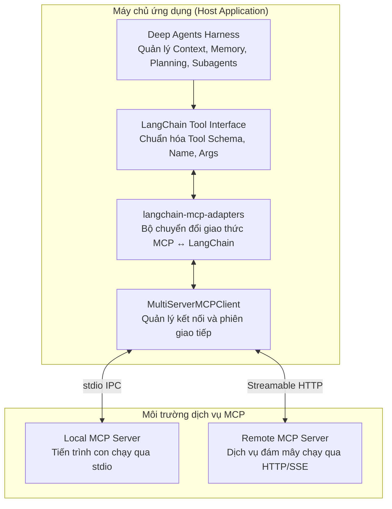
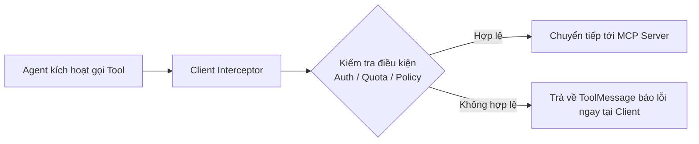

# Chương 12: MCP (Model Context Protocol) — Mở Rộng Hệ Sinh Thái Công Cụ Cho Deep Agents Bằng Chuẩn Mở

> Tạo ra các công cụ tùy biến (Custom Tools) rất phù hợp khi hệ thống chỉ cần một vài năng lực nghiệp vụ nhỏ và cố định. Nhưng khi AI Agent phải kết nối với hàng chục cơ sở dữ liệu phân tán, kho lưu trữ đám mây, hệ thống CRM và các dịch vụ bên ngoài, việc tự viết và duy trì từng đoạn mã chuyển đổi (adapter) sẽ nhanh chóng trở thành một "cơn ác mộng" bảo trì.
> 
> **Model Context Protocol (MCP)** — giao thức chuẩn mở do Anthropic khởi xướng — sinh ra để giải quyết triệt để bài toán này. MCP thiết lập một ranh giới giao tiếp thống nhất: máy chủ dịch vụ (MCP Server) chỉ cần phát hành công cụ theo một chuẩn chung, còn ứng dụng Agent (MCP Client) có thể tự động khám phá, chuyển đổi và đưa vào sử dụng mà không cần viết lại mã nguồn.
> 
> Chương này sẽ hướng dẫn bạn làm chủ quy trình tích hợp MCP vào Deep Agents từ đầu đến cuối: từ việc xây dựng một MCP Server cục bộ, kiểm thử chuỗi kết nối không cần tiêu tốn API Key, tích hợp vào vòng lặp suy luận của Agent, cho đến việc thiết lập ranh giới an toàn đa tầng (HITL, Interceptor, cô lập tiến trình và bảo vệ Sub-agent).

---

## Lộ Trình Thực Hành Từng Bước Trong Chương

Để đảm bảo việc tích hợp diễn ra mượt mà và dễ dàng khoanh vùng lỗi, chúng ta sẽ đi qua chuỗi xác minh 5 bước:

1. **Khởi tạo MCP Server cục bộ:** Viết một máy chủ tính toán đơn giản bằng thư viện `FastMCP` cung cấp hai công cụ `add` và `multiply`.
2. **Kiểm thử Smoke Test không dùng mô hình (Zero-Model Verification):** Xác thực việc khám phá công cụ (Tool Discovery), chuyển đổi Schema và gọi hàm thực tế qua giao thức MCP mà không cần đến API Key của LLM.
3. **Bàn giao công cụ MCP cho Deep Agent:** Truyền danh sách công cụ đã chuyển đổi vào `create_deep_agent(tools=...)` để mô hình tự động phối hợp giải quyết bài toán phức tạp.
4. **Làm chủ hạ tầng nâng cao:** Quản lý kết nối nhiều Server (Multi-Server), giao thức Streamable HTTP, xử lý phân biệt giữa phiên không trạng thái (Stateless) và phiên duy trì (Persistent Session), cùng cách đọc Resources và Prompts.
5. **Thiết lập ranh giới an toàn toàn diện:** Bổ sung tiền tố chống xung đột tên, cài đặt trạm duyệt Human-in-the-Loop (HITL), kiểm soát phân quyền cho Sub-agent và cô lập an toàn tiến trình `stdio`.

> [!NOTE]
> **Yêu cầu phiên bản môi trường:**
> Nội dung chương này tương thích với: Python 3.11+, `deepagents>=0.7,<0.8`, `langchain-mcp-adapters>=0.3,<0.4`, và `mcp>=1.28,<2`.

---

## 1. Vị Trí Của MCP Trong Kiến Trúc Deep Agents

Nhiều kỹ sư thường nhầm lẫn rằng MCP là một đối thủ cạnh tranh với Deep Agents hoặc là một dạng Storage Backend mới. Thực tế, **MCP không thay thế Deep Agents**, mà hai thành phần này hoạt động ở hai tầng kiến trúc hoàn toàn khác nhau:



### Bảng Phân Tầng Trách Nhiệm Kiến Trúc

| Tầng kiến trúc | Thành phần đảm nhiệm | Trách nhiệm cốt lõi |
|---|---|---|
| **Agent Harness** | `Deep Agents` | Quản lý hệ thống tệp ảo, bộ nhớ dài hạn, phân rã công việc qua Sub-agent, lập kế hoạch Todo list và điều phối vòng lặp suy luận. |
| **Giao diện công cụ Agent** | `LangChain Tool` (`StructuredTool`) | Cung cấp tên công cụ, mô tả nghiệp vụ (description), JSON Schema của tham số đầu vào cho LLM và thực thi lệnh gọi. |
| **Bộ chuyển đổi giao thức** | `langchain-mcp-adapters` | Đóng vai trò cầu nối: Biến đổi các công cụ từ chuẩn MCP sang định dạng `LangChain Tool` mà Deep Agents hiểu được. |
| **MCP Client** | `MultiServerMCPClient` | Duy trì kết nối tới một hoặc nhiều Server, quản lý vòng đời Session, gửi request và nhận kết quả phản hồi. |
| **MCP Server** | Tiến trình cục bộ hoặc dịch vụ Web | Nơi **thực sự chạy logic nghiệp vụ**: Đọc/ghi cơ sở dữ liệu, gọi API thanh toán, quét tệp tin máy chủ. |

### Chu Trình Xử Lý Một Lệnh Gọi Công Cụ MCP

```
Yêu cầu người dùng (User Request)
   │
   ▼
[1] Deep Agent quyết định gọi công cụ để giải quyết bài toán
   │
   ▼
[2] LangChain Tool kiểm tra kiểu dữ liệu tham số (Parameter Validation)
   │
   ▼
[3] MultiServerMCPClient thiết lập Session và gửi RPC Request
   │
   ▼
[4] MCP Server thực thi mã nguồn và trả về kết quả
   │
   ▼
[5] langchain-mcp-adapters chuyển kết quả thành ToolMessage
   │
   ▼
[6] Deep Agent tiếp nhận ToolMessage, tổng hợp câu trả lời cho người dùng
```


> [!IMPORTANT]
> Hàm `create_deep_agent()` **không trực tiếp nhận cấu hình MCP** và cũng không tự quản lý vòng đời của các kết nối mạng. Ứng dụng của bạn sẽ chủ động tải danh sách công cụ thông qua `MultiServerMCPClient`, sau đó chuyển danh sách các `LangChain Tool` thu được vào tham số `tools=` của Agent:
> ```python
> tools = await client.get_tools()
> agent = create_deep_agent(model=model, tools=tools)
> ```

---

### Phân Biệt Ba Năng Lực Của MCP: Tools, Resources Và Prompts

Giao thức MCP định nghĩa 3 loại khả năng (Primitives). Việc phân biệt rõ chúng giúp bạn không nhồi nhét mọi thứ vào danh sách `tools=`:

| Năng lực MCP | Dạng chuyển đổi trong LangChain | Có truyền trực tiếp vào `tools=` không? | Mục đích và kịch bản sử dụng chuẩn |
|---|---|:---:|---|
| **Tools** | `StructuredTool` / `BaseTool` | **CÓ** | Các hành động có tác dụng phụ hoặc truy vấn: Truy vấn SQL, gọi API, tính toán toán học, gửi email. |
| **Resources** | `Blob` (dữ liệu nhị phân / văn bản) | **KHÔNG** | Các dữ liệu thụ động tương tự như tệp tin (File): Tài liệu hướng dẫn, log hệ thống, tệp cấu hình. Ứng dụng sẽ đọc và chủ động nhúng vào ngữ cảnh hoặc ghi vào Virtual Filesystem. |
| **Prompts** | Danh sách tin nhắn (`list[Message]`) | **KHÔNG** | Các mẫu câu lệnh (Prompt Templates) được chuẩn hóa sẵn từ Server, giúp ứng dụng lấy về để làm System Prompt hoặc vài ví dụ mẫu (Few-shot examples). |

---

## 2. Chuẩn Bị Môi Trường Thực Hành

Tạo một thư mục dự án độc lập và cài đặt các gói phụ thuộc tương thích:

```bash
mkdir deepagents-mcp-demo
cd deepagents-mcp-demo

# Khởi tạo môi trường ảo với uv (khuyến nghị)
uv init --bare --python 3.11
uv add --upgrade "deepagents>=0.7,<0.8" "langchain-mcp-adapters>=0.3,<0.4" "mcp>=1.28,<2" langchain-openai

# Hoặc cài đặt bằng pip truyền thống
# python -m venv .venv
# source .venv/bin/activate
# pip install --upgrade "deepagents>=0.7,<0.8" "langchain-mcp-adapters>=0.3,<0.4" "mcp>=1.28,<2" langchain-openai
```

Cấu trúc dự án thực hành gồm 3 tệp tin rõ ràng:

```
deepagents-mcp-demo/
├── math_server.py    # Máy chủ MCP cung cấp công cụ tính toán
├── check_mcp.py      # Script kiểm thử kết nối và chuyển đổi schema (không tốn token)
└── agent.py          # Ứng dụng Deep Agent hoàn chỉnh kết nối LLM
```

---

## 3. Xây Dựng Máy Chủ MCP Cục Bộ Với `FastMCP`

Chúng ta sử dụng lớp `FastMCP` được tích hợp sẵn trong thư viện chính thức `mcp` của Anthropic để tạo một server chuẩn chỉ với vài dòng mã:

Lưu nội dung sau vào tệp **`math_server.py`**:

```python
from mcp.server.fastmcp import FastMCP

# 1. Khởi tạo MCP Server với tên định danh
mcp = FastMCP("Chapter 12 Math Server")

# 2. Đăng ký hàm nghiệp vụ thành công cụ MCP qua decorator @mcp.tool()
@mcp.tool()
def add(a: int, b: int) -> int:
    """Cộng chính xác hai số nguyên."""
    return a + b

@mcp.tool()
def multiply(a: int, b: int) -> int:
    """Nhân chính xác hai số nguyên."""
    return a * b

# 3. Chạy server qua giao thức stdio khi tệp được thực thi trực tiếp
if __name__ == "__main__":
    mcp.run(transport="stdio")
```

### Cách `@mcp.tool()` Ánh Xạ Thông Tin Sang Schema

Ba thành phần trong mã Python sẽ được chuyển đổi trực tiếp sang chuẩn JSON Schema của Tool Calling:

| Khai báo mã Python | Trường thuộc tính trong MCP Tool | Vai trò đối với mô hình LLM |
|---|---|---|
| Tên hàm (ví dụ `add`) | `name` | Tên định danh của công cụ mà mô hình sẽ gọi. |
| Chuỗi tài liệu Docstring (`"""..."""`) | `description` | Chỉ dẫn ngữ nghĩa giúp mô hình hiểu **khi nào nên gọi công cụ này**. |
| Chú thích kiểu dữ liệu (`a: int, b: int`) | `inputSchema` | Quy định cấu trúc tham số, tự động tạo trường `required: ["a", "b"]`. |

> [!WARNING]
> ### Nguyên tắc sống còn với giao thức `stdio`:
> Khi chạy với `transport="stdio"`, Client và Server trao đổi các gói tin JSON-RPC qua hai luồng nhập/xuất tiêu chuẩn (`stdin` và `stdout`).
> 
> Do đó, **tuyệt đối không sử dụng lệnh `print()` để in log gỡ lỗi trong `math_server.py`**! Bất kỳ chuỗi văn bản nào in ra `stdout` sẽ làm hỏng cấu trúc gói tin JSON-RPC và khiến Client báo lỗi phân tích cú pháp (Protocol Parsing Error). Nếu cần ghi log, hãy dùng thư viện `logging` xuất ra `sys.stderr`.

---

## 4. Kiểm Thử Smoke Test Chuỗi Kết Nối (Không Cần API Key)

Một trong những sai lầm thường gặp nhất khi debug Agent là tích hợp tất cả các thành phần (LLM + Prompt + Tool + Mạng) cùng một lúc. Khi Agent không gọi công cụ, bạn sẽ không thể biết nguyên nhân là do mô hình hiểu nhầm, prompt viết kém, hay do giao thức MCP bị lỗi kết nối.

Hãy luôn thực hiện một bài **Smoke Test** độc lập: Kiểm tra việc khởi động server, khám phá công cụ và thực thi lệnh gọi trực tiếp mà không cần đến LLM.

Lưu nội dung sau vào tệp **`check_mcp.py`**:

```python
import asyncio
import sys
from pathlib import Path
from langchain_mcp_adapters.client import MultiServerMCPClient

# Xác định đường dẫn tuyệt đối tới tệp math_server.py
SERVER_PATH = Path(__file__).with_name("math_server.py").resolve()

def extract_schema_dict(tool) -> dict:
    """Trích xuất tham số JSON schema từ LangChain Tool."""
    schema = tool.args_schema
    if isinstance(schema, dict):
        return schema
    return schema.model_json_schema()

def get_first_text_content(result: list[dict]) -> str:
    """Trích xuất chuỗi văn bản từ danh sách content blocks trả về."""
    return next(block["text"] for block in result if block["type"] == "text")

async def main() -> None:
    # 1. Khởi tạo Client cấu hình kết nối tới Server stdio
    client = MultiServerMCPClient(
        {
            "course_math": {
                "transport": "stdio",
                "command": sys.executable,  # Đường dẫn Python đang chạy
                "args": [str(SERVER_PATH)],
            }
        },
        tool_name_prefix=True,  # Bật tiền tố để tránh trùng lặp tên công cụ
    )

    # 2. Khám phá và chuyển đổi toàn bộ công cụ sang LangChain Tools
    tools = await client.get_tools()
    print("📋 Danh sách công cụ tìm thấy:", [tool.name for tool in tools])

    # 3. Kiểm tra công cụ cộng (đã được gắn tiền tố course_math_add)
    add_tool = next(tool for tool in tools if tool.name == "course_math_add")
    schema = extract_schema_dict(add_tool)
    print("📝 Mô tả công cụ:", add_tool.description)
    print("🔑 Các tham số bắt buộc:", schema.get("required", []))

    # 4. Kích hoạt gọi trực tiếp công cụ bằng ainvoke (không qua mô hình)
    print("🚀 Đang gửi lệnh gọi: a=37, b=58...")
    result = await add_tool.ainvoke({"a": 37, "b": 58})
    
    print(f"✅ Kết quả tính toán từ MCP Server: 37 + 58 = {get_first_text_content(result)}")

if __name__ == "__main__":
    asyncio.run(main())
```

Chạy script kiểm tra:

```bash
uv run python check_mcp.py
```

Kết quả đầu ra mong đợi:

```text
📋 Danh sách công cụ tìm thấy: ['course_math_add', 'course_math_multiply']
📝 Mô tả công cụ: Cộng chính xác hai số nguyên.
🔑 Các tham số bắt buộc: ['a', 'b']
🚀 Đang gửi lệnh gọi: a=37, b=58...
✅ Kết quả tính toán từ MCP Server: 37 + 58 = 95
```


### Hai Chi Tiết Kỹ Thuật Quan Trọng Cần Hiểu Sâu:

1. **Tại sao kết quả trả về không phải là một số nguyên trần `95`?**
   Mặc dù hàm `add` trả về `int`, nhưng theo đặc tả của MCP và LangChain Adapter, kết quả luôn được đóng gói dưới dạng danh sách các khối nội dung (Content Blocks):
   ```python
   [{"type": "text", "text": "95", "id": "..."}]
   ```
   Cấu trúc này cho phép một công cụ MCP linh hoạt trả về đồng thời văn bản, hình ảnh biểu đồ hoặc dữ liệu tệp tin đính kèm.

2. **Tại sao BẮT BUỘC phải dùng `ainvoke()` mà không dùng `invoke()`?**
   Bộ chuyển đổi `langchain-mcp-adapters` tạo ra các `StructuredTool` hoạt động thuần túy bất đồng bộ (`coroutine`). Nếu bạn gọi hàm đồng bộ `add_tool.invoke(...)`, chương trình sẽ lập tức ném lỗi:
   ```text
   NotImplementedError: StructuredTool does not support sync invocation.
   ```
   Do đó, toàn bộ chuỗi làm việc với MCP trong Deep Agents phải sử dụng cú pháp `await`:
   * `tools = await client.get_tools()`
   * `await tool.ainvoke(...)`
   * `await agent.ainvoke(...)`

---

## 5. Tích Hợp Công Cụ MCP Vào Vòng Lặp Deep Agent

Sau khi đã chứng minh chuỗi kết nối MCP hoạt động hoàn hảo, chúng ta sẽ kết nối mô hình LLM để Agent tự động lập kế hoạch và sử dụng các công cụ này.

Thiết lập các biến môi trường kết nối mô hình (ví dụ sử dụng SiliconFlow hoặc OpenAI-compatible API):

```bash
export SILICONFLOW_API_KEY="sk-..."
export MODEL_NAME="Qwen/Qwen2.5-72B-Instruct"  # Hoặc mô hình hỗ trợ Tool Calling mạnh mẽ
```

Lưu nội dung sau vào tệp **`agent.py`**:

```python
import asyncio
import os
import sys
from pathlib import Path
from deepagents import create_deep_agent
from langchain_mcp_adapters.client import MultiServerMCPClient
from langchain_openai import ChatOpenAI

SERVER_PATH = Path(__file__).with_name("math_server.py").resolve()

async def main() -> None:
    # 1. Khởi tạo Client và nạp danh sách công cụ
    client = MultiServerMCPClient(
        {
            "course_math": {
                "transport": "stdio",
                "command": sys.executable,
                "args": [str(SERVER_PATH)],
            }
        },
        tool_name_prefix=True,
    )
    tools = await client.get_tools()

    # 2. Cấu hình mô hình ngôn ngữ hỗ trợ Tool Calling
    model = ChatOpenAI(
        model=os.environ.get("MODEL_NAME", "Qwen/Qwen2.5-72B-Instruct"),
        api_key=os.environ["SILICONFLOW_API_KEY"],
        base_url="https://api.siliconflow.cn/v1",
    )

    # 3. Khởi tạo Deep Agent tích hợp công cụ MCP
    agent = create_deep_agent(
        model=model,
        tools=tools,
        system_prompt=(
            "Bạn là trợ lý tính toán chuẩn xác. Đối với các phép toán, "
            "bạn BẮT BUỘC phải gọi các công cụ MCP tương ứng, không được tự nhẩm tính."
        ),
    )

    # 4. Đưa ra bài toán yêu cầu phối hợp nhiều bước
    prompt = "Hãy tính giúp tôi: lấy 37 cộng với 58, sau đó lấy kết quả thu được nhân với 12."
    print(f"👤 Người dùng: {prompt}\n")

    result = await agent.ainvoke(
        {
            "messages": [{"role": "user", "content": prompt}]
        }
    )

    # 5. In kết quả cuối cùng từ Agent
    print(f"🤖 Agent: {result['messages'][-1].content}")

if __name__ == "__main__":
    asyncio.run(main())
```

Chạy chương trình:

```bash
uv run python agent.py
```

### Chuỗi Hành Động Của Agent Bên Dưới (Trace Logs):
Agent sẽ tự động phân tích và kích hoạt chuỗi Tool Calls 2 bước:
1. `course_math_add(a=37, b=58)` $\rightarrow$ Nhận kết quả `95`.
2. `course_math_multiply(a=95, b=12)` $\rightarrow$ Nhận kết quả `1140`.
3. Agent xuất câu trả lời: *"Kết quả của phép tính (37 + 58) * 12 là 1,140."*

---

## 6. Mở Rộng Hệ Thống: Đa Máy Chủ (Multi-Server), HTTP Và Chống Xung Đột

Trong các dự án thực tế, Agent cần kết nối tới nhiều nguồn dịch vụ khác nhau. `MultiServerMCPClient` cho phép bạn khai báo đồng thời các server cục bộ lẫn server từ xa:

### Hai Giao Thức Truyền Dẫn Chủ Đạo (Transports)

| Giao thức truyền dẫn | Cách Client cấu hình | Vòng đời hoạt động | Kịch bản sử dụng phù hợp |
|---|---|---|---|
| **`stdio`** | Chỉ định `command`, `args`, và `env` | Client tự động sinh tiến trình con (subprocess) trên cùng máy. | Môi trường phát triển cục bộ, ứng dụng Desktop, các công cụ hệ điều hành tin cậy. |
| **`http` (Streamable HTTP)** | Chỉ định `url`, `headers`, hoặc `auth` | Client kết nối qua HTTP/HTTPS tới một dịch vụ mạng đang chạy sẵn. | Môi trường Production, microservices dùng chung trong doanh nghiệp, hạ tầng đám mây. |

> [!NOTE]
> Theo đặc tả kỹ thuật mới nhất của MCP, chuẩn **Streamable HTTP** (`transport="http"`) là khuyến nghị chính thức cho các kết nối từ xa. Chuẩn cũ `sse` (Server-Sent Events) đã bị đánh dấu lỗi thời (deprecated) và không nên áp dụng cho các dự án mới.

---

### Ví Dụ Cấu Hình Đa Server Với Xác Thực Bearer Token

```python
import os
from langchain_mcp_adapters.client import MultiServerMCPClient

client = MultiServerMCPClient(
    {
        # Server 1: Máy chủ tính toán nội bộ qua tiến trình con stdio
        "course_math": {
            "transport": "stdio",
            "command": sys.executable,
            "args": [str(SERVER_PATH)],
        },
        # Server 2: Dịch vụ quản lý đơn hàng từ xa qua HTTP có kèm Token
        "orders_service": {
            "transport": "http",
            "url": "https://mcp.internal-enterprise.com/v1",
            "headers": {
                "Authorization": f"Bearer {os.environ['ORDERS_MCP_TOKEN']}",
            },
        },
    },
    tool_name_prefix=True,  # BẮT BUỘC: Đặt tiền tố phân biệt tên server
)

# Nạp toàn bộ công cụ của tất cả các server
all_tools = await client.get_tools()

# Hoặc chỉ nạp riêng công cụ của server tính toán
math_tools = await client.get_tools(server_name="course_math")
```

### Cơ Chế Tiền Tố Tránh Xung Đột Tên (`tool_name_prefix=True`)

Khi kết nối nhiều Server, khả năng trùng lặp tên công cụ là rất cao: ví dụ cả hai server đều cung cấp hàm `search` hoặc `delete`. Thậm chí, một MCP Tool có thể trùng tên với các công cụ tệp tin có sẵn của Deep Agents như `read_file`.

Khi bật `tool_name_prefix=True`, tên công cụ sẽ được tự động định danh theo mẫu:
```
<tên_server>_<tên_công_cụ>
```
Ví dụ: hàm `add` trong `course_math` sẽ trở thành **`course_math_add`**. Điều này giúp mô hình LLM và các luật kiểm duyệt HITL luôn phân biệt chính xác đối tượng cần tác động.

---

## 7. Phiên Không Trạng Thái (Stateless) vs. Phiên Duy Trì (Persistent Session)

Mặc định, `MultiServerMCPClient` hoạt động ở chế độ **hoàn toàn không lưu trạng thái (Stateless)**:
Mỗi khi Agent gọi một công cụ, Client sẽ thực hiện chu trình:
```
Khởi động tiến trình con -> Khởi tạo Session -> Gọi công cụ -> Đóng Session -> Hủy tiến trình con
```
Mô hình này giúp cô lập lỗi tuyệt vời cho các công cụ dạng tra cứu (Read-only queries). Tuy nhiên, nếu MCP Server của bạn cần **lưu trữ phiên đăng nhập, giữ kết nối database pool, hoặc duy trì con trỏ giao dịch (transaction cursor)** trong bộ nhớ RAM, chế độ mặc định sẽ làm mất toàn bộ trạng thái sau mỗi lần gọi.

### Cách Duy Trì Phiên Liên Tục Qua `client.session()`

Để giữ cho tiến trình MCP Server và kết nối mạng sống liên tục qua nhiều lần gọi công cụ, hãy sử dụng ngữ cảnh `async with client.session()`:

```python
from langchain_mcp_adapters.tools import load_mcp_tools

# Mở một Session bền vững cho server "course_math"
async with client.session("course_math") as session:
    # Nạp công cụ gắn chặt với session đang mở
    tools = await load_mcp_tools(
        session,
        callbacks=client.callbacks,
        tool_interceptors=client.tool_interceptors,
        server_name="course_math",
        tool_name_prefix=client.tool_name_prefix,
        handle_tool_errors=client.handle_tool_errors,
    )
    
    # Tạo Agent và thực thi công việc bên trong khối ngữ cảnh
    agent = create_deep_agent(model=model, tools=tools)
    result = await agent.ainvoke(
        {"messages": [{"role": "user", "content": "Tính 20 + 22"}]}
    )
    # Session vẫn được giữ nguyên cho các lượt chat tiếp theo bên trong khối này
```


> [!CAUTION]
> ### Phân biệt ranh giới: MCP Session KHÔNG PHẢI là LangGraph Checkpoint!
> * **LangGraph Checkpoint:** Tuần tự hóa (serialize) trạng thái tin nhắn và biến nhớ của Agent vào cơ sở dữ liệu để khôi phục khi ứng dụng khởi động lại.
> * **MCP Session:** Chỉ là một kết nối mạng socket hoặc tiến trình con hệ điều hành đang chạy trong bộ nhớ RAM tạm thời.
> 
> Nếu hệ thống của bạn gặp sự cố khởi động lại, LangGraph Checkpoint có thể khôi phục cuộc trò chuyện, nhưng **tiến trình MCP con sẽ bị mất**. Do đó, đừng bao giờ lưu trữ dữ liệu kinh doanh cốt lõi trong RAM của MCP Server; hãy lưu chúng vào cơ sở dữ liệu thực sự!

---

## 8. Ngoài Tools: Cách Đọc Resources, Prompts Và Kết Quả Cấu Trúc

### 1. Đọc Tài Nguyên (Resources) Thành Đối Tượng `Blob`

MCP Server có thể phát hành các tài nguyên tĩnh hoặc tài liệu tham khảo:

```python
# Lấy nội dung tài liệu từ server "knowledge_base"
blobs = await client.get_resources(
    "knowledge_base",
    uris=["file:///handbook/refund_policy.md"],
)

for blob in blobs:
    print(f"📄 Nguồn: {blob.metadata['uri']}")
    print(f"📖 Nội dung: {blob.as_string()[:200]}...")
```

Ứng dụng của bạn có toàn quyền quyết định: ghi nội dung này vào hệ thống tệp ảo của Deep Agents qua `write_file`, hoặc chèn vào prompt của mô hình.

---

### 2. Tải Mẫu Câu Lệnh (Prompts)

```python
# Tải mẫu phân loại ticket từ server "support"
messages = await client.get_prompt(
    "support",
    "ticket_triage",
    arguments={"priority": "urgent", "customer_tier": "vip"},
)
```

Kết quả trả về là một danh sách tin nhắn mẫu, giúp bạn dễ dàng làm giàu ngữ cảnh cho Agent.

---

### 3. Xử Lý Kết Quả Cấu Trúc (`structuredContent`) Tránh Tràn Ngữ Cảnh

Khi một công cụ MCP trả về một tập dữ liệu JSON phức tạp, adapter sẽ lưu trữ phần dữ liệu cấu trúc này trong `ToolMessage.artifact["structured_content"]`, trong khi chỉ gửi văn bản tóm tắt ngắn gọn vào `content` của mô hình:

```python
from langchain.messages import ToolMessage

for msg in result["messages"]:
    if isinstance(msg, ToolMessage) and isinstance(msg.artifact, dict):
        structured_data = msg.artifact.get("structured_content")
        if structured_data:
            print("📦 Dữ liệu cấu trúc dành cho ứng dụng:", structured_data)
```

> [!TIP]
> Việc tách biệt giữa **văn bản cho mô hình đọc (`content`)** và **dữ liệu cấu trúc cho ứng dụng máy chủ (`artifact`)** là giải pháp then chốt để chống phình to Context Window, tiết kiệm token mà vẫn đảm bảo ứng dụng trích xuất được dữ liệu nguyên bản để xử lý logic.

---

## 9. Xử Lý Lỗi Và Cơ Chế Đánh Chặn (Interceptor)

### Ngữ Nghĩa Báo Lỗi Trong Chuẩn `langchain-mcp-adapters>=0.3.0`

Trước đây, khi một công cụ MCP bị lỗi, adapter thường ném ra ngoại lệ (Exception) làm sập toàn bộ luồng chạy của Agent.

Kể từ phiên bản `0.3.0`, khi MCP Server trả về kết quả có cờ `CallToolResult(isError=True)`:
* Adapter sẽ **tự động chuyển đổi thành một `ToolMessage` mang cờ `status="error"`**.
* Thông báo lỗi được chuyển cho mô hình LLM đọc.
* Mô hình sẽ nhận thức được lý do thất bại (ví dụ: *"Thiếu tham số mã bưu điện"*), từ đó tự động điều chỉnh tham số hoặc chuyển sang công cụ thay thế mà không làm gián đoạn trải nghiệm người dùng!

---

### Client Interceptor: Trạm Kiểm Soát Trước Khi Gọi Server

Interceptor cho phép bạn can thiệp, kiểm tra quyền hoặc bổ sung dữ liệu vào yêu cầu gọi công cụ ngay tại tầng Client:



Ví dụ: Cài đặt Interceptor yêu cầu người dùng phải đăng nhập trước khi được gọi công cụ hủy đơn hàng (`orders_cancel`):

```python
from langchain.messages import ToolMessage
from langchain_mcp_adapters.client import MultiServerMCPClient
from langchain_mcp_adapters.interceptors import MCPToolCallRequest

async def enforce_user_authentication(request: MCPToolCallRequest, handler):
    # Trích xuất trạng thái xác thực từ LangChain runtime context
    is_logged_in = request.runtime.state.get("is_authenticated", False)
    
    # Kiểm tra: nếu gọi công cụ hủy đơn của server "orders" mà chưa đăng nhập -> Chặn đứng!
    if request.server_name == "orders" and request.name == "cancel_order" and not is_logged_in:
        return ToolMessage(
            content="Lỗi bảo mật: Thao tác này yêu cầu người dùng phải đăng nhập tài khoản.",
            tool_call_id=request.runtime.tool_call_id,
            status="error",
        )
        
    # Nếu hợp lệ, cho phép tiếp tục gửi gói tin sang Server
    return await handler(request)

# Gắn interceptor vào Client
client = MultiServerMCPClient(
    connections_config,
    tool_interceptors=[enforce_user_authentication],
)
```

---

## 10. Phối Hợp MCP Với Các Cơ Chế Bảo Mật Của Deep Agents

Tích hợp MCP mang lại sự tiện lợi, nhưng cũng mở ra các bề mặt tấn công mới. Bạn cần kết hợp đa tầng bảo vệ:


### 1. Phân Quyền Tệp Tin (`FilesystemPermission`) KHÔNG Thể Bảo Vệ MCP Tools!

> [!CAUTION]
> Hãy nhớ lại bài học ở Chương 11: `FilesystemPermission` chỉ kiểm soát các công cụ tệp tin có sẵn của Deep Agents (`read_file`, `write_file`).
> 
> Nếu bạn kết nối một **MCP Filesystem Server**, Agent hoàn toàn có thể gọi công cụ của MCP Server để đọc trộm các tệp tin trong hệ thống với quyền hạn của tiến trình MCP đó, bất chấp bạn đã cấu hình cấm trong `FilesystemPermission`. 
> 
> **Giải pháp:** Bạn phải cấu hình giới hạn thư mục gốc ngay trong chính cấu hình của MCP Server!

---

### 2. Đặt Trạm Kiểm Duyệt Con Người (HITL) Cho Công Cụ MCP Nhạy Cảm

Các công cụ có tác dụng phụ tài chính hoặc thay đổi dữ liệu nghiêm trọng phải luôn được cấu hình qua `interrupt_on`:

```python
from deepagents import create_deep_agent
from langgraph.checkpoint.memory import InMemorySaver

agent = create_deep_agent(
    model=model,
    tools=all_mcp_tools,
    interrupt_on={
        # BẮT BUỘC: Dùng tên công cụ đầy đủ sau khi đã gắn tiền tố Server
        "payment_service_charge_credit_card": {
            "allowed_decisions": ["approve", "reject"],
        }
    },
    checkpointer=InMemorySaver(),  # Bắt buộc để tạm dừng và khôi phục đồ thị
)
```

---

### 3. Thu Hẹp Công Cụ Cho Sub-Agents

Mặc định, Sub-agent sẽ kế thừa toàn bộ công cụ của Main Agent. Để tuân thủ nguyên tắc quyền hạn tối thiểu (Least Privilege), bạn nên chọn lọc danh sách công cụ riêng cho từng Sub-agent:

```python
agent = create_deep_agent(
    model=model,
    tools=all_mcp_tools,  # Main Agent có cả công cụ Đọc và Ghi
    subagents=[
        {
            "name": "catalog_reader",
            "description": "Chuyên viên chỉ tra cứu danh mục sản phẩm",
            "system_prompt": "Bạn chỉ được phép dùng công cụ tra cứu để trả lời thông tin.",
            # GÁN RIÊNG: Chỉ cấp danh sách công cụ MCP chỉ đọc, thay thế hoàn toàn quyền của cha
            "tools": read_only_mcp_tools,
        }
    ],
)
```

---

### 4. Rủi Ro An Ninh Cấp Tiến Trình Của Giao Thức `stdio`

Khi bạn khai báo một cấu hình `stdio`:
```python
{"command": "python", "args": ["script.py"]}
```
Tiến trình Client sẽ **kích hoạt lệnh này trực tiếp trên hệ điều hành với đầy đủ quyền hạn của tài khoản người dùng đang chạy ứng dụng**.

**Quy tắc an toàn khi đưa lên Production:**
1. Tuyệt đối không cho phép người dùng cuối truyền tham số tùy ý vào `command` hoặc `args`.
2. Luôn sử dụng đường dẫn tuyệt đối đã được mã hóa cứng (Hard-coded Absolute Path).
3. Không để tiến trình con kế thừa bừa bãi toàn bộ biến môi trường của máy chủ Host.
4. Đối với môi trường web đa người dùng (Multi-tenant), hãy triển khai MCP Server thành các dịch vụ Docker riêng biệt kết nối qua Streamable HTTP có xác thực TLS/mTLS, thay vì chạy `stdio` trực tiếp trên máy chủ web.

---

## 11. Bảng Tra Cứu Chẩn Đoán Sự Cố Thường Gặp (Troubleshooting)

| Hiện tượng lỗi | Nguyên nhân phổ biến nhất | Hướng dẫn khắc phục |
|---|---|---|
| `NotImplementedError: StructuredTool does not support sync invocation` | Sử dụng lệnh gọi đồng bộ `invoke()` | Chuyển toàn bộ sang `await add_tool.ainvoke(...)` và `await agent.ainvoke(...)`. |
| Không tìm thấy tệp `server.py` khi chạy `stdio` | Thư mục làm việc hiện tại của tiến trình con bị sai lệch | Luôn dùng `Path(__file__).with_name("server.py").resolve()` để tạo đường dẫn tuyệt đối. |
| Server vừa chạy đã báo lỗi phân tích giao thức (JSON-RPC error) | Đã dùng lệnh `print()` trong mã nguồn của MCP Server `stdio` | Xóa bỏ `print()`, dùng `logging` ghi ra `sys.stderr`. |
| Tên công cụ không có tiền tố như mong muốn | Quên thiết lập tham số `tool_name_prefix=True` trong Client | Đặt `tool_name_prefix=True` tại `MultiServerMCPClient`. |
| Trạng thái của Server bị biến mất sau mỗi lần gọi | Client mặc định chạy ở chế độ Stateless | Sử dụng `async with client.session(...)` để duy trì phiên. |
| Mô hình LLM không chịu gọi công cụ MCP | Docstring của hàm viết sơ sài hoặc mô hình kém về Tool Calling | Cải thiện phần docstring giải thích rõ khi nào cần dùng; kiểm tra lại khả năng Tool Calling của mô hình. |
| Công cụ MCP báo lỗi nhưng không thấy ném Exception | Bản `0.3.0` tự động chuyển lỗi thành `ToolMessage(status="error")` | Đây là tính năng giúp LLM tự sửa sai; nếu muốn văng lỗi, đặt `handle_tool_errors=False`. |
| Gọi HTTP Server bị lỗi 401 hoặc 403 Forbidden | Header xác thực bị sai hoặc thiếu Token | Kiểm tra lại trường `headers` trong cấu hình kết nối của Client. |
| HITL không ngắt được công cụ MCP | Cấu hình `interrupt_on` sử dụng tên gốc thay vì tên có tiền tố | Sửa lại tên khóa trong `interrupt_on` thành `<server_name>_<tool_name>`. |

---

## Tổng Kết Chương

* **MCP là chuẩn kết nối mở:** MCP không thay thế Deep Agents mà hoạt động như một tầng cung cấp công cụ tiêu chuẩn, kết nối vào Agent thông qua `MultiServerMCPClient` và `langchain-mcp-adapters`.
* **Phân biệt rạch ròi 3 Primitives:** Chỉ có **Tools** được truyền vào `tools=`; **Resources** chuyển thành `Blob` và **Prompts** chuyển thành danh sách tin nhắn để ứng dụng chủ động xử lý.
* **Quy trình xác minh phân tầng:** Luôn chạy Smoke Test không dùng mô hình để kiểm tra Schema và kết nối trước khi đưa LLM vào vận hành.
* **Cơ chế gọi thuần túy Asynchronous:** Mọi thao tác khám phá và gọi công cụ MCP bắt buộc phải sử dụng `await` (`ainvoke`).
* **Quản lý đa Server an toàn:** Sử dụng `tool_name_prefix=True` để chống xung đột tên; ưu tiên chuẩn Streamable HTTP cho các kết nối từ xa.
* **Vòng lặp bảo mật đa tầng:** Kết hợp Client Interceptor, trạm kiểm duyệt con người HITL, phân quyền tối thiểu cho Sub-agent và cô lập tiến trình `stdio` để xây dựng hệ thống Agent mạnh mẽ và an toàn tuyệt đối.

---

## Tài Liệu Tham Khảo Chính Thức

* [Tài liệu Deep Agents Tools: Hỗ trợ MCP tools](https://docs.langchain.com/oss/python/deepagents/tools#mcp-tools)
* [LangChain Model Context Protocol (MCP) Adapter](https://docs.langchain.com/oss/python/langchain/mcp)
* [Tài liệu chính thức Model Context Protocol](https://modelcontextprotocol.io/introduction)
* [Kho lưu trữ mã nguồn `langchain-mcp-adapters`](https://github.com/langchain-ai/langchain-mcp-adapters)
* [Tài liệu hướng dẫn thực hành an ninh MCP (Security Best Practices)](https://modelcontextprotocol.io/docs/tutorials/security/security_best_practices)
* [Kho lưu trữ Python SDK chính thức của MCP](https://github.com/modelcontextprotocol/python-sdk)
