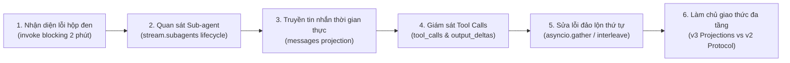
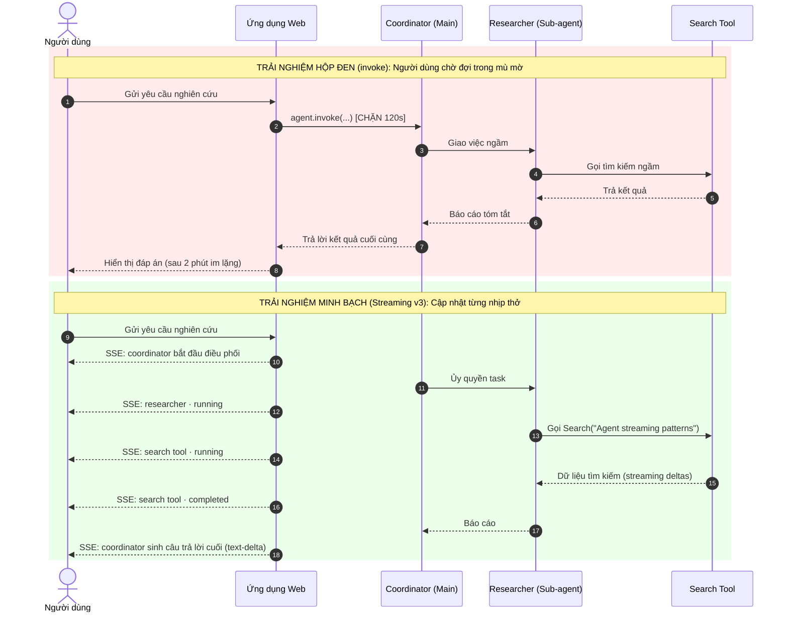
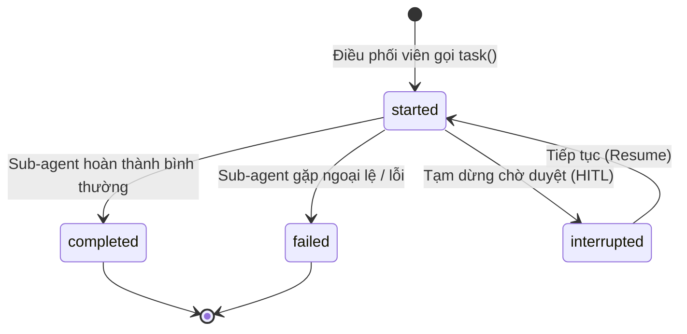
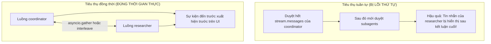
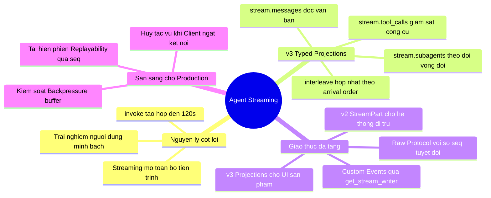

# Chương 14: Streaming — Giám Sát Thời Gian Thực Main Agent, Sub-agent Và Lệnh Gọi Công Cụ

> **Một Agent trợ lý nghiên cứu (Research Assistant) chạy ròng rã suốt 2 phút.**  
> Nhật ký máy chủ (Server Log) ghi nhận rằng nó đã gọi công cụ tìm kiếm, đã khởi chạy Sub-agent `researcher`, và đang xử lý dữ liệu. Tuy nhiên, người dùng cuối nhìn vào trình duyệt web chỉ thấy duy nhất một **biểu tượng vòng tròn xoay tít (Loading Spinner)**.  
> Đến khi đáp án cuối cùng xuất hiện, người dùng hoàn toàn mù mờ: Suốt 2 phút qua hệ thống có thực sự làm việc không, hay đã bị treo (hung/deadlock)?
> 
> Mô hình ngôn ngữ lớn (LLM) có thể đưa ra một bản tóm tắt rất tốt, nhưng trải nghiệm người dùng sẽ trở nên tồi tệ nếu ứng dụng "nén phẳng" toàn bộ quá trình thực thi 2 phút phức tạp thành một kết quả trả về duy nhất.  
> Chương này sẽ dẫn dắt bạn tái cấu trúc một "trợ lý nghiên cứu hộp đen" (Black-box Agent) thành một hệ thống minh bạch thời gian thực: nhìn thấy quá trình ủy quyền (Delegation), theo dõi tin nhắn và lệnh gọi công cụ của từng Sub-agent, khắc phục lỗi đảo lộn thứ tự sự kiện, và làm chủ cả hai tầng giao thức Streaming (v3 Typed Projections và v2 StreamPart).

---

## Lộ Trình Triển Khai Trong Chương

Để xây dựng một luồng Streaming chuẩn công nghiệp, chúng ta sẽ đi qua chuỗi nâng cấp 6 bước:



1. **Tái hiện bài toán "Agent bị treo":** Phân tích sự khác biệt về trải nghiệm giữa `agent.invoke()` và `agent.stream_events()`.
2. **Hiển thị vòng đời của Sub-agent:** Sử dụng `stream.subagents` để nắm bắt các trạng thái `started`, `completed`, `failed`, `interrupted` mà không cần đoán mò từ tên graph node nội bộ.
3. **Phát trực tiếp tin nhắn và giải quyết bài toán phân quyền ngữ cảnh:** Đọc `message.text` và ánh xạ chính xác tin nhắn thuộc về Main Agent (coordinator) hay Sub-agent (`researcher`).
4. **Giám sát chi tiết các lệnh gọi công cụ (Tool Calls):** Bắt giữ tiến trình thực thi của công cụ, từ tham số đầu vào, dữ liệu luồng (`output_deltas`) đến kết quả cuối cùng hoặc lỗi ngoại lệ.
5. **Khắc phục lỗi đảo lộn thứ tự thời gian thực (Order Distortion):** Sử dụng `asyncio.gather` trong kiến trúc bất đồng bộ hoặc `stream.interleave()` trong kiến trúc đồng bộ để hợp nhất các luồng sự kiện.
6. **Làm chủ hạ tầng Production & Chuyển đổi giao thức:** Phân biệt ranh giới giữa v3 Typed Projections (hướng sản phẩm) và v2 StreamPart (hướng thực thi đồ thị LangGraph), xử lý ngắt kết nối, bộ đệm cho client chậm (Backpressure) và sự kiện tùy biến (`custom events`).

> [!NOTE]
> **Yêu cầu phiên bản môi trường:**  
> Nội dung chương này tương thích với: Python 3.10+, `deepagents>=0.7.0` (khuyến nghị `deepagents>=0.7.18`), `langchain>=1.4.0`, và `langgraph>=1.2.0`.  
> Khung làm việc Deep Agents kế thừa toàn bộ engine đồ thị của **LangGraph Pregel**. Giao thức v3 Typed Projections (`stream_events(version="v3")`) là giao thức hiện đại nhất dành cho ứng dụng mới; trong khi giao thức v2 (`stream(version="v2")`) đóng vai trò nền tảng cho việc gỡ lỗi hạ tầng và các hệ thống di trú (Legacy migration).

---

## 1. Một Yêu Cầu Nghiên Cứu "Có Vẻ Như Bị Treo"

Hãy xem xét cách gọi Agent truyền thống mà đa số các kịch bản mẫu thường viết:

```python
# Gọi chặn (Blocking call) - Đợi toàn bộ Agent hoàn tất mới trả về
result = agent.invoke({"messages": [{"role": "user", "content": prompt}]})
print(result["messages"][-1].content)
```

Ở góc độ giao diện web hoặc thiết bị di động, người dùng chỉ nhìn thấy một dòng trạng thái đơn độc:

```text
Người dùng: Hãy nghiên cứu các mô hình Agent Streaming gần đây.
Hệ thống:   Đang sinh câu trả lời... (quay vòng trong 120 giây)
```

Đoạn mã trên không sai về mặt logic kỹ thuật, nhưng nó tạo ra một **hộp đen hoàn toàn**. Trong suốt 120 giây đó, cả lập trình viên lẫn người dùng đều không thể trả lời được các câu hỏi then chốt:

- Main Agent (coordinator) đã thực sự ủy quyền tác vụ cho Sub-agent `researcher` chưa?
- Sub-agent đang tìm kiếm trên Internet hay mạng đang bị rớt gói (timeout)?
- Công cụ đang nhận tham số gì, hay đã gặp lỗi ngoại lệ mà không ai hay biết?
- Trước khi câu trả lời cuối cùng xuất hiện, hệ thống đã thực hiện bao nhiêu bước trung gian?




Mục tiêu của chúng ta là giải phóng Agent khỏi chiếc hộp đen này: **Hiển thị chính xác "Ai đang làm việc gì" theo thời gian thực.**

---

## 2. Thiết Lập Ca Thực Nghiệm Ổn Định

Để việc kiểm thử luồng Streaming không bị ảnh hưởng bởi tính ngẫu nhiên của LLM (đôi khi mô hình tự ý trả lời luôn mà không thèm gọi Sub-agent), chúng ta ép buộc Main Agent luôn phải ủy quyền thông qua System Prompt:

```python
import os
from deepagents import create_deep_agent
from langchain_openai import ChatOpenAI

# Khởi tạo mô hình hỗ trợ Tool Calling ổn định
model = ChatOpenAI(
    model=os.environ.get("MODEL_NAME", "gpt-4o"),
    api_key=os.environ["OPENAI_API_KEY"],
)

# Thiết lập hệ thống Multi-Agent có cấu trúc phân tầng
agent = create_deep_agent(
    model=model,
    system_prompt=(
        "You are a coordinator. Delegate every research request to the "
        "researcher subagent. Do not research the topic yourself. "
        "After the subagent returns, summarize its result in two sentences."
    ),
    subagents=[
        {
            "name": "researcher",
            "description": "Researches a topic and returns a concise summary.",
            "system_prompt": (
                "Research the topic, use available tools when useful, "
                "and return a concise evidence-aware summary."
            ),
        }
    ],
)

request = {
    "messages": [
        {"role": "user", "content": "Research recent Agent streaming patterns"}
    ]
}
```

Cấu trúc trên thiết lập một cây phả hệ Agent rõ ràng:
- **Tầng gốc (Root):** `coordinator` tiếp nhận câu hỏi của người dùng và tổng hợp báo cáo cuối cùng.
- **Tầng nhánh (Sub-agent):** `researcher` chịu trách nhiệm thu thập thông tin và có thể gọi các công cụ ngoài.

---

## 3. Bước Sửa Chữa 1: Hiển Thị "Trợ Lý Nghiên Cứu Đã Khởi Động"

### 3.1 Đừng Đoán Trạng Thái Sản Phẩm Từ Graph Node Nội Bộ

Ở tầng lõi, LangGraph thực thi đồ thị thông qua các node kỹ thuật như `model_request`, `tools`, `pregel_step`.  
Nhiều lập trình viên cố gắng parse các chuỗi này để hiển thị UI:
```python
# CÁCH LÀM SAI LẦM: Lộ vết hạ tầng ra giao diện người dùng
if node_name == "tools:task_01":
    show_ui("Đang chạy node tools")
```
Người dùng cuối chỉ quan tâm đến nghiệp vụ: **"Trợ lý nghiên cứu đang xử lý"**, họ không cần biết `model_request` hay `pregel_step` là gì.

Deep Agents v0.6+ và LangGraph 1.2+ giải quyết vấn đề này bằng khái niệm **Typed Projection API**: `stream.subagents`. Mỗi đối tượng (handle) đại diện cho một lượt ủy quyền nghiệp vụ với đầy đủ tên gọi, đường dẫn và trạng thái vòng đời.

```python
# Sử dụng giao thức Event Streaming v3 hiện đại
stream = agent.stream_events(request, version="v3")

for subagent in stream.subagents:
    print(f"[{subagent.name}] Trạng thái: {subagent.status}")
    print("Đường dẫn (path):", subagent.path)

    try:
        # subagent.output sẽ chặn cho đến khi Sub-agent hoàn tất
        print("Kết quả (output):", subagent.output)
    except Exception as exc:
        print(f"Lỗi thực thi Sub-agent: {exc}")
```

Khi handle vừa xuất hiện, `subagent.status` sẽ có giá trị `"started"`. Giao diện có thể lập tức hiển thị một thẻ (Card): `researcher · running`.

---

### 3.2 Bóc Tách Các Thuộc Tính Của `subagent` Handle

Mỗi thực thể trong `stream.subagents` vừa là một bản ghi nhận diện (Identity Record), vừa là một cổng mở ra các luồng dữ liệu con (Sub-projections):

| Thuộc tính / Projection | Kiểu dữ liệu | Thời điểm đọc | Mục đích sử dụng trên giao diện UI |
|---|---|---|---|
| `name` | `str` | Ngay khi handle xuất hiện | Tên vai trò (ví dụ: `researcher`). **Không dùng làm khóa duy nhất (Unique Key)** vì cùng một role có thể được gọi nhiều lần. |
| `path` | `tuple[str, ...]` | Ngay khi handle xuất hiện | **Khóa định tuyến duy nhất (Routing Key)** trong phiên chạy hiện tại để phân biệt các Sub-agent cùng tên. |
| `status` | `str` | Khi handle xuất hiện và khi thay đổi | Trạng thái vòng đời: `started`, `completed`, `failed`, `interrupted`. |
| `messages` | `StreamChannel` | Khi cần hiển thị văn bản chi tiết | Luồng tin nhắn riêng biệt do chính Sub-agent này sinh ra. |
| `tool_calls` | `StreamChannel` | Khi cần hiển thị hoạt động công cụ | Luồng các lệnh gọi công cụ do Sub-agent này thực hiện. |
| `values` | `StreamChannel` | Khi cần gỡ lỗi hoặc xem biến trạng thái | Ảnh chụp nhanh trạng thái (State Snapshot) của Sub-agent. |
| `subagents` | `StreamChannel` | Khi có ủy quyền đa cấp | Mở ra luồng Sub-agent cấp con nếu `researcher` tiếp tục gọi thêm Agent khác. |
| `output` | Property / Method | Khi cần đợi kết quả kết thúc | Chứa trạng thái kết thúc của Sub-agent; ném ra ngoại lệ nếu Sub-agent thất bại. |

#### Vòng Đời Trạng Thái Của `status`



- `started`: Thao tác ủy quyền đã bắt đầu thực thi -> Cập nhật UI sang `running`.
- `completed`: Hoàn tất bình thường -> Thu thập `subagent.output` và ẩn thanh tiến trình.
- `failed`: Gặp lỗi nghiêm trọng -> Bắt giữ ngoại lệ và hiển thị thông báo lỗi màu đỏ trên thẻ của Sub-agent.
- `interrupted`: Tạm dừng tại trạm kiểm soát Human-in-the-Loop -> Giữ nguyên trạng thái để chờ người dùng duyệt lệnh gọi.

---

### 3.3 Mối Quan Hệ Giữa `path`, `namespace` Và `ns`

Cả ba khái niệm này đều diễn tả **đường dẫn thứ bậc từ Root Agent đến vị trí thực thi hiện tại**, nhưng tồn tại ở các tầng API khác nhau:

| Giao diện API | Tên trường | Kiểu dữ liệu trong Python | Ý nghĩa kỹ thuật |
|---|---|---|---|
| **v3 Typed Projection** | `subagent.path` | `tuple[str, ...]` | Đường dẫn gốc định danh lượt ủy quyền Sub-agent này. |
| **v3 Raw Protocol** | `event["params"]["namespace"]` | `list[str]` | Đường dẫn đầy đủ của sự kiện thô trong cây đồ thị. |
| **v2 Streaming** | `chunk["ns"]` | `tuple[str, ...]` | Đường dẫn đầy đủ của khối dữ liệu `StreamPart`. |

Mỗi phân đoạn trong đường dẫn có cấu trúc: `<node_name>:<id>`.  
Ví dụ:
```text
Root Agent (Main)           -> () hoặc []
Sub-agent researcher (cấp 1) -> ("tools:call_987abc",)
Node LLM bên trong Sub-agent -> ("tools:call_987abc", "model_request:step_02")
```

Hàm kiểm tra một sự kiện thô có thuộc về một Sub-agent hay không:
```python
def belongs_to_subagent(event_namespace: list[str] | tuple[str, ...], subagent_path: tuple[str, ...]) -> bool:
    """Kiểm tra tiền tố (Prefix matching) của namespace."""
    return tuple(event_namespace[: len(subagent_path)]) == subagent_path
```

> [!IMPORTANT]
> **Quy tắc phân định khóa định tuyến UI:**  
> Tuyệt đối không dùng `subagent.name` làm ID của thẻ UI, vì trong một bài toán phức tạp, Main Agent có thể gọi `researcher` 3 lần độc lập. Hãy luôn dùng `subagent.path` làm khóa (Key) trong React/Vue để quản lý các Card độc lập!

---

### 3.4 Cơ Chế Mở Luồng Theo Nhu Cầu (Lazy Projections)

Một ưu điểm vượt trội của Typed Projections trong v3 là tính chất **Lazy (lười biếng / theo nhu cầu)**:  
Nếu bạn chỉ lặp qua `stream.subagents` để lấy `status`, hệ thống **sẽ không tốn tài nguyên** truyền tải từng token tin nhắn hay chi tiết công cụ. Chỉ khi bạn chủ động truy cập `subagent.messages` hoặc `subagent.tool_calls`, luồng chi tiết tương ứng mới được kích hoạt.


#### Phân Biệt Phạm Vi Giữa Cha Và Con

| Projection ở cấp Root (`stream`) | Phạm vi dữ liệu |
|---|---|
| `stream.messages` | **Chỉ chứa tin nhắn của Main Agent (coordinator)**. Tuyệt đối không chứa tin nhắn của Sub-agent. |
| `stream.tool_calls` | **Chỉ chứa công cụ do Main Agent gọi** (ví dụ: công cụ ủy quyền `task`). |
| `stream.values` | Ảnh chụp trạng thái tổng thể của Root Graph. |
| `stream.subagents` | Danh sách các Sub-agent do Main Agent kích hoạt. |
| `stream.output` | Trạng thái cuối cùng của toàn bộ hệ thống sau khi hoàn tất. |

> [!WARNING]
> **Hiểu đúng về `values` projection:**  
> `stream.values` không phải là một luồng text stream hay danh sách token để in ra màn hình. Nó là một **State Snapshot (ảnh chụp trạng thái)** của đồ thị tại từng bước.  
> Trong `deepagents v0.7+`, tính năng TodoList không còn bật mặc định. Đừng bao giờ viết code kiểm tra `if "todos" not in snapshot: raise Error` vì trạng thái không có Todo là hoàn toàn bình thường trừ khi bạn chủ động gắn `TodoListMiddleware`.

---

## 4. Bước Sửa Chữa 2: Cho Người Dùng Biết Agent Đang Tìm Kiếm Điều Gì

Sau khi người dùng biết trợ lý đã chạy, họ muốn đọc nội dung văn bản mà các Agent đang trao đổi:

```python
stream = agent.stream_events(request, version="v3")

# Đọc thông điệp của coordinator
for message in stream.messages:
    print("[coordinator]", message.text)

# Đọc thông điệp của researcher
for subagent in stream.subagents:
    for message in subagent.messages:
        print(f"[{subagent.name}]", message.text)
```

### 4.1 Đọc Thuộc Tính `message.text`

Trong Typed Projection v3, các sự kiện phân mảnh phức tạp ở tầng dưới đã được gom gọn vào thuộc tính `message.text`:

- **Trong code đồng bộ (Sync):** Truy cập trực tiếp `message.text`.
- **Trong code bất đồng bộ (Async):** Bắt buộc phải dùng `await message.text` vì các đoạn văn bản đang được truyền trực tiếp qua mạng.

### 4.2 Thiết Kế Lớp Chuyển Đổi Sự Kiện Ứng Dụng (Event Adapter)

Framework không tự ý phát sinh các trường dành riêng cho giao diện như `kind` hay `source`. Một kiến trúc chuẩn sẽ sử dụng một lớp Adapter để chuyển đổi dữ liệu trước khi đẩy qua Server-Sent Events (SSE):

```python
# Cấu trúc gói tin SSE gửi xuống trình duyệt Web
sse_payload = {
    "kind": "message",
    "source": "coordinator" if not subagent_path else "subagent",
    "path": list(subagent_path),
    "text": message.text,
    "final": False,
}
```

### 4.3 Cạm Bẫy Đảo Lộn Thứ Tự Sự Kiện (Order Distortion)

Đoạn mã ở mục 4 có một **lỗi nghiêm trọng về mặt thời gian thực**:  
Vòng lặp `for message in stream.messages:` sẽ **chạy cho đến khi coordinator kết thúc lượt đầu tiên**. Sau đó, vòng lặp `for subagent in stream.subagents:` mới bắt đầu được duyệt!

Hậu quả là trên màn hình người dùng:
```text
[coordinator] Đang phân công nhiệm vụ nghiên cứu...
[coordinator] Dưới đây là tóm tắt kết quả cuối cùng: Agent streaming mang lại trải nghiệm mượt mà...
[researcher] Đang bắt đầu tìm kiếm thông tin trên web...   <-- BỊ ĐẢO LỘN RA SAU!
[researcher] Đã tìm thấy 5 bài báo khoa học...             <-- BỊ ĐẢO LỘN RA SAU!
```

Mặc dù `researcher` đã chạy và xong việc trước, nhưng do code xử lý tuần tự (Serial Consumption), thông điệp của nó lại bị đẩy ra sau phần tóm tắt của coordinator!  
Chúng ta sẽ giải quyết triệt để lỗi này ở **Mục 6**.

---

## 5. Bước Sửa Chữa 3: Lệnh Gọi Công Cụ Phải Được Nhìn Thấy Minh Bạch

Một trợ lý nghiên cứu không chỉ nói chuyện, nó còn phải gọi công cụ tìm kiếm, đọc tệp và phân tích dữ liệu. Người dùng cần biết công cụ nào đang chạy, tham số truyền vào là gì, và có bị lỗi mạng hay không:

```python
stream = agent.stream_events(request, version="v3")

for subagent in stream.subagents:
    for call in subagent.tool_calls:
        print(f"\n[{subagent.name}] Gọi công cụ: {call.tool_name}({call.input})")

        # In trực tiếp từng phần dữ liệu trả về từ công cụ nếu công cụ hỗ trợ streaming
        for delta in call.output_deltas:
            print(delta, end="", flush=True)

        # Kiểm tra trạng thái hoàn thành an toàn
        if call.completed:
            if call.error is None:
                print(f"\n-> Kết quả: {call.output}")
            else:
                print(f"\n-> Ngoại lệ: {call.error}")
```

### 5.1 Cấu Trúc Đối Tượng `tool_call` Handle

| Trường / Thuộc tính | Kiểu dữ liệu | Ý nghĩa và lưu ý kỹ thuật |
|---|---|---|
| `tool_name` | `str` | Tên công cụ được gọi (ví dụ: `web_search`). |
| `input` | `dict` | Tham số mô hình truyền vào. *Cần lọc dữ liệu nhạy cảm (Sanitize/Mask) trước khi ghi log hoặc gửi về client*. |
| `output_deltas` | `StreamChannel` | Luồng dữ liệu trả về từng phần nếu công cụ hỗ trợ streaming (ví dụ: tiến trình tải file, log quét mạng). |
| `completed` | `bool` | Cờ báo hiệu lệnh gọi đã kết thúc. **`completed=True` KHÔNG đồng nghĩa với thành công!** |
| `output` | `Any` | Dữ liệu trả về cuối cùng khi công cụ chạy thành công. |
| `error` | `Any \| None` | Chi tiết lỗi hoặc ngoại lệ nếu công cụ sụp đổ. |

> [!CAUTION]
> **Cách kiểm tra trạng thái công cụ chuẩn xác:**
> Tuyệt đối không viết `if call.completed: show_success()`. Hãy chia làm 3 nhánh rõ ràng:
> ```python
> if not call.completed:
>     ui_status = "running"
> elif call.error is not None:
>     ui_status = "failed"     # Bắt buộc hiển thị lỗi ra UI
> else:
>     ui_status = "completed"  # Thành công thực sự
> ```

Nhờ bổ sung tầng quan sát công cụ, giao diện người dùng trở nên cực kỳ sống động và đáng tin cậy:

```text
researcher · running
  ├── search_tool · completed  query="Deep Agents streaming patterns" (5 kết quả)
  ├── fetch_page  · running    url="https://docs.langchain.com/..."
  └── Đang tổng hợp các điểm cốt lõi giữa v3 projection và v2 protocol...
```

---

## 6. Khắc Phục Lỗi Đảo Lộn Thứ Tự: Tiêu Thụ Dữ Liệu Thời Gian Thực

Để các sự kiện từ `coordinator` và `researcher` xuất hiện đúng theo trình tự thời gian mà chúng sinh ra (Arrival Order), chúng ta không thể duyệt tuần tự các iterator.




---

### 6.1 Giải Pháp Cho Ứng Dụng Bất Đồng Bộ (Async): `asyncio.gather`

Trong các web framework hiện đại như FastAPI, Starlette hay Sanic, hãy sử dụng `astream_events` kết hợp `asyncio.gather`:

```python
import asyncio

async def stream_live_research():
    # Khởi tạo stream bất đồng bộ
    stream = await agent.astream_events(request, version="v3")

    async def consume_coordinator():
        async for message in stream.messages:
            # Phát SSE cho tin nhắn của coordinator
            print(f"[COORDINATOR] {await message.text}")

    async def consume_subagents():
        async for subagent in stream.subagents:
            print(f"-> [SUBAGENT KHỞI CHẠY] {subagent.name}")
            async for message in subagent.messages:
                # Phát SSE cho tin nhắn của subagent ngay khi có token
                print(f"[{subagent.name}] {await message.text}")

    # Chạy song song cả hai luồng tiêu thụ mà không làm nghẽn nhau
    await asyncio.gather(consume_coordinator(), consume_subagents())

# Thực thi
asyncio.run(stream_live_research())
```

---

### 6.2 Giải Pháp Cho Ứng Dụng Đồng Bộ (Sync): `stream.interleave()`

Nếu bạn đang viết một ứng dụng dòng lệnh (CLI) hoặc xử lý đồng bộ và không muốn cấu trúc lại toàn bộ code sang `async/await`, v3 cung cấp phương thức `interleave()`:

```python
stream = agent.stream_events(request, version="v3")

# Hợp nhất các projection theo đúng thứ tự đến (Monotonic Arrival Order)
for name, item in stream.interleave("messages", "subagents"):
    if name == "messages":
        print(f"[COORDINATOR] {item.text}")
    elif name == "subagents":
        print(f"-> [SUBAGENT DETECTED] {item.name}")
        for msg in item.messages:
            print(f"[{item.name}] {msg.text}")
```

#### Bảng Ánh Xạ Kiểu Dữ Liệu Trong `interleave`

| Giá trị `name` truyền vào | Kiểu đối tượng `item` nhận được | Thao tác xử lý tiếp theo |
|---|---|---|
| `"messages"` | `MessageStream` handle | Đọc chuỗi văn bản qua `item.text`. |
| `"subagents"` | `SubagentStream` handle | Đọc `item.name`, `item.path`, `item.status`, hoặc tiếp tục lặp `item.messages`. |
| `"tool_calls"` | `ToolCallStream` handle | Đọc `item.tool_name`, `item.input`, `item.output_deltas`. |

> [!IMPORTANT]
> **Quy tắc khóa độc quyền của Channel trong `interleave`:**  
> Trong engine của LangGraph, mỗi StreamChannel khi tham gia vào `interleave()` sẽ bị **khóa (locked)** cho đến khi generator duyệt xong.  
> Tuyệt đối không được vừa đọc `stream.messages` ở một luồng riêng, vừa truyền `"messages"` vào `stream.interleave()`, nếu không hệ thống sẽ ném lỗi xung đột. Nếu cần chia sẻ dữ liệu ra nhiều nơi, hãy dùng phương thức `.tee(n)` của channel.

---

## 7. Sự Kiện Giao Thức Thô (Raw Protocol Events) Và Kiểm Tra Thứ Tự Tuyệt Đối

Đa phần ứng dụng UI chỉ cần 3 vùng: Hộp chat chính, thẻ Sub-agent và danh sách công cụ. Tuy nhiên, khi bạn cần **lưu trữ kiểm toán (Audit Trail)**, phân tích độ trễ của từng token, hoặc xây dựng tính năng tua lại phiên làm việc (Session Replay), bạn cần đọc trực tiếp **Raw Protocol Events**.

```python
stream = agent.stream_events(request, version="v3")

for event in stream:
    # Lọc các sự kiện thông điệp hợp lệ
    if not isinstance(event, dict) or event.get("method") != "messages":
        continue

    params = event.get("params", {})
    data = params.get("data")
    if not isinstance(data, (list, tuple)) or not data:
        continue

    payload = data[0]
    # Lọc các khối token văn bản (text-delta)
    if payload.get("event") == "content-block-delta":
        delta = payload.get("delta", {})
        if delta.get("type") == "text-delta":
            seq = event["seq"]  # Số thứ tự tuần tự tuyệt đối
            namespace = params.get("namespace", [])
            source = "subagent" if namespace else "coordinator"
            print(f"#{seq:04d} [{source}] {delta['text']}", end="", flush=True)
```

### Các Trường Cốt Lõi Của Raw Protocol Event

| Đường dẫn trường | Kiểu dữ liệu | Ý nghĩa kiến trúc |
|---|---|---|
| `event["seq"]` | `int` | **Số thứ tự tăng dần đơn điệu nghiêm ngặt** trong một lượt chạy. Dùng để sắp xếp và phát hiện mất gói (dropped events), thay vì dùng timestamp. |
| `event["method"]` | `str` | Loại sự kiện giao thức: `messages`, `tools`, `values`. |
| `params["namespace"]` | `list[str]` | Danh sách các phân đoạn node dẫn tới nguồn phát sinh sự kiện. `[]` đại diện cho Main Agent. |
| `params["timestamp"]` | `int` | Thời điểm phát sinh sự kiện (Epoch milliseconds). Dùng để hiển thị, không dùng để sắp xếp do nguy cơ lệch đồng hồ (Clock Drift). |
| `data[0]["event"]` | `str` | Sự kiện chi tiết: `content-block-start`, `content-block-delta`, `content-block-stop`. |
| `data[0]["delta"]` | `dict` | Khối dữ liệu thay đổi thực tế (`text-delta`, `tool-call-delta`). |

---

## 8. Tại Sao Mã Nguồn Cũ Vẫn Sử Dụng `type / ns / data` (Giao Thức v2)?

Khi bảo trì các dự án viết trên nền tảng LangGraph thuần hoặc các phiên bản trước đây, bạn sẽ thường xuyên bắt gặp đoạn mã sau:

```python
for chunk in agent.stream(
    request,
    stream_mode=["updates", "messages", "custom"],
    subgraphs=True,
    version="v2",
):
    print("Mode:", chunk["type"])
    print("Namespace:", chunk["ns"])
    print("Data:", chunk["data"])
```


### Cấu Trúc Khối Dữ Liệu `StreamPart` Trong v2

Mỗi `chunk` trong v2 là một từ điển chứa 3 phần tử:

1. **`type` (Chế độ stream):** Xác định loại dữ liệu của chunk:
   - `"messages"`: Chứa token sinh ra từ LLM hoặc kết quả từ `ToolMessage`.
   - `"updates"`: Chứa cập nhật trạng thái của các node trong đồ thị (`{node_name: state_diff}`).
   - `"custom"`: Dữ liệu tùy biến do lập trình viên chủ động đẩy ra từ bên trong tool.
2. **`ns` (Namespace tuple):**
   - `()`: Thuộc về Main Agent cấp cao nhất.
   - `("tools:call_123",)`: Thuộc về Sub-agent được khởi tạo từ công cụ `task`.
   - `("tools:call_123", "model_request:step_456")`: Node mô hình bên trong Sub-agent.
3. **`data`:** Dữ liệu tương ứng với từng `type`.

#### Xử Lý Chi Tiết Nhánh `"messages"` Trong Giao Thức v2

```python
from langchain.messages import AIMessageChunk, ToolMessage

for chunk in agent.stream(
    request,
    stream_mode="messages",
    subgraphs=True,
    version="v2",
):
    if chunk["type"] != "messages":
        continue

    token, metadata = chunk["data"]
    source = "subagent" if chunk["ns"] else "main"

    # Trường hợp 1: LLM đang stream token của một lời gọi tool
    if isinstance(token, AIMessageChunk) and token.tool_call_chunks:
        for tool_chunk in token.tool_call_chunks:
            print(f"[{source}] Đang tạo tham số tool {tool_chunk.get('name')}: {tool_chunk.get('args')}")

    # Trường hợp 2: Công cụ đã chạy xong và trả về kết quả
    elif isinstance(token, ToolMessage):
        print(f"[{source}] Kết quả tool {token.name}: {token.content}")

    # Trường hợp 3: Token văn bản trả lời thông thường
    elif token.content:
        print(token.content, end="", flush=True)
```

> [!TIP]
> **Khi nào nên dùng v3 và khi nào nên dùng v2?**
> - **Dùng v3 (`stream_events(version="v3")`):** Bắt buộc cho mọi dự án làm mới, xây dựng Chat UI hiện đại, dashboard hiển thị cây Sub-agent phân cấp.
> - **Dùng v2 (`stream(version="v2")`):** Dành cho việc di trú hệ thống cũ, hoặc khi bạn cần can thiệp sâu vào từng phép toán cập nhật trạng thái đồ thị (`updates`).

---

## 9. Phát Các Sự Kiện Tiến Độ Tùy Biến (Custom Events) Từ Trong Tool

Đôi khi, một công cụ nghiệp vụ kéo dài hàng chục giây (ví dụ: cào 100 trang web hoặc phân tích bảng dữ liệu lớn). Nếu công cụ chỉ im lặng chạy, người dùng vẫn sẽ tưởng rằng hệ thống bị treo.

Bạn có thể chủ động đẩy các sự kiện tiến độ ra ngoài thông qua `get_stream_writer()`:

```python
from langchain.tools import tool
from langgraph.config import get_stream_writer

@tool
def analyze_market_trends(topic: str) -> str:
    """Thu thập và phân tích xu hướng thị trường, liên tục báo cáo tiến độ."""
    # Lấy writer từ ngữ cảnh thực thi đồ thị
    try:
        writer = get_stream_writer()
    except RuntimeError:
        writer = None

    # Phát sự kiện bắt đầu
    if writer:
        writer({"event": "progress", "phase": "fetch_data", "percent": 20, "topic": topic})

    # Thực hiện logic nghiệp vụ thực tế...
    if writer:
        writer({"event": "progress", "phase": "calculate_metrics", "percent": 75, "topic": topic})

    # Hoàn tất
    if writer:
        writer({"event": "progress", "phase": "finished", "percent": 100, "topic": topic})

    return f"Báo cáo phân tích hoàn tất cho chủ đề: {topic}"
```

> [!WARNING]
> **Bẫy ràng buộc ngữ cảnh thực thi của `get_stream_writer()`:**  
> Hàm `get_stream_writer()` **bắt buộc phải chạy trong môi trường đồ thị của LangGraph**.  
> Nếu bạn gọi trực tiếp công cụ này trong Unit Test độc lập (`analyze_market_trends.invoke(...)`), nó sẽ ném ra lỗi `RuntimeError: No stream writer found`.  
> Do đó, hãy luôn bọc lệnh gọi trong khối `try/except RuntimeError` như ví dụ trên để bảo vệ tính khả thi khi kiểm thử đơn vị.

---

## 10. Từ "Có Thể Nhìn Thấy" Đến "Sẵn Sàng Cho Production"

Để một ứng dụng Streaming thực sự vận hành ổn định trên môi trường Production, hệ thống phải giải quyết được 4 thách thức kỹ thuật cốt lõi:

```
┌────────────────────────────────────────────────────────┐
│             KIẾN TRÚC STREAMING PRODUCTION             │
├────────────────────────────────────────────────────────┤
│ 1. ĐIỀU PHỐI (Orchestration)                           │
│    Streaming != Chạy song song (Cần async subagents)   │
├────────────────────────────────────────────────────────┤
│ 2. QUẢN LÝ NGẮT KẾT NỐI (Disconnection Handling)       │
│    Client đóng tab -> Tự động hủy tác vụ (Task Cancel) │
├────────────────────────────────────────────────────────┤
│ 3. KIỂM SOÁT BACKPRESSURE CHO CLIENT CHẬM              │
│    Giới hạn kích thước Buffer, drop delta không quan trọng│
├────────────────────────────────────────────────────────┤
│ 4. KHẢ NĂNG PHỤC HỒI & TUA LẠI (Replayability)        │
│    Lưu trữ sự kiện tuần tự có số 'seq' vào Database/S3  │
└────────────────────────────────────────────────────────┘
```

### 1. Streaming Không Đồng Nghĩa Với Chạy Song Song
Việc các sự kiện đến đan xen nhau chỉ phản ánh thứ tự sinh dữ liệu của LLM. Nếu bạn cấu hình Sub-agent dạng đồng bộ tuần tự, Main Agent vẫn phải đợi Sub-agent xong mới chạy tiếp. Nếu muốn các Sub-agent thực sự chạy đa nhiệm song song, bạn phải kết hợp với **Async Subagents** (đã học ở Chương 8).

### 2. Xử Lý Ngắt Kết Nối Phía Client (Client Disconnection)
Khi người dùng đóng trình duyệt web hoặc mất kết nối 4G/Wifi, kết nối SSE bị đứt.  
- Nếu backend tiếp tục chạy vô hạn, bạn sẽ lãng phí hàng nghìn USD tiền API Token của LLM cho những tác vụ không ai đọc.
- Hãy lắng nghe sự kiện `request.is_disconnected()` trong FastAPI để phát tín hiệu `stream.abort()` hoặc hủy bỏ `asyncio.Task`.

### 3. Kiểm Soát Tràn Bộ Đệm (Backpressure) Cho Client Chậm
Nếu Agent sinh ra 100 token/giây nhưng thiết bị di động của người dùng kết nối mạng yếu chỉ nhận được 10 token/giây, bộ nhớ đệm (Buffer) trên server sẽ phình to mất kiểm soát.  
- Đặt ngưỡng giới hạn hàng đợi phát sự kiện (ví dụ: tối đa 500 sự kiện chờ).
- Nếu tràn hàng đợi, chủ động gộp các `text-delta` nhỏ thành các khối lớn hơn hoặc loại bỏ các sự kiện cập nhật trạng thái phụ.

### 4. Khả Năng Lưu Trữ Và Tái Hiện (Replayability)
Một lỗi phổ biến là coi luồng generator trong bộ nhớ là nơi lưu trữ duy nhất. Khi người dùng bấm phím `F5` (Refresh trang), toàn bộ nhật ký suy luận biến mất.  
- Trên production, lớp Adapter phải đồng thời đẩy dữ liệu qua SSE xuống trình duyệt, và ghi các sự kiện có gắn cờ `seq` vào kho lưu trữ (Redis Streams, PostgreSQL hoặc S3).
- Khi người dùng tải lại trang, hệ thống chỉ cần truy vấn theo `thread_id` và phát lại toàn bộ chuỗi sự kiện một cách mượt mà.

---

## 11. Bảng Đối Chiếu Các Khái Niệm Trong Bộ Template `deepagents/streaming`

Dưới đây là bảng đối soát chi tiết về nguồn gốc của các trường dữ liệu được chuẩn hóa trong template kiến trúc:

| Trường dữ liệu | Nguồn gốc chính xác | Mục đích nghiệp vụ trên giao diện người dùng |
|---|---|---|
| `kind` | Do Adapter ứng dụng tự sinh (`"message"`, `"subagent"`, `"tool_call"`, `"raw"`) | Giúp frontend sử dụng lệnh `switch(event.kind)` để render đúng component. |
| `source` | Do Adapter ứng dụng gắn nhãn (`"coordinator"` hoặc `"subagent"`) | Xác định thông điệp thuộc về khung chat chính hay nằm trong thẻ con của trợ lý phụ. |
| `path` | Chuyển đổi từ `subagent.path` (tuple) thành JSON array | Khóa định tuyến cha-con duy nhất của Sub-agent trong phiên. |
| `phase` | Do Adapter sinh ra (`"started"`, `"delta"`, `"completed"`, `"failed"`) | Thể hiện trạng thái của sự kiện giao diện. |
| `status` | Giá trị gốc từ `subagent.status` của framework | Trạng thái vòng đời chính thức của Agent. |
| `sequence` | Lấy từ trường `seq` của Raw Protocol | Số thứ tự nghiêm ngặt để đảm bảo tin nhắn không bị hiển thị đảo lộn. |
| `namespace` | Lấy từ `params["namespace"]` của Raw Protocol | Đường dẫn phân cấp kỹ thuật trong đồ thị Pregel. |

---

## 12. Tổng Kết Chương



1. **Khắc phục hoàn toàn hiệu ứng hộp đen**: Thay thế việc gọi chặn `invoke()` bằng `stream_events(version="v3")` để phản hồi tức thì cho người dùng từng bước suy luận, ủy quyền và gọi công cụ.
2. **Sử dụng Typed Projections theo nhu cầu**: Tận dụng cơ chế Lazy của `stream.subagents`, `stream.messages`, và `stream.tool_calls` để xây dựng giao diện đa tầng mạch lạc mà không tốn tài nguyên xử lý dữ liệu thừa.
3. **Bảo toàn tính toàn vẹn của thứ tự thời gian thực**: Tránh bẫy duyệt tuần tự từng iterator. Luôn dùng `asyncio.gather` trong ứng dụng async hoặc `stream.interleave()` trong ứng dụng sync để phản ánh chính xác nhịp độ thực tế của hệ thống.
4. **Hiểu rõ ranh giới kiến trúc hai tầng giao thức**: Sử dụng v3 cho tầng hiển thị sản phẩm cao cấp, và làm chủ v2 StreamPart cùng Raw Protocol (`seq`, `namespace`) để phục vụ việc kiểm toán, gỡ lỗi và di trú hệ thống kế thừa.
5. **Hoàn thiện các chốt chặn an toàn cho Production**: Thiết lập cơ chế tự động hủy tác vụ khi client ngắt kết nối, quản lý bộ đệm chống tràn cho client mạng yếu, và lưu trữ sự kiện định danh để hỗ trợ Replay khi người dùng tải lại trang.

---

## Tài Liệu Tham Khảo Chính Thức

- [Deep Agents Event Streaming Guide](https://docs.langchain.com/oss/python/deepagents/event-streaming)
- [Deep Agents Streaming: v2 Namespaces Architecture](https://docs.langchain.com/oss/python/deepagents/streaming)
- [LangChain Event Streaming v3 Specification](https://docs.langchain.com/oss/python/langchain/event-streaming)
- [LangGraph Event Streaming & GraphRunStream Protocol](https://docs.langchain.com/oss/python/langgraph/event-streaming)
- [LangGraph Low-level Streaming: StreamPart & `stream_mode`](https://docs.langchain.com/oss/python/langgraph/streaming)
- [AgentSeek `deepagents/streaming` Production Template](https://github.com/agentseek-ai/agentseek-templates/tree/main/templates/deepagents/streaming)
