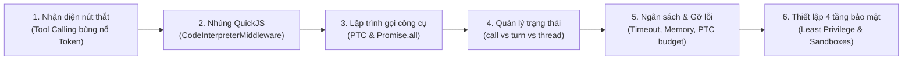
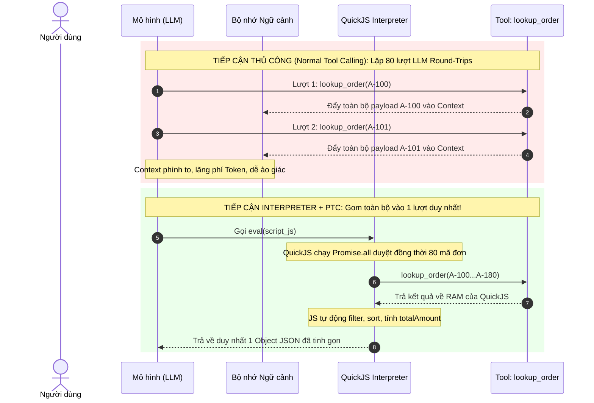
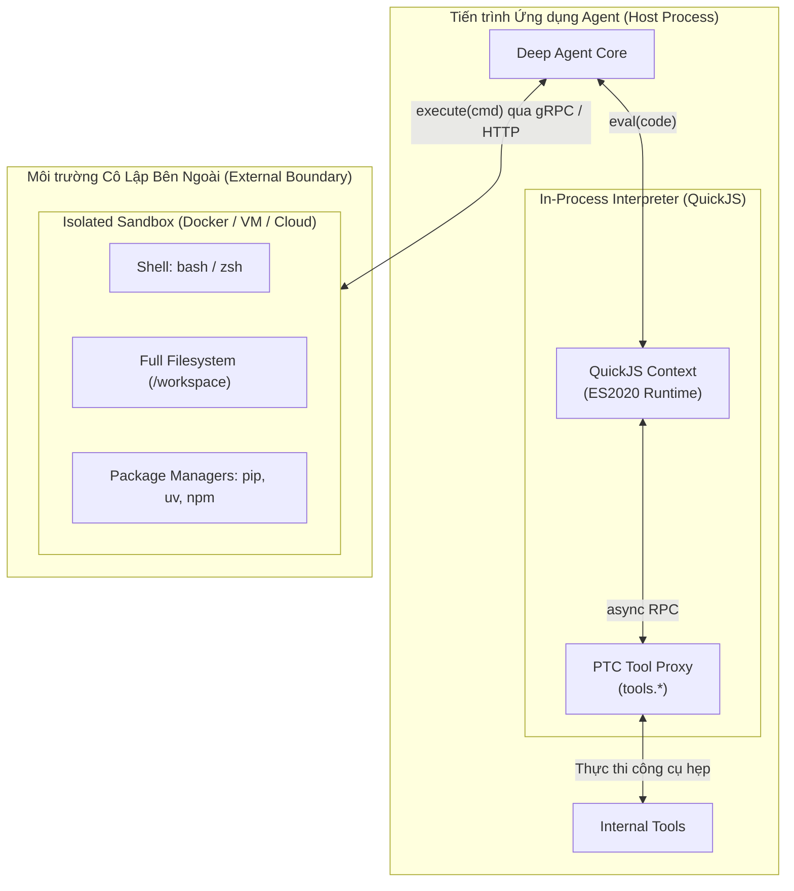
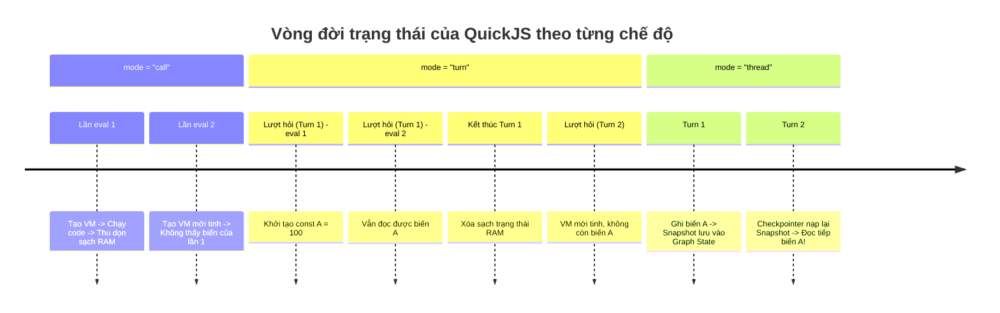
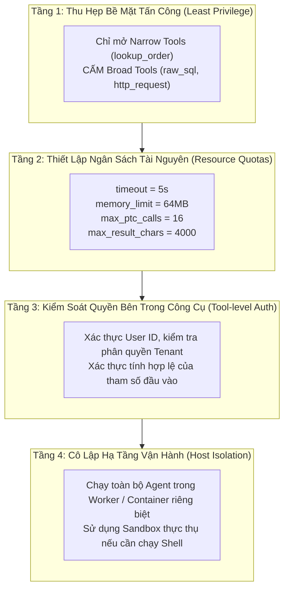

# Chương 15: Interpreters — Dùng Mã Nguồn Để Biên Họa (Orchestrate) Công Cụ Và Dữ Liệu Cho Agent

> **Bài toán thực tế tại một sàn thương mại điện tử:**  
> Một Agent chịu trách nhiệm rà soát rủi ro nhận danh sách gồm 80 mã đơn hàng cần kiểm tra.  
> Theo cách tiếp cận Tool Calling truyền thống, Agent sẽ gọi công cụ tra cứu cho đơn hàng số 1, chờ nhận kết quả, đưa kết quả vào ngữ cảnh (Context), rồi lại suy luận để gọi đơn hàng số 2...  
> Cứ như vậy, hàng chục lượt phản hồi thô liên tiếp tràn vào bộ nhớ ngữ cảnh. Chưa kịp duyệt xong 80 đơn hàng thì Context Window đã phình to cực đại, mô hình bắt đầu bị "ảo giác" (hallucination), bỏ sót dữ liệu và chi phí API tăng vọt.  
> 
> Bản thân công cụ tra cứu không hề có lỗi; điểm nghẽn nằm ở **cơ chế điều phối (Orchestration Pattern)**: Toàn bộ các thao tác mang tính tất định như vòng lặp (loop), lọc điều kiện (filtering), thử lại (retry) và tổng hợp số liệu (aggregation) lại đang bị phó mặc cho mô hình ngôn ngữ lớn (LLM) suy luận từng vòng một!

Công cụ thông thường (Standard Tool Calling) chỉ hoạt động hiệu quả với số lượng lệnh gọi ít và rời rạc. Khi một tác vụ đòi hỏi phải rẽ nhánh dựa trên dữ liệu trả về, xử lý theo lô (batch processing), hoặc lặp tuần tự, việc ép LLM suy luận qua từng lượt hội thoại sẽ gây lãng phí nghiêm trọng cả về độ trễ lẫn chi phí token.

**Interpreters (Trình thông dịch mã trong bộ nhớ)** mang lại một giải pháp đột phá: Mô hình chỉ đóng vai trò hoạch định chiến lược ở tầng cao, sau đó sinh ra một đoạn mã JavaScript/TypeScript ngắn để QuickJS tự thực thi ngay trong tiến trình của Agent. Toàn bộ các vòng lặp, xử lý mảng và gom nhóm dữ liệu diễn ra hoàn toàn bằng mã lệnh; chỉ có duy nhất kết quả tổng hợp cuối cùng được trả về cho mô hình.

Chương này sẽ hướng dẫn bạn tích hợp `CodeInterpreterMiddleware`, chạy đoạn mã JavaScript nội bộ đầu tiên, kích hoạt cơ chế **Programmatic Tool Calling (PTC - Lập trình gọi công cụ)** để đọc và xử lý dữ liệu theo lô, nắm vững cách kiểm soát trạng thái, thiết lập ngân sách tài nguyên và thắt chặt ranh giới an toàn trong môi trường Production.

---

> [!NOTE]
> **Yêu cầu phiên bản môi trường & Cập nhật kỹ thuật mới nhất:**
> - Bản thảo ban đầu của giáo trình ghi nhận tại thời điểm `deepagents==0.7.8` và `langchain-quickjs==0.3.5`.
> - **Phiên bản chuẩn mới nhất hiện tại:** `deepagents>=0.7.18`, `langchain-quickjs>=0.3.7`, `quickjs-rs` (nhúng QuickJS thông qua PyO3 + Rust rquickjs), yêu cầu **Python `>=3.11`**.
> - **Cảnh báo bất đồng bộ cực kỳ quan trọng:** Trong `langchain-quickjs>=0.3.7`, các cầu nối PTC (PTC Bridges) được đăng ký dưới dạng các async host functions trong QuickJS. Do đó, nếu bạn gọi Agent thông qua phương thức đồng bộ `agent.invoke(...)` khi đang bật PTC, hệ thống sẽ ném ra lỗi `ConcurrentEvalError`. Bạn **bắt buộc phải sử dụng phương thức bất đồng bộ `await agent.ainvoke(...)`** hoặc `agent.stream_events(..., version="v3")`!

---

## Lộ Trình Triển Khai Trong Chương



---

## 1. Tại Sao Cần Interpreter (Trình Thông Dịch)?

Hãy xem xét quy trình làm việc tự nhiên của một tác vụ kiểm tra đơn hàng: Agent cần duyệt qua từng mã đơn, căn cứ vào giá trị đơn và số lần yêu cầu hoàn tiền để sàng lọc các đơn có nguy cơ gian lận, sau đó xuất báo cáo tổng hợp.

Khi sử dụng Tool Calling truyền thống, Agent phải trải qua một chuỗi vòng lặp suy luận như sau:

```text
Lượt 1: Mô hình quyết định tra cứu đơn A-100 -> Công cụ trả về JSON A-100 -> Đưa toàn bộ vào Context
Lượt 2: Mô hình quyết định tra cứu đơn A-101 -> Công cụ trả về JSON A-101 -> Đưa toàn bộ vào Context
Lượt 3: Mô hình quyết định tra cứu đơn A-102 -> Công cụ trả về JSON A-102 -> Đưa toàn bộ vào Context
...
Lượt 80: Mô hình đọc lại 80 kết quả từ Context -> Cố gắng cộng trừ, tính toán -> Trả lời kết quả
```

Dù một số mô hình hiện đại hỗ trợ cơ chế Parallel Tool Calling (gọi song song nhiều công cụ trong một lượt), nhưng danh sách các lệnh gọi đó hoàn toàn bị cố định tại thời điểm sinh văn bản. Mô hình **không thể** đọc kết quả của đơn A-100 rồi mới quyết định xem có cần tra cứu tiếp đơn A-101 hay không. Bất kỳ logic rẽ nhánh có điều kiện, xử lý lỗi (error retry) hay lặp phụ thuộc nào cũng đều đòi hỏi một lượt Round-Trip mới giữa Agent và LLM.

Khi quy mô dữ liệu tăng lên, 4 nhược điểm chí mạng sẽ lộ diện:
1. **Dễ bỏ sót tác vụ:** Mô hình tự quyết định số lần gọi qua từng bước, rất khó đảm bảo 100% mọi phần tử trong danh sách đều được xử lý đầy đủ mà không bị ngắt quãng giữa chừng.
2. **Ô nhiễm bộ nhớ ngữ cảnh (Context Bloat):** Từng đoạn kết quả JSON thô của từng công cụ đều bị đẩy vào Message History, chiếm dụng token đắt đỏ và làm loãng khả năng chú ý (Attention) của mô hình.
3. **Phó mặc tính toán tất định cho xác suất:** Việc sắp xếp, lọc điều kiện, loại bỏ trùng lặp hay tính tổng vốn là thế mạnh tuyệt đối của mã lập trình, nhưng lại bị ép cho một mạng nơ-ron xác suất xử lý, dẫn đến rủi ro sai sót số học rất cao.
4. **Chi phí và độ trễ tăng theo hàm mũ:** Mỗi lượt gọi công cụ tương ứng với một lượt gọi API mô hình, khiến thời gian phản hồi kéo dài từ vài giây lên vài phút.



### Bảng So Sánh Các Mô Hình Xử Lý Tác Vụ

| Hình thái tác vụ (Task Shape) | Lựa chọn tối ưu | Lý do kỹ thuật |
|---|---|---|
| **1-2 lệnh gọi ngoài độc lập, đơn giản** | **Normal Tool Calling** | Đường dẫn thực thi ngắn nhất; không cần thêm tầng trừu tượng điều phối nào. |
| **Sắp xếp, phân nhóm, phân tích cú pháp hoặc kiểm tra tính hợp lệ thuần bộ nhớ** | **Interpreter** | JavaScript xử lý dữ liệu tất định trong bộ nhớ RAM cực nhanh, chuẩn xác 100%. |
| **Nhiều lệnh gọi công cụ ngoài, cần lặp (loops) hoặc chạy đồng thời (concurrency)** | **Interpreter + PTC** | Viết code JS điều khiển gọi công cụ theo lô (`Promise.all`), chỉ mang kết quả sau khi đã tổng hợp về Context. |
| **Cần chạy lệnh Shell, cài đặt thư viện (`pip`), chạy test suite, can thiệp OS** | **Sandbox** | Đòi hỏi môi trường độc lập, cô lập tiến trình và có đầy đủ năng lực hệ điều hành (Container/VM). |
| **Nhiều tác vụ độc lập phức tạp, cần các vai trò Agent chuyên biệt khác nhau** | **Dynamic Subagents** | Mỗi vai trò cần sở hữu vòng lặp suy luận (Reasoning Loop) và prompt độc lập riêng biệt. |

> [!IMPORTANT]
> **Định vị chính xác:** Interpreter **không phải** là một phiên bản rút gọn của Shell, và cũng **không phải** là một Sandbox trên máy cục bộ. Nó đơn thuần là một **môi trường thực thi mã nguồn trong bộ nhớ (In-memory Code Runtime)** được tích hợp ngay bên trong vòng lặp của Agent!

---

## 2. Chuẩn Bị Môi Trường Và Chạy Đoạn JavaScript Đầu Tiên

Cài đặt các gói phụ thuộc cần thiết vào dự án Python của bạn bằng trình quản lý `uv`:

```bash
uv add "deepagents[quickjs]" langchain-openai
```

Nếu dự án của bạn đã có sẵn các gói này, `uv` sẽ tự động cập nhật hoặc giữ phiên bản tương thích (`langchain-quickjs>=0.3.7`).

Kiểm tra tính tương thích của môi trường Python, `deepagents` và `langchain_quickjs`:

```bash
uv run python -c "import sys, deepagents, langchain_quickjs; print(sys.version_info[:2]); print(langchain_quickjs.__name__)"
```

Kết quả mong đợi:
```text
(3, 11)   # Hoặc (3, 12), (3, 13), (3, 14)
langchain_quickjs
```

Thiết lập các biến môi trường cho mô hình (ở đây sử dụng nhà cung cấp tương thích chuẩn OpenAI API làm ví dụ):

```bash
export OPENAI_API_KEY="sk-your-actual-api-key"
export OPENAI_BASE_URL="https://api.siliconflow.cn/v1"
export MODEL_NAME="zai-org/GLM-5.2"
```

> [!WARNING]
> Mô hình được chọn **bắt buộc phải hỗ trợ tính năng Tool Calling** (Function Calling). Nếu mô hình không hỗ trợ Tool Calling một cách ổn định, nó sẽ không thể kích hoạt công cụ `eval` ngay cả khi đã đọc được hướng dẫn trong System Prompt.

---

### Chạy JavaScript Thuần Trong Bộ Nhớ

Đầu tiên, hãy gắn `CodeInterpreterMiddleware` vào Agent. Trong phiên bản khởi đầu này, chúng ta chưa cấp quyền gọi bất kỳ công cụ ngoài nào, mà chỉ yêu cầu trình thông dịch xử lý mảng dữ liệu có sẵn ngay trong Prompt:

```python
import asyncio
from deepagents import create_deep_agent
from langchain_openai import ChatOpenAI
from langchain_quickjs import CodeInterpreterMiddleware

model = ChatOpenAI(
    model="zai-org/GLM-5.2",
    temperature=0.0,
)

agent = create_deep_agent(
    model=model,
    system_prompt="Use the eval tool for deterministic data filtering, sorting, and mathematical aggregation.",
    middleware=[CodeInterpreterMiddleware(mode="call")],
)

async def main():
    prompt = """Dưới đây là danh sách đơn hàng dạng JSON:
    [
      {"id": "A-100", "amount": 320, "refunds": 0},
      {"id": "A-101", "amount": 1800, "refunds": 0},
      {"id": "A-102", "amount": 760, "refunds": 3}
    ]
    Hãy lọc các đơn có nguy cơ cao (amount >= 1000 HOẶC refunds >= 2), sắp xếp giảm dần theo amount và tính tổng tiền."""
    
    result = await agent.ainvoke({"messages": [{"role": "user", "content": prompt}]})
    print(result["messages"][-1].content)

if __name__ == "__main__":
    asyncio.run(main())
```

#### Cơ Chế Hoạt Động Ngầm Của `CodeInterpreterMiddleware`

Khi gắn `CodeInterpreterMiddleware`, Middleware sẽ tự động làm 3 việc:
1. Đăng ký một công cụ có tên là `eval` vào danh sách công cụ của Agent.
2. Tiêm thêm một đoạn chỉ dẫn ngắn vào System Prompt của Agent, giải thích cho LLM biết cú pháp, ngữ nghĩa, giới hạn bộ nhớ và thời gian chạy của công cụ `eval`.
3. Khi LLM quyết định xử lý dữ liệu, nó sẽ gọi `eval(code="...")`. Mã JavaScript này được nạp vào máy ảo QuickJS để thực thi.

Đoạn mã JavaScript mà mô hình sinh ra trong QuickJS sẽ có cấu trúc như sau:

```javascript
const orders = [
  { id: "A-100", amount: 320, refunds: 0 },
  { id: "A-101", amount: 1800, refunds: 0 },
  { id: "A-102", amount: 760, refunds: 3 },
];

const risky = orders
  .filter((order) => order.amount >= 1000 || order.refunds >= 2)
  .sort((left, right) => right.amount - left.amount);

// Biểu thức cuối cùng trả về kết quả cho eval
({
  ids: risky.map((order) => order.id),
  totalAmount: risky.reduce((sum, order) => sum + order.amount, 0),
});
```

> [!TIP]
> **Quy ước trả về của công cụ `eval`:**  
> Công cụ `eval` sẽ tự động lấy **giá trị của biểu thức cuối cùng (last expression value)** để làm giá trị trả về cho mô hình (được bọc trong thẻ `<result>...</result>`).  
> Các lệnh `console.log()`, `console.warn()` và `console.error()` vẫn được bắt lại và gửi kèm trong khối `<stdout>...</stdout>`, nhưng chúng chỉ nên phục vụ mục đích kiểm tra nhật ký, không nên dùng để thay thế giá trị trả về chính thức.

---

### QuickJS Mặc Định Có Thể Làm Gì?

Môi trường QuickJS được thiết kế theo triết lý **Closed by Default (Đóng băng mặc định)**:

| Khả năng | Trạng thái mặc định | Chi tiết diễn giải |
|---|---|---|
| **Cú pháp JavaScript hiện đại & Top-level `await`** | **Có (Yes)** | Hỗ trợ đầy đủ ES2020, vòng lặp `for`, rẽ nhánh `if/else`, `Promise`, cấu trúc mảng và biến đổi dữ liệu. |
| **`console.log/warn/error`** | **Có (Yes)** | Được thu thập vào bộ đệm và trả về bên trong khối `<stdout>`. |
| **Công cụ của Agent (Agent Tools)** | **Không (No)** | Bị chặn hoàn toàn, trừ khi được mở rõ ràng qua danh sách trắng PTC (`ptc=[...]`). |
| **Hệ thống tệp tin (Filesystem)** | **Không (No)** | Không có module `fs`, không thể đọc/ghi tệp tin của máy chủ chủ quản (Host). |
| **Mạng Internet / HTTP (`fetch`)** | **Không (No)** | Không có `fetch`, `XMLHttpRequest` hay `socket`. |
| **Đồng hồ hệ thống thực (Wall Clock)** | **Không (No)** | `Date.now()` chỉ trả về giá trị thời gian ảo do QuickJS mô phỏng để tránh tấn công kênh kề (Side-channel attacks). |
| **Lệnh Shell, cài thư viện (`npm`/`pip`), chạy test** | **Không (No)** | Tuyệt đối không hỗ trợ. Tác vụ này phải chuyển sang dùng Sandbox. |

---

### Giải Thích Chuyên Sâu: Tại Sao Lại Chọn QuickJS Nhúng Thay Vì Python `exec()` Hay Node.js?

Nhiều nhà phát triển thường thắc mắc: *"Tại sao một hệ sinh thái viết bằng Python như LangChain/Deep Agents lại bắt LLM viết code JavaScript rồi nhúng QuickJS, thay vì chạy trực tiếp bằng `exec()` của Python?"*

1. **Python không có cơ chế Sandbox trong tiến trình (No Safe In-process Sandbox):**  
   Hàm `exec()` hoặc `eval()` trong Python cực kỳ nguy hiểm. Kể cả khi bạn xóa bỏ `__builtins__`, kẻ tấn công vẫn có thể dùng Prompt Injection để truy cập vào các class nội bộ của Python thông qua kỹ thuật lội ngược cây kế thừa:
   ```python
   # Khai thác thoát khỏi sandbox Python thuần chỉ trong 1 dòng:
   ().__class__.__bases__[0].__subclasses__()[137].__init__.__globals__['system']('rm -rf /')
   ```
2. **QuickJS được cô lập hoàn toàn ở tầng ngôn ngữ C/Rust:**  
   QuickJS là một JavaScript engine siêu nhẹ viết bằng C, được tích hợp vào Python qua thư viện Rust `quickjs-rs` (sử dụng PyO3). Toàn bộ bộ nhớ heap của QuickJS nằm trong một vùng cấp phát riêng. QuickJS không hề có bindings với thư viện chuẩn C của hệ thống trừ khi lập trình viên chủ động nhúng thêm. Do đó, mã JavaScript chạy trong QuickJS không có cách nào chạm tới bộ nhớ tiến trình Python của Host.
3. **Hiệu năng khởi tạo vượt trội so với Node.js:**  
   Khởi động một tiến trình Node.js hoặc Deno bên ngoài tốn từ 50ms đến 200ms và chiếm hàng chục MB RAM. Trong khi đó, việc tạo một QuickJS Context mới chỉ tốn **dưới 1ms** và tiêu tốn chỉ vài trăm KB bộ nhớ.

---

### Phân Biệt Ranh Giới: Interpreter vs Sandbox

Cả hai cơ chế đều liên quan đến "thực thi mã nguồn", nhưng mục tiêu thiết kế và môi trường hoạt động hoàn toàn khác biệt:

| Tiêu chí so sánh | Interpreter (`CodeInterpreterMiddleware`) | Sandbox (`SandboxBackendProtocol`) |
|---|---|---|
| **Mục tiêu cốt lõi** | Điều phối công cụ, lưu biến trung gian, lọc và tổng hợp dữ liệu ngay trong vòng lặp Agent. | Vận hành toàn diện một môi trường hệ điều hành: chạy shell, thao tác file, cài thư viện, chạy test. |
| **Môi trường thực thi** | QuickJS nhúng trực tiếp trong cùng tiến trình (In-process). | Container Docker cô lập, máy ảo (VM) hoặc dịch vụ Cloud Sandbox từ xa (LangSmith Sandbox). |
| **Truy cập tệp tin mặc định** | **Không có gì** (trừ khi cấp công cụ file qua PTC). | Toàn quyền thao tác trên Virtual Filesystem của Sandbox. |
| **Truy cập mạng mặc định** | **Không có gì** (trừ khi cấp công cụ mạng qua PTC). | Tùy thuộc vào chính sách mạng của Container/Sandbox Provider. |
| **Kịch bản phù hợp** | Xử lý theo lô (Batching), lọc, sắp xếp, thử lại logic kinh doanh, tính toán tài chính. | Build dự án, chạy `pytest`, dịch mã nguồn, chạy script Python phân tích dữ liệu phức tạp. |
| **Kết quả trả về** | Giá trị của biểu thức cuối cùng + log console (`<result>`, `<stdout>`). | Toàn bộ STDOUT/STDERR của lệnh shell, mã thoát (exit code), tệp tin thành phẩm. |



---

## 3. Lập Trình Gọi Công Cụ Hàng Loạt Với PTC (Programmatic Tool Calling)

Trong ví dụ trước, dữ liệu đã có sẵn trong câu hỏi của người dùng. Trong các hệ thống thực tế, Agent thường chỉ nhận được một danh sách các mã định danh (IDs), và nó phải tự gọi API hoặc Database để lấy thông tin chi tiết. 

Đây chính là lúc cơ chế **PTC (Programmatic Tool Calling)** phát huy sức mạnh: Biến các công cụ của Python thành các hàm JavaScript bất đồng bộ (async functions) nằm trong không gian tên `tools.*` của QuickJS.

### Bước 1: Định Nghĩa Công Cụ Với Giao Diện Hẹp (Narrow Tool)

Giả sử chúng ta có nguồn dữ liệu đơn hàng, hãy tạo một công cụ đơn giản:

```python
from langchain.tools import tool

# Dữ liệu mô phỏng trong hệ thống
ORDERS_DB = {
    "A-100": {"amount": 320, "refunds": 0, "status": "completed"},
    "A-101": {"amount": 1800, "refunds": 0, "status": "completed"},
    "A-102": {"amount": 760, "refunds": 3, "status": "disputed"},
    "A-103": {"amount": 450, "refunds": 1, "status": "completed"},
    "A-104": {"amount": 2100, "refunds": 2, "status": "reviewing"},
    "A-105": {"amount": 980, "refunds": 2, "status": "completed"},
}

@tool
def lookup_order(order_id: str) -> dict:
    """Tra cứu chi tiết một đơn hàng dựa trên mã order_id."""
    order = ORDERS_DB.get(order_id)
    if order:
        return {"order_id": order_id, **order}
    return {"order_id": order_id, "error": "not_found"}
```

### Bước 2: Cấp Quyền Cho Công Cụ Vào PTC Của Interpreter

Chúng ta đưa trực tiếp đối tượng `lookup_order` vào danh sách `ptc` của Middleware:

```python
from deepagents import create_deep_agent
from langchain_quickjs import CodeInterpreterMiddleware

agent = create_deep_agent(
    model=model,
    system_prompt=(
        "You are an order risk analysis agent. "
        "Use the eval tool to query orders in batches via tools.lookupOrder, "
        "filter high-risk items, and return the aggregated summary."
    ),
    middleware=[
        CodeInterpreterMiddleware(
            ptc=[lookup_order],  # Chỉ mở công cụ này vào QuickJS
            mode="turn",         # Giữ biến trong phạm vi 1 turn
            max_ptc_calls=16,    # Giới hạn số lần gọi công cụ trong 1 lần eval
        )
    ],
)
```

> [!IMPORTANT]
> **Phân biệt hai cách khai báo PTC:**
> 1. **Truyền trực tiếp đối tượng công cụ (`ptc=[lookup_order]`):**  
>    Công cụ này **chỉ khả dụng duy nhất bên trong mã JavaScript của QuickJS** (`tools.lookupOrder`). Bản thân Agent sẽ **không** có công cụ này ở cấp độ ngoài (Model không thể gọi trực tiếp `lookup_order` ở bên ngoài). Điều này ép buộc mô hình phải luôn dùng `eval` để xử lý theo lô, ngăn chặn triệt để hành vi gọi đơn lẻ từng cái một!
> 2. **Truyền tên dạng chuỗi (`ptc=["lookup_order"]`):**  
>    Cách này đòi hỏi bạn phải đăng ký công cụ vào tham số `tools` của Agent (`tools=[lookup_order]`). Lúc này công cụ vừa có thể gọi theo cách thông thường, vừa có thể gọi bên trong QuickJS.

---

### Quy Tắc Chuyển Đổi Định Danh: `snake_case` -> `camelCase`

Một điểm kỹ thuật cốt lõi cần ghi nhớ để tránh lỗi `TypeError`:
- Tên hàm Python `lookup_order` sẽ được tự động chuyển thành **`tools.lookupOrder`** trong môi trường JavaScript.
- Tuy nhiên, **tên các trường tham số bên trong Object vẫn giữ nguyên theo Schema ban đầu của Python!**

```javascript
// ĐÚNG: Tên hàm là camelCase, nhưng tên trường tham số là snake_case
const order = await tools.lookupOrder({ order_id: "A-101" });

// SAI: Biến đổi cả tên tham số sẽ gây lỗi validation của Pydantic/Tool
const order = await tools.lookupOrder({ orderId: "A-101" }); // LỖI: Thiếu trường bắt buộc order_id
```

---

### Mã JavaScript Thực Thi Xử Lý Hàng Loạt Với `Promise.all`

Khi nhận được danh sách 7 mã đơn hàng cần duyệt, LLM sẽ sinh ra đoạn mã JavaScript tối ưu như sau:

```javascript
const ids = ["A-100", "A-101", "A-102", "A-103", "A-104", "A-105", "A-999"];

// 1. Kích hoạt gọi đồng thời tất cả các đơn hàng qua PTC
const rows = await Promise.all(
  ids.map((orderId) => tools.lookupOrder({ order_id: orderId }))
);

// 2. Tách các đơn không tồn tại trong hệ thống
const missing = rows
  .filter((row) => row.error === "not_found")
  .map((row) => row.order_id);

// 3. Lọc và sắp xếp các đơn hàng có nguy cơ cao
const risky = rows
  .filter((row) => !row.error)
  .filter((row) => row.amount >= 1000 || row.refunds >= 2)
  .sort((left, right) => right.amount - left.amount);

// 4. Trả về duy nhất đối tượng tổng hợp
({
  riskyOrders: risky.map((row) => ({
    id: row.order_id,
    amount: row.amount,
    refunds: row.refunds,
  })),
  totalRiskyAmount: risky.reduce((sum, row) => sum + row.amount, 0),
  missingOrders: missing,
});
```

**Kết quả mang lại:** 7 lệnh tra cứu API vẫn diễn ra đầy đủ và đồng thời dưới nền tảng, nhưng mô hình không phải đọc 7 cục JSON cồng kềnh. QuickJS đã đảm nhận toàn bộ việc lọc, cộng trừ số liệu, và chỉ trả về một đối tượng JSON nhỏ gọn cho lượt suy luận tiếp theo của LLM!

---

### So Sánh Đường Dẫn Thực Thi: Normal Tool Calling vs PTC

| Tiêu chí | Lệnh gọi thông thường (Normal Tool Calling) | Lệnh gọi qua mã (PTC) |
|---|---|---|
| **Thực thể điều khiển lệnh gọi tiếp theo** | Lượt suy luận tiếp theo của LLM. | Vòng lặp mã JavaScript trong cùng 1 lần gọi `eval`. |
| **Logic lặp và rẽ nhánh** | Mỗi bước lặp cần một lượt gọi mô hình mới. | Thực thi trực tiếp trong mã JS (`for`, `map`, `filter`). |
| **Xử lý kết quả trung gian** | Từng kết quả trung gian đều bị nạp vào Context. | Lưu tạm trong RAM của QuickJS; chỉ trả về kết quả cuối. |
| **Khả năng chạy đồng thời** | Phụ thuộc vào Provider và hỗ trợ song song của LLM. | Do mã nguồn quyết định (`Promise.all`). |
| **Cơ chế can thiệp phê duyệt (HITL)** | Kích hoạt bộ chặn `interrupt_on` cho từng lệnh gọi. | **Không kích hoạt `interrupt_on` cho từng lệnh gọi bên trong!** |

> [!CAUTION]
> **Ranh giới an toàn nghiêm ngặt với HITL và Side-Effects:**
> 1. **Bỏ qua bộ lọc duyệt từng lệnh:** Các lệnh gọi thông qua PTC diễn ra bên trong phiên `eval` đã được phê duyệt, do đó nó **sẽ không kích hoạt cơ chế `interrupt_on` cấp cha của Agent**. Tuyệt đối **không** đưa các công cụ có tác động lớn (High-impact side effects) như: chuyển tiền, xóa cơ sở dữ liệu, gửi email đại trà vào danh sách trắng của PTC!
> 2. **Snapshot không thể hoàn tác giao dịch:** Việc khôi phục trạng thái bộ nhớ (Memory Snapshot) của QuickJS chỉ có thể đưa các biến JavaScript về giá trị cũ. Nó **hoàn toàn không thể đảo ngược (rollback)** những thay đổi đã ghi vào cơ sở dữ liệu thật hoặc các yêu cầu thanh toán đã gửi qua API ngoài!

---

## 4. Kiểm Soát Phạm Vi Lưu Trữ Trạng Thái (State Retention Scope)

Tham số `mode` trong `CodeInterpreterMiddleware` quyết định vòng đời của các biến và hàm được định nghĩa trong QuickJS:

| Chế độ (`mode`) | Phạm vi lưu trữ trạng thái | Kịch bản ứng dụng | Rủi ro cần lưu ý |
|---|---|---|---|
| **`"thread"`** *(mặc định)* | Xuyên suốt toàn bộ các lượt hội thoại (turns) có cùng `thread_id`. | Phân tích dữ liệu nhiều giai đoạn, giữ lại các hàm tiện ích dùng chung. | Biến từ câu hỏi trước có thể gây ô nhiễm hoặc sai lệch câu hỏi sau. |
| **`"turn"`** | Chỉ giữ trạng thái giữa các lần gọi `eval` **trong cùng một lượt hỏi-đáp (turn)**. | Một yêu cầu phức tạp cần Agent thực hiện nhiều bước tính toán chia nhỏ. | Bước sang câu hỏi tiếp theo của người dùng, toàn bộ biến cũ sẽ bị xóa trắng. |
| **`"call"`** | Chỉ tồn tại duy nhất trong **một lần gọi `eval`**. | Chuyển đổi dữ liệu độc lập, yêu cầu mức độ cách ly tối đa. | Mỗi lần `eval` đều phải tự định nghĩa lại dữ liệu hoặc hàm từ đầu. |



### Cách Hoạt Động Của Chế Độ `"thread"` Và Checkpointer

Trong chế độ `mode="thread"`, QuickJS sẽ tự động chụp ảnh trạng thái bộ nhớ (Memory Snapshot) vào cuối mỗi lượt hội thoại và lưu vào Graph State của LangGraph. Khi sang lượt tiếp theo, nó giải nén Snapshot để phục hồi môi trường.

Để duy trì trạng thái này giữa các lần chạy, Agent cần được cấu hình một Checkpointer:

```python
from deepagents import create_deep_agent
from langchain_quickjs import CodeInterpreterMiddleware
from langgraph.checkpoint.memory import MemorySaver

agent = create_deep_agent(
    model=model,
    middleware=[
        CodeInterpreterMiddleware(
            mode="thread",
            max_snapshot_bytes=4 * 1024 * 1024,  # Giới hạn Snapshot tối đa 4MB
        )
    ],
    checkpointer=MemorySaver(),
)

# Cấu hình thread_id cố định để duy trì phiên
config = {"configurable": {"thread_id": "order-session-42"}}

# Lượt 1: Định nghĩa hàm tính toán trong JS
await agent.ainvoke(
    {"messages": [{"role": "user", "content": "Hãy định nghĩa hàm calculateTax(amount) bằng 10% trong eval"}]},
    config=config,
)

# Lượt 2: Tái sử dụng hàm đó ở lượt sau mà không cần định nghĩa lại
res = await agent.ainvoke(
    {"messages": [{"role": "user", "content": "Dùng calculateTax tính thuế cho đơn 5000"}]},
    config=config,
)
print(res["messages"][-1].content)
```

> [!WARNING]
> **Giới hạn của Snapshot:**  
> Snapshot chỉ đảm bảo khôi phục an toàn các **dữ liệu tuần tự hóa được (Serializable data)** như mảng, chuỗi, số và Object thuần túy. Việc lưu các instance của Class phức tạp, các con trỏ hàm gắn với tài nguyên hệ thống hoặc các `Promise` đang pending có thể dẫn đến lỗi khi giải nén snapshot ở lượt tiếp theo.

---

## 5. Thiết Lập Ngân Sách Tài Nguyên Và Gỡ Lỗi Theo Chuỗi Gọi

Nếu không có cơ chế giới hạn tài nguyên, một đoạn mã JavaScript do LLM sinh ra có chứa vòng lặp vô tận (`while(true)`) hoặc rò rỉ bộ nhớ sẽ làm treo hoàn toàn ứng dụng của bạn.

### Bảng Tra Cứu Toàn Bộ Tham Số Cấu Hình `CodeInterpreterMiddleware`

| Tham số | Giá trị mặc định | Diễn giải chức năng |
|---|---:|---|
| **`memory_limit`** | `64 * 1024 * 1024` (64 MB) | Giới hạn dung lượng RAM heap tối đa mà QuickJS được phép sử dụng. Vượt quá sẽ báo lỗi `OutOfMemory`. |
| **`timeout`** | `5.0` (giây) | Thời gian chạy tối đa cho mỗi lần gọi `eval`. Vượt quá sẽ báo lỗi `Timeout`. |
| **`max_ptc_calls`** | `256` | Số lượng lệnh gọi công cụ qua `tools.*` tối đa trong một lần `eval`. Ngăn chặn vòng lặp gọi API vô hạn. |
| **`tool_name`** | `"eval"` | Tên của công cụ hiển thị với mô hình (có thể đổi thành `run_javascript`). |
| **`capture_console`** | `True` | Có thu thập các dòng `console.log/warn/error` hay không. |
| **`max_result_chars`** | `4000` | Số lượng ký tự tối đa của kết quả trả về trước khi bị cắt cụt (truncate). Áp dụng độc lập cho cả kết quả và stdout. |
| **`ptc`** | `None` | Danh sách trắng công cụ cho phép gọi qua PTC (`list[str]` hoặc `list[BaseTool]`). |
| **`subagents`** | `True` | Tự động kích hoạt hàm toàn cục `task(...)` nếu Host Agent có hỗ trợ công cụ `task`. |
| **`mode`** | `"thread"` | Chế độ lưu trạng thái (`"thread"`, `"turn"`, hoặc `"call"`). |
| **`max_snapshot_bytes`** | `None` | Giới hạn kích thước tệp Snapshot (mặc định lấy bằng `memory_limit`). |

---

### Định Dạng Kết Quả Chuẩn Trả Về Cho Mô Hình

Tất cả kết quả thực thi của QuickJS đều được bọc trong định dạng thẻ rõ ràng:

```xml
<stdout>
Đã xử lý xong 7 bản ghi...
</stdout>
<result>{"riskyOrders":["A-104","A-101"],"totalAmount":3900}</result>
```

Nếu xảy ra sự cố, hệ thống sẽ trả về thẻ `<error>` tương ứng để LLM tự phân tích và tự sửa sai (Self-correction):

```xml
<error type="Timeout">Execution exceeded timeout of 5.0 seconds.</error>
<error type="OutOfMemory">QuickJS memory allocation limit reached.</error>
<error type="PTCCallBudgetExceeded">PTC call limit (16) exceeded in single eval.</error>
<error type="Deadlock">Top-level promise never resolved with no async host work in flight.</error>
```

---

### Ma Trận Gỡ Lỗi Dọc Theo Chuỗi Thực Thi (Troubleshooting Matrix)

| Hiện tượng lỗi | Nguyên nhân gốc rễ cần kiểm tra trước | Biện pháp khắc phục |
|---|---|---|
| **Agent không bao giờ gọi công cụ `eval`** | Mô hình không hỗ trợ Tool Calling; hoặc Prompt chưa yêu cầu rõ ràng. | Chuyển sang mô hình có năng lực Tool Calling tốt hơn (Gemini 2.5 Flash, Claude 3.5 Sonnet, GLM-4.5) và chỉ thị rõ ràng trong Prompt. |
| **Trong JavaScript báo `tools.lookup_order is not a function`** | Nhầm lẫn quy ước đặt tên: đang gọi tên hàm dạng `snake_case`. | Sửa thành `tools.lookupOrder` (chuyển sang `camelCase`). |
| **Công cụ báo lỗi validation tham số đầu vào** | Đổi nhầm tên trường tham số sang `camelCase`. | Giữ nguyên tên trường theo đúng Schema Python ban đầu (`{ order_id: ... }`). |
| **Gọi PTC bị dừng đột ngột giữa chừng** | Vượt quá ngân sách `timeout` (5s) hoặc `max_ptc_calls` (mặc định 256). | Tăng `timeout`, tăng `max_ptc_calls` hoặc chia nhỏ danh sách cần xử lý. |
| **Kết quả JSON trả về bị cụt đuôi** | Vượt quá ngưỡng `max_result_chars` (4000 ký tự). | Không trả về toàn bộ mảng thô; hãy viết code JS để tổng hợp và lọc gọn trước khi kết thúc hàm. |
| **Lỗi `ConcurrentEvalError` khi chạy code** | Gọi `agent.invoke(...)` đồng bộ trong khi PTC yêu cầu bất đồng bộ. | **Chuyển toàn bộ sang `await agent.ainvoke(...)`**. |

---

## 6. Thắt Chặt Ranh Giới An Toàn (Security Hardening)

QuickJS mặc định không có quyền truy cập tệp tin, mạng hay Shell của máy chủ. Tuy nhiên:  
> **Một khi bạn đưa một công cụ vào danh sách trắng PTC, mã JavaScript trong QuickJS sẽ có toàn bộ quyền năng mà công cụ đó sở hữu!**

### 4 Câu Hỏi Vàng Khi Thiết Kế Danh Sách Trắng (PTC Whitelist)

1. **Tác vụ này có thực sự cần thiết phải truy cập công cụ này qua mã không?**
2. **Công cụ này có khả năng đọc các bí mật hệ thống (`.env`, token), đọc file tùy ý hay gửi request tới URL bất kỳ không?**
3. **Công cụ này có gây tốn tiền (thanh toán), xóa sửa dữ liệu quan trọng hay kích hoạt thông báo ra bên ngoài không?**
4. **Một lần `eval` được phép gọi tối đa bao nhiêu lần (`max_ptc_calls`)?**

Luôn tuân thủ nguyên tắc **Đặc quyền tối thiểu (Least Privilege)**: Chỉ cấp phát các "công cụ hẹp" (như `get_order_by_id`), tuyệt đối không cấp phát các "công cụ rộng" (như `execute_raw_sql` hoặc `make_http_request`) vào môi trường PTC!



> [!CAUTION]
> **QuickJS Không Phải Là Ranh Giới Cô Lập Bộ Nhớ Máy Chủ (Host-Memory Isolation):**  
> QuickJS chạy trong cùng không gian địa chỉ tiến trình với ứng dụng Python của bạn. Mặc dù nó ngăn chặn được các thao tác độc hại ở tầng ứng dụng thông thường, nhưng đối với các đoạn mã hoàn toàn không đáng tin cậy (Untrusted User Code), bạn bắt buộc phải đưa toàn bộ Agent vào một Container Docker riêng biệt, hoặc sử dụng **Sandbox** (đã học ở Chương 10).

---

## 7. Thực Nghiệm Kiểm Tra Quy Trình Hoàn Chỉnh

Hãy cùng chạy thử nghiệm toàn diện bài toán rà soát đơn hàng với danh sách gồm các đơn `A-100` đến `A-105` và một đơn hàng không hề tồn tại `A-999`:

```python
import asyncio
from deepagents import create_deep_agent
from langchain.tools import tool
from langchain_openai import ChatOpenAI
from langchain_quickjs import CodeInterpreterMiddleware

ORDERS_DATABASE = {
    "A-100": {"amount": 320, "refunds": 0},
    "A-101": {"amount": 1800, "refunds": 0},
    "A-102": {"amount": 760, "refunds": 3},
    "A-103": {"amount": 450, "refunds": 1},
    "A-104": {"amount": 2100, "refunds": 2},
    "A-105": {"amount": 980, "refunds": 2},
}

@tool
def lookup_order(order_id: str) -> dict:
    """Tra cứu thông tin đơn hàng theo order_id."""
    if order_id in ORDERS_DATABASE:
        return {"order_id": order_id, **ORDERS_DATABASE[order_id]}
    return {"order_id": order_id, "error": "not_found"}

async def run_experiment():
    model = ChatOpenAI(model="zai-org/GLM-5.2", temperature=0.0)
    
    agent = create_deep_agent(
        model=model,
        system_prompt=(
            "You are an audit agent. Always use the eval tool to fetch all orders "
            "concurrently using Promise.all with tools.lookupOrder. Filter risky orders "
            "(amount >= 1000 or refunds >= 2), sort them descending by amount, and report summary."
        ),
        middleware=[
            CodeInterpreterMiddleware(
                ptc=[lookup_order],
                mode="turn",
                max_ptc_calls=16,
            )
        ],
    )
    
    user_query = "Kiểm tra rủi ro cho các đơn hàng sau: A-100, A-101, A-102, A-103, A-104, A-105, A-999."
    print(">>> Gửi yêu cầu kiểm tra danh sách đơn hàng...")
    
    response = await agent.ainvoke({"messages": [{"role": "user", "content": user_query}]})
    print("\n>>> Phản hồi cuối cùng của Agent:")
    print(response["messages"][-1].content)

if __name__ == "__main__":
    asyncio.run(run_experiment())
```

### 5 Tiêu Chí Đánh Giá Thực Nghiệm Thành Công

Khi kiểm tra nhật ký chạy (Execution Trace trên LangSmith hoặc console), bạn cần xác nhận 5 yếu tố sau:
1. **Chỉ gọi 1 lần `eval`:** Agent phát lệnh gọi công cụ `eval`, thay vì phát 7 lệnh gọi công cụ riêng lẻ liên tiếp.
2. **Sử dụng `Promise.all`:** Đoạn mã JavaScript sử dụng cơ chế xử lý đồng thời để gửi tất cả yêu cầu tra cứu cùng một lúc.
3. **Xử lý đơn lỗi linh hoạt:** Đơn `A-999` bị phát hiện là `not_found` nhưng không làm sập (crash) toàn bộ tiến trình duyệt mảng.
4. **Dữ liệu được sắp xếp và tính toán chính xác:** Các đơn rủi ro gồm `A-104` ($2100), `A-101` ($1800), `A-105` ($980, 2 refunds), `A-102` ($760, 3 refunds) được xếp giảm dần theo giá trị và tính đúng tổng tiền ($5640).
5. **Context tinh gọn:** Context của LLM không hề chứa 7 đoạn payload chi tiết thô của từng đơn.

---

## Tổng Kết Chương

1. **Interpreter đưa logic điều phối vào mã nguồn:** Chuyển toàn bộ các thao tác lặp tuần tự, rẽ nhánh điều kiện và tính toán số học từ xác suất của LLM sang mã lệnh JavaScript tất định.
2. **QuickJS đóng băng mặc định:** Không có quyền truy cập tệp tin, mạng, Shell hay đồng hồ hệ thống của Host; cực kỳ an toàn và nhẹ khi nhúng trong tiến trình.
3. **Programmatic Tool Calling (PTC):** Cho phép mã JavaScript gọi ngược lại các công cụ của Python thông qua không gian tên bất đồng bộ `tools.<camelCaseName>`.
4. **Quy tắc Schema đối số:** Tên hàm chuyển thành `camelCase`, nhưng tên các trường tham số bên trong Object **bắt buộc phải giữ nguyên theo Schema Python ban đầu**.
5. **Yêu cầu Bất đồng bộ (`ainvoke`):** Các cầu nối PTC là async host functions, do đó bắt buộc phải gọi Agent thông qua `ainvoke` để tránh lỗi `ConcurrentEvalError`.
6. **Ranh giới phê duyệt HITL:** PTC thực thi ngầm bên trong một lệnh `eval` đã duyệt; nó **không** kích hoạt các điểm ngắt `interrupt_on` cho từng lệnh gọi công cụ con. Không đưa các công cụ có độ rủi ro cao vào danh sách PTC.
7. **Kiểm soát vòng đời trạng thái (`mode`):** Lựa chọn giữa `"call"` (cách ly tuyệt đối từng lần chạy), `"turn"` (chia sẻ trong 1 câu hỏi), hoặc `"thread"` (lưu vết lâu dài qua Checkpointer).
8. **Phân định rõ ranh giới với Sandbox:** Interpreter dành cho việc tổng hợp dữ liệu và biên họa công cụ trong bộ nhớ; khi cần thao tác hệ điều hành, cài gói hay chạy bash, bắt buộc phải sử dụng Sandbox.

---

## Tài Liệu Tham Khảo Chính Thức

- [Deep Agents Interpreters Documentation](https://docs.langchain.com/oss/python/deepagents/interpreters)
- [Deep Agents Dynamic Subagents](https://docs.langchain.com/oss/python/deepagents/dynamic-subagents)
- [Deep Agents Sandboxes](https://docs.langchain.com/oss/python/deepagents/sandboxes)
- [langchain-quickjs on PyPI](https://pypi.org/project/langchain-quickjs/)
- [quickjs-rs Security & Architecture](https://github.com/langchain-ai/quickjs-rs#security)
- [QuickJS Javascript Engine Official](https://github.com/quickjs-ng/quickjs)
