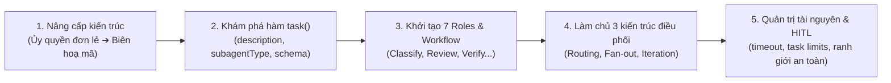
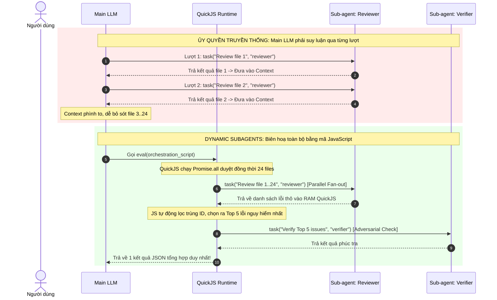
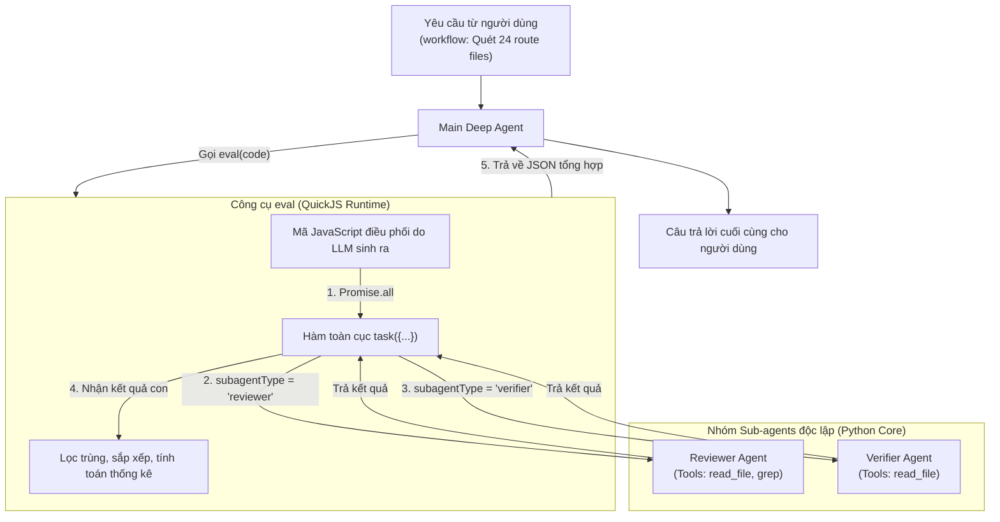

# Chương 16: Dynamic Subagents — Dùng Mã Nguồn Để Biên Hoạ Nhiều Agent

> **Bài toán thực tế trong kiểm thử mã nguồn quy mô lớn:**  
> Một kho mã nguồn (repository) có 24 tệp tin định tuyến (route files).  
> Nếu tiếp cận theo cách ủy quyền tuần tự truyền thống, Main Agent sẽ giao tệp tin đầu tiên cho Sub-agent chuyên rà soát an ninh (`reviewer`), đợi kết quả trả về, rồi lại suy luận xem có nên kiểm tra tệp tiếp theo hay không...  
> Quá trình này lặp đi lặp lại 24 lần. Sau khoảng 8-10 tệp, bộ nhớ ngữ cảnh (Context) của Main Agent đã chứa đầy các đoạn mã trung gian, mô hình bắt đầu mất tập trung, tự ý tóm tắt vội vàng và bỏ sót hàng loạt tệp chưa được rà soát.  
> 
> Thay vào đó, Main Agent có thể liệt kê toàn bộ 24 tệp ngay từ đầu, sinh ra một đoạn mã JavaScript để kích hoạt đồng thời 24 phiên làm việc của `reviewer` thông qua hàm `task()`, sau đó tự động gom nhóm, lọc trùng các lỗ hổng rủi ro cao và chuyển sang cho một Sub-agent khác (`verifier`) độc lập phúc tra lại.  
> Cả hai cách tiếp cận đều sử dụng Sub-agent, nhưng điểm khác biệt cốt lõi nằm ở **thực thể nắm quyền kiểm soát việc phân rã tác vụ, chạy đồng thời (concurrency) và điều phối các giai đoạn tiếp theo!**

Việc gọi Sub-agent trực tiếp qua công cụ thông thường chỉ phù hợp cho một lần ủy thác nhiệm vụ rõ ràng và đơn lẻ. Khi tác vụ trải rộng trên nhiều đối tượng độc lập, hoặc đòi hỏi quy trình phân loại, xử lý song song, đối chiếu chéo (cross-validation) và thu hẹp dần (convergence), việc ép LLM tự ra quyết định qua từng bước sẽ dẫn đến rủi ro bỏ sót dữ liệu, tăng vọt chi phí token và luồng điều khiển thiếu ổn định.

**Dynamic Subagents (Sub-agent Động)** kế thừa nền tảng QuickJS Interpreter (đã tìm hiểu ở Chương 15): Mô hình chính sẽ sinh mã JavaScript để điều phối, sau đó mã lệnh sẽ gọi hàm toàn cục **`task()`** được nhúng sẵn để khởi chạy hàng loạt vòng lặp suy luận độc lập của các Sub-agent và thu thập kết quả tinh gọn.

---

> [!NOTE]
> **Yêu cầu phiên bản môi trường & Cập nhật kỹ thuật mới nhất:**
> - Bản thảo ban đầu của giáo trình được biên soạn tại thời điểm `deepagents==0.7.8` và `langchain-quickjs==0.3.5`.
> - **Phiên bản chuẩn mới nhất hiện tại:** `deepagents>=0.7.18`, `langchain-quickjs>=0.3.7`, `quickjs-rs` (nhúng QuickJS qua PyO3 + Rust `rquickjs`), yêu cầu **Python `>=3.11`**.
> - **Hai lưu ý kỹ thuật sống còn khi triển khai Dynamic Subagents:**
>   1. **Bắt buộc dùng `await agent.ainvoke(...)`:** Hàm `task()` bên trong QuickJS gọi ngược ra Python để kích hoạt một vòng lặp Agent bất đồng bộ hoàn chỉnh. Nếu gọi qua phương thức đồng bộ `agent.invoke(...)`, hệ thống sẽ ném lỗi `ConcurrentEvalError`.
>   2. **Phải nới rộng `timeout` của Middleware:** Giá trị mặc định của `timeout` trong `CodeInterpreterMiddleware` là **5.0 giây**. Trong khi đó, mỗi lệnh gọi `task()` cần thời gian để Sub-agent suy luận và gọi công cụ (thường mất từ vài giây đến hàng chục giây). Nếu bạn điều phối nhiều Sub-agent, **bắt buộc phải tăng `timeout` lên mức thích hợp (ví dụ `timeout=30.0` hoặc `60.0`)**, nếu không toàn bộ phiên `eval` sẽ bị hủy ngang giữa chừng do lỗi `Timeout`!

---

## Lộ Trình Triển Khai Trong Chương



---

## 1. Từ Đơn Lẻ Ủy Quyền Đến Biên Hoạ Động

Trong kiến trúc Deep Agents tiêu chuẩn (Chương 5 & Chương 6), Main Agent có thể giao việc cho Sub-agent thông qua công cụ `task` thông thường. Tại mỗi lượt, Main Agent cung cấp một `description` và một `subagent_type`, sau đó tạm dừng để chờ Sub-agent hoàn thành rồi mới tiếp tục vòng lặp suy luận của chính mình.

Mô hình ủy quyền đơn lẻ này không hề sai, nhưng sự khác biệt nằm ở **độ mịn của quyền kiểm soát (Control Granularity)**:

### Bảng So Sánh Các Hình Thái Điều Phối Sub-Agent

| Hình thái tác vụ (Task Shape) | Lựa chọn tối ưu | Lý do kỹ thuật |
|---|---|---|
| **Giao một câu hỏi cụ thể, độc lập cho một chuyên gia duy nhất** | **Normal `task` Tool** | Đường dẫn ngắn nhất, dễ theo dõi trên nhật ký và dễ dàng thực hiện duyệt người-máy (HITL) từng bước. |
| **Phân tích đồng nhất trên một danh sách gồm nhiều đối tượng độc lập** | **Dynamic Subagents** | JavaScript có thể lặp qua 100% phần tử trong mảng và kích hoạt chạy song song (`Promise.all`). |
| **Đầu vào hỗn tạp, cần phân loại trước rồi mới phân luồng xử lý** | **Dynamic Subagents** | Kết quả phân loại của giai đoạn 1 quyết định trực tiếp giá trị `subagentType` của giai đoạn 2 ngay trong mã nguồn. |
| **Một phát hiện cần được một Agent khác độc lập phúc tra/phản biện** | **Dynamic Subagents** | Dữ liệu đầu ra của giai đoạn 1 (Candidate Findings) được đưa trực tiếp vào giai đoạn 2 (Adversarial Verification) trong cùng một lượt `eval`. |
| **Phạm vi tác vụ chưa rõ, cần tìm kiếm lặp cho đến khi thỏa điều kiện dừng** | **Dynamic Subagents** | Vòng lặp `while/for` và điều kiện dừng kinh doanh được mã hóa tường minh trong JavaScript. |
| **Tác vụ nền chạy ngầm dài hạn và Main Agent sẽ truy vấn trạng thái sau** | **Async Subagents** | Mục tiêu vòng đời hoàn toàn khác (chạy nền phi đồng bộ); không nên nhầm lẫn với việc kích hoạt song song theo lô. |

> [!IMPORTANT]
> **Bản chất kiến trúc:** Dynamic Subagents **không phải** là một loại Sub-agent mới được sinh ra trong bộ nhớ. Thứ thay đổi ở đây là **vị trí điều phối (Orchestration Location)**: Thay vì Main LLM phải tự thân gọi công cụ `task` qua từng lượt hội thoại, nó sinh ra một đoạn mã JavaScript trong một lần gọi `eval` duy nhất, và chính đoạn mã đó sẽ gọi hàm `task()` nhiều lần!



---

### Tại Sao Biên Hoạ Bằng Mã Nguồn Lại Ổn Định Hơn?

Giả sử cần rà soát an ninh cho 24 tệp tin. Khi để mô hình tự ủy thác tuần tự:
- Mỗi khi nhận phản hồi từ một tệp tin, ngữ cảnh dài ra có thể khiến mô hình bị "lệch hướng chú ý".
- Mô hình có xu hướng tự động kết luận sớm (Early Termination), tuyên bố đã xong việc dù mới chỉ duyệt qua 10/24 tệp.

Ngược lại, khi chuyển danh sách tệp tin vào mã JavaScript:
1. **Bảo đảm tính toàn vẹn (Completeness):** Vòng lặp `files.map(...)` đảm bảo 100% mọi tệp đều được khởi chạy nhiệm vụ mà không bị sót.
2. **Kiểm soát đồng thời (Controlled Concurrency):** Có thể chạy song song hoặc chia theo đợt (chunks) tùy thuộc vào giới hạn hạ tầng.
3. **Phân tách trách nhiệm (Separation of Concerns):** Việc lọc trùng, sắp xếp mức độ nghiêm trọng và giới hạn số lượng chuyển tiếp (ví dụ chỉ lấy Top 20) được thực thi bởi mã lập trình tất định (deterministic code).
4. **Giảm thiểu tối đa chi phí Context:** Toàn bộ quá trình tranh luận chi tiết của 24 Sub-agent chỉ diễn ra trong vòng lặp riêng của chúng; Main LLM chỉ tiếp nhận báo cáo cuối cùng đã được tổng hợp sạch sẽ.

---

## 2. Cơ Chế Vận Hành: AI Viết JavaScript, `task()` Thực Thi Điều Phối

Khi một Agent được trang bị đồng thời cấu hình `subagents=[...]` và `CodeInterpreterMiddleware`, môi trường máy ảo QuickJS sẽ tự động xuất hiện một hàm toàn cục bất đồng bộ mang tên **`task()`**.

Chuỗi liên kết thực thi diễn ra như sau:
1. **Main LLM tiếp nhận yêu cầu:** Phân tích bài toán, nhận diện đây là tác vụ cần xử lý nhiều bước phức tạp và quyết định gọi công cụ `eval`.
2. **Sinh mã điều phối:** LLM viết một đoạn mã JavaScript chứa logic duyệt danh sách, gọi các Sub-agent tương ứng và gom nhóm kết quả.
3. **QuickJS nạp và chạy mã:** Khi gặp lệnh `await task(...)`, cầu nối (bridge) của `langchain-quickjs` sẽ tạm ngắt trong máy ảo để kích hoạt Sub-agent tương ứng ở phía Python.
4. **Sub-agent thực thi độc lập:** Mỗi Sub-agent vận hành một vòng lặp suy luận Agentic đầy đủ (có System Prompt riêng, mô hình riêng và công cụ riêng).
5. **Tổng hợp dữ liệu:** Kết quả của Sub-agent được trả về máy ảo QuickJS dưới dạng dữ liệu JavaScript, mã tiếp tục chạy để lọc, ghép nối và cuối cùng trả về một cấu trúc dữ liệu gọn gàng cho Main LLM.



---

### Hợp Đồng Giao Tiếp Của `task()`: Chỉ Gồm 3 Trường

Khác với các giao diện phức tạp, hàm `task()` bên trong QuickJS được thiết kế cực kỳ tinh gọn với đúng **3 trường dữ liệu**:

| Trường dữ liệu | Bắt buộc | Diễn giải chức năng |
|---|:---:|---|
| **`description`** | **Có** | Lời chỉ thị cụ thể dành cho Sub-agent. Cần viết **tự chứa đầy đủ ngữ cảnh (self-contained)**, nêu rõ mục tiêu, phạm vi tệp, yêu cầu kỹ thuật và định dạng mong muốn. |
| **`subagentType`** | **Có** | Tên định danh của Sub-agent cần kích hoạt. Giá trị này **bắt buộc phải khớp chính xác** với trường `name` trong danh sách `subagents` đã cấu hình ở Python. |
| **`responseSchema`** | Không | Đối tượng JSON Schema dùng để ép kiểu dữ liệu trả về cho Sub-agent. Khi có trường này, kết quả nhận được sẽ là một **JavaScript Object có cấu trúc**, không cần gọi `JSON.parse()`. |

#### Ví Dụ Mẫu Về Cú Pháp Lệnh Gọi `task()`

```typescript
const review = await task({
  description: "Đọc tệp src/auth/login.ts, kiểm tra các lỗ hổng xác thực; trích dẫn số dòng cụ thể.",
  subagentType: "reviewer",
  responseSchema: {
    type: "object",
    properties: {
      issues: {
        type: "array",
        items: {
          type: "object",
          properties: {
            line: { type: "number" },
            severity: { type: "string", enum: ["low", "medium", "high"] },
            evidence: { type: "string" },
          },
          required: ["line", "severity", "evidence"],
        },
      },
    },
    required: ["issues"],
  },
});

// Biến review đã là JavaScript Object chuẩn, có thể dùng trực tiếp các hàm mảng:
const highRiskIssues = review.issues.filter((item) => item.severity === "high");
```

> [!TIP]
> **Đặc tính vô trạng thái (Stateless Dispatch):**  
> Mỗi lần gọi `task()` tương ứng với một phiên làm việc độc lập hoàn toàn của Sub-agent. Sub-agent **không lưu lại lịch sử hội thoại** của lần gọi trước đó. Do đó, tham số `description` phải luôn cung cấp đầy đủ thông tin định vị (như đường dẫn tệp tin, dữ liệu cần xử lý) để Sub-agent tự hành động mà không cần đoán mò.

---

## 3. Chuẩn Bị Roles Và Kích Hoạt Workflow

Để kiến trúc Dynamic Subagents vận hành chuẩn xác, có sự phân chia trách nhiệm rõ ràng giữa **Lập trình viên (Developer)** và **Người dùng/Hệ thống ra lệnh (Prompt/User)**:
- **Lập trình viên:** Thiết kế danh mục các Sub-agent (`subagents`), xác định ranh giới chuyên môn, mô tả vai trò và trang bị công cụ tương ứng.
- **Người dùng / Chỉ dẫn Prompt:** Mô tả quy trình công việc (`workflow`), nêu rõ thứ tự điều phối các vai trò, phạm vi dữ liệu và điều kiện dừng.

### 3.1 Cấu Hình 7 Chuyên Gia Mẫu Cho Hệ Thống

Dưới đây là cấu hình 7 Sub-agent chuyên biệt phục vụ cho các kịch bản thực tế:

```python
subagents = [
    {
        "name": "classifier",
        "description": "Phân loại yêu cầu hoặc sự cố thành: bug, feature, question hoặc unknown.",
        "system_prompt": "Bạn là chuyên gia phân loại. Chỉ phân loại theo 4 nhóm trên. Thiếu thông tin thì trả về unknown; tuyệt đối không tự ý xử lý công việc.",
    },
    {
        "name": "bug-fixer",
        "description": "Điều tra các sự cố lỗi (bug) và đưa ra các bước tái hiện chi tiết.",
        "system_prompt": "Kiểm tra kỹ hiện tượng và ngữ cảnh mã nguồn. Trả về các bước tái hiện (reproduction steps) và đánh giá phạm vi ảnh hưởng.",
    },
    {
        "name": "feature-analyst",
        "description": "Đánh giá tính khả thi, chi phí kỹ thuật và sự đánh đổi của tính năng mới.",
        "system_prompt": "Phân tích giá trị sử dụng, điều kiện triển khai và các thách thức kiến trúc lớn nhất.",
    },
    {
        "name": "support-agent",
        "description": "Giải đáp thắc mắc sử dụng dựa trên tài liệu kỹ thuật có sẵn.",
        "system_prompt": "Chỉ trả lời dựa trên tài liệu được cung cấp. Nếu tài liệu không đề cập, phải nêu rõ ràng là chưa có căn cứ.",
    },
    {
        "name": "reviewer",
        "description": "Rà soát mã nguồn tìm lỗ hổng, trả về đường dẫn tệp, số dòng và bằng chứng.",
        "system_prompt": "Chỉ báo cáo các vấn đề có bằng chứng mã cụ thể. Tạo mã định danh ổn định (stable ID) theo quy tắc: 'tep:dong:loai_loi'.",
    },
    {
        "name": "verifier",
        "description": "Độc lập kiểm chứng lại các lỗ hổng nghi vấn nhằm loại bỏ báo động giả (false positives).",
        "system_prompt": "Đọc lại đoạn mã liên quan, chủ động tìm các bằng chứng phản biện để bác bỏ hoặc xác nhận báo cáo của reviewer.",
    },
    {
        "name": "analyzer",
        "description": "Rà soát mã nguồn chết (dead code) trong phạm vi thư mục được giao theo từng đợt.",
        "system_prompt": "Tạo ID ổn định từ tên tệp và tên hàm/biến. Không báo cáo lại những phần tử đã được đánh dấu phát hiện ở các đợt trước.",
    },
]
```

Khởi tạo Agent với danh sách Sub-agents và Middleware:

```python
from deepagents import create_deep_agent
from langchain_openai import ChatOpenAI
from langchain_quickjs import CodeInterpreterMiddleware

model = ChatOpenAI(model="zai-org/GLM-5.2", temperature=0.0)

agent = create_deep_agent(
    model=model,
    subagents=subagents,
    middleware=[
        CodeInterpreterMiddleware(
            mode="turn",       # Giữ biến trong phạm vi 1 turn
            timeout=45.0,      # Nới rộng timeout vì subagents cần thời gian chạy!
        )
    ],
)
```

---

### Khung Soạn Thảo Prompt Kích Hoạt Workflow Chuẩn Mực

Để kích thích LLM ưu tiên sinh mã JavaScript điều phối thay vì tự làm thủ công, hãy sử dụng cấu trúc Prompt 4 phần sau:

```text
Chạy một workflow để xử lý phạm vi sau: [Danh sách tệp tin hoặc danh sách ID cụ thể].
Bước 1: Để [Role A] thực hiện [Nhiệm vụ khởi đầu].
Bước 2: Dựa trên kết quả bước 1, để [Role B] thực hiện [Nhiệm vụ phân tích / kiểm chứng].
Quy tắc xử lý: [Yêu cầu bao phủ toàn bộ, lọc trùng, giới hạn số lượng xử lý].
Điều kiện dừng / Xử lý ngoại lệ: [Khi nào dừng vòng lặp, xử lý trường hợp lỗi ra sao].
Đầu ra mong muốn: Trả về [Cấu trúc tóm tắt, số lượng thành công, số lượng chưa xử lý].
```

---

### 3.2 Ba Mẫu Kiến Trúc Biên Hoạ Điển Hình (Three Core Patterns)

#### Mẫu 1: Phân Loại Sau Đó Điều Hướng (Classification & Routing)

Xử lý một hòm thư tiếp nhận yêu cầu với nhiều thể loại công việc khác nhau:

```text
Chạy một workflow xử lý 3 yêu cầu sau:
- T-101: Nhấn đăng nhập trả về lỗi 500.
- T-102: Mong muốn trang danh sách đơn hàng có thể xuất ra file CSV.
- T-103: Làm thế nào để thay đổi mật khẩu tài khoản?

Bước 1: Dùng classifier để phân loại từng yêu cầu thành bug, feature, question hoặc unknown.
Bước 2: Điều hướng tương ứng tới bug-fixer, feature-analyst hoặc support-agent.
Quy tắc: Không bỏ sót yêu cầu nào; nếu là unknown thì giữ nguyên, không được đoán mò.
Trả về: Bảng tổng hợp gồm mã yêu cầu, phân loại, kết quả xử lý và lý do chưa xử lý (nếu có).
```

Mã JavaScript do Main LLM sinh ra trong QuickJS:

```typescript
const tickets = [
  { id: "T-101", text: "Nhấn đăng nhập trả về lỗi 500" },
  { id: "T-102", text: "Mong muốn trang danh sách đơn hàng có thể xuất file CSV" },
  { id: "T-103", text: "Làm thế nào để thay đổi mật khẩu tài khoản" },
];

const categorySchema = {
  type: "object",
  properties: {
    category: { type: "string", enum: ["bug", "feature", "question", "unknown"] },
  },
  required: ["category"],
};

const routeMap = {
  bug: "bug-fixer",
  feature: "feature-analyst",
  question: "support-agent",
};

// Kích hoạt phân loại song song cả 3 tickets
const processed = await Promise.all(
  tickets.map(async (ticket) => {
    // 1. Phân loại yêu cầu
    const { category } = await task({
      description: `Phân loại yêu cầu ${ticket.id}:\n${ticket.text}`,
      subagentType: "classifier",
      responseSchema: categorySchema,
    });

    // 2. Kiểm tra nếu thuộc nhóm không rõ (unknown)
    const targetAgent = routeMap[category];
    if (!targetAgent) {
      return { id: ticket.id, category, status: "unhandled", reason: "Phân loại unknown" };
    }

    // 3. Điều hướng tới chuyên gia tương ứng
    const solution = await task({
      description: `Xử lý yêu cầu ${ticket.id}: ${ticket.text}`,
      subagentType: targetAgent,
    });

    return { id: ticket.id, category, status: "completed", result: solution };
  })
);

processed;
```

---

#### Mẫu 2: Quét Song Song Và Phúc Tra Đối Kháng (Fan-out & Adversarial Verification)

Kiến trúc 2 tầng cực kỳ phổ biến trong bảo mật mã nguồn: Tầng 1 quét rộng (Recall cao), Tầng 2 kiểm chứng sâu (Precision cao).

```typescript
const files = [
  "src/routes/login.ts",
  "src/routes/session.ts",
  "src/routes/reset-password.ts",
];

// GIAI ĐOẠN 1: Quét song song cả 3 tệp tin với reviewer
const rawReviews = await Promise.all(
  files.map((file) =>
    task({
      description: `Rà soát an ninh tệp ${file}. Trả về danh sách vấn đề kèm ID ổn định định dạng 'file:line:type'`,
      subagentType: "reviewer",
      responseSchema: findingsSchema,
    })
  )
);

// Gom toàn bộ phát hiện thô
const allFindings = rawReviews.flatMap((r) => r.findings);

// Lọc trùng theo ID ổn định
const uniqueFindings = [...new Map(allFindings.map((item) => [item.id, item])).values()];

// Giới hạn ngân sách: Chỉ chọn tối đa 20 lỗ hổng nguy hiểm nhất để phúc tra
const candidates = uniqueFindings.slice(0, 20);

// GIAI ĐOẠN 2: verifier độc lập kiểm tra chéo
const verifications = await Promise.all(
  candidates.map((finding) =>
    task({
      description: `Đọc lại mã tại ${finding.file}:${finding.line}. Xác nhận hoặc bác bỏ bằng chứng sau: ${finding.evidence}`,
      subagentType: "verifier",
      responseSchema: verdictSchema,
    })
  )
);

// Phân tách kết quả đã được xác nhận thực tế
const confirmedIssues = candidates.filter((_, idx) => verifications[idx].confirmed);

({
  confirmedCount: confirmedIssues.length,
  rejectedCount: candidates.length - confirmedIssues.length,
  unreviewedCount: uniqueFindings.length - candidates.length,
  confirmedIssues,
});
```

---

#### Mẫu 3: Lặp Thu Hẹp Dần Cho Đến Khi Thỏa Điều Kiện Dừng (Iterative Search)

Sử dụng khi không biết trước khối lượng công việc, cần lặp nhiều vòng và đưa danh sách phát hiện cũ vào vòng tiếp theo để tránh trùng:

```typescript
const seenItemIds = new Set();
const collectedItems = [];
let actualRounds = 0;
let terminationReason = "Đạt ngưỡng tối đa 5 vòng lặp";

for (let r = 0; r < 5; r++) {
  actualRounds = r + 1;

  // Gọi analyzer và gửi kèm danh sách các ID đã biết
  const { items } = await task({
    description: `Tìm mã nguồn chết trong src/legacy/. Tối đa 20 mục. Các ID đã phát hiện trước đó: ${[...seenItemIds].join(", ") || "Chưa có"}`,
    subagentType: "analyzer",
    responseSchema: deadCodeSchema,
  });

  // Lọc ra các mục thực sự mới
  const newItems = items.filter((item) => !seenItemIds.has(item.id)).slice(0, 20);

  // ĐIỀU KIỆN DỪNG KINH DOANH: Nếu một vòng không phát hiện thêm gì mới -> Dừng ngay lập tức!
  if (newItems.length === 0) {
    terminationReason = "Vòng này không phát hiện thêm mã nguồn chết nào";
    break;
  }

  for (const item of newItems) {
    seenItemIds.add(item.id);
    collectedItems.push(item);
  }
}

({
  actualRounds,
  terminationReason,
  totalItemsFound: collectedItems.length,
  items: collectedItems,
});
```

---

## 4. Tham Số Cấu Hình Middleware & Ngân Sách Tài Nguyên Cần Thiết

Vì Dynamic Subagents vận hành hoàn toàn bên trong công cụ `eval` của `CodeInterpreterMiddleware`, các thông số cấu hình của Middleware sẽ kiểm soát trực tiếp độ an toàn của hệ thống:

| Tham số cấu hình | Mặc định | Tác động cụ thể tới Dynamic Subagents |
|---|:---:|---|
| **`memory_limit`** | `64 MB` | Giới hạn dung lượng heap của QuickJS. Toàn bộ mảng danh sách tệp tin, biến trung gian và kết quả tổng hợp của Sub-agent được lưu trong vùng nhớ này. |
| **`timeout`** | `5.0` s | **Đặc biệt lưu ý:** Giới hạn thời gian của toàn bộ lần gọi `eval`. Vì mỗi lệnh `task()` phải đợi Sub-agent suy luận, giá trị 5s mặc định sẽ gây Timeout ngay lập tức nếu gọi nhiều Agent. Khuyến nghị nâng lên từ **`30.0s - 120.0s`**. |
| **`max_result_chars`** | `4000` | Giới hạn ký tự trả về cho Main LLM. Nếu tổng hợp nhiều Sub-agent mà chuỗi kết quả quá dài, dữ liệu sẽ bị cắt cụt. Nên nâng lên `8000` hoặc gom nhóm dữ liệu súc tích. |
| **`ptc`** | `None` | Danh sách công cụ thông thường được mở vào `tools.*`. Lưu ý: **`ptc` độc lập hoàn toàn với `task()`**. |
| **`max_ptc_calls`** | `256` | **Điểm dễ nhầm lẫn nhất:** Tham số này **chỉ giới hạn các lệnh gọi `tools.*`, hoàn toàn KHÔNG giới hạn số lần gọi `task()`!** |
| **`subagents`** | `True` | Công tắc bật/tắt hàm toàn cục `task()` trong JavaScript. Nếu đặt `False`, Agent chỉ có thể gọi Sub-agent qua công cụ `task` ngoài. |
| **`mode`** | `"thread"` | Kiểm soát vòng đời biến của QuickJS (`"call"`, `"turn"`, `"thread"`). |

```python
# Cấu hình chuẩn Production cho hệ thống chạy Dynamic Subagents
middleware = [
    CodeInterpreterMiddleware(
        mode="turn",                  # Cách ly biến giữa các lượt hỏi-đáp
        subagents=True,               # Kích hoạt hàm task() trong QuickJS
        memory_limit=128 * 1024 * 1024, # 128 MB RAM heap
        timeout=60.0,                 # 60 giây để chờ các Sub-agents hoàn thành
        max_result_chars=8000,        # Đảm bảo kết quả tổng hợp không bị cắt
        capture_console=True,         # Ghi lại log để dễ debug
    )
]
```

> [!WARNING]
> **Cách kiểm soát số lượng Sub-agent khi không có `max_task_calls`:**  
> Vì `CodeInterpreterMiddleware` hiện tại chưa có tham số `max_task_calls`, để tránh việc LLM viết vòng lặp vô tận kích hoạt hàng nghìn Sub-agent làm cạn kiệt tài nguyên API, bạn phải kiểm soát thông qua 3 chốt chặn:
> 1. Giới hạn độ dài mảng đầu vào trong Prompt hoặc cắt mảng trong code (`slice(0, 20)`).
> 2. Đặt điều kiện vòng lặp tối đa cố định (`for (let r = 0; r < 5; r++)`).
> 3. Kiểm soát bằng `timeout` tổng thể của phiên `eval`.

---

## 5. Ranh Giới An Toàn, HITL & Giám Sát Thực Thi

### Ranh Giới Phê Duyệt Con Người (Human-in-the-Loop)

Tương tự như cơ chế PTC ở Chương 15:
- Mỗi lệnh gọi `task(...)` bên trong JavaScript **không kích hoạt điểm ngắt `interrupt_on` cấp cha của Main Agent!**
- Toàn bộ khối mã JavaScript được coi là đã được cấp phép thực thi một khi lệnh gọi `eval` ngoài cùng được thông qua.
- **Biện pháp phòng ngừa:** Nếu trong số các Sub-agent có những vai trò tiềm ẩn rủi ro cao (ví dụ Sub-agent có quyền ghi đè tệp tin hoặc gọi API thanh toán), bạn phải thiết lập middleware phê duyệt Human-in-the-Loop **ngay bên trong cấu hình của chính Sub-agent đó**, hoặc chỉ thị mô hình xuất ra bản dự thảo mã (draft) để con người phê duyệt trước khi cho chạy `eval`.

### Khả Năng Quan Sát Với Event Streaming v3

Khi hệ thống vận hành nhiều Sub-agent song song, bạn có thể giám sát tiến trình thời gian thực bằng giao thức Streaming v3 (đã học ở Chương 14):

```python
async for event in agent.astream_events(
    {"messages": [{"role": "user", "content": prompt}]},
    version="v3",
):
    # Lắng nghe vòng đời của các Sub-agents được kích hoạt động
    if event["event"] == "on_custom_event" and "subagent" in event.get("name", ""):
        print(f"[Subagent Update] {event['name']}: {event['data']}")
```

---

## Tổng Kết Chương

1. **Dynamic Subagents đưa việc điều phối đa Agent vào mã nguồn:** Thay thế các lượt suy luận tuần tự, dễ đứt gãy của LLM bằng luồng điều khiển xác định của JavaScript ngay trong máy ảo QuickJS.
2. **Hợp đồng `task()` 3 trường siêu tinh gọn:** Chỉ gồm `description` (yêu cầu tự chứa), `subagentType` (khớp với tên Sub-agent), và `responseSchema` (định hình kiểu dữ liệu trả về có cấu trúc).
3. **Phân định rõ vai trò thiết kế:** Lập trình viên định nghĩa các chuyên gia (`subagents`), người dùng định nghĩa quy trình công việc (`workflow`).
4. **Ba mẫu kiến trúc kinh điển:** Phân loại rồi điều hướng (Classification & Routing), Quét song song rồi phúc tra độc lập (Fan-out & Verification), và Lặp thu hẹp dần đến khi hội tụ (Iterative Search).
5. **Nới rộng `timeout` là bắt buộc:** Sub-agent cần thời gian suy luận và gọi công cụ; luôn tăng `timeout` của `CodeInterpreterMiddleware` từ 5s lên `30s - 60s` trở lên.
6. **`max_ptc_calls` không áp dụng cho `task()`:** Cần giới hạn số lượng Sub-agent kích hoạt thông qua logic mã JavaScript (`slice`, đếm vòng lặp) và chỉ dẫn Prompt chặt chẽ.
7. **Bảo toàn tính bất đồng bộ:** Luôn sử dụng phương thức bất đồng bộ `await agent.ainvoke(...)` để vận hành trơn tru cầu nối giữa QuickJS và Python Core.

---

## Tài Liệu Tham Khảo Chính Thức

- [Deep Agents Dynamic Subagents Documentation](https://docs.langchain.com/oss/python/deepagents/dynamic-subagents)
- [Deep Agents Interpreters Architecture](https://docs.langchain.com/oss/python/deepagents/interpreters)
- [Deep Agents Subagents Guide](https://docs.langchain.com/oss/python/deepagents/subagents)
- [Deep Agents Human-in-the-Loop Best Practices](https://docs.langchain.com/oss/python/deepagents/human-in-the-loop)
- [Deep Agents Event Streaming Specification](https://docs.langchain.com/oss/python/deepagents/event-streaming)
