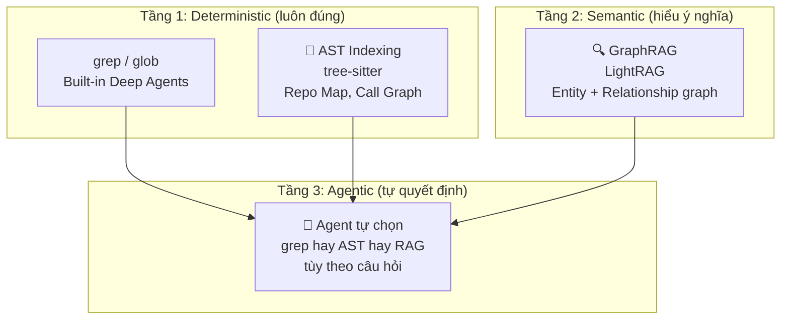
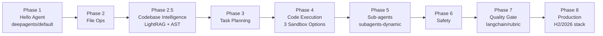
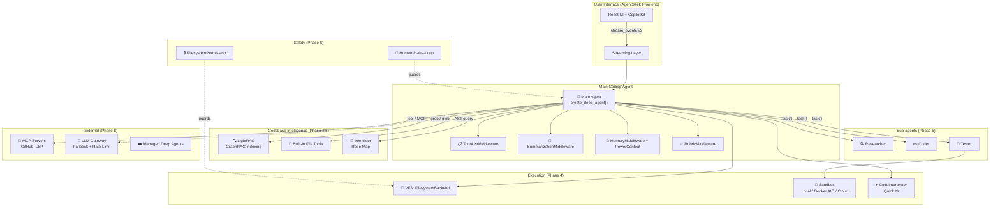

# 🛠️ Design Report V2: Xây dựng Coding Agent với Deep Agents + AgentSeek

> **Cập nhật**: 25/09/2026 — Tích hợp phản hồi + nghiên cứu H2/2026
> **Mục đích**: Bạn tự code hoàn toàn — report này chỉ ra concept, tại sao, và đọc tài liệu ở đâu

---

## Thay đổi so với V1

| Điểm | V1 | V2 |
|------|----|----|
| **Số phase** | 8 | **9** (thêm Codebase Intelligence) |
| **Scaffold** | Manual setup | **AgentSeek templates** |
| **Codebase lớn** | Chỉ grep/glob | **AST indexing + GraphRAG (LightRAG)** |
| **Sandbox** | 1 option | **3 options**: Local, Docker (AIO), Cloud |
| **Production** | Basic | **Managed Deep Agents + LLM Gateway + Context Hub** |
| **Format** | Code skeletons | **Concept-only + tài liệu reference** |
| **Model provider** | SiliconFlow hardcode | **AgentSeek multi-provider** |

---

## AgentSeek Templates — Mapping cho Tutorial

Dựa trên kết quả `agentseek create --list-templates --checkout main`, đây là các templates phù hợp cho từng phase:

| Phase | Template khuyến nghị | Lý do chọn |
|-------|---------------------|------------|
| 1. Hello Agent | `deepagents/default` | Scaffolding tối giản: `create_deep_agent` + lifecycle spec |
| 2. File Ops | (tiếp tục từ Phase 1) | Thêm `FilesystemBackend` vào project đã tạo |
| 2.5 Codebase Intelligence | (custom + LightRAG) | Tích hợp LightRAG vào agent làm MCP server hoặc custom tool |
| 3. Task Planning | (tiếp tục) | Thêm `TodoListMiddleware` |
| 4. Code Execution | `deepagents/sandbox` | Template có sẵn sandbox coding agent + streamed UI |
| 5. Sub-agents | `deepagents/subagents-dynamic` | 6 pattern subagent chính thức, evidence-driven UI |
| 6. Safety | (tiếp tục từ Phase 4) | Thêm `FilesystemPermission` + HITL |
| 7. Quality Gate | `langchain/rubric` | Evidence-backed rubric revision + guided demo UI |
| 8. Production | `deepagents/streaming` | Event Streaming v3 showcase |
| Tham khảo | `deepagents/powercontext` | PowerContext Memory + seekdb (cho Phase 2.5 & long-term memory) |
| Tham khảo | `deepagents/mcp` | MCP Tools app (cho Phase 8 MCP integration) |

> [!TIP]
> **Chiến lược**: Bắt đầu bằng `deepagents/default`, phát triển dần qua các phase. Khi đến phase quan trọng (sandbox, subagents, streaming), tham khảo template tương ứng để hiểu cấu trúc chuẩn rồi tích hợp vào project chính.

---

## Phase mới: 2.5 — Codebase Intelligence

### Vấn đề

Khi coding agent bắt đầu làm việc với codebase lớn (hàng ngàn file), `grep` + `glob` không đủ:
- **Token explosion**: grep trả về quá nhiều kết quả, tràn context window
- **Thiếu semantic**: tìm theo keyword không hiểu ý nghĩa code
- **Không hiểu dependency**: không biết hàm A gọi hàm B ở đâu, class C kế thừa class D

### Giải pháp: 3 tầng



### Tại sao LightRAG?

| Tiêu chí | Vector RAG truyền thống | LightRAG |
|----------|------------------------|----------|
| **Cấu trúc** | Flat chunks | Knowledge Graph (entity + relationship) |
| **Multi-hop** | Kém (chỉ tìm chunk giống nhau) | Tốt (theo graph relationship) |
| **Cập nhật** | Re-index toàn bộ | **Incremental update** |
| **Token cost** | Cao | Thấp hơn đáng kể |
| **Query modes** | 1 (similarity) | 5 (naive, local, global, hybrid, mix) |

### Cách tích hợp với Deep Agents

Có 2 approach:

**Approach A**: LightRAG làm **custom tool** cho Deep Agents
```
Agent → tool: search_codebase(query, mode="hybrid") → LightRAG → kết quả
```

**Approach B**: LightRAG làm **MCP server**
```
Agent → MCP client → LightRAG MCP server → kết quả
```

Approach B sạch hơn vì tách biệt hoàn toàn, và bài [14_mcp.md](file:///home/lai/Documents/divein-ai-agent/guideline/14_mcp.md) đã dạy cách tích hợp MCP.

### Tài liệu cần đọc

| Nguồn | Đọc gì | Lý do |
|-------|--------|-------|
| [05_virtual_filesystem.md](file:///home/lai/Documents/divein-ai-agent/guideline/05_virtual_filesystem.md) | grep output_modes, glob | Tầng 1: deterministic search |
| [14_mcp.md](file:///home/lai/Documents/divein-ai-agent/guideline/14_mcp.md) | MCP server creation, `FastMCP`, `MultiServerMCPClient` | Nếu dùng Approach B (MCP) |
| [LightRAG GitHub](https://github.com/HKUDS/LightRAG) | README, API docs | Setup LightRAG, indexing, query modes |
| [deepagents/powercontext template](file:///home/lai/Documents/divein-ai-agent) | `agentseek create deepagents/powercontext` | Tham khảo cách seekdb+PowerContext quản lý context |
| tree-sitter docs | Parsers, query API | Nếu muốn build AST index tự tay |

---

## Phase 4 mở rộng: 3 Sandbox Options

### Option A: LocalShellBackend (Dev only)

| Ưu | Nhược |
|----|-------|
| Setup 0 giây | Agent có thể chạy lệnh nguy hiểm |
| Không cần Docker | Không cô lập — crash ảnh hưởng host |
| Nhanh nhất | **KHÔNG BAO GIỜ** dùng cho production |

**Đọc**: [05_virtual_filesystem.md](file:///home/lai/Documents/divein-ai-agent/guideline/05_virtual_filesystem.md) — phần LocalShellBackend

### Option B: Docker Container — AIO Sandbox

**[agent-infra/sandbox](https://github.com/agent-infra/sandbox)** (AIO Sandbox):

| Tính năng | Mô tả |
|-----------|-------|
| **All-in-One** | Browser + Shell + File System + MCP + VS Code Server trong 1 container |
| **MCP-ready** | Expose capability qua MCP protocol — agent gọi trực tiếp |
| **Persistent workspace** | File system giữ lại giữa các session |
| **API access** | REST API cho shell execution, file management |

Tích hợp với Deep Agents:
- Chạy AIO Sandbox container
- Viết custom tool hoặc MCP client để giao tiếp với sandbox API
- Agent gọi `execute_in_sandbox(command)` thay vì `execute(command)`

**Đọc**: [12_sandboxes.md](file:///home/lai/Documents/divein-ai-agent/guideline/12_sandboxes.md) — phần Sandbox-as-Tool pattern

### Option C: Cloud Sandbox

| Provider | Loại | Đặc điểm nổi bật |
|----------|------|-------------------|
| **LangSmith Sandboxes** (GA) | MicroVM | Snapshot/fork, blueprints, auth proxy, tích hợp sẵn Deep Agents |
| **E2B** | Firecracker MicroVM | Nhanh, popular, nhiều SDK |
| **Daytona** | OCI container | Git-first, dev environment focus |

**Đọc**: [12_sandboxes.md](file:///home/lai/Documents/divein-ai-agent/guideline/12_sandboxes.md) — toàn bài

**Template tham khảo**: `agentseek create deepagents/sandbox --checkout main`

---

## Phase 8 cập nhật: H2/2026

### Nội dung mới cần cover

| Feature | Từ đâu | Ý nghĩa cho Coding Agent |
|---------|--------|--------------------------|
| **Managed Deep Agents** | LangSmith Public Beta 08/2026 | Deploy bằng `mda deploy`, không cần tự host |
| **LLM Gateway** | LangSmith Public Beta 08/2026 | Model fallback, rate limiting, PII redaction |
| **Context Hub** | LangSmith | Version-controlled skills & instructions |
| **v0.8 Personalized Memory** | Deep Agents 24/09/2026 | Mỗi developer có memory riêng |
| **Streaming v3 GA** | LangChain v1.3 05/2026 | Content-block-centric, typed projections |
| **PowerContext** | AgentSeek ecosystem | Handoff context giữa agents, seekdb |

### Template tham khảo cho Phase 8

- `deepagents/streaming` — Streaming v3 showcase
- `deepagents/mcp` — MCP integration
- `deepagents/powercontext` — PowerContext Memory + seekdb

---

## Lộ trình 9 Phases (cập nhật)



### Chi tiết từng Phase (concept-only format)

| Phase | Concept chính | Đọc tài liệu | Template tham khảo |
|-------|-------------|--------------|-------------------|
| **1. Hello Agent** | `create_deep_agent()`, custom tool, AgentSeek lifecycle, model provider config | [00](file:///home/lai/Documents/divein-ai-agent/guideline/00_preparation.md), [01](file:///home/lai/Documents/divein-ai-agent/guideline/01_deepagent_version_update.md), [03](file:///home/lai/Documents/divein-ai-agent/guideline/03_agent_framework_to_agent_harness.md), [04](file:///home/lai/Documents/divein-ai-agent/guideline/04_quickstart_first_deep_agent.md) | `deepagents/default` |
| **2. File Ops** | 7 file tools, `FilesystemBackend`, auto-eviction, grep modes, `edit_file` vs `write_file` | [05](file:///home/lai/Documents/divein-ai-agent/guideline/05_virtual_filesystem.md), [01](file:///home/lai/Documents/divein-ai-agent/guideline/01_deepagent_version_update.md) | — |
| **2.5 Codebase Intelligence** | AST indexing (tree-sitter), GraphRAG (LightRAG), hybrid retrieval, repo map pattern, MCP integration | [05](file:///home/lai/Documents/divein-ai-agent/guideline/05_virtual_filesystem.md), [14](file:///home/lai/Documents/divein-ai-agent/guideline/14_mcp.md), LightRAG docs | `deepagents/powercontext` |
| **3. Task Planning** | `TodoListMiddleware`, middleware architecture, `SummarizationMiddleware`, cognitive anchor | [06](file:///home/lai/Documents/divein-ai-agent/guideline/06_task_planning.md) | — |
| **4. Code Execution** | LocalShell / Docker AIO / Cloud Sandbox, Sandbox-as-Tool, `CodeInterpreterMiddleware` | [05](file:///home/lai/Documents/divein-ai-agent/guideline/05_virtual_filesystem.md), [12](file:///home/lai/Documents/divein-ai-agent/guideline/12_sandboxes.md), [17](file:///home/lai/Documents/divein-ai-agent/guideline/17_interpreters.md) | `deepagents/sandbox` |
| **5. Sub-agents** | `task` tool, async subagents, dynamic subagents, fan-out/verify pattern | [07](file:///home/lai/Documents/divein-ai-agent/guideline/07_subagents.md), [08](file:///home/lai/Documents/divein-ai-agent/guideline/08_async_subagents.md), [18](file:///home/lai/Documents/divein-ai-agent/guideline/18_dynamic_subagents.md) | `deepagents/subagents-dynamic` |
| **6. Safety** | `FilesystemPermission`, whitelist pattern, HITL, `PolicyWrapper`, subagent inheritance | [13](file:///home/lai/Documents/divein-ai-agent/guideline/13_filesystem_permissions.md), [11](file:///home/lai/Documents/divein-ai-agent/guideline/11_human_in_the_loop.md) | — |
| **7. Quality Gate** | `RubricMiddleware`, evidence tool, fail-closed, frozen criteria, two-model architecture | [15](file:///home/lai/Documents/divein-ai-agent/guideline/15_grading_rubrics.md) | `langchain/rubric` |
| **8. Production** | Streaming v3, Memory (v0.8), MCP, Skills, Managed Deep Agents, LLM Gateway, Context Hub | [16](file:///home/lai/Documents/divein-ai-agent/guideline/16_streaming.md), [10](file:///home/lai/Documents/divein-ai-agent/guideline/10_long_term_memory.md), [14](file:///home/lai/Documents/divein-ai-agent/guideline/14_mcp.md), [09](file:///home/lai/Documents/divein-ai-agent/guideline/09_skills.md) | `deepagents/streaming`, `deepagents/mcp` |

---

## Kiến trúc tổng thể sau 9 Phases



---

## Quyết định đã xác nhận

| # | Quyết định | Trạng thái |
|---|-----------|-----------|
| 1 | 9 phases (thêm Codebase Intelligence) | ✅ |
| 2 | AgentSeek templates | ✅ |
| 3 | LightRAG cho codebase intelligence | ✅ Pending review |
| 4 | 3 sandbox options (Local, Docker AIO, Cloud) | ✅ |
| 5 | Concept-only format (không code skeleton) | ✅ |
| 6 | Python target projects | ✅ |
| 7 | AgentSeek frontend (React) | ✅ |
| 8 | Phase 4 & 8 cập nhật H2/2026 | ✅ |

---

## Câu hỏi mở (nếu có)

1. **LightRAG storage backend**: Bạn muốn dùng backend nào cho LightRAG? (In-memory cho dev, hoặc seekdb theo PowerContext template?)

2. **Thứ tự Phase 2.5**: Bạn có muốn Phase 2.5 (Codebase Intelligence) là optional/advanced, hay bắt buộc trước Phase 3?

3. **Template strategy**: Bạn muốn:
   - (a) Bắt đầu từ `deepagents/default` rồi thêm tính năng dần
   - (b) Bắt đầu từ `deepagents/sandbox` (đã có sẵn coding agent + sandbox + UI)

---

> [!IMPORTANT]
> **Bước tiếp theo**: Sau khi bạn duyệt design V2 này, tôi sẽ **viết lại toàn bộ 9 tutorials** theo format concept-only, tích hợp AgentSeek, và cập nhật Phase 4 + Phase 8.
